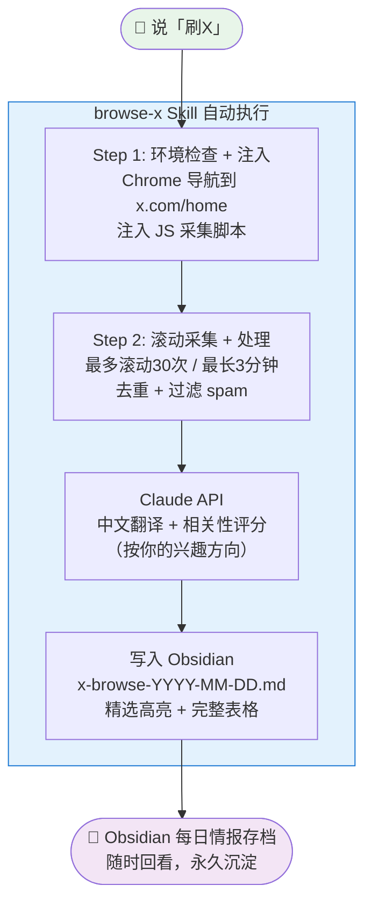
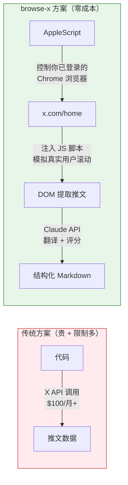

## 🌐 刷X飞轮：打破普通人的认知壁垒，获取全球视野


#### 🎬 案例场景：信息获取 / 知识管理

#### 🔧 使用工具：Claude Code · browse-x Skill · Obsidian

#### 📒 案例概要：全球最前沿的 AI 资讯、工程师实践、产品思考，大量在 X（Twitter）上首发。但语言障碍 + 手动浏览效率低 + 信息零散，导致大多数人错过第一手信息。本文介绍一个 Claude Code Skill：一句话触发，自动浏览 X 推荐流、翻译筛选、按相关性评分，将有价值内容整理成 Markdown 表格存入 Obsidian，每天5分钟，拿到全球视野。

---

## 1\. 问题：我们和全球信息之间隔了什么

程序员日常获取技术资讯的路径：

- •
	微信公众号 → 二手转载，滞后1-2周

- •
	掘金 / 知乎 → 原创质量参差，热门往往是软文

而真正的第一手信息在哪里？ **在 X（Twitter）。**

Claude、GPT 的 prompt 技巧，AI Agent 的最新架构，YC 创业者的产品复盘，MIT 的公开课资源……大量内容在 X 上首发，比国内平台早几周甚至几个月。

**但摆在大多数人面前的有三道墙：**

<table><colgroup><col width="80"> <col width="300"></colgroup><tbody><tr><td colspan="1" rowspan="1"><p>障碍</p></td><td colspan="1" rowspan="1"><p>说明</p></td></tr><tr><td colspan="1" rowspan="1"><p>语言壁垒</p></td><td colspan="1" rowspan="1"><p>高质量内容大量是英文，快速阅读成本高</p></td></tr><tr><td colspan="1" rowspan="1"><p>效率壁垒</p></td><td colspan="1" rowspan="1"><p>手动刷 Feed 时间碎片化，高价值推文淹没在噪音里</p></td></tr><tr><td colspan="1" rowspan="1"><p>沉淀壁垒</p></td><td colspan="1" rowspan="1"><p>看到好内容没地方存，刷完就忘，无法复用</p></td></tr></tbody></table>

**browse-x Skill 一次性解决这三道墙。**

---

## 2\. 它是什么：一句话触发的 X 情报收集器

```
Plain Text
```

```plain
你说：「刷X」

Claude Code 自动：
  1. 打开 Chrome，导航到 x.com 推荐流（For You）
  2. 模拟真实滚动，采集最近 24 小时推文
  3. 过滤 spam，去重，按时间排序
  4. 调用 Claude API 自动翻译成中文
  5. 根据你配置的兴趣方向评估相关性（0-3星）
  6. 生成 Markdown 表格 + 精选高亮
  7. 自动保存到 Obsidian vault
  
5分钟后，你在 Obsidian 里拿到今天全球 AI 圈在讨论什么。
```

---

## 3\. 整体流程

```
Mermaid
```



<svg aria-roledescription="flowchart-v2" role="graphics-document document" viewBox="-8 -8 305.171875 766" style="max-width: 305.171875px;" xmlns="http://www.w3.org/2000/svg" width="100%" id="mp-mermaid-graph-8Ph3Mom0"><g><marker orient="auto" markerHeight="12" markerWidth="12" markerUnits="userSpaceOnUse" refY="5" refX="10" viewBox="0 0 10 10" id="flowchart-pointEnd-8Ph3Mom0"><path style="stroke-width: 1; stroke-dasharray: 1, 0;" d="M 0 0 L 10 5 L 0 10 z"></path></marker><marker orient="auto" markerHeight="12" markerWidth="12" markerUnits="userSpaceOnUse" refY="5" refX="0" viewBox="0 0 10 10" id="flowchart-pointStart-8Ph3Mom0"><path style="stroke-width: 1; stroke-dasharray: 1, 0;" d="M 0 5 L 10 10 L 10 0 z"></path></marker><marker orient="auto" markerHeight="11" markerWidth="11" markerUnits="userSpaceOnUse" refY="5" refX="11" viewBox="0 0 10 10" id="flowchart-circleEnd-8Ph3Mom0"><circle style="stroke-width: 1; stroke-dasharray: 1, 0;" r="5" cy="5" cx="5"></circle></marker><marker orient="auto" markerHeight="11" markerWidth="11" markerUnits="userSpaceOnUse" refY="5" refX="-1" viewBox="0 0 10 10" id="flowchart-circleStart-8Ph3Mom0"><circle style="stroke-width: 1; stroke-dasharray: 1, 0;" r="5" cy="5" cx="5"></circle></marker><marker orient="auto" markerHeight="11" markerWidth="11" markerUnits="userSpaceOnUse" refY="5.2" refX="12" viewBox="0 0 11 11" id="flowchart-crossEnd-8Ph3Mom0"><path style="stroke-width: 2; stroke-dasharray: 1, 0;" d="M 1,1 l 9,9 M 10,1 l -9,9"></path></marker><marker orient="auto" markerHeight="11" markerWidth="11" markerUnits="userSpaceOnUse" refY="5.2" refX="-1" viewBox="0 0 11 11" id="flowchart-crossStart-8Ph3Mom0"><path style="stroke-width: 2; stroke-dasharray: 1, 0;" d="M 1,1 l 9,9 M 10,1 l -9,9"></path></marker><g><g><g id="SKILL-8Ph3Mom0"><rect height="548" width="289.171875" y="89" x="0" ry="0" rx="0" style="fill:#e3f2fd;stroke:#1976d2;"></rect><g transform="translate(60.5234375, 89)"><foreignObject height="24" width="168.125"><div style="display: inline-block; white-space: nowrap;" xmlns="http://www.w3.org/1999/xhtml">browse-x Skill 自动执行</div></foreignObject></g></g></g><g><path marker-end="url(#flowchart-pointEnd-8Ph3Mom0)" style="fill:none;" id="L-A-B-0-8Ph3Mom0" d="M144.5859375,39L144.5859375,43.166666666666664C144.5859375,47.333333333333336,144.5859375,55.666666666666664,144.5859375,64C144.5859375,72.33333333333333,144.5859375,80.66666666666667,144.5859375,89C144.5859375,97.33333333333333,144.5859375,105.66666666666667,144.5859375,109.83333333333333L144.5859375,114" stroke="currentColor"></path><path marker-end="url(#flowchart-pointEnd-8Ph3Mom0)" style="fill:none;" id="L-B-C-0-8Ph3Mom0" d="M144.5859375,201L144.5859375,205.16666666666666C144.5859375,209.33333333333334,144.5859375,217.66666666666666,144.5859375,226C144.5859375,234.33333333333334,144.5859375,242.66666666666666,144.5859375,246.83333333333334L144.5859375,251" stroke="currentColor"></path><path marker-end="url(#flowchart-pointEnd-8Ph3Mom0)" style="fill:none;" id="L-C-D-0-8Ph3Mom0" d="M144.5859375,338L144.5859375,342.1666666666667C144.5859375,346.3333333333333,144.5859375,354.6666666666667,144.5859375,363C144.5859375,371.3333333333333,144.5859375,379.6666666666667,144.5859375,383.8333333333333L144.5859375,388" stroke="currentColor"></path><path marker-end="url(#flowchart-pointEnd-8Ph3Mom0)" style="fill:none;" id="L-D-E-0-8Ph3Mom0" d="M144.5859375,475L144.5859375,479.1666666666667C144.5859375,483.3333333333333,144.5859375,491.6666666666667,144.5859375,500C144.5859375,508.3333333333333,144.5859375,516.6666666666666,144.5859375,520.8333333333334L144.5859375,525" stroke="currentColor"></path><path marker-end="url(#flowchart-pointEnd-8Ph3Mom0)" style="fill:none;" id="L-E-F-0-8Ph3Mom0" d="M144.5859375,612L144.5859375,616.1666666666666C144.5859375,620.3333333333334,144.5859375,628.6666666666666,144.5859375,637C144.5859375,645.3333333333334,144.5859375,653.6666666666666,144.5859375,662C144.5859375,670.3333333333334,144.5859375,678.6666666666666,144.5859375,682.8333333333334L144.5859375,687" stroke="currentColor"></path></g><g><g><g transform="translate(0, 0)"></g></g><g><g transform="translate(0, 0)"></g></g><g><g transform="translate(0, 0)"></g></g><g><g transform="translate(0, 0)"></g></g><g><g transform="translate(0, 0)"></g></g></g><g><g transform="translate(144.5859375, 157.5)" id="flowchart-B-213-8Ph3Mom0"><rect height="87" width="219.171875" y="-43.5" x="-109.5859375" ry="0" rx="0" style="" fill="none" stroke="currentColor"></rect><g transform="translate(-102.0859375, -36)" style=""><rect></rect><foreignObject height="72" width="204.171875"><div style="display: inline-block; white-space: nowrap;" xmlns="http://www.w3.org/1999/xhtml">Step 1: 环境检查 + 注入<br>Chrome 导航到 x.com/home<br>注入 JS 采集脚本</div></foreignObject></g></g><g transform="translate(144.5859375, 294.5)" id="flowchart-C-215-8Ph3Mom0"><rect height="87" width="202.203125" y="-43.5" x="-101.1015625" ry="0" rx="0" style="" fill="none" stroke="currentColor"></rect><g transform="translate(-93.6015625, -36)" style=""><rect></rect><foreignObject height="72" width="187.203125"><div style="display: inline-block; white-space: nowrap;" xmlns="http://www.w3.org/1999/xhtml">Step 2: 滚动采集 + 处理<br>最多滚动30次 / 最长3分钟<br>去重 + 过滤 spam</div></foreignObject></g></g><g transform="translate(144.5859375, 431.5)" id="flowchart-D-216-8Ph3Mom0"><rect height="87" width="177.03125" y="-43.5" x="-88.515625" ry="0" rx="0" style="" fill="none" stroke="currentColor"></rect><g transform="translate(-81.015625, -36)" style=""><rect></rect><foreignObject height="72" width="162.03125"><div style="display: inline-block; white-space: nowrap;" xmlns="http://www.w3.org/1999/xhtml">Claude API<br>中文翻译 + 相关性评分<br>&lt;按你的兴趣方向&gt;</div></foreignObject></g></g><g transform="translate(144.5859375, 568.5)" id="flowchart-E-217-8Ph3Mom0"><rect height="87" width="202.296875" y="-43.5" x="-101.1484375" ry="0" rx="0" style="" fill="none" stroke="currentColor"></rect><g transform="translate(-93.6484375, -36)" style=""><rect></rect><foreignObject height="72" width="187.296875"><div style="display: inline-block; white-space: nowrap;" xmlns="http://www.w3.org/1999/xhtml">写入 Obsidian<br>x-browse-YYYY-MM-DD.md<br>精选高亮 + 完整表格</div></foreignObject></g></g><g transform="translate(144.5859375, 19.5)" id="flowchart-A-212-8Ph3Mom0"><rect height="39" width="82.4375" y="-19.5" x="-41.21875" ry="19.5" rx="19.5" style="fill:#e8f5e9;"></rect><g transform="translate(-28.84375, -12)" style=""><rect></rect><foreignObject height="24" width="57.6875"><div style="display: inline-block; white-space: nowrap;" xmlns="http://www.w3.org/1999/xhtml">说&lt;刷X&gt;</div></foreignObject></g></g><g transform="translate(144.5859375, 718.5)" id="flowchart-F-223-8Ph3Mom0"><rect height="63" width="192.9375" y="-31.5" x="-96.46875" ry="31.5" rx="31.5" style="fill:#f3e5f5;"></rect><g transform="translate(-81.09375, -24)" style=""><rect></rect><foreignObject height="48" width="162.1875"><div style="display: inline-block; white-space: nowrap;" xmlns="http://www.w3.org/1999/xhtml">Obsidian 每日情报存档<br>随时回看,永久沉淀</div></foreignObject></g></g></g></g></g></svg>

---

## 4\. 使用方法

## 4.1 安装（一次性）

```
Bash
```

```bash
git clone https://github.com/wind-s/browse-x-skill.git /tmp/browse-x
cd /tmp/browse-x && bash install.sh
```

**Chrome 一次性设置：**

```
Plain Text
```

```plain
Chrome 菜单栏 → 查看 → 开发者 → 允许 Apple 事件中的 JavaScript
```

**配置你的兴趣方向** （ `~/.claude/skills/browse-x/config.json` ）：

```
JSON
```

```json
{
  "output_dir": "~/Documents/obsidian/你的vault路径",
  "model": "claude-sonnet-4-20250514",
  "user_goals": [
    "AI 工程 — Agent 架构、Prompt 工程、LLM 应用开发",
    "程序员成长 — 技术分享、开源工具、工程实践",
    "副业创业 — 独立开发、海外产品、流量增长"
  ]
}
```

> `user_goals` 决定相关性评分的基准——写什么，它就帮你找什么。

## 4.2 日常使用（每天2秒）

在 Claude Code 里直接说：

```
Plain Text
```

```plain
刷X
```

或者：

```
Plain Text
```

```plain
今天X上聊什么
看看X上有什么AI新消息
```

## 4.3 两步执行过程

Claude Code 会自动完成两步：

**Step 1：注入采集**

```
Bash
```

```bash
python3 ~/.claude/skills/browse-x/scripts/run_browse.py run
```

导航到 x.com → 确认 For You 标签 → 注入 JS 脚本开始采集

**Step 2：处理 + 保存**

```
Bash
```

```bash
python3 ~/.claude/skills/browse-x/scripts/run_browse.py complete
```

轮询采集进度 → 取回数据 → 翻译评分 → 写入 Obsidian

> 采集期间不要切换 Chrome 标签页（切走了也没关系，数据自动备份到 localStorage）

---

## 5\. 实际输出效果

**2026-05-06 采集结果（节选）：**

> 自动采集于 2026-05-06 10:29 | 共 24 条推文（已过滤 0 条 spam）

<table><colgroup><col width="74"> <col width="133"> <col width="300"> <col width="79"></colgroup><tbody><tr><td colspan="1" rowspan="1"><p>#</p></td><td colspan="1" rowspan="1"><p>作者</p></td><td colspan="1" rowspan="1"><p>内容摘要</p></td><td colspan="1" rowspan="1"><p>时间</p></td></tr><tr><td colspan="1" rowspan="1"><p>1</p></td><td colspan="1" rowspan="1"><p>@BTC__Sunny</p></td><td colspan="1" rowspan="1"><p>Claude AI 硬核干货，整整一小时，底层逻辑+实操玩法</p></td><td colspan="1" rowspan="1"><p>1小时前</p></td></tr><tr><td colspan="1" rowspan="1"><p>3</p></td><td colspan="1" rowspan="1"><p>@JiaweiShen2568</p></td><td colspan="1" rowspan="1"><p>女开发者用 ClaudeCode 做了音乐电台 Agent，24小时在线 AI 电台主播</p></td><td colspan="1" rowspan="1"><p>12小时前</p></td></tr><tr><td colspan="1" rowspan="1"><p>5</p></td><td colspan="1" rowspan="1"><p>@Jaden_riku</p></td><td colspan="1" rowspan="1"><p>AI 时代自媒体人该盯的信号源网站：Reddit/Google Trends/TikTok</p></td><td colspan="1" rowspan="1"><p>13小时前</p></td></tr><tr><td colspan="1" rowspan="1"><p>8</p></td><td colspan="1" rowspan="1"><p>@VincentLogic</p></td><td colspan="1" rowspan="1"><p>MIT 新课：从多模态理解到 Agent 执行，AI 玩家的终极形态</p></td><td colspan="1" rowspan="1"><p>14小时前</p></td></tr><tr><td colspan="1" rowspan="1"><p>20</p></td><td colspan="1" rowspan="1"><p>@WEB3_furture</p></td><td colspan="1" rowspan="1"><p>MIT《How to AI Almost Anything》公开课，共12节</p></td><td colspan="1" rowspan="1"><p>23小时前</p></td></tr><tr><td colspan="1" rowspan="1"><p>22</p></td><td colspan="1" rowspan="1"><p>@BTCqzy1</p></td><td colspan="1" rowspan="1"><p>打破 AI 信息差：每天刷 HN/Twitter/Reddit/GitHub 的信噪比处理方法</p></td><td colspan="1" rowspan="1"><p>23小时前</p></td></tr><tr><td colspan="1" rowspan="1"><p>24</p></td><td colspan="1" rowspan="1"><p>@GoSailGlobal</p></td><td colspan="1" rowspan="1"><p>给 founder 用的 AI skill：5派系19个项目调研</p></td><td colspan="1" rowspan="1"><p>23小时前</p></td></tr></tbody></table>

**单次运行拿到了：**

- •
	MIT 新 AI 公开课资源

- •
	Claude Code 实际应用案例

- •
	AI 信息获取方法论

- •
	独立开发者的 AI 工具调研

这些内容如果靠手动刷，平均需要 30-60 分钟；自动采集 + 翻译 + 筛选， **5 分钟完成** 。

---

## 6\. 核心技术：为什么不需要 X API

X（Twitter）的官方 API 对个人开发者限制严格，费用高昂。

browse-x 的实现完全绕开 API：

```
Mermaid
```



<svg aria-roledescription="flowchart-v2" role="graphics-document document" viewBox="-7.5 -8 226.015625 792" style="max-width: 226.015625px;" xmlns="http://www.w3.org/2000/svg" width="100%" id="mp-mermaid-graph-99cHrWeG"><g><marker orient="auto" markerHeight="12" markerWidth="12" markerUnits="userSpaceOnUse" refY="5" refX="10" viewBox="0 0 10 10" id="flowchart-pointEnd-99cHrWeG"><path style="stroke-width: 1; stroke-dasharray: 1, 0;" d="M 0 0 L 10 5 L 0 10 z"></path></marker><marker orient="auto" markerHeight="12" markerWidth="12" markerUnits="userSpaceOnUse" refY="5" refX="0" viewBox="0 0 10 10" id="flowchart-pointStart-99cHrWeG"><path style="stroke-width: 1; stroke-dasharray: 1, 0;" d="M 0 5 L 10 10 L 10 0 z"></path></marker><marker orient="auto" markerHeight="11" markerWidth="11" markerUnits="userSpaceOnUse" refY="5" refX="11" viewBox="0 0 10 10" id="flowchart-circleEnd-99cHrWeG"><circle style="stroke-width: 1; stroke-dasharray: 1, 0;" r="5" cy="5" cx="5"></circle></marker><marker orient="auto" markerHeight="11" markerWidth="11" markerUnits="userSpaceOnUse" refY="5" refX="-1" viewBox="0 0 10 10" id="flowchart-circleStart-99cHrWeG"><circle style="stroke-width: 1; stroke-dasharray: 1, 0;" r="5" cy="5" cx="5"></circle></marker><marker orient="auto" markerHeight="11" markerWidth="11" markerUnits="userSpaceOnUse" refY="5.2" refX="12" viewBox="0 0 11 11" id="flowchart-crossEnd-99cHrWeG"><path style="stroke-width: 2; stroke-dasharray: 1, 0;" d="M 1,1 l 9,9 M 10,1 l -9,9"></path></marker><marker orient="auto" markerHeight="11" markerWidth="11" markerUnits="userSpaceOnUse" refY="5.2" refX="-1" viewBox="0 0 11 11" id="flowchart-crossStart-99cHrWeG"><path style="stroke-width: 2; stroke-dasharray: 1, 0;" d="M 1,1 l 9,9 M 10,1 l -9,9"></path></marker><g><g></g><g></g><g></g><g><g transform="translate(-7.5, -8)"><g><g id="SKILL_WAY-99cHrWeG"><rect height="500" width="210.015625" y="8" x="8" ry="0" rx="0" style="fill:#e8f5e9;stroke:#2e7d32;"></rect><g transform="translate(29.84375, 8)"><foreignObject height="24" width="166.328125"><div style="display: inline-block; white-space: nowrap;" xmlns="http://www.w3.org/1999/xhtml">browse-x 方案&lt;零成本&gt;</div></foreignObject></g></g></g><g><path marker-end="url(#flowchart-pointEnd-99cHrWeG)" style="fill:none;" id="L-B1-B2-0-99cHrWeG" d="M113.0078125,72L113.0078125,80.16666666666667C113.0078125,88.33333333333333,113.0078125,104.66666666666667,113.0078125,121C113.0078125,137.33333333333334,113.0078125,153.66666666666666,113.0078125,161.83333333333334L113.0078125,170" stroke="currentColor"></path><path marker-end="url(#flowchart-pointEnd-99cHrWeG)" style="fill:none;" id="L-B2-B3-0-99cHrWeG" d="M113.0078125,209L113.0078125,217.16666666666666C113.0078125,225.33333333333334,113.0078125,241.66666666666666,113.0078125,258C113.0078125,274.3333333333333,113.0078125,290.6666666666667,113.0078125,298.8333333333333L113.0078125,307" stroke="currentColor"></path><path marker-end="url(#flowchart-pointEnd-99cHrWeG)" style="fill:none;" id="L-B3-B4-0-99cHrWeG" d="M113.0078125,346L113.0078125,354.1666666666667C113.0078125,362.3333333333333,113.0078125,378.6666666666667,113.0078125,395C113.0078125,411.3333333333333,113.0078125,427.6666666666667,113.0078125,435.8333333333333L113.0078125,444" stroke="currentColor"></path></g><g><g transform="translate(113.0078125, 121)"><g transform="translate(-56, -24)"><foreignObject height="48" width="112"><div style="display: inline-block; white-space: nowrap;" xmlns="http://www.w3.org/1999/xhtml">控制你已登录的<br>Chrome 浏览器</div></foreignObject></g></g><g transform="translate(113.0078125, 258)"><g transform="translate(-64, -24)"><foreignObject height="48" width="128"><div style="display: inline-block; white-space: nowrap;" xmlns="http://www.w3.org/1999/xhtml">注入 JS 脚本<br>模拟真实用户滚动</div></foreignObject></g></g><g transform="translate(113.0078125, 395)"><g transform="translate(-41.015625, -24)"><foreignObject height="48" width="82.03125"><div style="display: inline-block; white-space: nowrap;" xmlns="http://www.w3.org/1999/xhtml">Claude API<br>翻译 + 评分</div></foreignObject></g></g></g><g><g transform="translate(113.0078125, 189.5)" id="flowchart-B2-271-99cHrWeG"><rect height="39" width="106.40625" y="-19.5" x="-53.203125" ry="0" rx="0" style="" fill="none" stroke="currentColor"></rect><g transform="translate(-45.703125, -12)" style=""><rect></rect><foreignObject height="24" width="91.40625"><div style="display: inline-block; white-space: nowrap;" xmlns="http://www.w3.org/1999/xhtml">x.com/home</div></foreignObject></g></g><g transform="translate(113.0078125, 52.5)" id="flowchart-B1-270-99cHrWeG"><rect height="39" width="97.375" y="-19.5" x="-48.6875" ry="0" rx="0" style="" fill="none" stroke="currentColor"></rect><g transform="translate(-41.1875, -12)" style=""><rect></rect><foreignObject height="24" width="82.375"><div style="display: inline-block; white-space: nowrap;" xmlns="http://www.w3.org/1999/xhtml">AppleScript</div></foreignObject></g></g><g transform="translate(113.0078125, 326.5)" id="flowchart-B3-273-99cHrWeG"><rect height="39" width="115.765625" y="-19.5" x="-57.8828125" ry="0" rx="0" style="" fill="none" stroke="currentColor"></rect><g transform="translate(-50.3828125, -12)" style=""><rect></rect><foreignObject height="24" width="100.765625"><div style="display: inline-block; white-space: nowrap;" xmlns="http://www.w3.org/1999/xhtml">DOM 提取推文</div></foreignObject></g></g><g transform="translate(113.0078125, 463.5)" id="flowchart-B4-275-99cHrWeG"><rect height="39" width="140.015625" y="-19.5" x="-70.0078125" ry="0" rx="0" style="" fill="none" stroke="currentColor"></rect><g transform="translate(-62.5078125, -12)" style=""><rect></rect><foreignObject height="24" width="125.015625"><div style="display: inline-block; white-space: nowrap;" xmlns="http://www.w3.org/1999/xhtml">结构化 Markdown</div></foreignObject></g></g></g></g><g transform="translate(23.0078125, 542)"><g><g id="NORMAL-99cHrWeG"><rect height="226" width="162.8125" y="8" x="1.09375" ry="0" rx="0" style="fill:#ffebee;stroke:#c62828;"></rect><g transform="translate(1.09375, 8)"><foreignObject height="24" width="162.8125"><div style="display: inline-block; white-space: nowrap;" xmlns="http://www.w3.org/1999/xhtml">传统方案&lt;贵 + 限制多&gt;</div></foreignObject></g></g></g><g><path marker-end="url(#flowchart-pointEnd-99cHrWeG)" style="fill:none;" id="L-A1-A2-0-99cHrWeG" d="M82.5,72L82.5,80.16666666666667C82.5,88.33333333333333,82.5,104.66666666666667,82.5,121C82.5,137.33333333333334,82.5,153.66666666666666,82.5,161.83333333333334L82.5,170" stroke="currentColor"></path></g><g><g transform="translate(82.5, 121)"><g transform="translate(-36.2421875, -24)"><foreignObject height="48" width="72.484375"><div style="display: inline-block; white-space: nowrap;" xmlns="http://www.w3.org/1999/xhtml">X API 调用<br>$100/月+</div></foreignObject></g></g></g><g><g transform="translate(82.5, 189.5)" id="flowchart-A2-269-99cHrWeG"><rect height="39" width="79" y="-19.5" x="-39.5" ry="0" rx="0" style="" fill="none" stroke="currentColor"></rect><g transform="translate(-32, -12)" style=""><rect></rect><foreignObject height="24" width="64"><div style="display: inline-block; white-space: nowrap;" xmlns="http://www.w3.org/1999/xhtml">推文数据</div></foreignObject></g></g><g transform="translate(82.5, 52.5)" id="flowchart-A1-268-99cHrWeG"><rect height="39" width="47" y="-19.5" x="-23.5" ry="0" rx="0" style="" fill="none" stroke="currentColor"></rect><g transform="translate(-16, -12)" style=""><rect></rect><foreignObject height="24" width="32"><div style="display: inline-block; white-space: nowrap;" xmlns="http://www.w3.org/1999/xhtml">代码</div></foreignObject></g></g></g></g></g></g></g></svg>

**核心原理：**

- •
	用 macOS AppleScript 控制 Chrome（你自己的浏览器，你自己的登录态）

- •
	向页面注入 JavaScript，模拟滚动，提取 DOM 里的推文数据

- •
	用 localStorage 做备份，防止切标签页时数据丢失

- •
	用 Claude API 做翻译和相关性评估

**零依赖：** Python 纯标准库，不需要安装任何第三方包。

---

## 7\. 跨平台版本

如果是 Windows 或 Linux 用户，或者不想用 AppleScript，可以用 `browse-x-cross` ：

```
Bash
```

```bash
# 使用 Chrome DevTools Protocol (CDP) 替代 AppleScript
# macOS / Windows / Linux 全平台支持
```

**启动方式：**

```
Bash
```

```bash
# macOS
open -a "Google Chrome" --args --remote-debugging-port=9222

# Windows
start chrome --remote-debugging-port=9222

# Linux
google-chrome --remote-debugging-port=9222
```

然后在 Claude Code 里同样说「刷X」即可，行为完全一致。

---

## 8\. 实践总结

## 8.1 使用价值

<table><colgroup><col width="87"> <col width="108"> <col width="206"> <col width="95"></colgroup><tbody><tr><td colspan="1" rowspan="1"><p>使用方式</p></td><td colspan="1" rowspan="1"><p>时间成本</p></td><td colspan="1" rowspan="1"><p>信息质量</p></td><td colspan="1" rowspan="1"><p>语言门槛</p></td></tr><tr><td colspan="1" rowspan="1"><p>手动刷 X</p></td><td colspan="1" rowspan="1"><p>30-60 分钟</p></td><td colspan="1" rowspan="1"><p>被算法随机推送</p></td><td colspan="1" rowspan="1"><p>英文阅读慢</p></td></tr><tr><td colspan="1" rowspan="1"><p>国内平台</p></td><td colspan="1" rowspan="1"><p>20-30 分钟</p></td><td colspan="1" rowspan="1"><p>二手转载，滞后</p></td><td colspan="1" rowspan="1"><p>无</p></td></tr><tr><td colspan="1" rowspan="1"><p><strong>browse-x</strong></p></td><td colspan="1" rowspan="1"><p><strong>5 分钟</strong></p></td><td colspan="1" rowspan="1"><p><strong>24h 精华 + 相关性筛选</strong></p></td><td colspan="1" rowspan="1"><p><strong>自动翻译</strong></p></td></tr></tbody></table>

## 8.2 最大价值：让信息沉淀而不是流失

和手动刷 X 最大的区别不是效率，而是 **沉淀** ：

```
Plain Text
```

```plain
手动刷 X：
  看到好内容 → 收藏 → 忘了在哪 → 信息流失

browse-x：
  好内容 → 自动存 Obsidian → 按日期归档 → 永久可检索
  → 可以回顾「上个月 AI 圈在讨论什么」
  → 可以积累特定话题的信息库
```

## 8.3 注意事项

✅ 优势：

- •
	零成本，用自己的 Chrome 登录态，无需申请 X API

- •
	纯标准库，不需要安装额外依赖

- •
	数据存本地 Obsidian，完全私有

- •
	支持按自己兴趣方向配置相关性评分

⚠️ 注意：

- •
	采集期间（约 3 分钟）保持 Chrome 在 x.com 页面，不切标签

- •
	需要有效的 Anthropic API key 才能启用翻译和评分（没有也能用，只是原始格式）

- •
	推荐每天固定时间跑一次，养成习惯效果最好

---

## 9\. 安装快速参考

```
Bash
```

```bash
# 1. 安装 Skill
git clone https://github.com/wind-s/browse-x-skill.git /tmp/browse-x
cd /tmp/browse-x && bash install.sh

# 2. 编辑配置
vim ~/.claude/skills/browse-x/config.json

# 3. Chrome 设置（一次性）
# 查看 → 开发者 → 允许 Apple 事件中的 JavaScript

# 4. 配置 API Key（翻译功能）
export ANTHROPIC_API_KEY=sk-ant-...

# 5. 使用
# 在 Claude Code 里说：「刷X」
```

---

**🌐 信息差就是机会差。每天5分钟，让全球视野变成你的日常标配。**

**🌟 欢迎评论区分享你配置的 user\_goals，看看大家都在追哪个方向的信息**

点赞

![](data:image/png;base64,iVBORw0KGgoAAAANSUhEUgAAAE4AAABOCAYAAACOqiAdAAAAAXNSR0IArs4c6QAAAERlWElmTU0AKgAAAAgAAYdpAAQAAAABAAAAGgAAAAAAA6ABAAMAAAABAAEAAKACAAQAAAABAAAATqADAAQAAAABAAAATgAAAAC4RQRHAAAgyElEQVR4Ae2ce6xnV1XH1znn97iPuTN3+pi2tFPqdHjVghRqI/E1JRgC0WAAiQaJiUo0JkaDIY3RaGL8T+UPTYwx/iUJQozPoEGoOohiKYIIZUSknb6Eduh0Hvf5e53j57v2Xud3fndu3y1odM+cu19rr73W96z9PHv/CvsmuKZpij3VPlW82UO/EC+KYiG+h/YFie4V+AWpZA9QqjPXexJ/jWc5xb/yQPJ7OR7STHcSMMdfnAFSfIPnRI6b/AjbNwLIJGgI+Dz6HbCiDvwM1FfOlCZwesPC+hullYPCin5h5y8WVuLLlb3k19MESD1pbP1gYw1+PW5sslbbdNSYQD1+pO4AGQC6/0KBGEo9b5DtASyDdaQ0WdPSeulAVaulbU4q641Kq4albY8BrwK0KX5Z2M5oUa7lIWDVPL3a6lljK4PaZiOAG9Z2oD+z2VbtQO6er82t8gxAujUKvBcEwEUBnwN8lwL2mdKb4MMXKgdrY1bZoCa8Wtku4R7h5kvr1nz+dWZbN5mNj5lNeOrLrWlW0Xcli7ONv4X6Z7HK+wDvPisOnLLZa//Zhi8/b9NyZkvVzCZbMxsTXlMYa7zu0MxMTfq1gOjgPa8APmfg9gVMTVHWNRxVtjGtbFj0bGw9m437tvpPx2xy+m1W7NwOUDdhSVX7vpowEMRqw1Lbdc5khFN8BpCnrFn6exu89E9s9L33WTWY2MCmNmqmttab2Wg4M7dCNeXnF8DnBFwGTTx41H/RJGVhAmwLoIY841Hf7OKSlX/zg9acfZfZ9BZHQMqrpPwuMJekCzQInSbTejnnIgYprxj8q9nh91v/rX9udnDXBsOJjQBxVUACoFvgYhN+Lv2fRHhWbhE0muX9G5UtjwGs7Nlyrz8H7K9/xOz8T5vNji4oH7UGaAGM0iPNaQSMJypjHlaaZiFBG37Re8iay3/Phm//oxbAnenEVuup7QxmdsMaTXhufc8WvGcM3GLTPEk/lq1sqe7Z7mbfprOB1YOB9T5ym9npX6PvekWrnFuKo+CQeHoo7CnKy2A4Wabt0jTqsnDBa186Jfb/3aqX/IqVb7/byjEdRTW2pQMT2y2nHeuL/u8ZT2GeEXAd0ACMpvmVncpWj1S2c65v9QTAAK03WrHen/yylZvvspqJrpQOJV1j/oTyDohnZsvZD6hcnkHV+QjYCAeg7ueyqiPSCwLNwffb4Cd+nRF4m5F7zHRnbMuHJ7Z1ZmbHl7G+Eyrob+OZWN/TBm4RtNw0V+nDdrb6NlsamI2WrPfQlWZ/+zvW7HxHshxpIZeV6ioYyoXvlgZpCzJl2rzMQ/HMqg04TZd/0GZfng3vsuFbf9aKY18nvGvVLuCtAh7937zpPiPwnhZw+/ZnAm00GtiMIcCKJbO7mFJ89nfp/K93WQOAVvk9QHTTVSDi4TuTKLMXmD30UZfzcf29dOIZZXsP2uA7f8YGrz9FZYDH0DEcjveAJ+Lm6VjeUwK3r6Ud6PdttEvTrIc2mi7Tn32flff/hjWzA1niBERXIVdqDxCRlgpl8LKiswwAnYI7T36i8rlMF/QIh++mWm5a8bL32uAdH7Nhb4fJNuAtjZmMT56p5T0pcE8K2tYOTdNWrPzoG6w6/Ts+H5P8C2CFoqS3CgiGTroAmk0ZQ3hqwuq/arqe1hEvQK+AsUDsMe3TE5K3fDPPbv0keV3RDTh4xcyqV/wso+6dNNRtW13efTbgRfWtmN3AvIkyet4PTGqe49nQWtA+961W3f1+FD2QZJKcexWQ9FTjCuY8JY0nPGNadgZJ+a60JBCBvOwvgJHTeqAoAPu9XC6nO0h7yidmmS15hW3SZN9lve/+YgveoBqlZkuKnZC5P2mTjYbgrLt/FkDz0TP3aWqesrT+I1db+enfTqBJUB6Nlj5iKhxpZMmSQiEBdmHTbHunA5ryRaIyHVpPVFLO7/KZAPgOwG/AZ4Qf/APs8Fu5snyK1/UBG338t6146GrXxbsc+msZhnQ1DAV4Oy0uJGn9fYGbgyYbYJ7mUw6NngwE6tPq8ZrVH3mfNdP5pNYFbPmiB8oKB/9DgG7ELrLs3N5NeU4vGj3kt1tqXmheLgAI8DpVOG81650RAMJX1iv6eLyOzC/4tOzHR23jA+9zXaSTdNMMQbpK52THTwjevsBl2QCNaYeWUJqn+ZSD0bMqeC9/eoc127e2lqQCLmwGwa1OacSlsJrkFpbRSDHiDqbaX3bqw1wx5ZEuGs+WljwC1YHFVx8oPmGZwUb9pOqQRUf5ANB5Uy5elmRSWr1xq+383h2uk2YG0lG6SmfpnqXAv8RdAtzc2k4WvozSikCTW83TJuxYlJ+4zYrHf8iFkNAuQIARwkm5/MgatnmkTCjkQGRwXHHliVfmJzFDWdE6LyXiNEjoCVr5ckpToprtLuAFOME45PG4SHPB+tEfst0P3+a6SUfpKp21hPT19/5N9hLgJAMOKTBXrT21jNKKoOgt80rXzL54B0KlFUErHCXcEhCmFYiwLIBlYtJSiu11Ej4rEL6DmkGILBXz4iQU3ZekDIEuQqXjFFadelkhn+eTrhfnNLmM4lrdjD59h+smHaWrdJbu8yabynX+LgA3t7bcRLVg19qzrJZsirVVH32b1bvHU3kp4VLwR4LrkcsC7tLnzNSkcC1dinqCk3sGiUQcsMxDCsspO16E0ygx0yjodeWySg52eomqe6SXJkc8+ATv4KP0evu4bX/gba6j64rO0r3TZPcOFAvApUqoXvtp2hrSLocW7EW9bNXogBVffWeSw99UEkYVt28yCzihv9ETAofQKiyAXOiOL4W9qSmLdEmlbP1xMDyihHl6IpinBV1bF2WmyKD5oaeJR+aj+N5nevqdSUd0lc7SXRgIi/krSfXxtwVuwdq0Can9NN9LGy9ZUS1bc+ebsbZr3Py9eK5cYRdCVkKahFW/FkIqP0BRmqxhrwslIl0kAkK+8qK8wsHXwSbaVUvZcqKPMurzZH0q691JljMxT/Set3ONbX7oza6robN0FwbCIg8UXatrgUscJC4fUYS0ZmtNM2TWTodJMy0efkuuJQmhyvzJzSrC3jxCA5VQOD+RLNpwCkpJJ4l0j5BOXpseeZm2ZGe9ZIed7taJZPXB11sA9G7dZMvq3GUeLivhkDnkm3z5LUlXdJbuwkBYpK9wqqh1TLtbR8bJwh4eVsyde1aAeF2zEV2ztPryjQzdL3fKEM7lzZUHC01K1Yc4EMojI+hE4+HsKy4CF15pmd7TlUW8Oshe5CvNVqh69WU8+L3LSNfniA6z6UX6s4cZEO4127yHCfanCH85cRKZlnXqOrTaCPmV62EJmd0MHcf/cqP1brkH2l23utGQHeQL7CCfhMmJqBSAcHMTZCTtP1xiruwdVGx5s7wq1UzveaNXomJ6orn5myXBlUcATXIdAIGHkAqLdnit2dFfpBmfZ6pwH8+D0D7Kc4GylCkZsCv2B/QMX8QLvhGQAGz5W3KFeF0Xfaq/GTIE5MpL03PFmxLlvb9q9uifprBk1kvlQ5q7AE++kkJ+Ze7e9UY7eCtvoNmxWcU6dsYmKJ8w7ToetOFjunZPFi0ufRCurKpoppqCYKxFg1aP3SqeCxW0lQOSnCagYW0CLcCV9R19L9+dvy2Vt+9J9E/nr090nw7hHpopL+SxOxMongVAcgIvf65NmJMecjqB4o/cmnRGd2Ew7o1sh69yGw9M7fhNDrNIO8CdTN8968crZvpYmwGc+revX2bl9g1onRVXsU443pov1nN6pMkfHjU7INCin1H5p+kobhP2HtX8dr5C83sgxWc0zRlzRGYMVrId2DvMYv+qZKHLx8we+RAAQKP6xSP9wecl05iSI9zNE63c7MINNjlzmQ2u3mS2wH4jWAxqdo4vwxrAyE44WQBHAkcR+mdLq/nuWe/2bEIhK2iqn78FS6KQ3F5BcpqMTtaW627NX9mjB82+8P00vZtpSux1Lt2QwOyrr6Jpdt3kLB35GUCipWwB1ua/pWbtR01UCU51RBfh798TcgYJIYP7TkCefMq7nGTEoEGqgytfLoFX2vgfb7HB2x8lPrA+b0ffgks118vFyJn22mmI5ivrB/mqvgtwfAetSj68TIdWnTvm0sQb8RpUSSiCID7c57jyFRR7OSkw22CB/8n0RKLzQ5ZGjwrIIkVMweAtWqdTOk/O9sGHD/rJZd+9CHdk8UJKz3w9GHWKQ5TJvpLGjxxz3XvM5WZgoQ/oa5w+EEbHUz8XFoe5Mw3xYwl8IN6d9tkdHWDW7PJepGcPB3Pnv6eymI373El5XbpMu5AW/KQg/U7r/GWio5QkcQHATCQgNQ1hjurNX81WaWFFUZ3IHXQFMl8FdRSlH8Bm4paOfA9fuNZ1l8XVM5pqWSVs5oeBMnAn0wEYu4iZMjBUoKwCnIaxYvtqH85VtzpSlyGky37bwSq+l4YCBf2K93HKJ+7CEc7RuYmSEHUos0/ftUrzVhNfYaQdXkca34PEr3XQTTd5Hk/NepNPCuf+IYUlq/gEMO6rfizOHXlykR+0s42rSePN1H1aHguBRh/ZKXSQwmBlJ2JwiP6NAzDlbmkTPmWwqmephalOWNhTgb8kCeE1eX1eYYCQUjr5EMpy+kwvbvxNcmGw858899PvPUQn/xjKylqgERB6KqoaXJ2nI68AqGsyv2Ce/Xa0dWEox8Bf0TA07Tn0uhR/+PfhCb1IMpnHF16y8roEwZ/9RoHWgAEb7VgoM40lsGn7OQcO9pigjlptcmqoAV2OxHihumASPOX4ghjm2rsVxZsKYaJpidSbG4Fr3o3h8hFMbpXRVc9TuVwVdT8V5aX5M6xPo6pcyCUAu/K3clKR5ymbcKsP20sNfTyH0chnowNMZmBzEIzyKmLex+l8WjljuwiCGW1aUxUVKqaDOdOsUVTg8igtpyveFdItiQRNcmXETtdKmon3lCe1dcqaMMpu/weWeprm91Cy1Mk5WKkJQKDJc+8QlkoTHmBxW1/UlIIsFRYJvqqU36YRV5/YTXexogw6S/eaR4JXMxYF+QwfCXIJuDTxZTpSMh1hXQKEvC6OYUlbfY3PnWkIIYG9juyHAO7DNaxNFnP6V1COudYKTW/pxjTXUj/lSyc6+eiv6hFNl5WFpiOawmwBluZvmqK0HX9WzC0ph0OmAEVaKazsAEdpDkwOdPVRklxYZyqIzuheSH8wKXh0dk8HH/UcvykDp4I6CVkKJJ4ChGfM3UppxbdHm63M31YWOCFHQeIZV7FJcSUgqQtLmO+/tvmZ9LTFCTjQOSGUcRYt0SKN6KWg8/XCok4uiigWYOasJFMup3q0spHc3fq7+hToXNA8a0aRCuJChx6xBh1+rNV6wuLSmVtOQm4CGgQVBPJlOk05xuJWnFp//M1SaQjqQgqonObpkkiABZEKhhNdJ90VEb2c8lJoHo40aAZHkqX2WPzTbzvNjA9AWvOOGWwmjKxiIHYul3gRl3jBW2opL/IXZCHdy/fGrjsoOA6TScHIWtjgAOClNZtqD6nFnRhHSaf0dQJOW+TGYRXb4eRkrixR8VeVyOG7oASdU06Xp3i1npZc2rnY/S8SNG9zwiQ8Mecd/KJZVqwstHBf5llhZ2SJqUjBDCEXTYoT6SpeI+rWl83+ixF19Og8T2VCXM05fbFPQqTttfZiedt1Dyx0vLYdySVwem0eeuI/a49bc+5F8/yoMNcaggewrhh5oeA1P8VISv/m+Zi5tn9GX039mUZAsfFBhOaj6Uj/CkB6MZbFHO4SB+i5Wg8o3MYJs0I0rVXHGhxyKxAP1S1LE7F7+J6W84ImmBWH6Fif3GV77xA1dCK9qmEZ1dAvckzq0GM+AQ4SVRjOw1mYFikyJbMs58Crk8W00wrAGV6fnqRBcMIX36ycggtvWAl7HOvuNKmGJ/P0VBbva39I/VsJmCgiOUPuXMUCgEEnX1X1rzibdKdQYNGlgUrA8fY5ZFz2G9Pp7hnEAo1FLMw56X2EYQ4XFXfD3f4pzN3pJCgSbp82O/tnNLVvTYv7NCEUM3HZx+V0eaGgqDSd2fwCH50ZYDQlGbFjUrP+bWWCWBZaMUrvPqACGUd88WKIQ6+URqvzRKVH+ZCZJHfltehMojDQ0webCkuYsF7TtQFcAk4hJdSyMBHzDa4sayqdWe+Vp232MdmQJsd4Xm5eqe/BkeydrsjCEdYy6Oxf8vwF+ViFpiPrb6Dp3gxR5tP6Ocn1Ik/Zmr+duzNNS2pG5iiiKjwMcTRJ31lhgFD5cEHfjsQkuA4iyJltXEmkFei++h2nwWDGSAoGemBQA5yuDGSXgNPdgMfONRwjgGiHB9DUixfqyde2rVl/jIPPR7wuF0zlgwe+Rzu+mHufIrKcznE0n5xqgnr9L9Fc6eznDHMYT7JtnQLsv0pLNC+vCnAKh/NwJy5e6h66NIrPdU0lA9iWLvOIeHnFY1YdZpRBdxmO9ssannq5tvWlxq447AXmFuc3VtREq9oqOhjurNBXTRFkYuXR+20GcCFYrssVbyukKheyI4iEVForrGQnrm1zrUkVbjMJymoe/SOAY+KrcnRfTtO+LEVVRk920UV4tJuew1FWUfHz5H3oVF68By+5n7onvPgp9FM3nhpMCmGTmqlIBRzU9HG65qMbK6NdLlhoK4OnUOdSTKz37ffY9LO3tXo6INEssxABoPIUdoFVBWGRCHR3SL90zNknoszn3N+x3f1h0qkywPAiuVwA5vzFKPgRjDoD7IWXFXJCFDJ68ZzepsFPLNdefw+gARwz3RrwWHNan2Y7BBth5JdOYnDQhTLdRrGLXPXhdkrFEaBa4JVoAYPy6NetuPKMNWdSc+1W5kKoRh4pIKHDiU5pcpG8Qv/mo2CeWowfNjvzx3Tq9zuZE2pg8XKhdGSR2NYtnpmpPD3q+KNOlXdZnBH8MpEX8T/z8iqspME1Z6x/IyOP3h66F0wHSkATJroCNTuIQLp8R67+mE5e+4Uy7kYNRChrq2SujPksPxo6qMGr73GhJNi+D2xcEeXDPzptF0p15fS116AQ70QL9TMfMnvwt3iJp1PZ4OtKZtBUVAOQO/w2jwxh4rgon7jonIeiKiiHH7K08ilN+fmJ8Mp3oqM6Yy250F0YCAthontjwiidUu+MqpqSrB+c2Qb74GUP0Jox28cU1lqVxWbvu05Z8U80140DqcIQSpV3HXEpp2QpFUI5GX/OfJAO4nKmFEwr1PeK0OkIuhMIJHg5JQgMESi96ygXPAVMdzBq64VefCSPF1c4eBDmfytftb5pB998Citl+C5GTMn4LMjSS1jovtgal+3OX1QJdyxd/RWmq4u6hacLZRUoz2iiPT6N0YiYmuwy0u5Y77YveEUSJp7MyONhGcFeTSUACIFrVgujByiVm2qriQCSdiIUEGKM70n8UV77qKx457SYCnl50nXY0PPzixGrhDJ5US77kb56O7qho3SVztJdGAgLYSJs/HonrxHMclNV6dzP6RbeVE1VzRSzLYsdcvVs2xDm5WXs/UDuj7yuAAp3HtEoLtdtRlHWLZP8bl/kZaCPcv5encP8j4BSejwBWMSdElDdCrMMC3J2+Ku+3pXnbf0tAIeO0lU6S3dhICyEiY8B3r9RoO3jFDzR+E07XV3ULbyCXRG+E6IB1sbquRDTassGP/Ap10qCBBgq7taWhVTcBfU6CKOEO8UzjZdXWHn4wSvi8kUT9CrfjQd/kchlUqdxa1Va5t0t57SZd8pv7PCPfsp1cx21U6Dmiu7CQFgIE91CzP2bWITFOTu/JKv7nrq6WHB9R6g3oM9HQ5hsAR6ntV/BRYtb7nVJXUAkdsGgdiUUzwKLqysuL4R1opQeCs61VgFoOzQpYc4zeAeJ81ckHoLxElXW6fgTPL18m8Fy8HX32sprHnTdpKN0lc5ucWAgLIRJutbu3FTagcv9HFGuJcokJ+rnZgzJAFfzybyGWd3QOfHUzYYt/fDdVh1lNZEFapXJ4Iiz5wVYAjKcyhB3C1N+plF2lAkwWv6tvIlJ0EV+QieVF1+9kDYv+IuH6u7kDW58zK74mbtdp6Qb+klXHRNAd2EgLLyZ6sqmWn/qOxYtTqaoe52646n7niWm2u8xONBEi4JbKQUra+MpLtrKj3/SynWZdUdIciVwku7S9AAMCncilWuVVDg/LV/JqzoEAE/Xmpy4Wz4XdhmULvpOmtcjPqT1Lt+2I+/5pOsinaSbdJSurjO6CwNh4XddT2RG8MV1gVOcTKYluhirS7IFw3JDWy8Lbt5xzE4VlCXf9IoLVh44a6s/dhezRiZlKklRCSoWbk2qR07pCsejYBbe81RGaaLL5dt8pee8oAk/aAJIxR2kTO91OnHiHeXklxzdOvJzd1mlfTfpIp2kGzpKV+ks3YWBsMirBRUN1wLXTkt0CVYdYVidDRgcMN2Ce1DmFncRJdkppMLq+q/Zyjs+BzOpl10OBhALPiQex5fFu/I5zUFUmspHXgAZ6coizWkIR7Xd+EJ58RJZ5pfoG7vs3Z+zwfGvuQ6ui8kYsDh0lK7SOazNB4V0MTiaqVjOF/mKJZfmdA+P+XGALZorlxSmzG8a9oUKHp3gKX0PW5fgOB7wGgYKvasPvsrqncTPhc89v8IKyhrkC7CuZahOp/eA/nTinbAACxc8o5z7AgeC6N+cVmk5UV5vaWqH3/15W2VAaJrzWNp56LVdfAHQNlib0vWga4XOO3yWH6wyKGgpGm/ImfqfBeCEqLbj/Or1dadm9ugGcxhGljE/dTHgoOF41gM0feHWMbD03VXbhMPX3mvVkZFd+INb2H7KX587lpFlby1MVS8o7QnzNMmpMiGvhztlPCsndgGNcl3e/v6g7V+5a1f+/L/a8BiL44b1np2DHL8AvOYiKwVmDNU2OjL55TJwn3XhVfoliZscuK61qfoF4JSQHTUxiugO+4E+17Ev8o11yrSkz7fGqc4Gp6fUATUm0ewfW+9oYeu/MLaLv/9qm9x3KBi1ALlSgQC5e5XrxkUr557+8LRhz8nlc7pbWbbI4CMyT8dfeukFu/I9n+PDNQt4wCoKdliLc7QYQKPLKdS/9fmJDumIoegK+qZOIWokvclrFruu8/fRTVAYq1M6/Z/uO4w5dLKlZspRCL6v1vUaJxsPkXsYy7sM4suxwsvd52cY2FFYt4sfuNl2/pGDKxI91xuKu2IdWbqKdvMiPfyWD2WVFpLH9CMJrr/JqQq90tXbH7Erf5LFO80ygXaWroLfMCl4mseZfpyzfqUBgqaKxTVMfgerY7tOg573bfVea1MFUb3CrcvAKY/nVGVfo++aPMLRzh7XkvjG2jRrVIxVNXw2NIHHqU2BVwMm4Bl5ky9x/P2DL7HxV9M32RYUsc3Kq8YuMAFIpEl50bonP4fbuJK6+cQzez4nbtvhH/tPG97MIKA+TJZWYmUO2uPEZXXnKU8eA0O/ZJI/3bX+1SO7ZhnQbsLivMJ9r1/u21TnfZ0kxFy3dmZ2iDvsI366Rx9kJxx5qvVxUv8luP9RQJVpy5154MsmdvmvnrONO2+wnTtfZNOz+hSFKLlJeTiAwO8C4GF4d2kdbC+kP7hOGUUFmFx1xdjW3vRVO/ym+yHRvJNZgCVri2YqEAWa8io+ifWHzBo4gzFExwv8yIGxTZ6a6L6gqZqoTuFL3NzyTu5/0bf2s6gHGSYP8SbX4UZTLfXxeh3F1M+RV7ANVa/azieutc2TV9nkwXycIkCDKpqbJ+X0AFJSOYAZSEnczfN8/iwd22b39lE7cDtfvVk6aSUgYDRtKmRZ9GcaDEoBVjKSklcyIMQt6Wd40ffpACfRUn+nG3VxHz9uSc84HulN10E6hPGtAyK+N2XAK9YQmOtMXA5uOME+e2Tdtj5+pY1PHbTxQxzO9hseqgPXsSKB0wVpASzlYeWD6zlOf/NFWzvxdetdq44+7eJoTc3GoYOmplgCXiPACDcApqYpSwvQnsW9/CcFzlWZ/0jepeDFjxnoDmu6Xr5GGVlZsra6JmxrCA54/NAUXzUQehkFNGVhHri9bKMvHGJ/bgVA6T/PDK3e5LDLDt063YGDx15/QdMpmVP1r2L9eDVgvZgtrlddsN6q1pRsRhRM0rmXoN2NotjixaWlYVoRYHUAJgvz0bPaZFd36wX9MQMqczdvsrIBRlpZnq5hd38+Q3dZ68kqB3a4n8/gYXoAzcM017nVCTwBx3kF3SVo+sSZG+ZjVQ3Tm8KPE3nd/qehrep7pz7X6ZOlvrzpg4oW4no0EhZaKgk4t7buujqtQzVP05Sjr0ku9C/0z2eE9Bk8ReeWJ/C6P9iio5czXQbGAhvuvWvh1jQHKJF8tzisTreRuVWBL+AYNABPx0Z1tIpOEgAAj39yfJQjRGcNePpIXLCxqC9vvtHa6HtI3jN00GRx2uFImxJae2oZVWNhlQBjDfqN/MEWV0A6LDTbk/v/RJDue+qapm4c+uU59W0zmrKaKTfXCiOd+2EJPICjyXIRCuZMqrUacWvj5WTgBB0ak4/V0SvpeycbX4Q5fiaLw3p8a1+71GxC+t4hOxyyPl+ws/bUlnjNiuCb8RNB+4CHRZxEQe5/6ULs3h+l0tVF3cyZ6AwxIPrVJiyt1hUnWZs3VVmbjspy3lbnjXNzdWvrfH2R1amZctyR8rmZ+tZ+2mz17yLafAREbUJqP01bQ9rl0IL9m/2jVAGe/H37vb0/g6Zr2k3uyxwoP0U9TBdPuEMRR+J1UFlnbr2f8+aaz+ZRkU5MQZiaqfo3WR0fUfy7J+Clr1Gpr/OmmPs9Loy7hWmX43/Cz6A9MXgnscBsfbrj2f3hPQFYs0mgnRWBpVs78hvuUqhvK3l0UFlnbnX9iRk4LTX1cQ4awMUhIB1L0Mdy9XXx7Vdfo/w7KJuPJbu2apIC7H/iD+8FgJ1+T4ryMOrq6s4T/dRjD5B0zafm9o4uorBJz7/k65CyvrwJOJ0KldP5NCoB4HT4hYPz/JtSJn0413dPfcLT16j/LT/16IrlP/sCqDsB6v/0k7X7/biobqxUnG7XPYJSR+J14p1zDDpzK19OR6x0Pk1+M+X8BgdgevlYgn9h5wvU/8YfF824td6lAOYm/P8/Z9ti9KSBPQCKFgsSiFx/UlP+/x9QflL8PLMDYgZQIMplINM1H/MfWVZyuj6gUHL/l36yO3Tez98DpEgykC313rgmwV23EN9vo7FL/EKE/xsoW1veftffIQAAAABJRU5ErkJggg==)

赠送知识币

来做第一个送币的同学吧～

发表看法

0/1500

图片

无标签

2197 个字

30

0

0

投诉

%

0 / 0

100%

0 / 0

100%