[ChatGPT](https://chatgpt.com/)

[

](https://chatgpt.com/agents/new)

openclaw + linear 的桌面软件最佳开源组合是哪个

  

我先核对“OpenClaw”和“Linear”的具体指代，避免与同名或近似项目混淆；随后按开源、桌面端和可接入 Linear 工作流的标准给出可落地组合。

Thought for 6m 4s

**最佳组合：`OpenClaw 官方 Gateway/CLI + daxiondi/openclaw-desktop + openclaw/skills 的 linear-agent + Linear 官方 API/Webhooks`。**

理由很简单：这套组合里，**桌面壳、OpenClaw 本体、Linear skill 都是开源层**，而 Linear 通过官方 GraphQL API 和 Webhooks 接入；但要注意，**Linear 服务本身不是开源软件**，所以严格说这是“开源桌面/Agent 层 + Linear SaaS”的最佳组合，而不是全栈开源。

### 我会这样选

|场景|推荐组合|结论|
|---|---|---|
|**跨平台桌面端：macOS / Windows / Linux**|`daxiondi/openclaw-desktop` + `linear-agent`|**首选**|
|**Windows 用户，想一键安装**|`agentkernel/openclaw-desktop` + `linear-agent`|Windows 最省事|
|**想要纯 GUI、少碰终端**|`OpenClawDesk` + `linear-agent`|可用，但要谨慎核验来源|
|**开发者脚本/CI 自动化**|`OpenClaw CLI` + `linear-cli` / `linear-agent`|适合工程团队，不是桌面优先|

### 为什么首选 `daxiondi/openclaw-desktop + linear-agent`

`daxiondi/openclaw-desktop` 的定位就是普通用户桌面版，主打“安装即用、零门槛”，支持离线载荷、OAuth / API Key / 本地 Ollama，并且明确说明跨平台交付 macOS、Windows、Linux 安装包，仓库为 MIT License。对于“桌面软件最佳开源组合”，它比只做 Windows 的壳更适合作为通用答案。

Linear 侧建议用 `openclaw/skills` 里的 **`linear-agent`**，它是面向 Linear 项目管理的 OpenClaw skill，通过 GraphQL API 支持创建/更新 issue、管理 cycle/sprint、搜索 backlog、生成摘要、根据 git commit 同步状态等，功能覆盖比简单 CLI 更完整。

底层 OpenClaw 本体是自托管 Gateway，运行在你自己的机器上，连接 Discord、Slack、Telegram、WhatsApp、WebChat 等渠道，并提供本地控制 UI；官方文档也明确写到它是自托管、多渠道、智能体原生、MIT 开源。

Linear 官方 API 是 GraphQL，并支持 mutation；Webhooks 可以在 issue、comment、project、cycle 等对象变化时推送事件。API Key 也可以限制权限，比如只给 Read、Write、Create issues、Create comments，甚至限制到特定 team，这对 OpenClaw 这种可执行任务的 Agent 很重要。

### Windows-only 的最佳替代

如果你只考虑 **Windows 10/11 x64**，我会改推：

**`agentkernel/openclaw-desktop + openclaw/skills linear-agent`**

它把 OpenClaw 封装成 Windows `.exe` 安装体验，内置运行时、引导式设置，不需要手动装 Node/npm；当前 README 里写的桌面壳版本是 `0.7.0+openclaw.2026.4.2`，并捆绑 OpenClaw `2026.4.2`。对 Windows 新手来说，这个路径更直接。

### 不建议把“随便一个 Linear skill”装进生产环境

OpenClaw skill 的安全边界要认真对待。近期有安全报道指出，第三方 skill marketplace 曾出现大量恶意 skill，问题在于 OpenClaw skill 可能获得文件、命令、外部服务等权限；所以 Linear token 只给最小权限，优先用官方/可审计仓库，不要直接安装来源不明的 ClawHub skill。

### 最终推荐一句话

**跨平台桌面端：选 `daxiondi/openclaw-desktop + openclaw/skills/linear-agent + Linear API/Webhooks`。**  
**Windows-only：选 `agentkernel/openclaw-desktop + linear-agent`。**  
Linear API Key 只给项目管理所需的最小权限，最好单独建一个受限 token。

  

daxiondi/openclaw-desktop为什么是它，看它是star和fork量都不多

  

你这个质疑是对的：低 star/fork 会降低“首选”可信度。我会改按社区信号、维护状态、来源可信度、安装成熟度和 Linear 集成可审计性重新校准。

Thought for 4m 20s

你说得对。**只看 star / fork，`daxiondi/openclaw-desktop` 不应该被我说成“最佳”。**更准确的说法是：

> **它是“跨平台、一键安装、离线包友好”的候选，但不是信任度最高的选择。**  
> 如果你把维护度、官方性、社区规模放在第一位，我会把推荐改成：  
> **OpenClaw 官方 CLI / Gateway + Linear skill**；Windows 桌面优先则看 **`openclaw/openclaw-windows-node`** 或 **`agentkernel/openclaw-desktop`**。

### 为什么之前会提 `daxiondi/openclaw-desktop`

它的优点不是生态热度，而是**产品形态匹配**。README 里明确写了它面向普通用户，目标是“安装即用、零门槛”，支持离线载荷、OAuth / API Key / 本地 Ollama，并且跨平台产出 macOS、Windows、Linux 安装包。它的 release 也确实提供了 `.dmg`、`.deb`、Windows `.msi`、Windows portable zip 等资产。

但你指出的风险很关键：这个仓库目前只有 **82 stars / 20 forks**，**56 commits**，最新 release 是 **2026-03-17**，这说明它还不是一个被大规模使用和审计的桌面项目。

### 所以我会修正推荐

如果你问的是“**最稳、最可信**”，我不再把 `daxiondi/openclaw-desktop` 放第一。

现在我会这样排：

|目标|我现在更推荐|
|---|---|
|**最高可信度 / 长期可维护**|`openclaw/openclaw` 官方 CLI / Gateway + `linear-agent`|
|**Windows 桌面体验 + 官方组织背书**|`openclaw/openclaw-windows-node`|
|**Windows 一键安装 OpenClaw**|`agentkernel/openclaw-desktop`|
|**跨平台桌面封装，愿意承担早期项目风险**|`daxiondi/openclaw-desktop`|
|**只想把 OpenClaw 接 Linear**|桌面壳不重要，直接用 `openclaw/skills` 里的 `linear-agent` 或 `linear-cli`|

### 为什么 `openclaw/openclaw-windows-node` 更值得看

它在 **openclaw 官方 GitHub 组织**下面，当前显示 **516 stars / 88 forks / 508 commits**，比 `daxiondi/openclaw-desktop` 的社区信号强很多。它不是完整“跨平台桌面壳”，而是 Windows companion suite，包括系统托盘 app、共享 gateway client、CLI validator、PowerToys Command Palette extension。

它的 README 还写了具体桌面能力：Windows 托盘、嵌入式 Web Chat、实时状态、全局快捷发送、自动更新、通道控制、首次启动向导等。作为 Windows 桌面配套，它比个人仓库更像“稳健路线”。

### 为什么 `agentkernel/openclaw-desktop` 也比 daxiondi 更适合部分人

`agentkernel/openclaw-desktop` 当前是 **64 stars / 11 forks / 93 commits**，star 也不高，但 release 更新到 **v0.7.0+openclaw.2026.4.2**，比 `daxiondi` 的 v0.1.37 / OpenClaw 2026.3.13 更新。它明确定位为 Windows 10/11 x64 的 `.exe` 安装器，内置 Node.js 22.16.0 和 OpenClaw，并 pinned OpenClaw 2026.4.2。

不过它 README 也明确说自己是 **community-maintained Windows distribution**，不是 core project 官方项目。

### Linear 这边其实不用绑死桌面壳

Linear 集成最关键的是 OpenClaw skill，而不是桌面软件本身。`openclaw/skills` 里的 `linear-agent` 支持创建/更新 issue、管理 cycle/sprint、搜索 backlog、生成摘要、同步 git commit 到 Linear 状态等，并通过 Linear GraphQL API 工作。

如果你只要“OpenClaw + Linear”，更稳的组合是：

```
OpenClaw 官方安装 / Gateway+ openclaw/skills: linear-agent+ Linear API Key
```

桌面壳只是降低安装和配置门槛，不是 Linear 能力的核心。

### 结论

你的判断是对的：**`daxiondi/openclaw-desktop` star/fork 少，不适合被称为“最佳开源组合”的默认答案。**

我会改成：

**最稳组合：`openclaw/openclaw` 官方 CLI/Gateway + `openclaw/skills/linear-agent`。**

**Windows 桌面优先：`openclaw/openclaw-windows-node` + `linear-agent`。**

**跨平台桌面、一键安装优先、能接受早期项目风险：才考虑 `daxiondi/openclaw-desktop`。**

另外，OpenClaw 生态近期确实出现过假仓库/恶意 skill 相关安全报道，所以桌面壳和 skill 都不要只看“好不好装”，更要看来源、release 签名/校验、权限范围和 token 最小权限。

### 你所在的组织已达到高级功能和模型的使用上限。

你的限额将于 2026年6月13日重置。若想立即获得更多访问权限，请向你的管理员发送请求。

通知管理员


[ChatGPT](https://chatgpt.com/)

[

](https://chatgpt.com/agents/new)

openclaw/openclaw 项目和NousResearch/hermes-agent项目的深度对比

  

我会先核对两个官方仓库及文档，再从定位、架构、能力边界、运行方式、成熟度、生态依赖、风险与选型建议做横向对比。

我已确认最新 README、文档站、GitHub 页面和安全文档；核心差异是 OpenClaw 偏本地多入口个人助理/设备控制，Hermes 偏可学习自进化的通用 Agent Runtime。

Thought for 8m 53s

截至 **2026-05-14** 核对官方仓库与文档后，我的结论是：**OpenClaw 更像“本地优先、多端入口的个人 AI 助理产品”；Hermes Agent 更像“服务器/云优先、带学习闭环的可编程 Agent 平台”**。它们都覆盖聊天入口、工具调用、技能、记忆、沙箱和多模型，但产品哲学明显不同：OpenClaw 把“住在你的设备和聊天软件里”做得更突出；Hermes 把“长期运行、记住你、生成/改进技能、可部署在 VPS/集群/Serverless”做得更突出。OpenClaw README 明确定位为运行在用户自有设备上的 Personal AI Assistant，并强调 Gateway、语音、Canvas 与大量聊天通道；Hermes 则自称 self-improving agent，核心卖点是内置学习闭环、持久记忆、自动技能生成、FTS5 会话搜索与服务器部署自由度。

## 1. 一张表看核心差异

|维度|OpenClaw/openclaw|NousResearch/hermes-agent|判断|
|---|---|---|---|
|核心定位|个人 AI 助理，围绕本机 Gateway、桌面/手机节点、聊天入口、Canvas、语音体验展开|自成长 Agent 平台，围绕长期记忆、技能进化、服务器部署、工具后端、子代理和自动化展开|**OpenClaw 偏产品化个人助理；Hermes 偏 Agent 操作系统/开发平台**|
|默认部署心智|一台主机上的 Gateway 是控制平面，连接各种聊天通道和设备节点|可跑在本机、VPS、GPU 集群、Serverless、容器/远端后端|**OpenClaw 更本地设备中心；Hermes 更云/服务器中心**|
|入口与通道|README 显式列出 WhatsApp、Telegram、Slack、Discord、Google Chat、Signal、iMessage、Teams、Matrix、Feishu、LINE、Mattermost、Nostr、Twitch、Zalo、WeChat、QQ、WebChat 等|README 主打 Telegram、Discord、Slack、WhatsApp、Signal、Email、CLI；架构文档也列出 Matrix、Mattermost、DingTalk、Feishu、WeCom、Weixin、QQBot 等适配器|**OpenClaw 的消费级“多端助理”叙事更强；Hermes 的平台适配也不少但不是唯一中心**|
|技术栈|以 TypeScript 为主，另有 Swift/Kotlin 等移动/桌面相关代码|以 Python 为主，另有 TypeScript、Nix、Shell 等|**OpenClaw 更像 TS/多端应用栈；Hermes 更像 Python Agent/自动化栈**|
|记忆与成长|通过工作区文件、系统提示注入、skills、daily memory、pre-compaction flush 等机制维持个性和上下文|明确主打 “closed learning loop”：持久记忆、自动生成技能、技能自改进、会话搜索、用户建模|**Hermes 在“越用越会”的主线更强**|
|工具系统|文件、命令、浏览器、web search、消息、Canvas、节点、cron、图像/音乐/视频/TTS、sessions/subagents 等内置工具|70+ 工具、约 28 个 toolsets；终端、浏览器、Web、MCP、文件、视觉、delegation、RL、Home Assistant 等|**两者都强；Hermes 更偏工具平台化，OpenClaw 更偏个人助理场景化**|
|安全边界|官方安全文档强调它是个人助理部署，不是敌对多租户边界；默认主会话工具可跑在 host，需要审计、配对、沙箱与最小权限|官方文档强调七层 defense-in-depth、危险命令审批、容器/SSH/Modal 等后端隔离；但 YOLO/off 模式仍然危险|**Hermes 默认安全叙事更系统；OpenClaw 必须认真配置边界**|
|生态信号|GitHub 页面显示 OpenClaw 约 372k stars、76.9k forks、151 releases，最新 release 为 2026.5.7|Hermes 页面显示约 149k stars、23.5k forks、12 releases，最新 release v0.13.0 为 2026.5.7|**OpenClaw 仓库体量和 release 历史更大；Hermes 更像较新的高速平台化项目**|
|迁移关系|被 Hermes 明确支持为迁移来源|Hermes 提供 `hermes claw migrate`，可迁移 OpenClaw 的 SOUL、AGENTS、memory、skills、部分模型/通道配置等，但 cron、plugins、hooks 等一些项目会归档或需手工处理|**Hermes 对 OpenClaw 有迁移桥，但不是无损替代**|

## 2. 产品哲学：谁更像“助理”，谁更像“平台”

**OpenClaw 的中心是 Gateway。** 它的文档把 Gateway 描述为单个长期运行的控制平面，负责聊天通道、设备节点、Canvas 服务和 WebSocket API；客户端和节点通过 WebSocket 连接，节点可暴露 canvas、camera、screen、location 等能力。这意味着 OpenClaw 的理想使用方式是：你在一台可信设备上跑 Gateway，然后让它接管你的聊天入口、手机/桌面节点和个人自动化。

**Hermes 的中心是 AIAgent 与工具/记忆/技能运行时。** Hermes 架构文档列出 CLI、Gateway、ACP、Batch Runner、API Server、Python Library 等入口；核心 AIAgent 负责 prompt builder、provider resolution、tool dispatch、压缩/缓存、持久化和多种 API 模式。这说明 Hermes 的第一性原理不是“某个桌面/手机助理产品”，而是“一个可嵌入、可自动化、可调度、可扩展的 Agent runtime”。

所以，**OpenClaw 更适合你把 Agent 当成“我自己的数字分身/消息助理”来用**；**Hermes 更适合你把 Agent 当成“长期运行的自动化员工/研究员/开发者代理”来用**。

## 3. 架构对比：Gateway-first vs Agent-runtime-first

OpenClaw 的架构是典型的 **Gateway-first**。Gateway 维护 provider connections、typed WebSocket API、JSON Schema 校验，并发出 agent/chat/presence/health/heartbeat/cron 等事件；远程访问优先建议用 Tailscale/VPN，SSH tunnel 是 fallback。这个架构让它很适合统一收口多聊天平台、多设备节点、多端 UI，但也意味着 Gateway 是核心可信面，配置和网络暴露要非常谨慎。

Hermes 的架构是 **Agent-runtime-first**。文档把 CLI session、Gateway message、Cron job 都描述为进入同一个 AIAgent/Session/Tool Registry/Storage 流程的不同入口；Gateway 只是多入口之一。它的 session storage 使用 SQLite + FTS5，tool backends 覆盖 Terminal、Browser、Web、MCP、File/Vision 等，开发者更容易把它当库、API、批处理器或长期 worker 来嵌入。

一个实际后果是：**OpenClaw 做“人机入口聚合”更自然，Hermes 做“后端自动化流水线”更自然**。例如，你要把 Agent 接入 iMessage/WeChat/QQ、让手机节点提供摄像头/屏幕/语音触发，OpenClaw 的产品形态更顺；你要跑批处理、cron、远程 sandbox、并发 delegation、API server，Hermes 的结构更顺。

## 4. 安装与运行：OpenClaw 更像 app/daemon，Hermes 更像 Python 平台

OpenClaw 推荐 Node 24，也支持 Node 22.16+，安装路径是 npm/pnpm 全局安装后执行 `openclaw onboard --install-daemon`，Gateway daemon 可通过 launchd/systemd 管理。它还提供 macOS menu bar app、Voice Wake、WebChat/debug tools、iOS 节点、Android 节点等可选组件，明显偏向“个人长期驻留服务 + companion apps”。

Hermes 的安装脚本面向 Linux/macOS/WSL2/Termux，原生 Windows 仍标为 early beta；安装器会处理 uv、Python 3.11、Node.js、ripgrep、ffmpeg、Git Bash 等依赖。它的 CLI 包含 `hermes`、`hermes model`、`hermes tools`、`hermes gateway`、`hermes setup`、`hermes claw migrate`、`hermes doctor` 等命令，这更像一个可运维的 Agent 平台工具链。

如果你偏好 **“装好一个 daemon，然后让助理出现在各种聊天和设备里”**，OpenClaw 的心智负担更低。  
如果你偏好 **“我愿意维护 Python/uv/tool backend/profile/sandbox，把 Agent 当服务跑”**，Hermes 的自由度更高。

## 5. 模型与 provider：两者都很开放，但组织方式不同

OpenClaw 通过 provider plugin 组织模型接入，文档列出 Anthropic、Bedrock、Cloudflare、DeepSeek、GitHub Copilot、Google、Groq、Hugging Face、LiteLLM、Mistral、Ollama、OpenAI、OpenRouter、Perplexity、Qwen、Together、vLLM、xAI 等大量 provider；模型引用采用 `provider/model`，provider 插件还可以注入 catalog、onboarding、登录、模型选择器、transport/config 规范化和 fallback 分类。

Hermes README 也强调可使用 Nous Portal、OpenRouter 200+ models、NVIDIA NIM、Xiaomi MiMo、z.ai/GLM、Kimi/Moonshot、MiniMax、Hugging Face、OpenAI 或自有 endpoint；架构文档提到 provider resolution 处理 18+ providers。换句话说，模型开放性不是二者的决定性差异，差异更多在于 **OpenClaw 把 provider 作为产品插件生态的一部分，Hermes 把 provider 作为 Agent runtime 的一层抽象**。

## 6. 记忆、技能与“自我改进”：Hermes 更激进，OpenClaw 更可控

OpenClaw 的记忆和个性主要围绕 workspace 与 prompt bootstrap 文件展开。它会注入 AGENTS.md、SOUL.md、TOOLS.md、IDENTITY.md、USER.md、HEARTBEAT.md、BOOTSTRAP.md、MEMORY.md 等文件；daily memory 通常不直接注入，而是通过 memory_search/memory_get 按需访问。skills 以 `SKILL.md` 目录形式存在，运行时会把可用技能作为紧凑列表注入，模型需要读取对应 SKILL.md 才使用。

Hermes 的记忆更明确地被产品化为“闭环学习”。README 宣称它会从经验创建技能、使用中改进技能、持久化知识、搜索历史对话并建立用户模型；文档中的 MEMORY.md/USER.md 是有界 curated memory，存放在 `~/.hermes/memories/`，会在 session 开始时冻结注入，session 中的记忆变更会持久化但通常在下个 session 生效。

技能生态上，OpenClaw 兼容 AgentSkills 风格，支持 workspace、project、personal、managed/local、bundled、extra 等多级路径，也有 ClawHub 技能注册表；文档提醒第三方技能不可信，依赖安装会跑危险代码扫描，但环境变量/API key 注入 host process 仍需谨慎。

Hermes 的 Skills Hub 页面显示有 687 个技能，覆盖 built-in、optional、community 等注册表；它还把 skills、persistent memory、context files、@ references、checkpoints、scheduled tasks、subagent delegation、execute_code、event hooks、batch processing 等列为核心功能。

我的判断是：**OpenClaw 的记忆/技能机制更像“你显式管理个人助理的人设、工具说明和工作区知识”；Hermes 的记忆/技能机制更像“Agent 在长期运行中主动沉淀行为模式”**。前者更可控，后者更自动化，但也更需要你接受它对记忆和技能的主动维护。

## 7. 工具与自动化：Hermes 后端更丰富，OpenClaw 场景更贴近个人设备

OpenClaw 的 built-in tools 覆盖 exec/process、code_execution、browser、web_search/x_search/web_fetch、read/write/edit、apply_patch、message、canvas、nodes、cron/gateway、image/image_generate、music_generate、video_generate、tts、sessions/subagents/agents_list、session_status 等。这套工具强在“把 Agent 接到你的消息、Canvas、设备节点和本机工作区”。

Hermes 工具文档把工具分为 web、terminal-browser、media、orchestration、memory、automation、integrations 等类别，并列出 local、Docker、SSH、Singularity、Modal、Daytona、Vercel sandbox 等终端后端；架构页还提到 Tool Registry 有 70+ tools、约 28 toolsets、7 种 terminal backends、20 个 gateway adapters。

所以，**如果你的自动化主要是“在我的电脑/手机/聊天软件/个人文件夹里帮我做事”，OpenClaw 更贴合**。**如果你的自动化主要是“在隔离环境、远程机器、容器、批处理、MCP、cron、delegation 中帮我完成任务”，Hermes 更贴合**。

## 8. 安全模型：OpenClaw 是“个人可信边界”，Hermes 是“防御纵深但仍需自律”

OpenClaw 官方安全文档明确说，它假设的是 personal assistant deployment 和 trusted operator boundary，并不是 adversarial multi-tenant boundary；如果要面对敌对用户，应拆分 Gateway、凭据和 OS 用户。它还提供 `openclaw security audit`，并建议控制谁能对话、bot 能在哪些地方行动、能触碰哪些资源。

OpenClaw 的 sandbox 是可选项；如果关闭，工具会在 host 上运行。文档说明 sandbox 主要隔离 exec/read/write/edit/process 等工具，而 Gateway 本身不在沙箱内，某些 elevated tools 会绕过 sandbox。它支持 off、non-main、all 等模式，后端包括 Docker、SSH、OpenShell。

Hermes 文档把安全描述为七层 defense-in-depth：用户认证、危险命令审批、容器隔离、MCP credential filtering、context scanning、跨 session 隔离、输入清理。默认危险命令审批为 manual，也有 smart 和 off；文档特别警告 off/YOLO 会绕过危险命令审批，仍然只应在完全信任命令时使用。

Hermes 的 Docker 后端还列出只读 root filesystem、drop Linux capabilities、no privilege escalation、PID limits、namespace isolation、workspace volume 等 hardening 项；但文档也提示环境变量 forwarding 会让容器命令可见，所以它不是“绝对安全盒子”。

实践上，我会这样判断：**OpenClaw 的安全重点是别把个人助理暴露给不可信人群；Hermes 的安全重点是给自动化执行提供更多层隔离和审批**。如果你要让多个不可信用户共用一个强工具 Agent，两者都不能“开箱即放心”，但 Hermes 的防御纵深设计更适合这个方向。

## 9. 多代理与子代理：两者都有，但含义不同

OpenClaw 的 multi-agent 文档强调多个隔离 agent 可以拥有各自 workspace、agentDir、sessions 和渠道账号；凭据默认不共享，single-agent 默认 agentId 是 main，多 agent 用于不同账号、不同人格、独立 session，除非显式启用不会 cross-talk。这个设计更像“一个 Gateway 管多个个人/角色助理”。

Hermes 的 delegation/subagent 更偏任务编排。README 提到它可以 delegate/parallelize isolated subagents，每个子代理有自己的 conversations、terminals、Python RPC；features 页也把 subagent delegation 和 scheduled tasks、batch processing 放在一起。这个设计更像“一个主 Agent 把复杂工作拆给多个 worker”。

因此，OpenClaw 的多代理更偏 **身份/账号/人格隔离**；Hermes 的子代理更偏 **任务并行/工具执行隔离**。

## 10. 迁移关系：Hermes 能吃 OpenClaw 配置，但不是完全兼容层

Hermes 明确提供 `hermes claw migrate`，默认读取 `~/.openclaw`，可 dry-run/preview；它能迁移 SOUL、AGENTS、memory/user/daily memory、skills 到 `~/.hermes/skills/openclaw-imports/`，还能映射部分模型/provider、API keys、通道 allowlist 和终端/sandbox 配置。

但迁移文档也列出不少没有直接 Hermes 等价物的内容会被归档或需要手工处理，包括 IDENTITY、TOOLS、HEARTBEAT、BOOTSTRAP、cron jobs、plugins、hooks/webhooks、memory backend、registry、UI identity、logging、多 agent list、bindings、复杂 channels 等。也就是说，**Hermes 是给 OpenClaw 用户准备了迁移坡道，不是承诺完整无损复刻 OpenClaw 的运行语义**。

## 11. 怎么选

### 选 OpenClaw 更合理的情况

你想要的是一个真正“住在你个人设备和聊天软件里”的助理：接 iMessage、WeChat、QQ、Telegram、Slack、Discord、LINE、Feishu、Matrix、Mattermost 等通道；使用 macOS/iOS/Android 节点；通过 Canvas、语音、屏幕、摄像头、消息入口做日常助理。OpenClaw 的 README 和文档就是围绕这些能力组织的。

你也更适合选 OpenClaw，如果你愿意把它放在一个明确的个人可信边界里：例如只让自己或少数可信联系人触发高权限工具，开启 pairing、token auth、channel policy、sandbox 和 `security audit`。OpenClaw 的安全文档反复强调要控制谁能对话、能操作哪里、能接触什么资源。

### 选 Hermes Agent 更合理的情况

你想要的是一个长期运行、越用越会的 Agent：它能沉淀记忆、自动生成/改进技能、搜索历史会话、跑 cron、委派子代理、在容器/SSH/Modal/Serverless 等后端执行任务。Hermes 的 README 和文档把 closed learning loop、persistent memory、autonomous skill creation、FTS5 search、scheduler、subagent delegation 作为核心卖点。

你也更适合选 Hermes，如果你是开发者、研究员或团队自动化场景：需要 Python library/API/batch runner、工具后端、MCP、RL/Atropos 可选组件、隔离终端、批处理和更多可编排性。Hermes 的架构文档把这些都放在核心运行时，而不是只作为聊天助理附属能力。

## 12. 我的最终判断

**OpenClaw 的优势是“入口、设备、个人助理体验、成熟度和多端整合”。** 它更像一个 AI-native 的个人操作层：消息、语音、Canvas、手机/桌面节点、Gateway、skills、providers 都围绕个人助理体验组合起来。

**Hermes 的优势是“学习闭环、工具后端、隔离执行、服务器部署和开发者可编程性”。** 它更像一个可长期运行的 Agent runtime：记忆、技能、工具、cron、delegation、provider、Gateway、API/batch/CLI 都是同一套后端能力的不同入口。

我的选择建议很直接：  
**个人生活/消息/设备助理优先，选 OpenClaw。长期自动化/研究/开发/服务器 Agent 优先，选 Hermes。**  
如果你已经在用 OpenClaw，又想尝试 Hermes，先用 Hermes 的 dry-run migration 看迁移报告；尤其检查 cron、plugins、hooks、多 agent、复杂 channel 和安全策略，因为这些不是完全无损迁移。

### 你所在的组织已达到高级功能和模型的使用上限。

你的限额将于 2026年6月13日重置。若想立即获得更多访问权限，请向你的管理员发送请求。

通知管理员

[ChatGPT](https://chatgpt.com/)

[

](https://chatgpt.com/agents/new)

这个项目https://niuma.limyai.com/是不是基于openclaw开发的

  

我会先核对该站点公开页面、源码/说明和搜索线索，再对比 OpenClaw 的公开资料，区分明确证据与仅相似或可能借鉴。

Thought for 4m 56s

从我能查到的**公开资料**看：**不能确认它是基于 OpenClaw 开发的；更像是同类本地 Agent/工作台产品，可能兼容或借鉴了 OpenClaw/NanoClaw 生态里的 Skills 思路，但没有公开证据证明它是 OpenClaw 的 fork 或二次开发。**

我判断的依据是：

1. **牛马AI官网没有直接声明基于 OpenClaw。** 官网首页描述的是“本地化 AI 智能体”“自动化任务编排”“多模型自由切换”，并提到“推荐使用对 Claude Agent SDK 兼容性更高的 AI 模型”，但没有出现“OpenClaw / NanoClaw”作为底层框架说明。
    
2. **官方“产品故事”更像自研叙事。** 他们说牛马AI起源于自己的 AI JIRA 系统 Kova，使用 Claude 生成/打磨出第一个版本，之后继续完善框架并命名为牛马AI；这里也没有说基于 OpenClaw。
    
3. **服务条款把代码与界面知识产权归 NewMax AI 团队所有。** 这不能排除使用开源依赖，但如果它是 OpenClaw fork，通常会更容易看到 MIT 许可、上游仓库或致谢说明；目前公开条款只写了 NewMax AI 的自有权利。
    
4. **确实存在与 OpenClaw/NanoClaw 生态相关的线索。** GitHub 上有一个 `niuma-skills` 仓库，README 写的是 “Reusable AI agent skills for NanoClaw / OpenClaw and other Claude-based agents”，并给出把 skill 复制到 NanoClaw、OpenClaw/Claude Code 技能目录的用法。这个证据只能说明“牛马相关 Skills 可能面向/兼容 OpenClaw、NanoClaw、Claude 系代理”，不能证明牛马AI客户端本体基于 OpenClaw。
    
5. **第三方评测也把牛马AI和 OpenClaw 当作对比对象，而不是同一个底座。** 神爪导航的评测明确写到“牛马AI与OpenClaw等‘龙虾’产品存在本质区别”，称 OpenClaw 聚焦“让AI自己动手执行”，牛马AI强调“人机协同”。
    

所以我的结论是：**目前只能说牛马AI处在 OpenClaw 带火的“本地 Agent / Skills / 自动化工作台”赛道里，且可能兼容 OpenClaw/NanoClaw 的 Skills 生态；但没有公开证据表明它是“基于 OpenClaw 开发”的。**  
更准确的说法可能是：**受 OpenClaw/Claude Agent/Skills 生态影响的独立本地智能体产品。**

  

但是使用openclaw + 桌面 是不是可以替代这个桌面软件

  

我会把它分成“能力能否覆盖”和“产品体验能否替代”两层判断，重点看桌面控制、工作流/Skills、模型接入、安全权限、安装维护和稳定性。

Thought for 4m 47s

可以替代**一部分**，但不是“无脑平替”。更准确地说：

**OpenClaw + 桌面控制能力，可以替代牛马AI的“执行层”；但要完整替代牛马AI这个桌面软件的“产品层”，还需要你自己补很多东西。**

这里的“桌面”可能有两种含义：

1. **OpenClaw Desktop**：把 OpenClaw 封装成 Windows 桌面安装器/管理器，提供一键安装、内置运行时、设置向导、托盘、开机自启、多模型/多渠道配置等能力。它本质上是 OpenClaw 的 Windows 分发壳，不是完整的生产力套件。官方 README 也写明它是“把 OpenClaw 的运行环境封装成标准的 Windows 安装体验”，适用系统是 Windows 10/11 x64。
    
2. **Desktop Control Skill / 桌面控制技能**：让 OpenClaw 能截图、识别屏幕、点击鼠标、输入键盘、按快捷键，从而“操作桌面软件”。该项目说明它是 Windows 桌面 AI 自动化控制 Skill，核心能力包括截图、图像识别、鼠标点击/拖拽、键盘输入等。
    

所以答案是：

|需求|OpenClaw + 桌面能否替代牛马AI|
|---|---|
|让 AI 读写文件、运行脚本、调用本地工具|**可以**|
|让 AI 操作浏览器、Excel、网页后台、普通桌面软件|**可以，但稳定性取决于 Skill 和提示词**|
|自动拆解任务、执行多步骤工作流|**可以，OpenClaw更偏这类 Agent 框架**|
|开箱即用的本地生产力桌面客户端|**不完全可以**|
|PDF/Excel/PPT/Word/音视频等统一解析|**需要自己配工具链**|
|类似“牛马棚”的成品技能市场/行业模板|**需要自己找或自己写 Skill**|
|定时任务、事件触发、飞书/企微推送|**能做，但需要配置**|
|面向普通用户的稳定 UI、工作记录、文件知识库体验|**牛马AI更像成品软件，OpenClaw更像框架**|

牛马AI官网主打的不是单纯“AI能控制桌面”，而是一个本地生产力客户端：全格式知识解析、自动化任务编排、多模型切换、素材生成与剪映/Photoshop/Figma 等本地应用对接、定时/事件触发任务和飞书/企业微信通知等。 它还强调 PDF、Excel、PPT、Word、音视频解析、本地语音处理、数据分析可视化、日报、自媒体内容创作等内置场景。

而 OpenClaw Desktop 更像是把 OpenClaw 跑起来、管起来：一键安装、便携 Node.js + OpenClaw、模型/频道/网关设置向导、系统托盘、50+ AI 提供商、Telegram/Discord/Slack/WhatsApp/飞书等渠道。 这很强，但它默认不是牛马AI那种“给普通用户准备好的办公自动化产品”。

我的判断是：

**如果你是开发者、技术用户，愿意折腾 Skill、脚本、模型 API、本地解析工具，那么 OpenClaw + Desktop Control 大概率可以替代牛马AI 70% 以上的核心能力，甚至在可定制性上更强。**

**如果你想要的是开箱即用、少配置、拖文件进去就分析、自动生成报告、定时跑任务、通知到飞书/企微、集成常见办公/内容软件，那牛马AI暂时更像成品工具，OpenClaw 方案会更像自己搭一套系统。**

还有两个现实限制要注意。

第一，**平台差异**。牛马AI下载页写的是支持 Apple 芯片 Mac 和 Windows 10+；OpenClaw Desktop 目前主要是 Windows 10/11 x64 分发，OpenClaw 核心可在 macOS/Linux/Windows 上安装，但 Windows 还推荐 WSL2，桌面控制 Skill 也主要面向 Windows。 如果你主要用 Mac，OpenClaw 可以跑，但“桌面控制平替”没 Windows 上那么顺滑。

第二，**安全边界要自己管**。OpenClaw/Skill 这类工具一旦能读写本地文件、执行脚本、控制桌面，本质上就是给 AI 很高权限。媒体曾报道 OpenClaw 的第三方 Skill 生态出现过恶意插件问题，包括伪装成自动化工具的恶意 Skill、窃取凭据/钱包/浏览器数据等风险。 牛马AI也不是天然无风险，但它作为封装产品，至少把很多能力收进自己的应用边界；OpenClaw 方案则更依赖你审查每个 Skill、每段脚本和每个权限。

我的建议是：

**想省事：用牛马AI。想可控、可扩展、可二开：用 OpenClaw + OpenClaw Desktop + Desktop Control + 自己的 Skills。**

一个比较稳的替代架构是：

```
OpenClaw / OpenClaw Desktop  + Desktop Control Skill  + 本地文件处理 Skill  + Excel/数据分析 Skill  + PDF/Word/PPT 解析 Skill  + 音视频转写 Skill  + 定时任务/通知 Skill  + 飞书/企微/Webhook 集成  + 本地模型或 API 模型
```

最后给个更直接的结论：

**技术上可以替代，但产品体验上不能完全平替。**  
如果你的目标是“让 AI 在本机干活”，OpenClaw + 桌面控制够用；如果你的目标是“买/装一个完整的本地 AI 办公助理”，牛马AI这种桌面软件目前更省心。

### 你所在的组织已达到高级功能和模型的使用上限。

你的限额将于 2026年6月13日重置。若想立即获得更多访问权限，请向你的管理员发送请求。

通知管理员

[ChatGPT](https://chatgpt.com/)

[

](https://chatgpt.com/agents/new)

codex app 桌面版是否适合二次开发

  

我先核对 Codex 桌面端相关官方资料，再从源码可改性、授权/商业风险、扩展接口与插件集成、替代方案几个角度判断是否适合二次开发。

Thought for 3m 31s

结论：**适合做“扩展式二次开发”，不太适合做“改桌面 App 本体源码/白标客户端”的二次开发。**

OpenAI 官方把 Codex 桌面 App 定位为一个桌面工作台：可在 macOS 和 Windows 上运行，用于并行处理 Codex threads，并内置 worktree、automation、Git 等能力；Windows 版还支持 worktrees、automations、Git、内置浏览器、artifact previews、plugins 和 skills。 这说明它很适合作为开发工作流入口，但不是最理想的“拿来改 UI、重新打包发布”的底座。

更准确地说：

|目标|是否适合|建议路径|
|---|---|---|
|给团队加固定开发流程、代码规范、审查规范|**适合**|用 Skills、AGENTS.md、Rules、Hooks、项目级 `.codex/config.toml`|
|集成内部系统，比如 Jira、CI、GitLab、私有 API、知识库|**适合**|写 Codex Plugin 或 MCP server|
|在 CI/CD、批处理、自动修复任务里调用 Codex|**适合**|用 Codex SDK、CLI、GitHub Action|
|做自己的富客户端/内部平台，把 Codex 嵌进去|**适合但偏工程化**|用 Codex App Server 协议|
|修改 Codex 桌面 App 自身界面、功能、品牌并重新发布|**不太适合**|官方公开列出的开源组件主要是 CLI、SDK、App Server、Skills 等；桌面 App 本体不应假设可 fork 改造。|

我会把它理解成三层二次开发。

**第一层：配置和工作流定制。**  
这是最推荐的起点。Codex 支持用户级和项目级配置，个人默认配置在 `~/.codex/config.toml`，项目内可以放 `.codex/config.toml`，并可配置模型、approval policy、sandbox、MCP servers 等。 项目还可以配置本地环境、setup scripts、常用 actions，比如自动安装依赖、运行测试、启动 dev server，这些配置可以提交到仓库共享给团队。

**第二层：插件、Skills、MCP 扩展。**  
这是最像“二次开发”的方式。官方文档明确支持创建、测试、分发 Codex plugins；如果只是个人或单仓库流程，官方建议先从 local skill 开始；如果要团队共享、打包 app integrations 或 MCP 配置，再做 plugin。 这种方式适合把你们公司的研发规范、发布流程、代码审查模板、内部 API、CI 操作、Issue 系统等封装成 Codex 可调用的能力。

**第三层：SDK / App Server 集成。**  
如果你要把 Codex 嵌入自己的系统，而不是只在桌面 App 里点点点，官方提供了 Codex SDK 和 App Server。SDK 可以启动/恢复 thread 并运行 prompt；Python SDK 通过 JSON-RPC 控制本地 Codex app-server，目前标注为 experimental。 App Server 则是 Codex 用来支撑富客户端的接口，适合在自有产品里做更深集成，包括认证、会话历史、审批和流式 agent events；官方也说明如果是自动化任务或 CI，应优先用 Codex SDK。

所以，**如果你的“二次开发”是增强 Codex 的能力、接入内部工具、沉淀团队工作流、做自动化任务，它是适合的；如果你想修改桌面 App 源码、改界面、去 OpenAI 化、重新打包成自己的产品，它不太适合。**

我的建议路线是：

1. **个人/小团队流程**：先写 Skill + `.codex/config.toml` + AGENTS.md。
    
2. **团队可复用能力**：升级成 Plugin，必要时加 MCP server。
    
3. **平台化/自动化**：用 Codex SDK、CLI 或 App Server，而不是改桌面 App。
    
4. **要做自有 AI 编程产品**：把 Codex CLI/App Server 当底层能力参考或集成点，前端和权限体系自己做。
    

另外要注意两点：桌面 App 和 CLI 使用相同底层 Codex agent/config，但版本可能不同，某些实验功能可能先出现在 CLI；官方故障排查文档也提醒了这一点。 如果是企业环境，还要提前设计 sandbox、approval、数据控制、API key/ChatGPT 账号权限和内部代码安全边界。

### 你所在的组织已达到高级功能和模型的使用上限。

你的限额将于 2026年6月13日重置。若想立即获得更多访问权限，请向你的管理员发送请求。

通知管理员

[ChatGPT](https://chatgpt.com/)

[

](https://chatgpt.com/agents/new)

研究现在中国市面上openclaw二次产品开发的思路

  

我会先核对 OpenClaw 的具体指代与开源/硬件边界，再结合国内夹爪、灵巧手、教育科研和具身智能市场，拆解二次开发方向、商业化路径、差异化切入点与风险。

已进一步确认重点应转向 AI Agent/OpenClaw，而非机械爪硬件；后续会围绕本地化、自托管、企业流程执行与安全审计来展开。

Thought for 9m 25s

以下默认你说的 **OpenClaw** 是 2026 年国内热议的 AI Agent / “养龙虾”项目，而不是开源机械爪硬件项目。若按这个语境，二次产品开发的关键不是“再做一个 OpenClaw”，而是把它做成 **中国化、行业化、安全可控、可交付的数字员工产品**。

## 一句话结论

现在中国市场最值得做的方向是：**OpenClaw 企业安全发行版 + 国产模型/IM/OA 适配 + 行业 Skill/插件包 + 可审计的私有化交付**。单纯代安装、卖教程、卖“万能自动化”已经进入低门槛红海，而且安全责任很高；真正有利润和壁垒的是帮企业把 OpenClaw 从“极客工具”变成“可控生产系统”。

OpenClaw 本身定位是自托管 Gateway 网关，把聊天应用、渠道插件和 AI 编码/执行智能体连接起来，官方文档强调自托管、多渠道、工具调用、会话/记忆、多智能体路由等能力；其工具、Skills、插件三层结构，也决定了二次开发最好围绕“插件 + Skill + 企业权限治理”展开，而不是大改核心。

---

## 1. 当前中国市面格局

### 1）需求真实，但正在从“尝鲜安装”转向“可用交付”

国内早期最火的是代安装、远程指导、上门部署。36氪报道中提到，淘宝等平台已有店家累计售出数千单安装服务，单次远程安装通常几十到数百元，上门服务可到 500–1000 元，企业一条龙服务甚至报价到万元级；这说明市场教育已完成，但也说明“安装服务”很快会被卷成低毛利服务。

现在用户更关心的是四件事：**能不能稳定完成任务、Token 成本能不能控住、会不会泄密、出问题能不能追责**。新浪财经转载的用户访谈把当前状态概括为“高成本、高风险、低产出”，并提到部分用户因部署复杂、成本失控、Bug、安全风险等原因卸载或转向替代 Agent。

### 2）本土化适配是确定性机会

Gitee 上的 OpenClaw-CN 明确把定位放在“更懂中文环境的 Local Agent 基础设施”，强调安全可控镜像、国产模型适配，以及飞书、企业微信等办公流自动化插件；其目标用户包括独立开发者、个人 RPA 助手、自动化测试和企业效率团队。

官方 OpenClaw 已经支持 Feishu、QQ Bot、WeChat 等中国用户关心的入口：Feishu 插件通过 WebSocket 事件订阅接入机器人，无需暴露公共 webhook；QQ Bot 是内置插件，支持私聊、群聊、频道和富媒体；微信则通过外部插件与 OpenClaw 的通用渠道插件契约分离。

### 3）政策正在把机会推向“AI+制造/服务/具身智能”

无锡高新区发布“养龙虾12条”，提到鼓励本地云平台设 OpenClaw 服务区、补贴部署与开发工具包、算力、数据标注，并将 OpenClaw 引向工业质检、设备预测性维护、具身智能机器人等制造业场景，关键技术最高支持 500 万元。

深圳坪山也提出开放 500 个应用场景，并对 OpenClaw 等智能体研发、应用企业按算力租赁、数据治理/标注等成本给予年度最高 100 万元资助，覆盖智能制造、智慧医疗、智能网联、城区治理等方向。

### 4）安全风险不是小问题，而是最大的产品机会

国家网络安全通报中心通过央视网发布风险预警，指出 OpenClaw 互联网资产暴露、默认配置、漏洞、插件投毒、行为不可控等问题；其中提到境内活跃资产约 2.3 万个，且默认配置、公网暴露、ClawHub 插件恶意代码等问题会造成服务器被控、数据泄露等风险。

国家互联网应急中心也提示，OpenClaw 被授予较高系统权限，可访问文件系统、环境变量、外部 API 和扩展功能，存在提示词注入、误操作、Skills 投毒、安全漏洞等风险，并建议网络隔离、凭证管理、插件来源管理、补丁更新和运行环境隔离。

---

## 2. 二次产品开发的优先级

|优先级|产品方向|目标客户|核心卖点|为什么值得做|
|---|---|---|---|---|
|S|**OpenClaw 安全治理平台**|已部署或准备部署的企业、园区、政企客户|权限、审计、插件扫描、命令审批、密钥管理、沙箱隔离|安全是当前最大痛点，也是企业付费理由最强的部分|
|S|**中国化企业发行版**|中小企业、AI 转型团队、IT 服务商|国产模型、飞书/钉钉/企微/微信/QQ、私有化部署、运维面板|本土化适配需求明确，且可复用交付|
|A|**行业数字员工包**|电商、客服、销售、运维、制造、内容团队|“开箱即用”的流程模板 + 系统插件 + 人工审批|比通用 Agent 更容易成交和证明 ROI|
|A|**可信 Skill / 插件市场**|开发者、企业效率团队、园区生态|签名、扫描、评级、灰度、企业私有市场|官方生态开放但风险高，可信分发有壁垒|
|B|**代安装/培训/课程**|个人用户、小微团队|低价快速上手|流量入口可以做，但不宜作为核心商业模式|
|B|**消费级个人助理 App**|普通用户|微信/手机里的 AI 助理|需求大但留存、稳定性、成本和合规难度高|

---

## 3. 最值得落地的 6 个二次产品思路

### 方向一：OpenClaw Shield，企业安全治理平台

这是我认为最有商业价值的方向。不要只帮企业“装龙虾”，而是卖一套 **OpenClaw 安全运行层**。

MVP 功能可以包括：一键安全体检、默认端口暴露检测、allowlist/denylist 配置、敏感命令审批、危险工具禁用、第三方 Skill 静态扫描、运行日志审计、API Key 泄露检测、操作回放、异常行为告警、紧急 Kill Switch。官方文档本身已经支持工具 allow/deny、工具 profile 和工具组控制，这给二次开发安全面板提供了天然抓手。

商业模式可以是企业私有化部署费 + 年度维护费，或者按实例数/座席数收费。这个方向特别适合卖给已经因安全预警而犹豫的企业，因为你不是在推销“更激进的自动化”，而是在解决“如何安全使用 Agent”。

### 方向二：OpenClaw-CN 企业发行版

做一个稳定、可审计、可升级的中国化发行版，核心不是改名，而是把部署、模型、渠道、系统插件、监控、安全策略打包好。

建议内置能力：DeepSeek、通义千问、Kimi、MiniMax、智谱、火山/百炼等模型适配；飞书、钉钉、企业微信、QQ、微信入口；本地向量库和知识库；Docker Compose / K8s / 单机 appliance 三种部署方式；模型路由和成本预算；离线安装包；国产化环境适配。OpenClaw-CN 已经把“安全可控、国产适配、办公流自动化插件”作为本土化方向，这说明市场已有明确共识。

这个方向适合做成“标准版 + 行业包 + 企业定制”的产品线。标准版降低交付成本，行业包抬高客单价，定制服务提供利润。

### 方向三：面向飞书/钉钉/企微的“数字员工中台”

企业用户不会为“Agent 框架”买单，但会为“客服助理、销售助理、运营助理、研发助理、行政助理”买单。OpenClaw 的多渠道网关适合做统一入口，把企业 IM 变成自然语言操作台。

可做的 MVP：员工在飞书/钉钉/企微里 @数字员工，Agent 能查询 CRM 客户、创建工单、生成日报、拉取库存、检索知识库、起草邮件、生成合同摘要、发起审批。所有高风险动作必须走人工确认，比如群发、删除、转账、修改生产数据、执行脚本。

产品包装不要叫“OpenClaw 二开”，而叫“企业 AI 工作流助手”。OpenClaw 只作为底座存在。

### 方向四：行业 Skill 包，而不是泛泛的 Skill 市场

Skill 的本质是“把行业 SOP 写成可执行说明 + 工具调用边界”。官方文档说明 Skill 是带 YAML frontmatter 和 Markdown 说明的目录，用来告诉智能体何时、如何使用工具；这意味着很多行业知识可以产品化为 Skill 包，而不一定需要写复杂代码。

建议优先做这几类行业包：

|行业包|典型任务|关键插件/系统|
|---|---|---|
|电商客服包|订单查询、退换货答复、差评归因、客服质检|店铺后台、CRM、工单、知识库|
|内容运营包|选题、脚本、配图、排期、评论归类|小红书/抖音/B 站工具、素材库、审批流|
|销售增长包|线索清洗、客户画像、跟进提醒、邮件草稿|CRM、企微、飞书、多维表格|
|运维 SRE 包|告警解释、日志查询、Runbook 执行、故障复盘|Prometheus、Grafana、Jenkins、K8s|
|制造质检包|设备巡检、异常归因、质检报告、预测维护|MES、ERP、IoT、视觉模型|
|研发助理包|Issue 分类、代码审查、发布说明、测试报告|GitLab/GitHub、Jira、CI/CD|

这里的关键是：每个 Skill 包都要带 **权限边界、测试集、失败回退、人工确认规则、审计字段**，否则很容易从“生产力工具”变成“安全事故源”。

### 方向五：可信 ClawHub / 企业私有插件市场

OpenClaw 的插件架构允许插件注册 Provider、渠道、语音、媒体理解、网页搜索、工具、命令、Hook、HTTP 路由等能力；这很适合做企业内部插件市场或行业插件商店。

但开放市场最大的问题是投毒和供应链风险，所以产品化重点应该是“可信”：

每个插件入库前做源码扫描、依赖扫描、网络请求扫描、危险命令扫描、敏感路径访问扫描；发布时做签名和版本锁定；运行时做权限声明和最小授权；企业管理员可以统一批准、禁用、回滚插件。这个方向可与安全平台绑定，变成“OpenClaw 企业 App Store”。

### 方向六：Agent 成本与稳定性观测平台

很多用户卸载不是因为 OpenClaw 完全没用，而是因为“不知道它在干什么、烧了多少 Token、为什么失败”。这说明 **可观测性和成本控制** 是独立产品机会。新浪的用户访谈里就出现了 Token 消耗快、定时任务不稳定、任务进度虚报等痛点。

MVP 可以做：每个任务的 Token 成本、模型调用链路、工具调用链路、成功率、失败原因、人工介入次数、P95 执行时长、按部门/项目预算限额、自动降级到便宜模型、重复任务缓存、失败自动重试和回放。

这类产品能把 Agent 从“玄学助手”变成“可度量系统”，尤其适合企业 IT、SRE、运营团队。

---

## 4. 推荐技术架构

建议采用“**上游 OpenClaw 不深度魔改 + 外围产品化增强**”的路线。

```
用户入口层：飞书 / 钉钉 / 企业微信 / 微信 / QQ / Web 控制台Agent 网关层：OpenClaw Gateway、会话路由、多智能体、渠道适配国产模型层：DeepSeek / Qwen / Kimi / MiniMax / GLM / 火山 / 百炼 / 本地 Ollama工具与插件层：CRM、ERP、工单、RPA、浏览器、文件、搜索、数据库、CI/CD、MES治理安全层：权限白名单、命令审批、沙箱、密钥托管、插件扫描、日志审计、Kill Switch行业工作流层：客服、销售、运营、研发、运维、制造、财务、法务 Skill 包可观测与成本层：Token 成本、任务成功率、操作回放、异常告警、ROI 报表
```

开发上，尽量把能力做成 **插件、Skill、外部服务和管理面板**，不要一上来 fork 核心。只有当你需要定制调度、权限模型、审计事件或企业级多租户时，再维护企业发行版分支。

---

## 5. 商业模式设计

### 个人/小微版

适合卖“安全安装包 + 国产模型配置 + 常用 Skill 包”。价格可以低，但要明确边界：不承诺无人值守高风险动作，不碰金融交易、批量群发、绕过平台风控等灰区。

### 企业私有化版

主打本地部署、内网运行、权限隔离、日志审计、数据不出域、国产模型适配、飞书/钉钉/企微入口。收费可以按“部署费 + 年服务费 + 行业包 + 插件开发”组合。

### 行业数字员工版

按场景卖，比如“客服数字员工”“销售跟进数字员工”“SRE 值班助手”“制造质检助手”。客户更容易理解价值，交付范围也更可控。

### 园区/政府/产业服务版

围绕无锡、深圳坪山这类政策场景做“OpenClaw 创业/产业赋能套件”：安全发行版、开发模板、合规检查、场景对接、企业培训、Demo 工厂。政策已经把 OpenClaw 与 AI+制造、场景开放、算力/数据补贴绑定，这类客户更适合项目制成交。

---

## 6. 最小可行产品路线

**第 1 阶段：2–4 周，做安全部署包。**  
交付 Docker Compose / 本地安装器 / 云镜像，默认关闭公网暴露，内置认证、端口检查、模型配置、日志目录、备份恢复、插件白名单。目标是替代低端代安装。

**第 2 阶段：4–8 周，做一个强场景闭环。**  
不要同时做十个行业。建议先选一个高频刚需场景，例如飞书/钉钉日报助手、客服知识库助手、SRE 告警助手、电商售后助手。做到“80% 标准流程自动化 + 20% 人工审批”。

**第 3 阶段：8–12 周，做治理面板。**  
加入任务日志、成本统计、工具权限、Skill 扫描、敏感动作审批、异常告警。这个阶段开始具备企业收费能力。

**第 4 阶段：3–6 个月，做行业模板和插件市场。**  
沉淀可复用 Skill 包、系统连接器、Prompt 测试集、行业 Demo 数据、权限模板。此时产品壁垒从“会装”升级为“懂行业 + 可治理 + 可交付”。

---

## 7. 不建议做的方向

不建议把“代安装”当长期主业。它可以作为获客入口，但安装本身会被云镜像、一键脚本、社区教程迅速压低价格，而且出了安全问题容易背锅。

不建议做“万能无人值守 Agent”。当前安全预警和用户反馈都说明，无限制执行、开放公网、自动安装第三方 Skill、直接操作生产系统都风险极高。企业产品必须默认最小权限、人工确认、全量审计。

不建议做内容平台的批量自动化灰产，比如批量养号、自动私信、刷量、规避风控。这类场景短期看有需求，但合规和平台封禁风险很高，不适合做正规产品。

---

## 8. 最推荐的切入组合

最现实的组合是：

**OpenClaw-CN 企业安全发行版 + 飞书/钉钉/企微入口 + 一个行业数字员工包 + 安全审计面板。**

第一个行业建议从 **客服/销售/运维/制造质检** 四选一。它们有明确业务系统、明确 ROI、明确人工审核点，也更容易做出“节省多少人时、降低多少响应时间、减少多少重复操作”的结果。

真正的产品壁垒不是 OpenClaw 本身，而是你沉淀出来的 **行业 SOP、插件连接器、安全策略、任务评测集、交付方法论和客户数据闭环**。

[


Business Insider

How OpenClaw turned into China's next big thing

2026年4月21日


](https://www.businessinsider.com/china-ai-raise-lobsters-openclaw-ai-agent-boom-2026-4?utm_source=chatgpt.com)

[


Business Insider

China rushed to use OpenClaw. Now, some stressed-out users are forking out cash to uninstall the AI agent.

2026年3月12日


](https://www.businessinsider.com/china-openclaw-lobster-craze-uninstall-ai-agent-paid-side-hustle-2026-3?utm_source=chatgpt.com)

[


The Verge

OpenClaw's AI 'skill' extensions are a security nightmare

2026年2月5日


](https://www.theverge.com/news/874011/openclaw-ai-skill-clawhub-extensions-security-nightmare?utm_source=chatgpt.com)

[


axios.com

The AI agent buffet is closed

2026年4月6日


](https://www.axios.com/2026/04/06/anthropic-openclaw-subscription-openai?utm_source=chatgpt.com)

### 你所在的组织已达到高级功能和模型的使用上限。

你的限额将于 2026年6月13日重置。若想立即获得更多访问权限，请向你的管理员发送请求。

通知管理员


[ChatGPT](https://chatgpt.com/)

[

](https://chatgpt.com/agents/new)

最新AI行业简报

  

[

行业简报智能体

](https://chatgpt.com/agents/a/agt_6a0574569da08191a330023d7e005ccf)

我先快速核实过去几周里最值得纳入简报的 AI 进展，重点看公司公告、监管动态和基础设施信号，然后给你一版适合管理层阅读的精简 briefing。

Worked for 2m 30s

**AI行业简报**  
假设口径：全球 AI 行业，面向企业管理层，时间范围聚焦 2026 年 4 月中旬到 5 月 14 日。([openai.com](https://openai.com/index/openai-launches-the-deployment-company/))

**一句话判断**  
最近一轮 AI 行业最重要的变化，不是又出了哪一个更强模型，而是三件事同时落地了：厂商开始大规模做“AI部署服务”，云与算力继续前置绑定，监管开始从“发布后约束”转向“发布前评估+持续合规”。([openai.com](https://openai.com/index/openai-launches-the-deployment-company/))

**本期最重要的 4 个进展**

- OpenAI 在 5 月 11 日推出 `OpenAI Deployment Company`，并同意收购 Tomoro；该实体由 OpenAI 控股，启动时有超过 40 亿美元初始投资，核心是把前沿模型嵌入企业关键流程。([openai.com](https://openai.com/index/openai-launches-the-deployment-company/))
    
- Anthropic 在 5 月 4 日与 Blackstone、Hellman & Friedman、Goldman Sachs 共同成立新的企业 AI 服务公司；微软则在 5 月 1 日推动 `Agent 365` 正式可用，强调对跨业务智能体的治理和规模化部署。三家头部厂商都在把竞争点从“卖模型”转向“改造工作流”。(anthropic.com)
    
- Google 在 4 月 22 日的 Cloud Next ’26 上主推 `Gemini Enterprise Agent Platform` 和第八代 TPU；Anthropic 4 月 20 日宣布与 Amazon 扩大合作，锁定最高 5GW 新算力，并称已有超过 10 万客户通过 Bedrock 使用 Claude。算力和云绑定仍是头部厂商最硬的护城河之一。(blog.google)
    
- 监管明显前置化。美国商务部/NIST 旗下 CAISI 5 月 5 日宣布与 Google DeepMind、Microsoft、xAI 签署新协议，允许政府在模型公开前做评估；欧盟已确认 GPAI Code of Practice 可作为 AI Act 的自愿合规工具，OpenAI、Anthropic、Google、Microsoft 等已签署；中国 4 月 10 日发布《人工智能拟人化互动服务管理暂行办法》，7 月 15 日施行，5 月 8 日又发布《智能体规范应用与创新发展实施意见》。(nist.gov)
    

**正在形成的主题**

- 真正的主题是“agent 落地能力”，不是单次模型发布。这个判断是推断，但支撑它的公开动作很一致：OpenAI、Anthropic、Microsoft、Google 最近都在发布部署组织、企业智能体平台、连接器和治理层，而不只是单一模型更新。([openai.com](https://openai.com/index/openai-launches-the-deployment-company/))
    
- 合规正在变成产品能力的一部分，而不是法务收尾动作。美国在做发布前测评，欧盟在压实透明度/版权/安全义务，中国则把拟人化互动、智能体标准和安全责任写得更细。(nist.gov)
    
- 基础设施承诺越来越像资本密集型产业。Anthropic 对 AWS 的十年超千亿美元技术承诺，以及 Google 在 agent 平台与 TPU 上的持续推进，都说明领先厂商正把“模型能力”与“长期算力锁定”绑在一起。(anthropic.com)
    

**什么偏热，什么更重要**

- 偏热：单次模型 headline、排行榜波动、以及 ChatGPT 广告测试这类话题，注意力很高，但对企业中短期竞争力的解释力没那么强。OpenAI 的广告试点目前仍限于特定市场与层级，重点是免费层商业化探索。([openai.com](https://openai.com/news/company-announcements/))
    
- 更重要：谁能把 AI 接进核心流程、谁能拿到稳定算力、谁能跨美国/欧盟/中国主要规则体系做合规运营，这三件事更直接决定未来 12 个月的商业位置。这个结论是基于上述公开动作的综合判断。([openai.com](https://openai.com/index/openai-launches-the-deployment-company/))
    

**对业务负责人的 3 个实际含义**

1. 今年不宜再把 AI 只当“办公助手采购”，更适合选 2 到 3 个高价值流程做 agent 化改造，比如销售支持、客服、财务关账、研究分析，再配治理和审计机制一起上。([openai.com](https://openai.com/index/openai-launches-the-deployment-company/))
    
2. 如果业务涉及欧洲或中国市场，现在就该补模型文档、版权来源、风险分级、用户提示和人工干预机制，因为这些已越来越接近明确执行要求。([digital-strategy.ec.europa.eu](https://digital-strategy.ec.europa.eu/en/policies/contents-code-gpai))
    
3. 供应商选择要从“哪个模型更强”升级为“哪家云+模型+集成商组合更稳、可迁移、可谈判”，否则后面容易被算力、接口和合规锁定。这个判断属于推断，但有明确产业证据支持。(blog.google)
    

如果你要，我可以下一步直接给你补一版：

1. 面向 CEO 的 1 页版
    
2. 面向投资/战略团队的深度版
    
3. 面向中国企业的“出海合规 + 供应商选择”专题版
    

行业简报智能体

你可以在“设置”中查看归档的聊天

# 最新AI产品方向研究报告

## 执行摘要

近两年，AI 产品竞争的重心已经明显从“谁的基础模型更强”转向“谁能把模型嵌入工作流、控制成本、满足合规、形成可复制收入”。从总盘子看，IDC 预计全球 AI IT 投资将由 2024 年的 3,158 亿美元增至 2028 年的 8,159 亿美元，五年复合增长率为 32.9%；其中生成式 AI 到 2028 年将达到 2,842 亿美元，五年复合增长率高达 63.8%。中国市场方面，IDC 预计 2028 年中国 AI 总投资将突破 1,000 亿美元，五年复合增长率为 35.2%；中国生成式 AI 投资到 2028 年将超过 300 亿美元，五年复合增长率为 51.5%。同时，IDC 指出中国 AI 市场中“智能基础设施调配”已经占到约四成支出，说明算力与平台层仍是近两年的大头。citeturn32view0

但“会用 AI”和“能把 AI 做成生意”之间仍有明显鸿沟。McKinsey 2025 年全球企业调研显示，88% 的受访组织已经在至少一个业务职能中常态化使用 AI，但只有约三分之一真正进入规模化阶段；仅 23% 的受访者表示其组织在某些场景中已规模化部署 Agentic AI，而 39% 仍处于实验阶段。更关键的是，McKinsey 定义的 AI 高绩效企业仅占约 6%，其共性不是“模型更大”，而是“重构工作流、领导层牵引、把评测与人工校验嵌入流程”。这意味着未来三年的价值高地，不会主要来自再做一个通用模型，而会来自“场景化智能体 + 多模态输入 + 数据连接 + 治理/观测”。citeturn24view0

同时，模型层本身正在快速“去差异化”。斯坦福 HAI《2025 AI Index》显示，头部开源权重模型与闭源模型的差距已经缩小到 1.70%，领先模型与第十名模型在 LMSYS Chatbot Arena 上的差距也从 11.9% 收敛到 5.4%。中国与美国头部模型的性能差距也在迅速收窄：2024 年美国机构发布 40 个代表性模型，中国为 15 个，但在多个主流基准上的表现已接近同一量级。对产品公司而言，这意味着“模型本身”越来越像可采购部件，真正的护城河将转移到行业数据、流程嵌入、渠道分发、私有化交付与合规可信。citeturn24view4turn25view0

在未指定行业、预算和团队规模的前提下，我的核心判断是：**短期最值得投入的方向，是企业级 AI 助手/Agent 与可证明 ROI 的工作流自动化；中期最值得投入的方向，是带多模态能力的垂直行业智能体；长期最值得形成平台壁垒的方向，是 AI 开发平台、评测/观测/治理一体层，以及端云协同的边缘 AI。** 相比之下，通用基础模型自研和 AI 芯片/加速器虽然战略价值极高，但对大多数产品团队并不是最优的一号创业/转型方向，因为资本强度、生态门槛和上市时间都显著高于软件与平台赛道。这个结论与当前全球资本流向、平台整合趋势、政策要求和企业采购行为是一致的。citeturn42view1turn30view8turn30view9turn30view7

## 研究口径与方法

本报告覆盖时间以 2024—2026 年为主，地域同时覆盖中国市场与全球市场。信息优先级按“官方发布/监管文件/上市公司披露/权威研究机构/主流厂商文档/高质量行业研究”排序；其中市场规模与增长率主要采用 IDC、Gartner、Stanford HAI、McKinsey、KPMG 等公开材料，产品能力与商业模式则优先采用 OpenAI、Microsoft、AWS、Google Cloud、NVIDIA、阿里云、百度智能云、华为云等官方页面或年报。citeturn32view0turn24view0turn38view1turn24view4turn42view0

需要说明的是，不同机构对“AI 市场”“生成式 AI”“边缘 AI”“MLOps”“AI 治理”“AIOps”的口径并不完全一致，因此本报告在比较产品方向时，采用的是**最接近该方向的公开可得市场口径**，更适合做战略排序与资源配置，不应直接替代投委会级财务预测模型。涉及跨口径比较之处，我会明确写成“邻近市场”或“支出池 proxy”，并把它当作方向判断而非精确财务口径。citeturn32view0turn35view8turn35view7turn39view0

一个关键背景是，中国与全球市场在产品化路径上已经出现明显分化。全球市场更偏向“模型 + 云平台 + SaaS 入口”的一体化打法，中国市场则更强调国产模型、合规备案、行业落地和云边协同。CNNIC 2025 年报告显示，截至 2025 年 6 月，中国生成式 AI 用户规模已达 5.15 亿，普及率为 36.5%；超过 90% 的用户会优先选择国产大模型。到 2026 年 4 月 30 日，中国累计已有 868 款生成式 AI 服务完成备案，530 款应用或功能完成登记。这意味着，中国市场里“可上线、可备案、可私有化、可交付”的产品工程能力，本身就是重要门槛。citeturn17search2turn36view0

## 赛道全景与代表产品

把近两年的 AI 产品生态拆开看，本质上可以分成九个主要方向：生成式 AI、垂直行业大模型、AI 助手/Agent、多模态感知、边缘 AI、AI 开发平台、AI 安全与合规、AI 运维/监控，以及 AI 芯片与加速器。这些方向并不是平行孤立的，而是上下游强耦合：芯片和云基础设施决定成本边界，基础模型决定通用能力，多模态和 Agent 决定产品表现力，开发平台决定交付效率，治理和观测决定能否进入生产环境。这个结构，在全球主流平台产品中已经相当清晰。citeturn25view1turn25view3turn25view4turn25view9turn30view6turn31view9

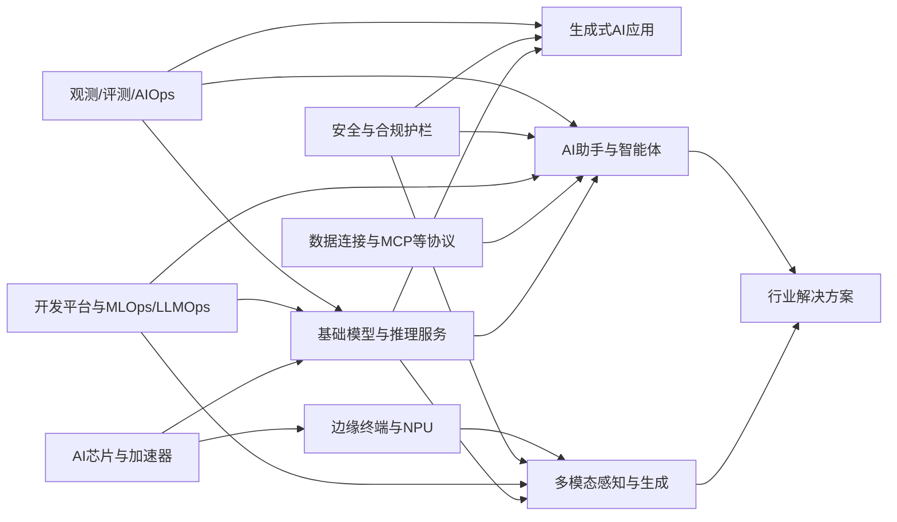

上图反映的不是理论框架，而是过去两年主流厂商的现实产品形态：OpenAI、Anthropic、微软、AWS、Google、Databricks、NVIDIA、阿里云、百度智能云、华为云，都在同时推进“模型—Agent—工具连接—治理—观测—行业场景”的全链条布局。Anthropic 在 2024 年末把 MCP 定义为连接 AI 助手与业务系统的开放标准；微软、AWS、Google、Databricks 分别把 Agent、工具连接、观测与治理做成开发平台；NVIDIA 则将推理部署、Guardrails 与基础设施打包成企业级微服务。citeturn31view6turn25view3turn25view4turn31view4turn31view5turn30view6turn25view6

| 产品方向 | 核心技术 | 典型产品/厂商 | 关键应用场景 | 常见商业模式 | 当前成熟度与判断 |
| --- | --- | --- | --- | --- | --- |
| 生成式 AI 与内容生产 | Transformer、MoE、扩散模型、文本/图像/视频生成、多模态推理。 | OpenAI GPT‑4o、ChatGPT Enterprise；Google Gemini 2.5；阿里 Qwen3；字节豆包；快手 Kling。 | 搜索问答、办公创作、营销内容、视频生成、代码生成、知识检索。 | Freemium、订阅制、API 按量付费、广告/电商分发、企业授权。 | **成熟度高，但同质化加速。** GPT‑4o 将语言、视觉、音频统一到一个模型中；Qwen3 强调推理与非推理模式统一；Kling 已把视频生成做成独立产品能力。随着开源/开放权重差距缩小，护城河更依赖分发、数据和场景。citeturn27search0turn7search2turn16search3turn28search0turn25view0 |
| 垂直行业大模型 | 行业语料微调、RAG、知识图谱、规则引擎、行业工具调用。 | 华为盘古行业模型；百度千帆；阿里云百炼；ServiceNow 行业工作流 AI。 | 金融风控、工业设计/质检、医疗文书与影像辅助、政务、能源、矿山。 | 年费订阅、项目制交付、私有化部署、运维与咨询服务。 | **成熟度中高，最适合中国市场形成壁垒。** 华为强调“AI for industries”，盘古已在 30 多个行业、400 多个场景落地；China IDC 也显示中国 AI 投资最集中的前三行业是软件与信息服务、通信、银行。citeturn14search1turn16search0turn32view0 |
| AI 助手与 Agent | 工具调用、任务规划、长期记忆、多智能体协作、Computer Use、RAG。 | ChatGPT agent；Claude Computer Use；Azure AI Foundry Agent Service；Amazon Bedrock Agents；Google Vertex AI Agent Builder；微软 Copilot Studio；百度千帆 Agent 平台。 | 知识助理、客服、销售协同、IT 服务台、研究分析、文档流转、流程自动化。 | 按席位收费、按调用/动作收费、平台订阅、实施费。 | **成熟度中。** 有明显需求，但边界要收窄。Anthropic 明确将 computer use 定义为“experimental”和“error-prone”；McKinsey 显示仅 23% 组织在某处规模化部署 agentic AI。 bounded workflow 已可商业化，完全自治仍需谨慎。citeturn25view2turn25view3turn25view4turn31view4turn46view0turn24view0 |
| 多模态感知与生成 | VLM、语音识别/合成、视频理解、文档智能、世界模型、视觉智能体。 | GPT‑4o；盘古世界模型；百度一见视觉智能体平台；Kling O1；豆包视觉理解。 | 文档/票据理解、视频生成、工业质检、门店巡检、车端感知、语音助手。 | SaaS 按量付费、项目制、边缘设备捆绑、API/SDK 授权。 | **成熟度分化。** 文档理解、图像理解、视觉质检已较成熟；世界模型、长视频生成仍在快速迭代。百度一见已明确走“云边协同、自主进化”的企业视觉平台路线，盘古则把世界模型用于智能驾驶和具身机器人训练。citeturn28search2turn28search1turn28search4turn27search6turn27search0 |
| 边缘 AI | 模型压缩、量化、蒸馏、端侧推理、NPU、端云协同。 | AI PC、GenAI 手机；Qualcomm 端侧 AI；Windows/PC 生态；企业边缘网关。 | 本地总结、会议转写、隐私优先助手、离线推理、工厂/零售现场感知。 | 硬件溢价、设备捆绑软件订阅、OEM 授权、企业终端升级。 | **成熟度中高。** Gartner 预计 2025 年 AI PC 出货量 7,780 万台，占全球 PC 31%，2026 年将增至 1.43 亿台、占比 55%；Counterpoint 指出 2025 年 Q1 GenAI 手机已占全球智能手机市场 30%。端侧价值在“隐私、延迟、单位成本”，但需要硬件刷新周期配合。citeturn31view1turn41search0turn41search3 |
| AI 开发平台 | 模型接入网关、向量检索、评测、提示词版本管理、模型服务、连接器、MLOps/LLMOps。 | Azure AI Foundry；Amazon Bedrock；Google Vertex AI Agent Builder；Databricks Mosaic AI；阿里云百炼；百度千帆。 | 企业级 AI 应用开发、模型路由、数据接入、应用上线与治理。 | 平台订阅、消费计费、企业版 license、专业服务。 | **成熟度高。** 这是未来三年最重要的平台层。微软在 2025 年报中披露 Copilot Studio 已有 23 万+ 组织使用；Azure Foundry 强调 1,400+ 连接器和企业级治理；Databricks 已将 Agent Bricks、MLflow 3.0、AI Gateway 做成完整链路。citeturn46view0turn25view3turn31view5turn25view9turn16search1 |
| AI 安全与合规 | Guardrails、PII 检测、策略引擎、运行时监控、内容水印、合规编排。 | Amazon Bedrock Guardrails；NVIDIA NeMo Guardrails；Microsoft Purview；Lakera；Google Cloud + Wiz。 | 受监管行业、企业内网、客服/法务/财务机器人、内容分发。 | 安全订阅、按量扫描、合规审计、平台附加包。 | **成熟度中，增长确定性高。** Gartner 预计 AI governance 支出 2026 年达 4.92 亿美元，到 2030 年将超过 10 亿美元；Bedrock Guardrails、NeMo Guardrails 已把“幻觉筛查、PII、越狱防护、运行时治理”做成显性产品。citeturn38view1turn25view5turn25view6turn10search1turn18search1turn30view9 |
| AI 运维与监控 | Tracing、评测、成本监控、OpenTelemetry、LLM/Agent observability、自动告警。 | Datadog LLM Observability；Elastic LLM Observability；LangSmith；MLflow 3.0；Snowflake Cortex AI Observability。 | 生产环境模型监控、成本控制、幻觉检测、性能回放、根因定位。 | Usage-based SaaS、企业版订阅、监控 seat、平台附加功能。 | **成熟度中高，但标准仍在形成。** OpenTelemetry 明确指出 AI agent observability 标准仍在演进；Elastic 与 Datadog 已把性能、安全、成本和敏感信息扫描纳入统一可观测层。citeturn31view7turn31view8turn31view9turn31view5turn22search2 |
| AI 芯片与加速器 | GPU/NPU、互连、推理引擎、rack-scale、编译器/运行时、系统级优化。 | NVIDIA Blackwell/NVL72/NIM；AMD Instinct + ZT Systems/Silo AI；华为昇腾与 CloudMatrix 384；阿里云灵骏智算。 | 模型训练、推理服务、主权 AI、行业大模型底座、端侧加速。 | 硬件销售、云算力租赁、软件订阅、运维与集成。 | **成熟度高但门槛极高。** NVIDIA 2025 财年 Q2 数据中心收入 411 亿美元，Blackwell 数据中心收入环比增长 17%；中国 2025 上半年加速服务器市场规模已达 160 亿美元，同比翻倍以上。该赛道是战略高地，但不适合大多数软件团队作为主攻起点。citeturn30view7turn30view6turn30view4turn13search2turn34search3 |

从全景表可以看到，**真正有吸引力的不是单一赛道，而是“组合赛道”**：智能体需要多模态输入，垂直行业需要治理与私有化，开发平台离不开评测与观测，边缘 AI 需要云端大模型协同，安全与合规正在从“补丁”变成采购前置项。对于产品策略而言，这意味着未来最佳打法通常不是做一个单点功能，而是做一个**以一个高价值场景切入、再向平台能力外溢**的组合产品。这个判断与国内外主流厂商的产品栈演进方向是一致的。citeturn25view3turn25view4turn31view5turn30view0turn36view0

## 市场、资本与竞争格局

从需求侧看，全球与中国市场都进入了“高增长，但结构分化”的阶段。全球层面，IDC 预计生成式 AI 的增速明显高于整体 AI；中国层面，2028 年中国生成式 AI 投资占 AI 总投资的比重将由 2024 年的 18.9% 升至 30.6%。但与此同时，IDC 也指出中国 AI 市场最大的应用场景仍然是基础设施调配，约占四成支出，这意味着在未来两三年里，AI 的利润池不会只停留在前端应用层，而会同时落在平台、基础设施和行业落地层。citeturn32view0

下表对各主要产品方向做了适合高管决策的关键属性比较。表中“市场规模”尽量采用公开口径；拿不到严格同口径数字的方向，我使用了最接近的邻近市场或支出池作为 proxy，并在“市场指标”一栏中直说。

| 产品方向 | 市场指标 | 进入门槛 | 竞争强度 | 主要盈利模式 | 上市速度 | 方向判断 |
| --- | --- | --- | --- | --- | --- | --- |
| 通用生成式 AI 应用/助手 | 全球 GenAI 到 2028 年达 2,842 亿美元；中国 GenAI 到 2028 年超 300 亿美元。citeturn32view0 | 中等 | **极高** | 订阅、API、广告、电商/办公渗透 | 快，约 3—6 个月可出 MVP | 市场大、验证快，但差异化最难，容易被平台型入口挤压。 |
| 企业级 Agent 与工作流自动化 | 企业 adoption 广，但规模化仍少；23% 已在某处规模化 agentic AI，39% 仍实验。citeturn24view0 | 中高 | 高 | 按席位、按动作量、实施费、运维费 | 快到中，约 4—9 个月 | **最适合短期切入。** 只要 ROI 可量化，就容易签单。 |
| 垂直行业大模型/行业智能体 | 中国 AI 投资前三行业为软件与信息服务、通信、银行；盘古已落地 30+ 行业、400+ 场景。citeturn32view0turn14search1 | 高 | 中高 | 年费订阅、私有化 license、项目交付 | 中，约 6—12 个月 | **最适合中期做壁垒。** 依赖行业 know-how，但后续替代率低。 |
| 多模态现场感知/视觉智能体 | 邻近支出池：全球边缘计算 2025 年 2,610 亿美元，2028 年 3,800 亿美元；中国政策强推终端与现场智能化。citeturn31view0turn32view0 | 中高 | 中 | 项目制、SaaS、硬件/边缘盒子捆绑 | 中，约 6—12 个月 | 在制造、零售、物流、安防最有机会，适合具备行业资源的团队。 |
| AI 开发平台/LLMOps/MLOps | MLOps 邻近市场 2024 年 21.9 亿美元，2030 年 166.1 亿美元，CAGR 40.5%；Databricks AI 产品 run-rate 已超 10 亿美元。citeturn35view8turn31view3 | 高 | 高 | 平台订阅、按量调用、企业版授权 | 中，约 6—12 个月 | 长期价值高，但要么深耕某一开发者生态，要么做强行业化。 |
| AI 安全/治理 | Gartner 预计 AI governance 支出 2026 年 4.92 亿美元、2030 年超 10 亿美元；TRiSM 市场 2024 年 23.4 亿美元、2030 年 74.4 亿美元。citeturn38view1turn35view7 | 中高 | 中 | 安全订阅、按扫描/策略收费、审计服务 | 快到中，约 4—8 个月 | **适合作为附加层或平台层。** 单独切赛道也成立，但需强合规与安全口碑。 |
| AI 运维/监控 | AIOps 估算市场约 15 亿美元，2020—2025 年 CAGR 约 15%；AI 观测正在向 GenAI 扩展。citeturn39view0turn31view9 | 中高 | 中 | Usage-based SaaS、企业监控 license | 快到中，约 4—8 个月 | B2B 现金流质量好，但需要与主流模型/框架深度集成。 |
| 边缘 AI/端侧 AI | Gartner 预计 2025 年 AI PC 出货 7,780 万台、2026 年 1.43 亿台；Counterpoint 指出 2025 年 Q1 GenAI 手机已占 30% 市场。citeturn31view1turn41search0 | 高 | 中高 | 硬件溢价、OEM、订阅、系统集成 | 中到慢，约 9—18 个月 | 适合有终端生态或线下场景控制力的玩家。 |
| AI 芯片与加速器 | 全球半导体市场 2025 年已超 8,300 亿美元；中国加速服务器 2025 上半年达 160 亿美元，同比翻倍。citeturn34search2turn34search3 | **极高** | 寡头化 | 硬件、云算力、软件栈订阅 | 慢，约 24—48 个月以上 | 战略价值极高，但不适合大多数产品团队。 |

资本面也验证了这一排序。斯坦福 HAI 统计显示，2024 年美国私人 AI 投资达到 1,091 亿美元，生成式 AI 全球私人投资达到 339 亿美元；KPMG 则指出，2025 年 Q1 全球 VC 投资增至 1,263 亿美元，AI 由大型 megadeal 驱动，OpenAI 一笔融资就达到 400 亿美元，Anthropic 完成 45 亿美元级别融资。与此同时，KPMG 也指出亚洲 VC 在 2025 年 Q1 仍偏弱，但中国 DeepSeek R1 的发布明显冲击了全球市场预期，并带动腾讯、阿里等中国厂商迅速推出更高能效模型，说明中国市场的技术竞争正在影响全球产品节奏。citeturn24view4turn42view0turn42view2turn42view3

并购方向则更值得管理层关注，因为它揭示了大厂真正愿意花钱买什么。过去两年最典型的几类是：  
其一，**买 AI 工作流入口与前端体验**。ServiceNow 在 2025 年完成对 Moveworks 的收购，目的就是把企业搜索、前端 AI assistant、reasoning engine 与自身工作流平台合并，打造“AI-native front door”。citeturn30view8  
其二，**买 AI 安全与治理**。Google 完成对 Wiz 的收购，明确把它定义为“AI 时代的安全平台”；Check Point 则收购 Lakera，以补齐 Agentic AI 应用的运行时安全。citeturn30view9turn18search1  
其三，**买端到端基础设施与人才**。AMD 先后完成对 Silo AI 和 ZT Systems 的收购，分别加强模型/软件与数据中心系统设计能力，这反映出在 AI 基础设施时代，芯片公司也必须向“系统公司”演进。citeturn35view6turn13search1

基于上述事实，我的竞争格局判断是：**应用层将继续碎片化，但入口会迅速集中；平台层会向云与数据平台寡头集中；基础设施层会向少数芯片与云厂商集中；中国市场会在行业落地与本土化合规上形成第二套竞争体系。** 这也是为什么“单点工具”越来越难长期防守，而“工作流 + 数据 + 治理 + 交付”越来越重要。citeturn46view0turn31view3turn30view7turn32view0turn17search2

## 合规、风险与商业化约束

如果只看技术，很多 AI 产品已经“够用”；但如果看商业化，真正决定生死的往往是合规、稳定性和交付边界。中国市场最重要的监管信号有四个：第一，《生成式人工智能服务管理暂行办法》已经把训练数据、内容安全、标识、备案等责任框架化；第二，国家网信办披露到 2026 年 4 月底已累计备案 868 款生成式 AI 服务、登记 530 款应用或功能；第三，《人工智能生成合成内容标识办法》已于 2025 年 3 月发布，并明确自 2025 年 9 月 1 日起施行，要求显式和隐式标识；第四，2026 年 5 月发布的《智能体规范应用与创新发展实施意见》把智能体的安全、可靠、可信明确为底线要求，并要求发展测试、部署、运维、安全治理等工具链。对中国市场而言，这意味着“模型能力”只是准入条件，**合规工程能力**才是产品能力的一部分。citeturn2search1turn36view0turn47search0turn30view0

国际市场也在迅速收紧。欧盟《AI Act》已于 2024 年 8 月 1 日正式生效，并采用风险分级框架，对透明度风险、高风险和不可接受风险场景施加不同义务；NIST 在 2024 年发布了《AI RMF: Generative AI Profile》，把生成式 AI 风险管理做成跨行业配套资源。再往前看，Gartner 预计到 2030 年，碎片化 AI 监管将扩展到全球 75% 的经济体，AI 治理支出将突破 10 亿美元。也就是说，未来三到五年，AI 产品经理不能把“治理”当法务条线的事情，而必须把它当作产品设计的一部分。citeturn35view0turn35view2turn38view1

另一个常被低估的风险，是**技术成熟度与宣传强度之间的差距**。以 Agent 为例，Anthropic 在发布 Claude Computer Use 时明确写到该能力“still experimental—at times cumbersome and error-prone”。McKinsey 的数据也显示企业大多仍在 pilot。换言之，Agent 确实是方向，但它更像一项“需要狭域约束与人工接管机制”的产品能力，而不是已经无条件可以替代人的“自治员工”。如果项目一开始就承诺“跨系统自治执行”，失败概率会显著高于承诺“处理一个或两个高价值工作流”。citeturn25view2turn24view0

与之对应，生产环境里的需求也在变化：企业越来越需要看到“这个模型为什么贵、为什么慢、为什么错、为什么不合规”。Elastic 已经把性能、安全、支出、防护措施监测做成统一的 LLM observability 层；Datadog 直接把敏感信息扫描与 LLM Observability 绑定；OpenTelemetry 社区也在推进 AI agent observability 语义约定。这说明可观测性不再只是研发工具，而会逐步变成企业采购 AI 系统的标配条件。citeturn31view9turn31view8turn31view7

| 主要风险 | 典型表现 | 对商业化的影响 | 现实应对路径 |
| --- | --- | --- | --- |
| 幻觉与事实错误 | 检索答非所问、总结失真、自动决策不可靠。 | 直接拖累客户信任，尤其是财务、法务、医疗、客服。 | 把 RAG、自动推理、人工校验链路前置。AWS 已把“自动推理检查”做成 Guardrails 能力。citeturn25view5 |
| 数据泄露与隐私风险 | Prompt 中含 PII、企业知识库被误暴露、日志泄漏。 | 在政企、金融、医疗采购中会直接卡住。 | 数据分级、脱敏、权限隔离、私有化部署、日志留存与审计。Datadog、Purview、NeMo Guardrails 都在围绕这一点做产品化。citeturn31view8turn10search1turn25view6 |
| 监管碎片化 | 中国备案/标识、欧盟风险分级、跨境数据要求差异。 | 多区域上线成本显著提高。 | 用治理平台做统一政策编排与持续合规，而不是手工对单点义务打补丁。citeturn36view0turn47search0turn35view0turn38view1 |
| 集成与数据质量问题 | 系统连接复杂、业务主数据脏、知识库过期。 | AI 看似可用，但迟迟做不出稳定 ROI。 | 先做高频窄流程；把连接器、知识更新、模型评测放进正式项目范围。McKinsey 指出真正高绩效企业会重构流程。citeturn24view0 |
| 单位经济性不清晰 | Token 成本高、推理延迟高、边缘设备硬件成本高。 | 用户增长不一定转化为利润增长。 | 模型路由、小模型替代、缓存、量化、端云协同、成本可观测。citeturn30view6turn31view9turn31view5 |
| 组织变革不足 | 一线员工不用、流程 owner 不配合、领导层只看 demo。 | 项目停留在试点，无法扩大采购。 | 用“节省时长、提升转化、减少工单、降低错误率”而不是“模型更强”来卖。McKinsey 的 6% 高绩效企业说明管理机制极关键。citeturn24view0 |

综合来看，**AI 产品最大的风险不是“模型不够强”，而是“在真实流程中不够稳、不够省、不够合规”**。这也是为什么治理、观测、评测和私有化部署能力，在过去两年从“后台能力”上升为“可售卖能力”。citeturn38view3turn31view9turn31view8

## 优先级建议与实施路线

在默认对象是“希望未来 12—24 个月形成可复制收入的软件/平台型团队”的前提下，我建议把方向优先级排成下面这样。排序并不是按“技术性感”排，而是按**市场需求密度、可验证 ROI、进入壁垒、交付难度、资金效率**综合排序。

| 优先级 | 建议方向 | 周期 | 为什么值得做 | 关键实施要点 | 资源与时间线建议 |
| --- | --- | --- | --- | --- | --- |
| **最高优先级** | 企业级 AI 助手/Agent，聚焦一个高价值工作流。 | 短期 | 企业 AI 渗透已广，但真正能规模化的仍少；谁能把某个流程做出可量化 ROI，谁就最容易获客和扩单。微软、OpenAI、AWS、Google 都在把 Agent 做成入口能力。citeturn24view0turn46view0turn25view1turn25view3turn25view4turn31view4 | 不要做“万能助手”，先做 1—2 个场景，例如客服工单、销售知识检索、法务条款审阅、IT 服务台。内核必须同时具备：数据连接、权限体系、评测、回放、人工接管。 | 典型团队：产品 1、前后端 4—6、ML/Prompt 2、数据/集成 2、解决方案 1、合规/安全 1。<br>8—12 周做 MVP，4—6 个月拿首批付费试点。 |
| **高优先级** | 垂直行业智能体，优先制造、金融、医疗、政企。 | 中期 | 中国市场更偏好国产、合规、私有化、行业 know-how；盘古、千帆、百炼都在走这条路。行业模型的价值不在“大”，而在“嵌入行业流程”。citeturn17search2turn36view0turn16search0turn25view9turn16search1 | 选择一个监管或流程复杂行业，形成“模型 + 流程 + 数据连接 + 交付模板”。尽量把项目型能力产品化，例如沉淀成模板、规则库、评测集、行业知识组件。 | 典型团队：行业专家 2—3、产品 1—2、ML 3、数据工程 2、交付/售前 2。<br>6—9 个月形成行业版产品，9—18 个月扩展第二行业。 |
| **高优先级** | AI 评测/观测/治理一体层。 | 中短期 | 这是所有 AI 项目的“刚需附加层”。Gartner 预计治理支出 2030 年超 10 亿美元；Datadog、Elastic、Databricks 都证明这层可以单独卖，也可以增强主产品粘性。citeturn38view1turn31view8turn31view9turn31view5 | 切入点可从“成本可视化 + 敏感信息扫描 + 幻觉评测 + 审计日志”四件事开始。最适合和主业务产品绑定销售，而不是从零独立做大而全平台。 | 典型团队：产品 1、后端/平台 3—4、AI 评测工程师 1—2、安全工程师 1。<br>10—16 周可形成 V1，最适合作为 enterprise SKU。 |
| **中优先级** | 多模态现场感知与边缘 AI。 | 中长期 | 边缘/现场场景有真实预算，且更容易形成物理世界数据壁垒；但交付比纯软件复杂。适合制造、零售、物流、安防、能源。citeturn31view0turn28search2turn28search1turn31view1 | 路线不是“先做通用边缘平台”，而是先从一个现场问题切入，例如巡检、质检、门店运营。再逐步形成云边协同能力、端侧部署能力与模型压缩能力。 | 典型团队：产品 1、视觉/语音算法 2—3、边缘工程 2、后端 2、交付 2。<br>6—12 个月形成一个行业方案，12—24 个月平台化。 |
| **选择性布局** | AI 开发平台/Agent builder。 | 中长期 | 平台价值高，但强烈依赖生态与开发者心智；更适合已有云、数据或开发者分发能力的公司。citeturn31view3turn25view3turn31view4turn25view9turn16search1 | 如果没有大分发，就不要做通用平台，而要做“行业 Agent builder”“私有数据 Agent builder”或“多模态文档智能 builder”。 | 需要平台工程、模型服务、连接器与商业生态的持续投入。通常要 12—24 个月才会显现平台复利。 |
| **谨慎进入** | AI 芯片/加速器。 | 长期 | 市场大，但资本、供应链、生态、编译器、客户验证门槛都极高；对大多数产品公司不是一号方向。citeturn30view7turn34search3turn34search2 | 只有在具备资本、硬件经验、系统软件团队和特定客户基础时才考虑；否则更现实的做法是做“推理优化软件、模型服务、行业算力集成”。 | 一般需要多年度投入，24—48 个月以上才有明显商业结果。 |

如果把这些建议压缩成一句管理层可以直接执行的话，那就是：**先做“能算赢”的窄场景 Agent，再把治理、观测、多模态和行业知识逐步抽象成平台能力。** 这条路径比“先做一个大而全平台”更现实，也比“从零造底模/造芯片”资金效率更高。这个判断与 McKinsey 关于 AI 高绩效企业的结论、以及 ServiceNow/Moveworks 这类并购对“工作流入口”的重视高度一致。citeturn24view0turn30view8

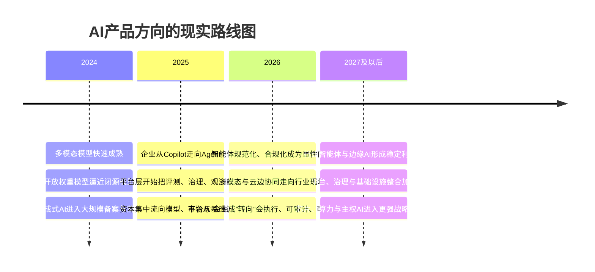

就实施路径而言，我建议按“短中长期三段式”推进：

短期，聚焦一个高频、标准化程度较高、能明确算账的工作流。最合适的是客服、销售、知识检索、IT 服务台、财务报销审核、法务条款比对这类流程。短期的成功标准不是模型评分，而是三项业务指标：单次请求成本是否下降、处理时长是否缩短、人工回退率是否可控。只要把这三项指标做实，就能把 AI 从“试验预算”拿到“业务预算”。这一阶段最重要的资源不是训练算力，而是系统连接器、权限体系、日志审计与评测集。citeturn24view0turn25view3turn25view4turn31view9

中期，围绕一个行业把产品做深。制造业适合“视觉智能体 + 质检/巡检/工序管理”，金融适合“知识与流程智能体 + 合规审校”，医疗更适合“文书/辅助分诊/非核心诊疗运营智能体”，政企适合“知识处理、材料审核、问答工单”。中期产品的关键不是再追前沿基准，而是沉淀可复制交付模板：行业知识库、权限模型、评测规则、领域工具调用链、私有化交付方案。谁先做到这一步，谁就会从“卖模型能力”升级到“卖行业操作系统”。citeturn16search0turn28search2turn32view0

长期，再决定是否平台化。如果前两阶段已经拿到足够多的真实流程、真实日志、真实评测数据，那么可以顺势把底层能力抽象出来，做成开发平台、治理平台或多租户产品线。如果没有真实场景沉淀，直接做平台往往会陷入“功能很多、客户很少”的困境。长期价值最大的产品通常不是最先看起来最酷的，而是最早沉淀出**数据、流程、治理、观测闭环**的产品。citeturn31view5turn38view3turn24view0

最后给出一个明确排序：  
**短期首选**：企业级 AI Agent / workflow copilot。  
**中期首选**：垂直行业智能体，优先多模态、强合规场景。  
**长期首选**：AI 开发平台与评测/观测/治理一体层；若具备终端/线下控制力，再加码边缘 AI。  
**审慎进入**：通用基础模型自研与 AI 芯片。  

如果只能押注一个方向，我建议押注**“行业化 Agent 产品”**，而不是“单纯 Agent 平台”或“通用聊天助手”。因为前者最容易把 ROI、合规和壁垒同时做出来。这个方向同时顺应了中国市场对国产化、可备案、可私有化的要求，也顺应了全球市场从 Copilot 向 Agent、从 demo 向 workflow、从模型分数向业务结果迁移的大趋势。citeturn17search2turn36view0turn24view0turn46view0turn30view8

近期产业动态参考如下，便于跟踪后续变化：  
navlist近期AI产品与资本动态turn21news44,turn28news44,turn18news45,turn19news40


# 现在 AI Agent 发展的最新方向研究报告

## 执行摘要

在 2024—2026 这一轮演进中，AI Agent 的核心变化，不是“把大模型再包一层 UI”，而是从**单次问答模型**转向**可持续运行的系统**：它们开始具备更强的多步推理、工具调用、跨系统执行、长期状态管理、观测与评测，以及在必要时与人协同的能力。OpenAI 将构建重心放在 Responses API、Agents SDK、AgentKit、内置工具和评测体系上；Anthropic 则将重点推进到 context engineering、MCP、computer use、managed agents 与 agent evals；Google DeepMind 则明确把“通用 AI 助手”作为方向，将 Gemini、Project Astra、Project Mariner、A2A、ADK 与 Agent Engine 串成一条产品和研究主线。本文的判断是：**Agent 正从“模型能力问题”快速转为“系统工程问题”**。citeturn26view0turn31view1turn29view3turn30view0turn38view0

从技术层面看，最新方向可概括为六条主线：**推理模型与规划能力增强、长期记忆与状态化、工具与协议标准化、多代理与分布式协作、多模态与计算机/浏览器操作、具身与世界模型**。这些方向已经不再是分散的科研点，而是逐步在产品中汇合：例如，OpenAI 的推理模型开始“agentically use and combine every tool”；Anthropic 将“上下文工程”视为比传统 prompt engineering 更关键的新范式；Google 则把 Project Astra 的视频理解、屏幕共享、记忆与电脑控制并入“通用 AI 助手”的路线图。citeturn31view0turn29view5turn30view0turn30view1

但与此同时，Agent 的“可用性边界”仍然很清晰。WebArena、OSWorld、AssistantBench、SWE-bench、LoCoMo、MemBench 等现实场景评测说明，开放环境中的网页导航、跨应用操作、长期记忆与稳定执行仍远未完全解决；尽管成绩从 2024 到 2026 有明显提升，例如 Claude Sonnet 4.5 在 OSWorld 上达到 61.4%，但这并不意味着通用 Agent 已在所有真实任务上达到人类水平。现实部署中最突出的难题，依然是**提示注入、过度授权、隐私泄露、不可逆操作、长链路错误传播和评测困难**。citeturn4search1turn35view0turn35view1turn35view3turn35view2turn29view6turn3search14turn28view3turn28view4turn22search5

对技术决策者而言，最具确定性的机会不是“全能个人 AGI 助手”本身，而是三类更现实的方向：**高价值垂直 Agent、Agent 运行时与安全治理基础设施、以及围绕协议和连接器的企业级集成层**。在未来一到三年，AI Agent 的竞争焦点很可能从“谁的模型更强”转向“谁能更安全地把模型接到真实世界并稳定交付结果”。citeturn31view1turn29view3turn26view3turn26view4turn27search2

## 定义与分类

结合中国网信办 2026 年《智能体规范应用与创新发展实施意见》、中国信通院 2025 年政务智能体报告，以及近两年的 Agent 综述文献，本文采用一个偏工程化的定义：**AI Agent 是具备自主感知、记忆、决策、交互与执行能力，能够在目标约束下通过工具、环境与人协同完成任务的智能系统**。这一界定比“会对话的大模型应用”更严格，因为它强调外部行动能力、持续状态与任务闭环。citeturn26view4turn27search1turn6search1

从能力结构看，当前 Agent 可以大致分为几类。第一类是**单模态 Agent**，主要围绕文本输入、知识检索、分析写作、代码修改与工作流编排展开，常见于客服、研究、法务、投研和软件开发。第二类是**多模态 Agent**，同时使用文本、图像、音频、视频或界面像素进行理解和行动，代表方向包括浏览器代理、桌面代理、手机代理与视觉辅助系统。Project Astra、OpenAI computer use、Anthropic computer use 都属于这一类。citeturn30view1turn28view5turn29view1

第三类是**工具使用型 Agent**，也是目前商业化最快的一类。这类系统通过 API、函数调用、数据库、RAG、代码执行器、浏览器、文件系统等外部能力来“补足模型天花板”，其关键问题已从“是否会调用工具”转向“如何在正确时机调用正确工具，并在失败后恢复”。OpenAI Responses API、Anthropic 的 advanced tool use 与 Google 的 ADK/Agent Engine 都在朝这一方向收敛。citeturn26view0turn28view6turn37search10turn38view0

第四类是**内省型或反思型 Agent**。这类系统强调可控推理、元推理、自我检查、错误恢复与上下文管理。其典型信号包括 OpenAI reasoning + tools、Anthropic 的 hybrid reasoning、visible/extended thinking、“think” tool，以及 Google/DeepMind 的自发现推理结构研究 SELF-DISCOVER。这里的核心变化并不是把推理过程“展示出来”，而是把推理从一次性文本技巧，升级为可嵌入执行循环的系统能力。citeturn31view0turn37search7turn37search0turn7search7

第五类是**协作型与分布式多代理系统**。这一方向在 2025—2026 年明显升温：Anthropic 把 Research 做成并行子代理系统；Microsoft 的 Magentic-One 采用 orchestrator + specialist agents 的架构；CrewAI、AutoGen 等开源框架把多代理协作标准化；Google 进一步把 agent-to-agent 通讯协议 A2A 推向开放标准。它们反映出一个重要趋势：**复杂任务不再由单个“万能代理”解决，而是由多个专长代理分工协同。**citeturn29view4turn35view6turn26view7turn33view2turn26view3

第六类是**具身 Agent**。这类系统不只理解数字世界，还要在物理或仿真环境中规划与行动。Google DeepMind 的 Genie 2、Gemini Robotics、Gemini Robotics-ER、SIMA 2，都表明“世界模型 + embodied reasoning + action interface”正在成为长期前沿方向。就成熟度而言，这一方向仍主要处于研究和受限试点阶段，但它对中长期产业格局影响很大。citeturn30view3turn30view4turn30view6turn30view5

## 关键技术进展

最近两年的第一个关键进展，是**推理模型与规划能力从“答题增强”转向“行动增强”**。OpenAI 在 2025 年明确表示，推理模型首次可以在 ChatGPT 中“agentically use and combine every tool”，并把这视为迈向更具代理性的系统；Anthropic 则把 Claude 3.7 及后续模型定义为 hybrid reasoning model，并通过 “think” tool、extended thinking 和 context engineering 把复杂推理融入工具调用；Google 将 Gemini 2 解释为“thinking、reasoning、tool use 的基础”，Gemini 3 则把这些能力合并为 agent foundation。换言之，Agent 规划正在从“链式提示模板”走向**可调度的 reasoning runtime**。citeturn31view0turn37search7turn37search3turn29view5turn26view2turn24search15

第二个关键进展，是**记忆与状态化从外挂式 RAG 迈向可写、可管、可评测的长期记忆系统**。Letta 已把 stateful agent、memory blocks、shared memory 和 read-only memory 做成基础概念；LoCoMo 与 MemBench 则说明，仅仅延长上下文窗口不足以解决长期对话和长期任务问题，模型在时间因果、跨会话一致性和多模态长期记忆方面仍显著落后于人类；Mem0 等记忆架构则尝试用显著性提取、合并和图结构记忆来降低 token 成本并提升长期效果。这里的最新方向不是“更长 context”，而是**把记忆做成一层独立于模型的系统能力**。citeturn33view0turn33view1turn35view3turn35view2turn6search2

第三个关键进展，是**工具调用正在标准化和协议化**。OpenAI 在 Responses API 中把 web search、file search、computer use 和 remote MCP 放到同一工具面；Anthropic 推出 MCP，把模型接入数据源、工具与工作流的方式从“每家各写一套 connector”重构为通用协议；Google 则推进 A2A，试图解决“代理之间如何发现、认证、互通与协作”的问题。MCP 更像“模型—工具/上下文”层的标准，A2A 更像“代理—代理”层的标准。二者叠加意味着 AI Agent 的系统栈正逐渐形成类似互联网协议分层的生态。citeturn26view0turn28view6turn29view0turn32view0turn26view3turn32view2turn38view0

第四个关键进展，是**长时运行与执行架构的系统化**。Anthropic 2026 年提出“decoupling the brain from the hands”，把 session、harness、sandbox 拆开；OpenAI 在 2025 年则强调 background mode、prompt caching、events/webhooks 等长期运行原语；Google 的 Agent Engine UI 也正在把 trace、session、deployment 做成生产环境管理界面。这说明生产级 Agent 的问题已明显超出 prompt 与模型精度——它需要状态存储、任务恢复、错误处理、权限管理和运行时隔离。citeturn29view3turn29view2turn31view4turn38view0

第五个关键进展，是**多模态感知与界面操作正在从演示走向受控部署**。Anthropic 在 2024 年公开 computer use，OpenAI 在 2025—2026 年把 computer use 做成通用工具回路，Google 的 Project Mariner 从浏览器原型发展到最多同时处理十项任务，Project Astra 则把视频理解、屏幕共享、记忆与设备间连续性整合为“通用 AI 助手”路线图。与此同时，OSWorld、WebArena 和 AssistantBench 这些真实环境 benchmark 把焦点拉回现实：Agent 必须面对网页、应用、文件、外设、网络延迟和不可预期页面状态，而非只在干净 API 里执行。citeturn29view1turn28view5turn30view0turn30view1turn35view0turn35view4turn35view1

第六个关键进展，是**强化学习、自动评测与外部验证器正在成为 Agent 提升的关键路径**。OpenAI 的 RFT 让开发者通过 grader 对 reasoning models 进行强化微调；Anthropic 明确提出 agent evals 的核心难点是多轮工具调用与环境状态修改；Google DeepMind 的 AlphaEvolve 则把模型、自动验证器和进化搜索结合起来做算法发现。一个明显趋势是：**Agent 的能力不再只靠更大的预训练获得，而是越来越依赖“模型 + grader/evaluator + 环境反馈”的闭环。**citeturn31view2turn31view3turn29view6turn24search0

第七个关键进展，是**具身智能与世界模型开始与 Agent 主线合流**。Genie 2 可以从单张图像生成可交互的 3D 环境，作为训练和评估 embodied agents 的无限课程；Gemini Robotics 通过 VLA 与 embodied reasoning 双模型路线，把感知、规划与物理动作打通；SIMA 2 则从 instruction-following 升级为会对话、会推理、能长期改进的虚拟世界 agent。虽然这些系统仍远未进入广泛商业部署，但它们清楚表明：中长期真正的“代理化”不会只停留在浏览器和办公软件里。citeturn30view3turn30view4turn30view6turn30view5

下图概括了 2025—2026 年最典型的生产级 Agent 架构。它反映的是行业收敛方向，而非某一家公司的唯一实现。该图基于 OpenAI 的 Responses/Tools 体系、Anthropic 的 session-harness-sandbox 架构、MCP/A2A 协议，以及 Google/Anthropic 对长期运行、多代理与安全确认的公开做法综合抽象而成。citeturn26view0turn29view3turn32view0turn26view3turn38view0turn28view5

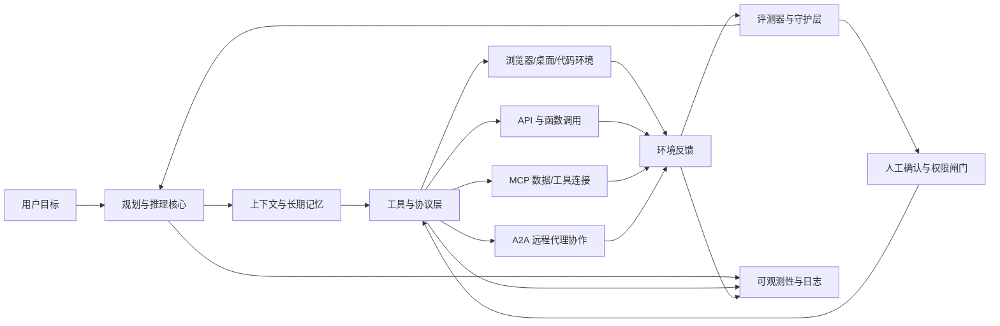

## 产业化与产品化案例

当前产业化最成熟的落地方向，集中在四类场景：**研究与知识工作、软件开发与运维、企业流程自动化、以及多系统办公协同**。Research agent、coding agent 和 browser/computer-use agent 是最典型的三条主线：OpenAI deep research 面向高强度知识工作者；Anthropic 与 OpenHands、Jules 则重点占领 agentic coding；Google、OpenAI、Anthropic 共同推动浏览器与桌面任务自动化；中国本土产品如 Manus、扣子、阿里云百炼/灵码等，则更强调办公、开发和企业应用的可快速交付。citeturn31view5turn33view3turn30view2turn29view1turn34view0turn21search0turn34view2turn34view3

| 平台/项目 | 近两年代表能力 | 典型场景 | 交付形态与商业路径 | 代表依据 |
|---|---|---|---|---|
| OpenAI Agents SDK / Responses API / AgentKit / deep research | 统一 Responses API、内置 web/file/computer tools、多代理工作流、Agent Builder、Evals、RFT、研究型 agent | 深度研究、客服、企业助手、流程自动化 | API 调用 + 企业平台 + 可视化工作流 + 内置评测 | citeturn26view0turn31view1turn31view5turn31view2 |
| Anthropic MCP / computer use / Managed Agents / Research | MCP 标准、computer use、multi-agent research system、managed agents、context engineering、agent evals | 编码、研究、金融、浏览器任务、长时任务 | 平台 API + 托管 agent + 协议生态 + 行业模板 | citeturn29view0turn29view1turn29view3turn29view4turn29view6 |
| Google DeepMind / Google Cloud Agents | Gemini 通用助手路线、Project Astra、Project Mariner、Jules、ADK、Agent Engine、A2A | 浏览器操作、跨系统任务、编码、云端企业代理 | 云平台 + SDK + 协议 + 研究原型转产品 | citeturn30view0turn30view1turn30view2turn26view3turn38view0 |
| Meta Llama Stack | 将 inference、storage、safety、tool calling、agent orchestration 做成统一 OpenAI-compatible server | 私有化部署、企业自建 agent 平台、开放生态 | 开源/开放栈 + 服务端抽象 + 多提供方接入 | citeturn23search1turn11search4turn23search0 |
| LangGraph / LangSmith | 长时、可恢复、可追踪的 agent orchestration；可观测、评测、部署一体化 | 企业工作流、复杂状态机、生产级代理监控 | 开源编排框架 + SaaS/私有化 observability/evals | citeturn26view6turn18search0turn18search4 |
| AutoGen / Magentic-One | 多代理对话和协作框架；orchestrator 指挥专长代理；配套 benchmark 工具 | 通用复杂任务、网页与文件混合任务、研究实验 | 开源框架 + 研究基准 + 可扩展多代理系统 | citeturn26view7turn35view6 |
| OpenHands | 软件代理 SDK、CLI、Local GUI、Cloud、Enterprise，自带代码/系统交互能力 | 代码修复、测试编写、自动审查、开发协作 | 开源 SDK + 商业 Cloud/Enterprise | citeturn33view3turn13search0turn13search9 |
| Manus | 自主通用 agent、沙盒环境、互联网访问、持久文件系统、自定义工具 | 办公任务、研究、内容生成、结果交付 | 订阅式产品 + 面向个人与团队的 agent 平台 | citeturn34view0turn21search3 |

如果从开源社区的演化看，LangGraph、AutoGen、CrewAI 和 OpenHands 更接近当前“生产可用”的基础设施层；AutoGPT 与 BabyAGI 则更像上一阶段的重要启蒙项目，它们推动了任务规划、自主循环、基准测试和函数/触发式执行环境等理念扩散，但在 2025—2026 的主流生产栈中，其角色更多转向生态启发与原型孵化。citeturn26view6turn26view7turn33view2turn33view3turn8search3turn33view4

中国市场的路线也已逐渐清晰。Manus 明确把自己定义为“拥有自己电脑的虚拟同事”；阿里云百炼与灵码则把“智能体应用调用”“自定义智能体”“subagent 调度”和独立工具权限做成官方开发入口；扣子则把 AI Agent 办公平台和跨设备、跨渠道行动力作为主要卖点。与国际厂商相比，本土产品更强调“办公结果交付”和“企业场景快速接入”，而不是先做大而全的研究型 agent。citeturn34view0turn34view2turn34view3turn21search0

就商业模式而言，当前最稳固的并不是“卖一个会思考的模型”，而是四种组合：**按调用计费的 Agent API、按席位收费的企业助手、面向企业的托管工作流平台、以及围绕监控/评测/安全/连接器的基础设施服务**。OpenAI、Anthropic、Google、LangChain、OpenHands 的产品路径几乎都在向这四类模式聚拢，这也是判断行业进入“系统层竞争”的重要依据。citeturn31view1turn29view3turn38view0turn18search0turn33view3

## 风险、治理与合规

AI Agent 的头号安全问题已经从一般意义上的“幻觉”升级为**提示注入驱动的越权行动**。OpenAI 明确把 prompt injection 定义为 frontlier security challenge；Anthropic 则指出，对于 browser-based agents 来说，每个网页、嵌入文档、广告和动态脚本都可能成为攻击向量；OWASP 2025 中文版则进一步把“过度自主性”“系统提示泄露”“无限制消耗”等纳入高风险项。这意味着：一旦 Agent 能浏览网页、连企业知识库、执行命令或发邮件，它的风险形态就更接近“操作系统和浏览器安全”，而不再只是 NLP 输出质量问题。citeturn28view3turn28view4turn22search5turn22search1

因此，生产级 Agent 的安全设计必须默认采用**零信任外部内容**。OpenAI 的 computer use 指南建议在隔离浏览器或容器中运行工具、为域名与动作建立 allow-list、对购买与破坏性操作保留 human in the loop；Anthropic 的浏览器防护实践则强调针对 prompt injection 的强化学习与持续对抗评测；Meta 的开发者指南也明确提出应设定 agent use policies，限定智能体可采取的动作范围。高质量 Agent 的安全，不是靠一道 system prompt，而是靠**权限、隔离、确认、评测与审计**的组合。citeturn28view5turn28view4turn23search5

隐私与数据治理同样正在成为 Agent 设计的一级约束。NIST 2024 的 Generative AI Profile 明确将可信度纳入设计、开发、使用和评估全过程；OpenAI 在 Responses API 中强调 business data 默认不用于训练，并通过 connector、remote MCP、workspace controls 等方式增强企业控制；Google 的 Agent Engine UI 和 A2A 标准化认证机制，也说明企业部署越来越依赖可追踪的 session、trace 和身份边界。对于 Agent 来说，**能接入多少数据和工具，不该只取决于“模型是否足够聪明”，更要取决于组织是否能证明其边界可控。**citeturn28view1turn26view0turn38view0turn32view1

从监管与标准化看，2025—2026 的最大变化，是全球主要司法辖区都在从“原则讨论”转向“落地机制”。欧盟 GPAI Code of Practice 已在 2025 年发布，并聚焦透明度、版权、安全与系统性风险；中国网信办在 2026 年发布《智能体规范应用与创新发展实施意见》，明确提出任务理解、任务规划、工具使用、长期记忆、互认互通、群体协同等技术攻关，并要求布局数据交换、质量评测、安全保障、可信认证等标准体系；中国 2024 版《国家人工智能产业综合标准化体系建设指南》则为更宽泛的质量、安全、数据和产业标准化提供框架。可以说，**Agent 正在从“产品创新对象”转变为“治理对象”与“标准对象”。**citeturn28view2turn26view4turn19search1

一个特别值得关注的趋势是**协议层合规**。MCP 已把 authorization 机制纳入规范讨论，A2A 也在 v0.2 及后续版本中推进标准化认证与更轻量的 stateless interaction。这意味着未来企业会越来越关注：代理如何被发现、如何声明能力、如何认证、如何在跨组织调用中回溯责任。这一层如果不成熟，多代理系统越开放，风险就越高。citeturn32view1turn38view0turn32view2

## 路线图、产业机会与建议

综合近两年的研究、产品发布与治理文件，本文给出一个简化的成熟度判断。需要说明的是，这不是行业统一标准，而是基于公开证据的分析性归纳。citeturn26view0turn29view3turn30view0turn27search2

| 方向 | 2024 关键信号 | 2025—2026 状态 | 成熟度判断 |
|---|---|---|---|
| 工具使用型数字 Agent | Responses API、computer use、MCP、ADK 初步成型 | 已进入企业试点和部分规模化部署，成为最确定的商业化主线 | **高** citeturn26view0turn29view0turn38view0 |
| 浏览器/电脑操作 Agent | Project Mariner、Anthropic computer use、OSWorld | 仍需受控部署与人工确认，但能力提升极快 | **中高** citeturn29view1turn30view0turn35view0 |
| 长期记忆与状态化 | LoCoMo 暴露能力缺口，Letta/Mem0 等架构出现 | 技术已进入系统化建设阶段，但长期一致性仍未解决 | **中** citeturn35view3turn33view0turn33view1turn6search2 |
| 多代理协作与分布式系统 | AutoGen、Magentic-One、Anthropic Research system | 在研究、编码、复杂知识任务中已有明显价值 | **中高** citeturn26view7turn35view6turn29view4 |
| 协议互通与连接器标准 | MCP、A2A 启动开放生态 | 2025—2026 进入快速标准化与企业集成阶段 | **中高** citeturn32view0turn26view3turn38view0 |
| 具身 Agent 与世界模型 | Genie 2、Gemini Robotics、SIMA 2 | 仍以研究与受限试点为主，中长期潜力最大 | **中低** citeturn30view3turn30view4turn30view5turn30view6 |

从机会看，短期最可做的是**高价值、低容错损失、成功标准明确**的垂直流程，例如研究分析、代码修复、合规初筛、文档工作流、客服分流和内部知识运维。Anthropic 自己也强调，Agent 最适合“有清晰成功标准、允许反馈循环、且有人类监督”的任务；OpenAI 与 Google 的产品路径也基本围绕这些高价值知识工作展开。citeturn26view1turn31view1turn30view0

中期最值得布局的是**Agent 基础设施层**。包括：统一工具协议网关、连接器治理、可观测与 trace grading、长期状态与可删除记忆层、权限策略与审批流、以及以 session/harness/sandbox 为核心的执行运行时。这些东西通常不如“模型升级”吸引眼球，但更可能构成难以替代的工程壁垒。citeturn29view3turn29view6turn18search0turn32view0turn32view1

长期则应关注**世界模型与具身执行**。Google DeepMind 已经把通用 AI 助手、世界模型、机器人 embodied reasoning 放到同一叙事里；中国信通院的 2025 年产业报告也把“探索世界模型”和“具身智能走出比特世界”视为关键路径。对于制造、物流、零售、公共服务等面向物理环境的行业，这条线会比纯办公 Agent 更具结构性价值。citeturn30view0turn30view3turn30view4turn27search2

基于上述研究，给出五条可操作建议：

- **优先做“窄场景、强闭环、可评测”的 Agent，而不是追求全能助手。** 最合适的切入点是有明确目标函数、可验证结果和可插入人工审批的流程。citeturn26view1turn29view6turn31view1
- **把连接器与协议层独立出来，优先兼容 MCP，并关注 A2A。** 这会显著降低未来模型和平台替换成本，也更利于企业治理。citeturn29view0turn32view0turn26view3turn38view0
- **在正式扩容前，先建设 evals、trace 与回放体系。** 未来真正拉开差距的，往往不是模型首轮回答，而是你是否能发现失败、定位失败并持续修复失败。citeturn29view6turn31view3turn18search0
- **采用“脑与手分离”的 runtime 设计。** 让推理核心、会话日志、执行沙盒、外部工具和权限控制彼此解耦，能显著提升安全、恢复性和跨环境部署能力。citeturn29view3turn29view2turn28view5
- **把长期记忆当作产品能力来治理，而不是简单打开长上下文。** 应从一开始就设计可写、可共享、可审计、可删除的记忆层，并明确 retention、更新与权限策略。citeturn33view0turn33view1turn35view3turn35view2

## 开放问题与局限

本文主要依据 2024—2026 年公开论文、官方技术文档、政策文件与公司公告整理而成，但仍有三点局限。其一，部分最新性能结果来自厂商自有评测或自有产品发布，跨平台横向可比性有限。其二，2025—2026 的不少能力仍处于 beta、research preview 或 limited access 阶段，产品形态和政策边界可能快速变化。其三，中国公开材料目前在治理、政务和产业趋势层面较强，但在统一的通用 Agent 标准 benchmark 与可复现对比方面，仍不如国际英文研究社区丰富。citeturn29view1turn31view1turn30view1turn27search1turn27search2

# 中国桌面 AI Agent 竞争研究报告

## 执行摘要

本报告将“桌面 AI Agent”界定为：能在本地桌面或本地工作区内直接操作文件、浏览器、应用与协同系统，并通过聊天渠道或移动端持续调度的产品。按这个口径，OpenClaw 更像“开源运行时与控制平面底座”，腾讯 QClaw 更像“微信/IM 驱动的个人入口产品”，阿里系的钉钉悟空更像“组织协同与企业治理平台”，而阿里另一条线的 QoderWork 则更接近“面向白领交付物的桌面工作站”。从行业环境看，QuestMobile 披露 2026 年 3 月 AI 原生 App 月活已达 4.4 亿；IDC 也判断中国企业级 AI Agent 市场在 2025 年至 2026 年初已从概念验证转向规模化价值交付；信通院则把智能体带来的治理与安全问题列为核心产业挑战之一。citeturn31search3turn32search2turn32search3

截至 2026 年 5 月 19 日，竞争焦点已经不再是“谁先把 Agent 跑起来”，而是“谁先把 Agent 放进高频入口，并顺利从免费体验转入会员、席位或 Credits 变现”。QClaw 在 2026 年 4 月 1 日官方案例页仍写明“公测阶段完全免费、每天送 4000 万 Token”，但到 5 月 19 日，官方文档已经上线 50/150/500 元月订阅与积分包；悟空则采用“免费算粒体验 + 个人/企业会员 + 充值包”的席位化路径；OpenClaw 本体继续以 MIT 开源软件存在，但模型、搜索、媒体理解等实际成本由外部供应商计费，且费用发生在 OpenClaw 软件之外。citeturn46view0turn44view0turn44view1turn13view0turn12view0turn27search1

如果只看“谁更值得选”，结论非常明确。QClaw 的优势不在模型本身，而在微信、小程序和五大 IM 直连带来的低门槛与高触达；悟空的优势不在“像不像 OpenClaw”，而在钉钉原生、管理员授权、企业配额和移动协同构成的组织级治理能力；OpenClaw 的优势则在开放、自托管、多渠道和插件式扩展；QoderWork 的优势是直接交付 Word、Excel、PPT、PDF、图表和浏览器任务，贴近“办公室结果交付”而非聊天。citeturn10view2turn6view1turn24view0turn12view2turn20view1turn27search0turn28view3turn48search1turn48search3

一个很重要、但容易被忽略的事实是：这个市场仍高度分散，远未到头部垄断阶段。单看应用宝这个公开窗口，EasyClaw 的公开下载已到 1.0 万，QClaw 为 3,784，MiniMax 为 677，阶跃 AI 为 596。这说明用户当前最优先考虑的，仍然是“一键安装、接入国内模型、低成本跑起来”，而不是品牌归属本身。也因此，我判断 2026 年上半年的中国桌面 Agent 市场，本质上仍是“安装门槛竞争 + 入口竞争 + 计费单位竞争”的早期阶段。citeturn42search2turn37search0turn37search3turn36search6

## 赛道现状与竞争态势

从产品路线看，这一轮中国桌面 Agent 大致分成四条线。第一条是**开源底座线**，以 OpenClaw 为代表，强调自托管、多渠道、插件扩展和设备节点；第二条是**高频入口线**，以 QClaw 为代表，强调微信小程序、IM 直连、零配置和个人效率；第三条是**组织协同线**，以钉钉悟空为代表，强调本地控制、云端安全沙箱、管理员授权和企业统一采购；第四条是**交付工作站线**，以 QoderWork 为代表，强调直接完成表格、图表、PPT、PDF 与浏览器任务交付。MiniMax Agent、阶跃 AI 桌面伙伴则更偏“通用桌面智能体”或“多模态工作伙伴”，仍在争取早期体验用户。citeturn27search0turn28view3turn10view2turn6view0turn6view1turn24view0turn12view2turn48search1turn48search3turn50search3turn49search4

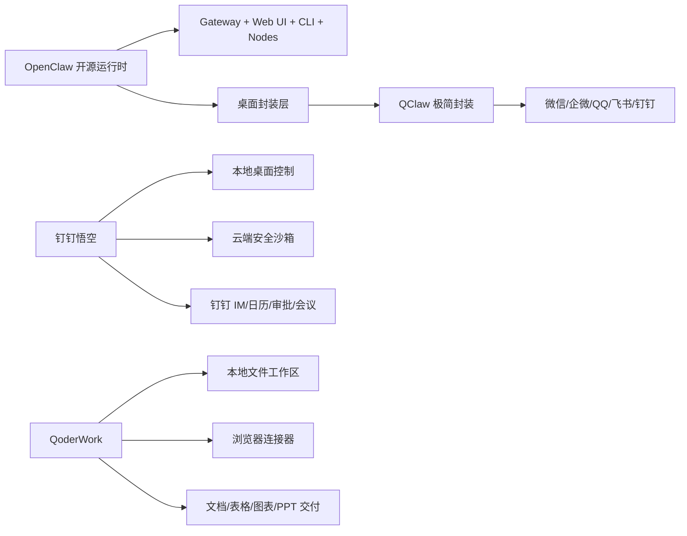

上图反映的不是代码继承关系，而是商业形态关系：OpenClaw 更像**底座**，QClaw 和部分轻封装产品更像**分发层与包装层**，悟空与 QoderWork 则是**基于自家协同/开发生态的完整产品层**。QClaw 官方已经明确写到，它是腾讯电脑管家“基于 OpenClaw 开源生态打造”的本地化 AI Agent；而悟空则把自己明确定义为“面向企业的全新 AI 工作平台”，采用“本地深度控制 + 云端安全沙箱 + 钉钉移动协同”的三维体系。citeturn10view2turn24view0turn12view2

就“最新竞争状态”而言，2026 年春季之后的核心变化有三点。其一，OpenClaw 仍保持极高的社区迭代速度，官方 GitHub 仓库已达 373k stars、166 次 release，最新版本为 2026.5.18。其二，QClaw 已从 3 月 20 日“全面开放、无需邀请码”的抢装机阶段，快速推进到 5 月中旬的正式订阅与积分计费阶段。其三，钉钉悟空仍处“分阶段灰度测试”与邀请码运行状态，但已完整上线个人会员、企业会员、充值包和企业管理员购买/分配路径，商业化比 QClaw 更早地偏向企业席位。citeturn47view3turn29view0turn6view1turn44view0turn44view1turn13view0turn12view0

## 产品概述与对比

严格说，OpenClaw 的“桌面产品”并不是一个单一商业 SKU。官方核心仓库把产品定义为“运行在你自己设备上的个人 AI 助手”，Gateway 只是控制平面；在中文市场，真正降低使用门槛的，是桌面封装层。当前公开可见的桌面交付至少包括：官方核心运行时与 Web 控制台、agentkernel 的 Windows Desktop shell，以及 daxiondi 的跨平台 Tauri 封装。这种结构意味着 OpenClaw 在开放性和可扩展性上最强，但在统一品牌、统一交付和统一计费上反而最弱。citeturn28view0turn28view3turn30search0turn25search0turn30search6

| 产品 | 核心功能模块 | 技术架构与运行方式 | 平台支持 | 目标用户与场景 | 定价与付费模式 | 差异化优势 |
|---|---|---|---|---|---|---|
| OpenClaw | 多渠道消息接入、Web 控制 UI、会话/记忆、插件/Skills、移动节点、Canvas | 单个自托管 Gateway 作为控制平面；客户端以 Web UI/CLI/macOS app 接入，节点以 macOS/iOS/Android/headless 接入 | 安装支持 macOS、Linux、Windows/WSL2；节点支持 macOS/iOS/Android | 开发者、高级用户、隐私敏感和多渠道调度场景 | 软件 MIT 开源免费；模型/搜索/API 成本由外部供应商计费 | 开放、自托管、多渠道、可深度定制 |
| 腾讯 QClaw | 远程整理文件、读写文档、发邮件、定时任务、灵感广场、技能市场、微信小程序与多 IM 接入 | 基于 OpenClaw 开源生态极简封装；本地执行、本地存储，自带安全防护与安全沙箱；可关联已装 OpenClaw | macOS（Apple/Intel）、Windows；手机侧通过微信小程序和 IM 远程触发 | 个人效率、移动办公、轻量自动化、非技术用户 | 当前为会员订阅 + 积分包；标准版 50 元/月、高级版 150 元/月、旗舰版 500 元/月；积分包 6/30/128 元；免费版存在但稳定公开额度未单列 | 微信入口极强、零配置、小白友好、五大 IM 直连 |
| 钉钉悟空 | 本地桌面控制、技能中心、定时任务、IM 机器人、移动同步、企业数据权限、云沙箱 | “本地深度控制 + 云端安全沙箱 + 钉钉移动协同”三维体系；组织数据需管理员授权，敏感操作二次确认 | Windows、macOS Beta；手机/Pad/钉钉桌面端协同 | 钉钉组织内知识工作者、主管理员、团队和企业采购场景 | 免费试用算粒 + 个人/企业会员 + 充值包；普通会员 39 元/月/人，高级会员 99 元/月/人；充值包 200 算粒 9.8 元、2000 算粒 98 元 | 企业治理强、采购路径清晰、钉钉原生协同和权限体系完整 |
| QoderWork | 本地文件读取、浏览器连接器、文档/表格/图表/PPT/PDF 交付、Skills 扩展、任务监视器 | 本地优先工作区，自主规划逐步执行，强调结果交付和浏览器自动化 | 桌面客户端；公开产品页强调本地文件访问与直接下载 | 白领办公、数据分析、PPT/报表/内容生成、浏览器任务交付 | 公开页强调“立即免费试用”和新用户 300 Credits；若参考 Qoder 个人方案，则为免费、20/60/200 美元月订阅 | 更像“AI 工作站”，强在文档与交付结果 |
| MiniMax Agent | 本地工作区、多 Agent 团队、长期记忆、技能、网页与本地任务、定时任务 | 直接运行在本地工作区，按任务动态组装 Agent Team | 官方提供下载页与桌面端分发 | 通用型创作者、内容与知识工作者、希望多 Agent 协作的个人用户 | 免费 + Basic/Pro/Ultra 订阅 + Credits 包；公开条款确认有三档付费，但当前抓取页未展示具体价位 | 多 Agent 协作和创意型工作流更强 |

表中 OpenClaw 行依据官方 docs 与 GitHub 仓库；QClaw 行依据官方产品文档、新闻与应用宝分发页；悟空行依据官网、产品手册、FAQ、企业会员购买指南；QoderWork 行依据阿里云/Qoder 官方页面与 Qoder 定价文档；MiniMax 行依据官方产品页、下载页与订阅服务条款。citeturn27search0turn28view0turn28view3turn47view3turn10view2turn10view3turn10view4turn44view0turn44view1turn6view0turn6view1turn37search0turn24view0turn12view2turn20view1turn13view0turn12view0turn37search1turn48search1turn48search3turn48search0turn50search3turn50search11

从渠道与分发看，QClaw 已形成“官网安装包 + 微信小程序 + 应用宝 + 五大 IM 直连”的个人分发闭环；悟空则形成“官网下载 + 钉钉左侧工作栏 + IM 机器人 + 企业管理员购买/分配”的组织级闭环；OpenClaw 主要还是 GitHub、docs、CLI 与社区桌面封装；QoderWork 走阿里云/Qoder 官网下载；MiniMax 和阶跃 AI 则更多依赖官网下载与应用商店辅助。这意味着真正的竞争，不是“谁有桌面端”，而是“谁占住了用户每天已经在用的入口”。citeturn6view0turn6view1turn12view2turn12view0turn27search0turn30search0turn25search0turn48search1turn50search3turn36search6

## 用户选择与付费分析

用户选择这些产品时，第一判断通常不是模型名字，而是**工作入口、权限边界和交付预期**。需要“出门在外通过微信一句话让电脑办事”的个人用户，会自然偏向 QClaw，因为它把入口放进了微信/企微/QQ/飞书/钉钉等高频 IM；已经把文档、审批、会议、日历、待办放在钉钉里的组织用户，会更偏向悟空，因为它不仅能控制本地 Excel、浏览器和 IDE，还能通过管理员授权接到组织数据；追求自托管、多渠道、插件扩展和更高自由度的开发者，仍更适合 OpenClaw；重结果交付、经常做表格分析、PPT、信息图和浏览器抓取的白领，则更容易被 QoderWork 吸引。这个判断更多是产品结构推导，而不是单一社区口碑。citeturn10view2turn6view1turn24view0turn20view1turn27search0turn48search1turn48search3

更值得关注的是，国内桌面 Agent 的计费单位正在快速从“Token 叙事”转成“积分/算粒/Credits/Prompt 叙事”。QClaw 以积分作为核心计量单位；悟空以算粒作为执行成本单位；Qoder 以 Credits 计费；MiniMax Agent 官方已把 Agent Credits 升级成 MiniMax Credits；阶跃 Step Plan 则用 Prompt 作为平台标准化计费单位。对厂商来说，这种方式更容易把模型差异、任务复杂度和峰值调度折算进统一价格体系；对用户来说，横向比价反而更难，早期付费转化也更依赖“有没有明显省时间”的体感价值。citeturn44view0turn13view0turn48search0turn50search3turn50search11turn49search1turn49search3

下表只对**核心三款**做付费率与 ARPU 粗估，因为它们的商业模式公开信息相对完整。这里的 ARPU 以“月活用户”为分母，ARPPU 以“付费用户”为分母；所有区间都是本文基于公开价格、开放程度、分发深度与当前赛道阶段做出的保守估算。

| 指标 | OpenClaw 桌面 | 腾讯 QClaw | 钉钉悟空 |
|---|---|---|---|
| 当前官方收费形态 | 软件免费开源；模型/API/搜索等成本外部结算 | 会员订阅 + 积分包；免费版存在但稳定公开额度未单列 | 免费算粒试用 + 个人/企业会员 + 充值包 |
| 官方起步价 | 0 元软件费 | 50 元/月 | 39 元/月/人 |
| 估算付费率 | 软件层约 0%；若把外部模型支出算入“生态付费”，重度用户付费意愿较高 | 4%–10% | 12%–25% |
| 估算 ARPPU | 不适用；外部模型与搜索成本差异极大 | 80–120 元/月 | 50–90 元/月 |
| 估算 ARPU | 软件层约 0 | 4–10 元/月 | 7–15 元/月 |

这个估算的逻辑是：OpenClaw 软件本身不收软件费，官方也明确说明费用主要来自外部模型与 API 调用，因此它更像“零软件 ARPU、外部生态收费”；QClaw 到 5 月中旬才正式推出 50/150/500 元档位，因此当前应仍处低付费率、低 ARPU 的增长转付费阶段；悟空虽然用户规模可能还没 QClaw 公开，但由于它更早具备个人会员、企业会员、充值包和管理员购买/分配流程，付费率与 ARPU 理应更高。citeturn27search1turn44view0turn44view1turn13view0turn12view0

## 市场份额与用户规模估算

公开资料里，厂商主要披露的是功能、价格、更新日志和场景案例，而不是独立的桌面 Agent 用户数。因此，下面的规模估算采用“公开可见代理指标”法：综合最近 90 天内的公开下载、GitHub 社区信号、是否全量开放、是否仍在邀请码灰度、入口生态强弱与当前计费成熟度，给出保守区间。这里的口径是**中国市场、桌面 Agent 可见 MAU**，不含海外用户，也不等同于厂商内部 DAU/MAU 口径。citeturn37search0turn37search3turn36search6turn42search2turn47view3turn30search0turn25search0turn13view0turn39search3

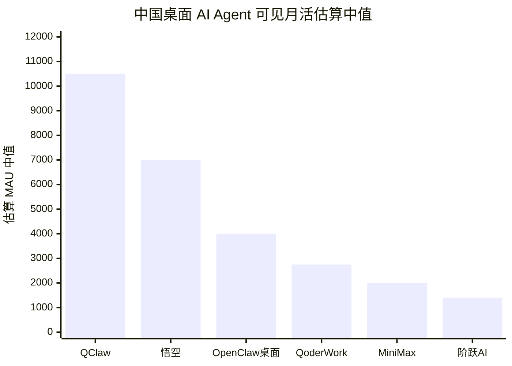

| 产品 | 估算累计装机 | 估算 MAU | 估算依据与说明 |
|---|---:|---:|---|
| 腾讯 QClaw | 1.5 万–3 万 | 0.6 万–1.5 万 | 已全量公测、五大 IM 直连、官网和应用宝双分发；应用宝单页显示 3,784 下载，考虑官网直装与 macOS 直装后上修 |
| 钉钉悟空 | 0.8 万–2 万 | 0.4 万–1 万 | 仍处灰度与邀请码分发，但背靠钉钉企业入口，且已支持企业采购、配额和管理员分配 |
| OpenClaw 桌面 | 0.4 万–1.2 万 | 0.2 万–0.6 万 | 核心仓库 373k stars 代表极强开发者心智，但桌面封装碎片化；中文常见桌面封装仓库星标仍在双位数到低三位数 |
| QoderWork | 0.3 万–0.8 万 | 0.15 万–0.4 万 | 阿里云与 Qoder 双入口、公开免费试用、偏高价值办公交付；但公开下载信号仍不足 |
| MiniMax Agent | 0.2 万–0.5 万 | 0.1 万–0.3 万 | 官网下载 + 免费/付费订阅；应用宝公开下载 677 |
| 阶跃 AI 桌面伙伴 | 0.15 万–0.4 万 | 0.08 万–0.2 万 | 产品矩阵已列桌面伙伴，应用宝公开下载 596，会员化清晰但桌面产品仍早期 |
  
这些区间的意义，不在“谁精确领先多少”，而在看清当前市场结构：头部产品并没有甩开到数量级差距，大厂产品之间也还没有形成压倒性的单一赢家；同时，应用宝里的 EasyClaw 公开下载已达 1.0 万，反而高于 QClaw 在同一渠道的 3,784，说明安装更轻、适配国内模型更直接的“轻封装长尾”仍在大量吸走早期 Windows 用户。换言之，2026 年上半年的中国桌面 Agent 市场，更像“多个分发节点上的用户试错市场”，而不是成熟的大一统平台市场。citeturn37search0turn13view0turn12view0turn47view3turn30search0turn30search1turn37search3turn36search6turn42search2

## 路线图、风险与机会

从近期路线图和更新日志看，OpenClaw 仍是“底层能力不断扩展”的代表：最新 2026.5.18 release 继续更新 Agent 工作规范、Pi package、Node 版本底线与部署参数；近期 release 序列还加入了 typed plugin 工具链、调试技能和更多运行时改进。QClaw 则是“入口与易用性优先”的路线：3 月 18 日升级到微信小程序入口，上线灵感广场，并明确写到后续要支持语音指令与图片传输；3 月 20 日又扩展到微信、企业微信、QQ、飞书、钉钉五大 IM、定时任务和像素工作室；5 月则补上计费文档。悟空则是“企业化能力优先”的路线：更新日志显示其最新重点包括定时任务、技能中心重构和底层架构升级，官方通知又把硬件协同、钉钉专业版联动和邀请码运营结合起来，说明其产品方向并不是单纯 C 端桌面助手，而是更大范围的企业工作平台。citeturn29view0turn29view4turn45search0turn45search1turn44view0turn44view1turn16view0turn16view1

风险主要有四类。第一是**权限风险**：桌面 Agent 天生涉及本地文件、浏览器、邮件、审批和组织数据；悟空因此设置了管理员授权和敏感操作再次确认，QClaw强调本地执行与安全沙箱，而 OpenClaw 更依赖用户自行配置允许列表、认证和隧道方式。第二是**计费透明度风险**：积分、算粒、Credits、Prompt 让单次任务成本更灵活，但会让普通用户更难横向比较。第三是**生态锁定风险**：QClaw 更偏微信/腾讯生态，悟空更偏钉钉组织生态，迁移成本会逐渐上升。第四是**治理与合规风险**：信通院在“智能原生”专题报告中已明确把商业模式变化与伴生治理、安全挑战一起提出。citeturn20view1turn10view1turn28view3turn44view0turn13view0turn48search0turn49search1turn32search3

机会同样清晰。IDC 已把企业级 AI Agent 市场描述为从 POC 迈向规模化价值交付；QuestMobile 的大盘增长则说明用户教育成本正在被整个 AI 应用行业共同承担。对厂商而言，真正可持续的机会并不是把聊天再做强一点，而是把 Agent 变成**席位、工作流和企业采购项**：QClaw 有望先在个人入口侧形成装机优势，悟空有望在企业采购与组织治理侧先吃到规模红利，OpenClaw 则会继续作为云厂商、模型厂商、插件生态和桌面封装创业者的底座层受益。citeturn32search2turn31search3turn10view2turn12view0turn27search0

## 结论与建议

如果用户问的是“OpenClaw 的桌面产品到底应不应该拿来和 QClaw、悟空放在一起比”，我的结论是：**应该比，但要换一种比法**。OpenClaw 更适合被看作“开源运行时 + 自托管 Gateway + 多种桌面封装”的底座型产品；QClaw 和悟空则是已经把入口、权限和商业化包起来的成品。前者的竞争力来自开放性与开发者心智，后两者的竞争力来自分发与治理。用同一把尺子去看，会误判。citeturn28view0turn28view3turn10view2turn24view0

如果从选型角度落地，建议也很明确。**开发者、自托管偏好者、隐私敏感且需要多渠道调度的人，优先看 OpenClaw；微信重度用户、自由职业者、经常在路上远程处理桌面任务的人，优先看 QClaw；钉钉组织内的知识工作者、团队负责人和 IT 管理者，优先看悟空；经常要交付表格、图表、PPT、文档和网页调研结果的办公室白领，可重点看 QoderWork。** 未来半年最值得跟踪的，不是谁再加一个技能，而是谁能证明“免费体验后的付费留存”和“从个人装机到企业席位”的转化效率。citeturn27search0turn10view2turn24view0turn48search1turn48search3

## 主要参考来源

- OpenClaw 官方文档与 GitHub 仓库，包括产品定义、Gateway 架构、安装方式、费用说明、GitHub 社区规模与最新 release。citeturn27search0turn28view0turn28view3turn27search1turn47view3turn29view0
- 腾讯 QClaw 官网、新闻资讯、产品文档与应用宝分发页，包括功能、平台支持、微信小程序入口、五大 IM 接入、免费阶段表述与当前会员/积分价格。citeturn6view0turn6view1turn10view2turn10view3turn10view4turn44view0turn44view1turn46view0turn37search0
- 钉钉悟空官网与产品手册，包括产品定位、入口体系、隐私安全、竞品对比、FAQ、企业会员购买指南、更新日志与官方通知。citeturn37search1turn24view0turn12view2turn20view1turn14view0turn13view0turn12view0turn16view0turn16view1
- 阿里云/Qoder 官方页面，包括 QoderWork 产品页、Qoder 个人方案定价与免费 Credits 试用。citeturn48search1turn48search3turn48search0
- MiniMax 与阶跃 AI 官方页面及应用商店分发页，包括 MiniMax Agent 的订阅形态、阶跃桌面伙伴与会员价格，以及应用宝公开下载量。citeturn50search3turn50search11turn49search0turn49search4turn37search3turn36search6
- 第三方行业资料，主要用于大盘背景与产业判断，包括 QuestMobile、IDC 与中国信通院。citeturn31search3turn32search2turn32search3
# 中国央行加量投放MLF与美联储年末加息假设的分层影响研究

## 执行摘要

中国人民银行已公告将于 2026 年 5 月 25 日开展 6000 亿元、期限 1 年的中期借贷便利操作；考虑到当月有 5000 亿元 MLF 到期，本次对应净投放 1000 亿元。与此同时，美联储在 2026 年 4 月会议上将联邦基金利率目标区间维持在 3.5%—3.75%，官方表述仍是“数据依赖”；但 3 月会议纪要已明确，部分与会者认为若通胀持续高于目标，未来不排除上调利率，市场定价也已从“年内按兵不动/降息”转向“年底存在再加息可能”。中国这边的起点是：一季度 GDP 同比增长 5.0%，4 月 CPI 同比 1.2%、PPI 同比 2.8%，4 月末 M2 同比 8.6%、社融存量同比 7.8%，4 月 DR007 月均 1.35%、10 年国债收益率月末 1.75%，最新 1 年期/5 年期以上 LPR 分别为 3.0%/3.5%。这意味着，此次组合冲击更像是“国内量宽对冲外部偏鹰”，而不是单边总量刺激。 citeturn4view0turn7search0turn19view0turn18search1turn19view2turn12view0turn13view0turn13view1turn15view1turn32search0turn34view0

本报告的核心判断有三点。第一，**一阶影响**主要落在中国的期限流动性、政府债承接能力和银行负债端，而不是立即触发广谱降息；因为在 4 月，隔夜流动性已经偏松，DR001 月均较 7 天逆回购政策利率低 17 个基点，资金并不紧。第二，**二阶影响**将通过中美利差、美元融资成本、资产配置风格分化和信用分层来体现：高等级利率债与高等级信用债受益最直接，但低评级信用、离岸美元债、地产链和高外需弹性权益资产将更受美联储偏鹰预期牵制。第三，**三阶影响**取决于中国货币—财政协同是否把“流动性”转成“信用扩张”和“内需修复”；如果只停留在流动性宽松层面，外溢到全球金融体系的改善将有限。 citeturn13view1turn12view0turn40view0turn40view1turn42view0turn40view2turn41view2

在概率分布上，我给出**基准情景 55%**、**温和冲击 30%**、**严重冲击 15%**。之所以不把“美联储年底加息 25bp”设为更高概率，是因为官方 2026 年 3 月 SEP 的联邦基金利率中位数仍为 3.4%，低于当前区间中枢，说明“年底再加息”并非官方基线，而更接近市场对通胀与油价扰动的再定价；但之所以又不能把它当成小概率尾部，是因为美国 4 月 CPI 已升至 3.8%，3 月 PCE 和核心 PCE 分别为 3.5% 和 3.2%，鲍威尔也明确指出更高的能源价格会在近端推升总体通胀。中国方面，人民币中间价最新在 6.8318，4 月末外汇储备 34105 亿美元，一季度经常账户顺差 1841 亿美元，3—4 月合并口径跨境资金月均净流入 149 亿美元、企业外汇套保率 33.6%，这些都意味着中国并非处于一个脆弱的外部起点。 citeturn18search1turn19view0turn27search0turn27search1turn27search4turn41view0turn22view0turn23search0turn30search0turn31search0

下表给出面向宏观策略团队的最简化结论框架。

| 维度 | 结论 |
|---|---|
| 流动性 | 偏松，但更偏向期限与结构缓冲，不是全面宽货币 |
| 利率债 | 中短端优于长端，曲线更可能先牛平后陡化 |
| 信用债 | 高等级优于低等级，境内优于离岸美元信用 |
| 股票 | 高股息、银行、公用事业、政策受益链优于高估值外需弹性板块 |
| 外汇 | 人民币短期可控，中期取决于美债/美元与油价是否共振上行 |
| 房地产 | 只能改善融资边际，难以单独扭转投资和销售弱势 |
| 政策含义 | 量化工具优先于价格工具，财政协同决定乘数，稳汇率约束大于稳资金约束 |

注：表中结论基于官方当前利率、汇率、流动性与信用起点，以及 IMF/BIS 对中国货币传导、美元周期与全球债券溢出的研究综合判断。 citeturn13view0turn13view1turn22view0turn23search0turn30search0turn31search0turn40view0turn40view1turn41view1turn46view0turn42view0

## 事件校准与分析框架

这次分析的关键，不是把“6000 亿元 MLF”机械地当成一次全面宽松，而是要先校准它的**真实增量**与**政策位置**。公告明确写明的是金额与期限，但未在招标公告中列示中标利率。因此，本报告按用户要求采用工作假设：**MLF 期限为 1 年，利率中枢假设为 2.0%，并设置 ±10bp 敏感性区间**。这个假设依据有二：一是 2026 年 5 月招标公告本身只提供数量与期限；二是最近公开可得、且有明确披露中标利率的多重价位 MLF 结果为 2024 年 11 月的 2.0%。由于 2026 年 5 月 20 日 LPR 仍维持在 3.0% 和 3.5%，所以这次操作更可能体现为“量的支持”，而不是“价的重定价”。 citeturn4view0turn39search0turn34view0

从规模上看，6000 亿元 MLF 约相当于 4 月末 M2 的 0.17%，净投放 1000 亿元仅相当于 M2 的约 0.03%。如果参考人民银行 2025 年四季度报告中“存款准备金率下调 0.5 个百分点释放长期流动性约 1 万亿元”的官方量级，那么**1000 亿元净投放**大致只相当于**不到 0.05 个百分点降准的量级**；而**6000 亿元总投放**虽然在票面上接近一次 0.25 个百分点降准的释放规模，但因有 5000 亿元到期对冲，其真正的净宽松强度明显更小。这也是为什么本报告把它定义为“期限调节工具”，而非“总量转向标志”。 citeturn13view0turn47search3turn7search0

更重要的是起点环境。4 月同业拆借月均 1.29%，质押式回购月均 1.31%，DR007 月均 1.35%，而人民银行 7 天逆回购利率为 1.40%；同期 10 年国债收益率月末已在 1.75%，3 年 AAA 中票利差仅 44bp。换言之，**短钱不缺、长债不便宜、信用利差已不宽**。这意味着 MLF 增量进入系统后，最先改善的是银行中期负债稳定性、跨月与政府债发行的资金安排，以及政策性与高等级资产的配置承接，而不是继续把已经很低的隔夜利率向下压得更多。 citeturn13view1turn9search2

与此同时，美联储侧的故事并不对称。官方当前利率区间是 3.5%—3.75%，3 月 SEP 对 2026 年联邦基金利率的中位数是 3.4%，这代表官方基线仍偏向“更久维持高位”而不是“年底再加息”；但 3 月纪要已出现“若通胀持续高于目标，未来可能需要上调利率”的表述，美国 4 月 CPI 和 3 月 PCE/核心 PCE 也验证了近端通胀黏性。因此，本报告把“今年 12 月一次性加息 25bp”视为**比官方更鹰、但已进入市场有效讨论区间**的工作假设。 citeturn18search1turn19view0turn19view2turn27search0turn41view0

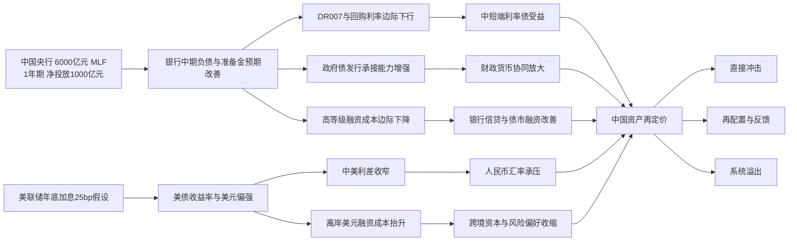

这张传导图对应本文后续的三层分析：先看银行体系与利率的直接冲击，再看信用、汇率、资本流动和资产风格的再配置，最后看对中国与全球金融体系的制度性和跨境溢出。其逻辑基础分别来自人民银行对“适度宽松+汇率稳定”的政策框架表述、中国当前流动性与信用起点、美联储“数据依赖但存在双向调整可能”的表态，以及 BIS/NBER 对美元周期与全球债券溢出的文献。 citeturn12view0turn13view1turn19view0turn19view2turn40view0turn42view0

## 直接冲击

**对应一阶影响的判断是：这次 MLF 首先影响的是“银行资金曲线”，其次才是“实体融资曲线”。** 参考人民银行 2025 年“0.5 个百分点降准释放约 1 万亿元”的官方量级，以及 IMF 关于中国货币政策传导的研究——其估计显示，扩张性货币冲击若对应 100bp 的市场利率下行，可在冲击当期带来大约 15—30bp 的国债收益率下降、15—25bp 的企业债利差收窄——则本次 **1000 亿元净投放**所对应的有效货币冲击非常有限。按比例缩放并结合当前“资金已偏松”的市场位置，我倾向于把其**短期 0—3 个月的直接定量影响**校准为：DR007 下行 5—15bp，1—3 年国债/政金债收益率下行 5—12bp，10 年国债下行 0—8bp，高等级信用利差压缩 0—5bp；若实际 MLF 中标利率低于 2.0% 假设 10bp，则上述影响可再额外放大 2—4bp，反之则相应减弱。前半句是文献弹性，后半句为基于当前起点的作者测算。 citeturn47search3turn41view1turn41view2turn46view0turn13view1

这种利率传导将首先利好**利率债**。但需要强调的是，利率债内部也会分化：中短端最受益，长端受益程度更受财政供给和外部利率冲击约束。因为 4 月 10 年国债收益率已经在 1.75%，而 4 月政府债券单月净融资 9041.1 亿元、前四个月累计净融资 4.45 万亿元，供给并不轻。若后续财政发力继续上行，则 MLF 对长端的利多会被部分供给压力抵消。换句话说，**最确定的多头不在 10 年久期，而在 1—3 年久期和政策性金融债曲线中段**。 citeturn13view1turn13view0

对**信用债与企业融资成本**，边际改善存在，但不会均匀。人民银行一季度报告显示，3 月新发放企业贷款利率和个人住房贷款利率都在 3.1% 左右；这说明社会综合融资成本本来就在低位。因而这次 MLF 更可能把高等级、银行授信充分、现金流稳定的主体融资成本再压低 5—15bp，而对民营、低评级、房地产链和外需波动较大的主体，改善幅度可能只有 0—5bp，甚至在外部美元走强时被信用风险溢价抵消。简单说，**这不是“所有企业都便宜融资”的信号，而是“高等级与政策支持领域更容易融资”的信号**。 citeturn12view0turn13view0turn34view0

对**银行信贷与房地产**，直接冲击也会体现为“表内优先、地产次之”。一方面，4 月末人民币贷款同比 5.6%，低于 M2 的 8.6%；商业银行一季度末流动性覆盖率 151.65%，不良率 1.51%，人民币超额备付金率 1.47%，说明银行体系并非被流动性约束，而更多受到风险偏好、资产投向和信用需求约束。另一方面，房地产 1—4 月开发投资同比下降 13.7%，房企到位资金下降 18.4%，个人按揭贷款下降 31.7%，销售面积和销售额分别下降 10.2% 和 14.6%。因此，这次 MLF 可以改善房贷与按揭利差定价的边际，并缓和部分城投、国企开发平台和按揭链条的融资压力，但**不足以单独扭转全国地产投资与开发资金的弱势趋势**。 citeturn26search1turn13view0turn16search0turn17search1

对**外汇与资本流动**，一阶冲击并不危险，但方向偏向“人民币小幅承压”。当前人民币中间价仍在 6.8318，较一季度末的 6.9081 更强；外汇储备为 34105 亿美元；一季度经常账户顺差 1841 亿美元；3—4 月平均跨境资金净流入 149 亿美元，企业外汇套保率 33.6%。因此，即便市场继续把美联储年底加息纳入定价，人民币也更可能表现为**“有管理地偏弱”而非“失序贬值”**。在基准情景下，我估计年底美元兑人民币会较 5 月 25 日中间价抬升至 6.88—6.98；若美元、美债和油价共振上行，则会进入 6.98—7.10 区间。这个区间判断是基于当前外储、经常账户和套保条件下的作者情景测算，而不是点位预测。 citeturn22view0turn12view0turn23search0turn30search0turn31search0turn19view0

## 再配置与反馈

**对应二阶影响的重点，不在于 MLF 当天释放了多少资金，而在于中美利差如何改变资产偏好与融资结构。** BIS 的最新研究表明，美国 10 年期收益率意外变动已能解释德国和英国 10 年期收益率意外变动方差的大约三分之一；另一篇 BIS 研究则指出，后危机时代美国货币政策冲击对全球主权收益率的影响模式，与美债本身的反应几乎同步。换言之，只要市场开始认真重估“美联储年底再加息”，这件事对全球债券市场的影响会比对单一利率点位的影响更大。 citeturn40view0turn40view1

这一点和 NBER 关于“全球美元周期”的结论是衔接的：美元升值冲击往往与更紧的美国货币条件和更差的全球风险偏好高度相关，并会预示新兴经济体增长放缓。IMF 也指出，美国利率高位和强美元通常会压低更易波动的新兴市场证券流入，只是近年来许多新兴市场凭借更强的政策框架展现出更高韧性。把这些结论映射到中国，本轮二阶影响最核心的表现有三类：**离岸美元融资成本上升、境内外信用市场分化加大、权益市场从“总量交易”转向“风格交易”**。 citeturn42view0turn42view1

对**银行信贷与影子银行**，二阶反馈尤其值得关注。4 月末社融口径下，委托贷款余额同比下降 0.1%，信托贷款同比增长 7.4%，未贴现银行承兑汇票同比下降 7.9%。这组结构说明，传统影子银行并没有广谱反弹，但“非标/准非标”并未消失，而是在监管与信用偏好下发生结构性切换。我的判断是：在基准情景下，MLF 会优先支持表内贷款、政府债承接和高等级信用融资，影子银行总体维持**低位稳定到小幅修复**；而在温和或严重冲击情景下，若美元融资变贵、民营信用分层加剧，则票据和信托等工具可能重新承担一部分“过桥融资”和“滚动续作”功能，影子银行存量增速会比表内中长期贷款更快。也就是说，**二阶影响的关键不是表外会不会大幅回潮，而是表内外融资分层会不会重新拉大**。 citeturn13view0turn26search1turn42view0

对**股票、商品与房地产资产价格**，二阶反馈会显著提高风格分化。结合中国当前低融资成本、地产偏弱、人民币仍有缓冲、美联储偏鹰风险上升的组合，我更倾向于以下基准判断：高股息、银行、公用事业、通信、部分政策金融受益链优于高估值成长和高外部融资敏感板块；黄金的对冲价值高于工业金属，工业金属更依赖中国内需是否真的接上信用扩张；原油若和美联储偏鹰预期来自同一通胀/地缘主线，则会上涨但并不利于全球风险资产；房地产权益和地产信用只能获得流动性缓冲，难享受趋势反转。这些不是单一数据直接给出的结论，而是由中国当前利率/地产/汇率起点与全球美元周期文献共同推导出的组合判断。 citeturn15view1turn16search0turn17search1turn22view0turn40view0turn42view0turn41view0

下表给出**基准情景**下主要资产类别的时间维度判断。

| 资产类别 | 短期 | 中期 | 长期 |
|---|---|---|---|
| 利率债 | 中短端受益最明确；10 年期下行空间有限 | 若美联储加息兑现且财政供给偏重，曲线更可能陡峭化 | 取决于名义增长和财政协同，仍偏“低利率中枢” |
| 信用债 | AAA/央国企优于 AA 民企；离岸美元信用弱于境内 | 利差重新分层，弱资质主体受美元与风险偏好双重约束 | 信用研究重于 Beta，票息策略优于盲目拉久期 |
| 股票 | 高股息、银行、公用事业、通信占优；宽基中性偏正 | 风格切换加快，外需/美元债敏感板块承压 | 若财政和内需修复落地，才会从防御切回顺周期 |
| 外汇 | 人民币可控偏弱；出口商优于净美元负债主体 | 中美利差和油价决定人民币波动区间 | 汇率弹性与套保渗透率将更关键 |
| 商品 | 黄金优于工业金属；油价偏外生 | 工业金属取决于中国信用是否转成实体需求 | 商品内部继续分化，难有纯总量式牛市 |
| 房地产 | 融资边际缓和，但销售与投资难反转 | 取决于库存去化、财政收储、居民预期修复 | 行业从“高杠杆扩张”继续走向“低周转、分层修复” |

注：表中为方向性与区间判断，不是点位预测；其依据是中国当前利率、信用、地产和汇率起点，以及美元周期与全球债券溢出的经验文献。 citeturn13view0turn13view1turn16search0turn17search1turn22view0turn40view0turn40view1turn42view0

## 系统重定价与制度溢出

**对应三阶影响的核心问题是：此次“央行加量 + 美联储偏鹰”最终会把中国和全球金融体系带向“更高韧性”，还是“更强分层”。** 这取决于中国的流动性是否能与财政和信用政策协同放大。人民银行一季度货币政策执行报告已经把“继续实施好适度宽松的货币政策”“加强货币财政政策协同”“保持人民币汇率在合理均衡水平上的基本稳定”并列为下阶段政策主线。IMF 关于中国货币传导的研究也指出，与财政政策协同的货币扩张，对银行间资金成本和国债收益率的影响更强、持续时间更长；而不协同的货币宽松，其效果往往不持久。换成投资语言就是：**如果 MLF 只变成银行增配利率债的资金，三阶效果就弱；如果它和财政支出、政策性贷款、民企信用分担工具一起发力，三阶效果才会真正体现为增长和风险偏好的改善。** citeturn12view0turn41view2turn46view0

这也是为什么我认为**银行体系的真正考验不在流动性，而在资产负债表再配置**。目前商业银行不良率 1.51%、拨备覆盖率 203.14%、资本充足率 15.00%，表面上缓冲充足；但若外部美元走强、离岸信用收紧、地产恢复不及预期，那么银行最容易做的动作是继续向政府债、高等级央国企、政策支持行业集中，而不是把资金大量释放给信用识别难度更高的民营和地产尾部主体。三阶后果因此会体现在：**金融体系名义稳定，但融资可得性和资金价格的分层加深**。这对宏观总量未必立刻致命，却会显著影响增长质量和资产收益分布。 citeturn26search1turn16search0turn13view0

放到全球金融体系里，中国的角色又比一般新兴市场更大。IMF 2025 年的研究明确指出，中国国内冲击对全球 GDP、通胀和大宗商品价格的溢出，显著强于其他 G20 新兴经济体；IMF 中国 Article IV 口径还显示，过去几年中国大约贡献了全球增长的 30%。因此，这一事件对全球的三阶影响，不是 6000 亿元本身会不会“冲垮”全球资产定价，而是它是否有助于**避免中国增长进一步失速**。如果中国通过流动性与财政协同把增长底部抬住，那么它会部分对冲美联储偏鹰和美元走强对亚洲与新兴市场造成的紧缩外溢；反过来，如果中国的流动性宽松未能传导到信用和内需，那么全球会同时承受“美国更紧 + 中国不稳”的双重压力。 citeturn40view2turn44search9turn42view0

最后，三阶影响还会体现在**制度工具的升级需求**上。SAFE 数据显示，企业外汇套保率已升至 33.6%，说明市场主体已在适应更高波动的汇率环境。未来若中美货币周期继续错位，中国金融体系需要的不只是更多流动性，而是更多能把汇率、利率、信用和期限错配一起管理好的工具：更成熟的 IRS 和 FX 衍生品、更完备的信用风险分担、更强的离岸人民币流动性安排，以及财政与货币政策在政府债发行节奏上的更细协同。三阶影响的本质，是促使整个金融体系从“数量管理”进一步升级到“资产负债表管理”。 citeturn31search0turn12view0turn40view0

## 时间维度与情景推演

从时间上看，这个组合冲击会经历一个比较典型的“三段式”演化：先由中国 MLF 主导资金面，再由美联储路径主导全球定价，最后由中国政策协同和全球需求再反馈决定资产价格中枢。这个顺序很重要，因为它意味着**短期看钱，中期看价，长期看量与制度**。 citeturn4view0turn19view0turn12view0turn40view0

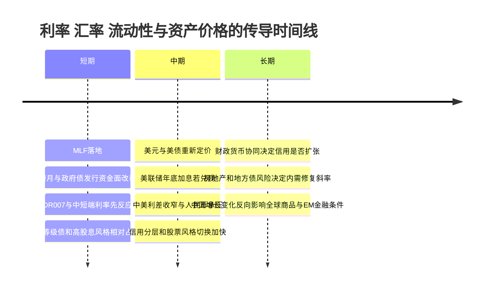

基于上文的框架，我把情景划分为基准、温和冲击、严重冲击三类。这里的区间，默认都是相对于“没有这次 MLF 加量、且美联储年底不再动作”的反事实情形；因此它衡量的是**事件增量效应**，而不是全年宏观变量的绝对预测值。之所以这样设定，是因为 6000 亿元 MLF 的净增量并不大，而美联储年底加息 25bp 又不是官方当前基线，所以最有分析价值的是“相对影响”。概率分布之所以设为 55/30/15，主要依据是：官方 Fed 路径仍非加息基线，而中国当前外储、经常账户、跨境资金和汇率套保均提供了缓冲。 citeturn18search1turn19view0turn23search0turn30search0turn31search0

| 情景 | 概率 | 美元兑人民币年末区间 | 中国 10 年国债区间 | 3 年 AAA 信用利差 | 宽基股票相对反事实 | 对中国实际 GDP 增速影响 | 对中国 CPI 影响 |
|---|---:|---:|---:|---:|---:|---:|---:|
| 基准 | 55% | 6.88—6.98 | 1.70%—1.80% | 40—50bp | -2% 至 +3% | -0.05 至 +0.05 个百分点 | +0.05 至 +0.15 个百分点 |
| 温和冲击 | 30% | 6.98—7.10 | 1.78%—1.90% | 50—65bp | -5% 至 -10% | -0.10 至 -0.30 个百分点 | +0.10 至 +0.25 个百分点 |
| 严重冲击 | 15% | 7.10—7.35 | 1.85%—2.05% | 65—100bp | -10% 至 -20% | -0.30 至 -0.70 个百分点 | +0.20 至 +0.50 个百分点 |

注：当前锚点分别取自 2026 年 5 月 25 日美元兑人民币中间价 6.8318、2026 年 4 月末中国 10 年国债收益率 1.75%、3 年 AAA 中票与 3 年国债利差 44bp；GDP/CPI 区间为基于人民银行/NBS 当前数据、IMF 对中国货币传导估计、以及 BIS/NBER 对美国货币与美元外溢弹性的作者情景测算。 citeturn22view0turn13view1turn12view0turn15view1turn32search0turn41view1turn46view0turn40view0turn42view0

对这三种情景，我的结论分别是：**基准情景**下，中国能以“量宽价稳”的方式对冲 Fed 偏鹰，人民币小幅走弱但不失序，利率债中短端仍有价值，系统性风险不大；**温和冲击情景**下，真正的压力不在银行间流动性，而在信用分层、离岸美元融资和权益风险偏好，配置应向美元/黄金/高等级信用和高股息迁移；**严重冲击情景**下，中国将不得不把政策重点从单纯流动性支持转向更强的财政协同、汇率预期管理、信用风险分担和地产去库存，否则三阶影响会从金融市场传导到增长与外贸链条。 citeturn12view0turn19view2turn40view2turn42view1

## 投资对冲与政策建议

**短期策略**上，我更偏向“做多中短端、谨慎长端；增持高等级、回避弱离岸；用汇率和黄金做外部对冲”。具体而言，利率债优先 1—3 年国债与政金债，长端不宜追涨；信用上偏好高等级央国企、金融债和政策支持行业债，降低地产美元债和弱资质民企离岸信用敞口；权益上偏好银行、公用事业、通信和高股息央企；外汇对冲上，出口企业应把更高套保率视为利润稳定器而不是交易工具，进口企业则应分批锁定成本，避免在美元上行周期被动追保。之所以这样配置，是因为本轮更像“国内期限利多 + 外部美元利空”的组合。 citeturn13view1turn31search0turn40view0turn42view0

**中期策略**上，关键观察点是“Fed 年底加息是否真的兑现，以及中国是否转向更强的财政—货币协同”。如果美国通胀和油价回落、加息预期降温，那么中国长端利率债会在前期曲线陡峭化后重新具备配置价值；如果加息兑现且人民币接近或突破温和冲击区间，则应进一步提高美元、黄金和波动率对冲权重，降低信用 Beta，尤其是离岸高收益与对外融资依赖高的板块。宏观策略团队在这个阶段更应关注“再定价后的赔率”，而不是执着于短期方向。 citeturn19view0turn41view0turn40view1turn42view0

**长期策略**上，真正值得增配的是那些对外部美元环境敏感度较低、内生现金流更稳定、且能在中国政策框架中持续受益的资产和行业。对债券而言，是本币高等级久期资产和具备稳定现金流的信用；对股票而言，是高股息、强国企属性、受益于公共资本开支与国产替代的板块；对企业而言，则是尽快把负债端从“美元短债”转向“本币中长期债+更高套保”。长期来看，本轮事件最大的投资启示不是某个点位，而是：**中国资产内部的“币种、信用、久期、股息”分层会长期存在**。 citeturn31search0turn40view2turn44search9

**政策建议**方面，短期宜继续以 OMO、MLF、买断式逆回购和再贷款等“量的工具”为主，不宜在外部压力未明朗前押注广谱降息；中期若 Fed 偏鹰兑现，优先选用降准、再贷款扩容、民企信用风险分担、出口和进口企业汇率避险支持、以及政府债发行节奏优化；长期则要把地产去库存、地方债务置换、信用风险分担与人民币国际化工具建设结合起来。IMF 对中国货币传导的结论已经很清楚：**协同政策比孤立宽松更有效、更持久**。 citeturn12view0turn41view2turn46view0

## 风险点与监测指标

这次事件最大的误判风险，不是把 6000 亿元看大了，而是把“Fed 年末 +25bp 假设”看成了一次孤立利率行为。真正需要盯住的是：美元、油价、美债、人民币、信用利差和地产资金面是否共振。如果这些变量同向恶化，那么冲击会迅速从一阶流动性问题升级成二阶分层问题，再升级为三阶系统溢出问题。相反，只要人民币保持有序、跨境资金不持续外流、信用利差不显著走阔，本轮更多仍会停留在“资产风格切换”层面。 citeturn41view0turn42view0turn31search0turn16search0

| 指标 | 最新读数 | 升级信号 | 监测意义 |
|---|---:|---|---|
| DR007 月均 | 1.35% | 持续高于 1.55% | 表征国内资金面是否从“偏松”转为“偏紧” |
| 中国 10 年国债收益率 | 1.75% | 升至 1.90% 上方并伴随信用走阔 | 表征长端是否从“受益流动性”转向“受压供给/汇率” |
| 美元兑人民币中间价 | 6.8318 | 持续升破 7.05 | 表征中美利差与汇率预期是否进入温和冲击区 |
| 外汇储备 | 34105 亿美元 | 连续两月明显下降 | 表征稳汇率成本是否上升 |
| 跨境资金 | 3—4 月月均净流入 149 亿美元 | 连续两月转负 | 表征资本流动约束是否强化 |
| 企业套保率 | 33.6% | 回落至 30% 以下且人民币走弱 | 表征企业是否在波动上升时“裸奔” |
| 商业银行不良率 | 1.51% | 快速抬升且拨备回落 | 表征流动性问题是否转为信用问题 |
| 房地产开发投资 | 同比 -13.7% | 销售和到位资金继续同步恶化 | 表征宽流动性能否真正传导到地产融资与需求 |
| 美国 CPI / 核心 PCE | 3.8% / 3.2%—3.5% | 通胀继续上行并推高加息预期 | 表征外部偏鹰假设是否从情景走向现实 |

注：表中“最新读数”来自人民银行、SAFE、NFRA、国家统计局、美联储与美国统计部门公开数据；“升级信号”为本报告用于划分基准/温和/严重冲击的工作阈值。 citeturn13view1turn22view0turn23search0turn31search0turn26search1turn16search0turn27search0turn27search1turn27search4

归纳起来，这次“6000 亿元 MLF + 美联储年底加息 25bp 假设”的组合，**对中国是可管理的偏紧外部环境与偏松内部环境并存**。一阶影响偏利多中国短端利率和高等级融资；二阶影响会显著强化资产和信用分层；三阶影响则完全取决于中国能否把流动性转成信用、把信用转成内需、把内需稳住以后再去对冲美元周期外溢。对宏观策略团队而言，最重要的不是预判所有价格，而是先判断这轮冲击目前处于哪一层、是否正在升级。 citeturn4view0turn19view0turn12view0turn40view0turn40view2turn42view0

navlist近期相关市场报道turn21news14,turn20news13,turn20news15,turn31news24

[ChatGPT](https://chatgpt.com/)

[

](https://chatgpt.com/agents/new)

我会先核对 openclaw/openclaw、openclaw-cn 与 Linear 集成现状，再按可维护性、本地化、工作流边界和行业模板分层给出选型。

已确认核心判断：长期主干应选 openclaw/openclaw，openclaw-cn 更适合作为中文和国内渠道适配层；Linear 集成优先走官方 API/Webhooks/OAuth/MCP，不改 OpenClaw 内核。

Thought for 8m 18s

**建议：行业定制主干用 `openclaw/openclaw`，不要把行业逻辑写进 OpenClaw 核心；`openclaw-cn` 只作为中文化、国内渠道、国内模型和安装加速的适配层。**

也就是说，最佳方案不是二选一，而是：

```
openclaw/openclaw 官方主线    + Linear 插件 / 自研 Linear 行业插件    + 行业 Skills / Playbooks / Agent 路由规则    + 可选：openclaw-cn 的中文化、飞书/钉钉/企微/QQ/微信适配经验
```

## 直接结论

|场景|推荐|
|---|---|
|Linear 是核心流程入口，做研发、交付、工单、项目管理自动化|**用 `openclaw/openclaw`**|
|要长期跟随上游、保证插件兼容、接入 Linear OAuth/Webhook|**用 `openclaw/openclaw`**|
|面向中国客户，需要飞书、钉钉、企业微信、QQ、微信、国内网络优化|**参考或局部采用 `openclaw-cn`**|
|要做行业定制产品，而不是个人工具|**官方主线 + 自研行业插件，不建议直接魔改核心**|
|要快速给国内用户做演示版 / PoC|**`openclaw-cn` 可以更快起步**|

我会选：**`openclaw/openclaw` 做主干，`openclaw-cn` 做补丁来源。**

## 为什么主干选 `openclaw/openclaw`

官方仓库是 OpenClaw 的主线，GitHub 页面显示它是 MIT 许可、约 49,430 commits，并且 README 明确把 Gateway、channels、skills、webhooks、sandboxing、multi-agent routing 等作为官方能力维护。官方 README 也列出了 Linear 场景会用到的关键基础能力：多渠道 Gateway、多智能体路由、first-class tools、skills、webhooks、cron、配置和安全文档等。

`openclaw/openclaw` 的开发方式也更适合二开：官方 README 写明源码 checkout 使用 pnpm workspace，开发循环用 `pnpm gateway:watch`，插件会从 `extensions/*` 加载，适合你维护自己的插件、skills 和行业扩展，而不是把所有东西硬塞进核心。

从 npm 当前信息看，官方 `openclaw` 包的最新版本是 `2026.5.7`，6 天前发布，并且已有其他项目依赖；而 `openclaw-cn` 包搜索结果显示最新版本是 `0.2.0`，约 1 个月前发布。对 Linear 这种需要跟 OpenClaw 插件 API、Gateway、webhook 路由持续兼容的场景，官方主线更稳。

## `openclaw-cn` 适合放在哪里

`openclaw-cn` 的价值很明确：中文化、国内网络环境、国内办公渠道和国内模型接入。它自己的 README 写明这是“非官方 cn 版本”，目标是让国内用户快速接入，并把 GitHub 依赖构建为 npm 包以便通过淘宝镜像源下载；同时它列出完整中文化、飞书、钉钉、企业微信、QQ、微信等特性。

OpenClaw-CN 的 Gitee 组织介绍也强调它面向中国开发者，主打“安全落地版本与本土化生态支持”，包括 DeepSeek、通义千问、Ollama 以及飞书、企业微信等办公流自动化插件。

所以它适合：

```
- 国内安装体验优化- 中文控制台 / 中文文档- 飞书 / 钉钉 / 企业微信 / 微信 / QQ 渠道- DeepSeek / Qwen / Ollama 等国内模型预设- 国内客户 PoC
```

但不建议把它作为 Linear 行业定制的长期主干。原因是 Linear 集成更依赖官方 OpenClaw Gateway、插件生命周期、webhook、OAuth、skills、sandbox 等基础能力，而这些首先会在官方主线演进。

## OpenClaw + Linear 的最佳行业定制架构

推荐架构如下：

```
Linear  ↓ Webhook / OAuth公网 HTTPS 入口  ↓OpenClaw Gateway  ↓Linear 插件层  ↓行业编排层  ↓Planner / Worker / Auditor / Compliance Agent  ↓Git worktree / CI / PR / Linear 回写  ↓飞书 / Slack / 企微 / 钉钉通知
```

更具体一点：

```
1. Linear 作为业务入口   - issue   - project   - label   - custom field   - team   - cycle   - status   - comment   - assignment2. OpenClaw Gateway 作为执行与编排中心   - 接收 Linear webhook   - 维护 agent session   - 调用模型和工具   - 管理工作区、skills、插件   - 运行沙箱3. 行业插件作为“业务规则层”   - 行业模板   - SLA 规则   - 风险等级   - 审批门禁   - 验收标准   - 合规检查   - 角色路由4. Linear 回写作为可审计界面   - triage 评论   - agent 进度   - 测试结果   - 审计结论   - 失败原因   - 人工审批请求
```

## Linear 插件怎么选

目前我会把 `calltelemetry/openclaw-linear-plugin` 当成最接近的起点，但建议 **fork 到你自己的组织后做安全审计和行业改造**。

这个插件的 README 描述非常贴合“OpenClaw + Linear 自动研发/交付流”：它支持 issue 自动 triage、复杂度分层派发、隔离 git worktree、worker → auditor 流水线、失败后自动返工、多智能体路由、项目规划、跨模型评审、Linear session activity streaming，并提供 `openclaw openclaw-linear setup` 配置向导。

它的 Quick Start 也说明了真实部署要求：安装插件、暴露 Gateway、创建 Linear OAuth app、设置 webhook URL 和 OAuth callback、启用 Agent Sessions / Comments / Issues 事件，再配置 `LINEAR_CLIENT_ID` 和 `LINEAR_CLIENT_SECRET`。这意味着 Linear 集成不是单纯本地插件，而是一个需要公网 HTTPS 回调的系统集成。

## 行业定制不要改核心，改这三层

### 1. 行业 Linear Schema

在 Linear 里先定义行业语义，而不是让 AI 猜：

```
Custom Fields:- Industry- Risk Level- SLA- Customer Segment- System Area- Data Sensitivity- Compliance Required- Human Approval Required- Target Repo- Deployment Environment
```

示例：

```
金融行业：- Risk Level: Low / Medium / High / Critical- Compliance Required: PCI / SOX / 内控 / 审计- Human Approval Required: true医疗行业：- Data Sensitivity: PHI / Non-PHI- Compliance Required: HIPAA / 医疗器械质量体系- Human Approval Required: true制造业：- System Area: MES / ERP / WMS / PLC / Quality- Deployment Window- Rollback Required
```

### 2. 行业 Agent 角色

不要只放一个“万能 agent”。建议至少拆成：

```
Planner Agent- 把需求拆成 Linear issues- 生成 user story- 生成 acceptance criteria- 生成 UAT 场景Worker Agent- 只负责实现- 不能自己标记完成- 不能跳过测试Auditor Agent- 独立验证 diff- 跑测试- 检查 acceptance criteria- 生成审计报告Compliance Agent- 检查行业规则- 检查敏感数据- 检查审批要求- 高风险任务必须人工确认Release Agent- 生成发布说明- 生成回滚方案- 触发 CI/CD 前请求人工批准
```

`calltelemetry/openclaw-linear-plugin` 已经内置了 worker → auditor 边界，README 说明 worker 不能自我认证，audit 是插件强制触发，不是 LLM 自愿执行。这个思路非常适合行业定制。

### 3. 行业 Skills / Playbooks

OpenClaw 官方文档说明 Skills 是目录形式的 `SKILL.md`，用于教 agent 如何使用工具；OpenClaw 会从工作区、项目 agent、个人 agent、托管/本地、内置 Skills 等位置加载，并且工作区 Skills 优先级最高。

所以行业定制应该放在：

```
<workspace>/skills/finance-risk-review/SKILL.md<workspace>/skills/medical-uat-checklist/SKILL.md<workspace>/skills/manufacturing-release-gate/SKILL.md<workspace>/.agents/skills/project-planning/SKILL.md
```

而不是 fork OpenClaw 核心。

## 安全底线

OpenClaw 官方 README 明确提醒：OpenClaw 连接真实消息渠道，应把入站 DM 视为不可信输入；未知发送者默认通过 pairing 流程处理，公开 DM 需要显式 opt-in 和 allowlist。

行业场景尤其要启用沙箱。官方沙箱文档说明，如果关闭沙箱，工具会在宿主机上运行；启用后，`exec`、`read`、`write`、`edit`、`apply_patch`、`process` 等工具会在隔离沙箱内执行，以降低文件系统和进程访问风险。

建议默认配置思路：

```
{  "agents": {    "defaults": {      "sandbox": {        "mode": "non-main",        "scope": "session",        "workspaceAccess": "none"      }    }  }}
```

高风险行业建议更严：

```
{  "agents": {    "defaults": {      "sandbox": {        "mode": "all",        "scope": "session",        "workspaceAccess": "ro"      }    }  }}
```

同时，第三方 Skills 要当作不可信代码。OpenClaw Skills 文档明确提示，启用第三方 skills 前要先阅读，对不可信输入和高风险工具优先使用沙箱；并且 `skills.entries.*.env` 和 `apiKey` 会把密钥注入宿主机进程，不要把密钥放进提示词和日志。

## 国内部署时的推荐组合

如果你的客户主要在国内，我建议这样做：

```
主干：openclaw/openclawLinear 集成：fork calltelemetry/openclaw-linear-plugin或自研 openclaw-linear-industry-plugin国内适配：参考 openclaw-cn移植需要的中文化、渠道、模型 provider、安装脚本渠道：飞书 / 钉钉 / 企业微信 用 openclaw-cn 的经验或插件适配Linear 仍然走官方 Gateway 插件体系部署：Linux / WSL2 / Docker / 内网服务器公网 HTTPS webhook 入口反向代理或隧道
```

注意：Linear webhook 需要公网 HTTPS 地址。`openclaw-linear-plugin` README 明确写到 Linear 通过公网发送 webhook，因此 Gateway 需要公网 HTTPS URL；它推荐 Cloudflare Tunnel，但任何能把 HTTPS 转发到 `localhost:18789` 的反向代理或隧道都可以。

如果客户环境不允许 Cloudflare，可以改成：

```
Linear  ↓公网 webhook receiver  ↓ 签名校验 + 队列企业内网 OpenClaw Gateway  ↓Agent 执行
```

也就是把公网入口和执行环境隔离。

## 最佳落地路线

第一阶段，PoC：

```
npm install -g openclaw@latestopenclaw onboard --install-daemonopenclaw plugins install @calltelemetry/openclaw-linearopenclaw openclaw-linear setup
```

第二阶段，fork Linear 插件：

```
@your-org/openclaw-linear-industry
```

新增：

```
- 行业配置 schema- Linear custom field 映射- agent 路由规则- 风险等级规则- 审批规则- 合规检查 agent- 飞书/企微/钉钉通知
```

第三阶段，抽象行业包：

```
packages/  linear-core/  industry-finance/  industry-healthcare/  industry-manufacturing/  notification-feishu/  notification-wecom/  notification-dingtalk/
```

第四阶段，做发行版：

```
官方 openclaw/openclaw stable+ 你的行业插件+ 你的 Skills+ 中文配置向导+ 国内模型 provider+ 企业部署脚本
```

## 最终建议

**不要直接在 `openclaw-cn` 上做 Linear 行业产品主干。**

最佳选择是：

```
openclaw/openclaw作为核心 Gateway 和插件兼容主线openclaw-cn作为中文化、国内模型、国内办公渠道、安装加速的参考和补丁来源Linear 行业定制放在独立插件 + Skills + Linear Schema + Agent Playbooks 中
```

一句话：**用官方 OpenClaw 保持技术主线，用 openclaw-cn 补国内落地体验，用 Linear 插件承载行业流程。**

  

openclaw + ele 套壳开发路径

  

我会把“ele”按 Electron 理解，给你一条从 PoC 到可发布安装包的路径：先保证 Gateway 可独立运行，再让 Electron 做向导、托盘、日志和服务控制。

Stopped thinking快速回答

  

openclaw + Electron 开发各端桌面路径是怎样的

  

Thought for 20s

下面是一条**OpenClaw + Electron 多端桌面版**的推荐开发路径。核心原则是：

> **OpenClaw Gateway 做真正后端和常驻服务；Electron 只做桌面壳、配置向导、托盘、日志、更新和服务控制。**

OpenClaw Gateway 本身已经提供常驻进程、WebSocket 控制/RPC、OpenAI 兼容 HTTP API、Control UI、hooks、默认 loopback 绑定、认证，以及 `gateway install/status/restart/stop`、`logs --follow`、`doctor` 等运维命令；官方文档也把 macOS launchd、Linux systemd、Windows 原生服务生命周期作为 Gateway 的监督运行方式。

---

## 1. 总体架构

推荐架构：

```
Electron Desktop App├─ Main Process│  ├─ OpenClaw 安装检测│  ├─ Gateway 启停 / 重启 / 状态检测│  ├─ 日志读取│  ├─ 托盘菜单│  ├─ 自动更新│  ├─ 本地配置读写│  └─ IPC 安全网关│├─ Preload│  └─ 只暴露白名单 API 给 Renderer│├─ Renderer│  ├─ 首次配置向导│  ├─ Provider / Model 配置│  ├─ Channel 配置│  ├─ Gateway 状态页│  ├─ 日志页│  ├─ 插件 / Skills 管理│  └─ 打开 OpenClaw Control UI│└─ OpenClaw Runtime   ├─ openclaw CLI   ├─ OpenClaw Gateway   ├─ bundled Node / pnpm / npm，可选   └─ user config / state / logs
```

关键边界：

```
不要让 Electron Renderer 直接执行 shell不要把 OpenClaw 逻辑重写进 Electron不要把 Gateway 绑死为 Electron 子进程不要让 Electron 退出就导致 Gateway 必须退出
```

正确做法是：

```
Electron = 控制台OpenClaw Gateway = 后端服务系统服务管理器 = 常驻保障
```

---

## 2. 技术栈建议

```
ElectronReactTypeScriptVite / electron-viteelectron-builderelectron-updaterZustand / JotaiTailwind / shadcn/uinode-pty，可选，用于日志/终端体验
```

安全配置建议：

```
webPreferences: {  nodeIntegration: false,  contextIsolation: true,  sandbox: true,  preload: path.join(__dirname, 'preload.js')}
```

Electron 官方安全文档明确建议启用 context isolation、启用进程 sandbox，并提醒启用 `nodeIntegration: true` 会影响 renderer 沙箱隔离。

---

## 3. 推荐目录结构

```
openclaw-desktop/├─ apps/│  └─ desktop/│     ├─ src/│     │  ├─ main/│     │  │  ├─ gateway/│     │  │  │  ├─ install.ts│     │  │  │  ├─ status.ts│     │  │  │  ├─ restart.ts│     │  │  │  ├─ logs.ts│     │  │  │  └─ doctor.ts│     │  │  ├─ updater/│     │  │  ├─ tray/│     │  │  ├─ ipc/│     │  │  ├─ config/│     │  │  └─ main.ts│     │  ││     │  ├─ preload/│     │  │  └─ index.ts│     │  ││     │  ├─ renderer/│     │  │  ├─ pages/│     │  │  │  ├─ Onboarding.tsx│     │  │  │  ├─ GatewayStatus.tsx│     │  │  │  ├─ ProviderSetup.tsx│     │  │  │  ├─ ChannelSetup.tsx│     │  │  │  ├─ Logs.tsx│     │  │  │  └─ Settings.tsx│     │  │  └─ components/│     │  ││     │  └─ shared/│     │     ├─ types.ts│     │     └─ constants.ts│     ││     ├─ resources/│     │  ├─ win/│     │  ├─ mac/│     │  └─ linux/│     ││     ├─ electron-builder.config.ts│     └─ package.json│├─ packages/│  ├─ openclaw-runtime/│  ├─ openclaw-config/│  ├─ openclaw-ipc/│  └─ ui/│└─ scripts/   ├─ download-openclaw.ts   ├─ bundle-runtime.ts   ├─ verify-runtime.ts   └─ release.ts
```

---

## 4. 开发阶段路线

### 阶段 1：PoC，先跑通 Electron 控制 OpenClaw

目标不是打包，而是先证明 Electron 能管理本机 Gateway。

先实现这些能力：

```
1. 检查 openclaw CLI 是否存在2. 检查 Gateway 是否运行3. 调用 openclaw gateway status4. 调用 openclaw gateway install5. 调用 openclaw gateway restart6. 调用 openclaw logs --follow7. 在 Electron 中打开本地 Control UI
```

Electron 主进程做类似封装：

```
import { execFile } from 'node:child_process';export function runOpenClaw(args: string[]) {  return new Promise<{ stdout: string; stderr: string }>((resolve, reject) => {    execFile('openclaw', args, { timeout: 30_000 }, (error, stdout, stderr) => {      if (error) {        reject(Object.assign(error, { stdout, stderr }));        return;      }      resolve({ stdout, stderr });    });  });}export async function getGatewayStatus() {  return runOpenClaw(['gateway', 'status', '--json']);}export async function restartGateway() {  return runOpenClaw(['gateway', 'restart']);}
```

这个阶段只支持开发机即可。

---

### 阶段 2：配置向导

首次启动向导建议分 6 步：

```
Step 1: 环境检测- OS- CPU arch- OpenClaw runtime- Node runtime- 端口占用- 配置目录权限Step 2: Gateway 设置- port- bind: loopback / lan- auth token / password- 是否安装为系统/用户服务Step 3: Provider 设置- OpenAI-compatible- Anthropic- Gemini- DeepSeek- Qwen- Ollama- 自定义 Base URLStep 4: Agent 设置- default agent- model- embedding model- workspace path- sandbox 模式Step 5: Channel 设置- Linear- Slack / Discord / Telegram- 飞书 / 钉钉 / 企业微信- WebhookStep 6: 验证- gateway status- /v1/models- channel probe- doctor
```

OpenClaw 文档里 Gateway 默认使用 `18789` 端口，绑定模式默认是 loopback，并且默认要求认证；这部分应直接体现在向导里，不要默认暴露到公网。

---

### 阶段 3：本地服务管理

桌面端要做成“用户能看懂”的状态机：

```
Not InstalledInstalledStartingRunningUnhealthyRestartingStoppedUpdate RequiredRepair Required
```

对应按钮：

```
安装 Gateway启动 Gateway重启 Gateway停止 Gateway查看日志运行 doctor修复配置打开 Control UI
```

不要用：

```
openclaw gateway stop && openclaw gateway start
```

官方文档明确建议使用：

```
openclaw gateway restart
```

并说明 macOS 上 `gateway stop` 涉及 launchd 行为，不应该用 stop/start 串联替代 restart。

---

### 阶段 4：托盘与后台体验

托盘菜单建议：

```
OpenClaw├─ 状态：Running / Stopped / Error├─ 打开控制台├─ 打开聊天├─ 查看日志├─ 重启 Gateway├─ 停止 Gateway├─ 设置└─ 退出桌面壳
```

注意：“退出桌面壳”不等于“停止 Gateway”。

Electron 官方 Tray API 支持主进程创建系统托盘；macOS 推荐 template image，Windows 推荐 ICO，Linux 托盘点击行为会因桌面环境不同而有差异。

---

## 5. Windows 路线

Windows 应该作为第一优先级，因为 OpenClaw 普通用户的安装门槛最高。

### Windows 目标

```
一个 .exe 安装包内置 OpenClaw runtime内置 Node runtime，可选无需用户手动安装 pnpm/npm安装后自动进入配置向导支持开始菜单 / 桌面快捷方式支持开机自启支持托盘支持日志查看支持一键修复
```

### Windows 打包

```
electron-buildertarget: nsisartifact: .exearch: x64 / arm64
```

### Windows 服务管理

推荐顺序：

```
1. 优先复用 openclaw gateway install2. 不直接自己写 Windows Service3. 不让 Electron 子进程长期托管 Gateway4. Electron 只调用 status / restart / logs / doctor
```

目前已有 `agentkernel/openclaw-desktop` 可以作为 Windows 桌面壳参考，它的定位就是把 OpenClaw runtime 打成标准 Windows 安装体验：下载安装一个 `.exe`、完成配置向导、从原生桌面壳运行 OpenClaw。

### Windows 里程碑

```
M1: Electron 能检测 openclawM2: Electron 能安装 GatewayM3: Electron 能配置 ProviderM4: Electron 能显示 Gateway 状态M5: Electron 能显示日志M6: 打出 NSIS 安装包M7: 加代码签名M8: 加自动更新
```

---

## 6. macOS 路线

macOS 不要照搬 Windows。

### macOS 目标

```
.dmg 安装包拖拽到 Applications菜单栏 / 托盘体验launchd 管理 Gateway支持 Apple Silicon / Intel支持签名和 notarization支持自动更新
```

### macOS 服务管理

OpenClaw Gateway 官方文档已经把 macOS 的监督运行方式放在 launchd 路线下，所以桌面端应调用 OpenClaw 的 Gateway lifecycle 命令，而不是自己维护一套 LaunchAgent。

### macOS 注意点

```
- 菜单栏图标要用 template image- Apple Silicon / Intel 分别构建，或做 universal build- 必须尽早规划代码签名- 分发给普通用户时要处理 notarization- 不要默认请求过多系统权限
```

### macOS 里程碑

```
M1: 开发环境跑通M2: launchd gateway install/status/restart 跑通M3: 菜单栏托盘跑通M4: dmg 打包M5: arm64/x64 构建M6: 签名M7: notarizationM8: 自动更新
```

---

## 7. Linux 路线

Linux 建议最后做，因为发行版差异最大。

### Linux 目标

```
AppImagedebrpm，可选systemd user service托盘兼容主流桌面环境支持 headless Gateway
```

### Linux 服务管理

OpenClaw Gateway 官方文档把 Linux 的监督运行方式放在 systemd 用户服务和系统服务路线下，所以 Electron 同样只应调用 OpenClaw CLI 的生命周期命令。

### Linux 注意点

```
- 优先 AppImage，覆盖面最大- deb 面向 Ubuntu / Debian- rpm 面向 Fedora / RHEL 系- 托盘在 GNOME/KDE/XFCE 行为不完全一致- systemd user service 比自己守护子进程更稳定
```

### Linux 里程碑

```
M1: AppImage 跑通M2: systemd user service 跑通M3: deb 打包M4: 日志读取M5: 托盘兼容M6: 自动更新或手动更新策略
```

---

## 8. 自动更新路线

推荐分两层更新：

```
Electron App 更新OpenClaw Runtime 更新
```

不要把两者混在一起。

```
Electron App:- electron-updater- GitHub Releases / 私有更新服务器- 更新 UI、壳、向导、托盘、打包逻辑OpenClaw Runtime:- 固定 bundled version- 检查 upstream version- 下载新 runtime- 校验 hash- 迁移配置- 重启 Gateway
```

`electron-builder` 的自动更新通常通过 `electron-updater` 实现，文档建议在 CI 发布流程中配置自动发布与更新元数据。

---

## 9. 安全路线

OpenClaw + Electron 的风险比普通桌面应用高，因为它可能：

```
- 读写本地文件- 执行工具- 连接外部渠道- 保存 API Key- 安装 Skills / plugins- 启动本地服务
```

最低安全要求：

```
Electron:- nodeIntegration: false- contextIsolation: true- sandbox: true- preload 只暴露白名单 API- 所有 IPC 参数做 schema 校验- 不允许 renderer 任意传 shell command- 不加载不可信远程页面- 配置 CSPOpenClaw:- 默认 loopback- 默认认证- 不默认暴露公网- Skills / plugins 安装前提示风险- 高风险工具启用 sandbox
```

OpenClaw 沙箱文档说明，如果不启用 sandbox，工具会在宿主机运行；启用后，`exec`、`read`、`write`、`edit`、`apply_patch`、`process` 等工具执行会进入隔离沙箱，从而限制文件系统和进程访问风险。

---

## 10. 产品功能优先级

### V0：开发者预览版

```
- 打开本地 Control UI- Gateway status- Gateway restart- logs --follow- Provider 配置- 基础设置页
```

### V1：普通用户可用版

```
- 一键安装- 首次配置向导- 托盘- 开机自启- 日志查看- doctor 修复- 自动更新- Windows 安装包
```

### V2：多端桌面版

```
- Windows .exe- macOS .dmg- Linux AppImage / deb- 多语言- 统一配置迁移- Runtime 版本管理- 插件市场- Skills 管理
```

### V3：行业版 / 企业版

```
- Linear / Jira / 飞书 / 企业微信集成- 组织级 Provider 配置- 审批流- 审计日志- RBAC- 私有更新源- 离线安装包- MDM / 企业分发
```

---

## 11. 推荐开发顺序

我建议按这个顺序做：

```
1. 先做 Windows2. 再做 macOS3. 最后做 Linux
```

原因：

```
Windows:- 用户痛点最大- OpenClaw 安装门槛最高- agentkernel/openclaw-desktop 已有参考macOS:- 服务管理较清晰- 但签名和 notarization 成本高Linux:- 技术上不难- 但发行版、桌面环境、托盘、包管理差异最大
```

---

## 12. 最佳落地方案

### 如果你要最快出产品

```
fork agentkernel/openclaw-desktop先做 Windows 增强版保留 bundled runtime增加中文化、国内模型、Linear、飞书/企微配置
```

适合：

```
- 快速 PoC- 国内用户- Windows 优先- 开源二开
```

### 如果你要长期维护多端产品

```
自研 Electron 壳复用 OpenClaw 官方 Gateway CLI/API参考 agentkernel/openclaw-desktop 的 Windows 打包经验不要长期绑定它的实现
```

适合：

```
- 商业发行- 多端桌面- 企业客户- 行业定制- 长期维护
```

---

## 最终推荐路径

```
阶段 A：Windows PoCOpenClaw CLI + Electron main process + status/restart/logs阶段 B：Windows 产品化配置向导 + 托盘 + NSIS 安装包 + bundled runtime阶段 C：OpenClaw Runtime 管理版本 pin + hash 校验 + 配置迁移 + Gateway 修复阶段 D：macOSlaunchd + dmg + 签名 + notarization + 菜单栏阶段 E：LinuxAppImage + systemd user service + deb/rpm阶段 F：行业扩展Linear / 飞书 / 企微 / Jira / 插件 / Skills / 审计
```

一句话：**先把 Electron 做成 OpenClaw Gateway 的“桌面控制台”，再做跨平台安装器，最后做行业插件和企业分发。**


# playwright-cli 与 agent-browser 的深度对比报告

## 执行摘要

这两项工具都能完成“登录网站并在后续自动化中复用会话”这一目标，但它们在**认证抽象层级**和**安全边界设计**上差异很大。`playwright-cli` 本质上是把 Playwright 能力以 CLI + SKILL 的形式暴露出来，认证主要依赖 **storage state、cookie/localStorage/sessionStorage 操作、持久化 profile、以及 CDP attach 到已登录浏览器**；它更像“把底层浏览器状态管理直接交给你”。`agent-browser` 则在此之上额外提供了**认证金库（auth vault）**、**会话自动保存/恢复**、**按 origin 作用域的请求头注入**、**状态文件可选加密**、**内容边界/域名白名单/动作策略/确认机制**等一整套“面向 AI 代理运行时”的控制面，因此在**企业 SSO、敏感站点探测、或多代理协作**场景里更完整，也更接近“可运营的认证自动化平台”。（`playwright-cli` 官方 README、技能文档、Playwright 中文文档；`agent-browser` README、命令/会话/配置/认证文档、源码）citeturn16view2turn15search0turn16view1turn2view3turn7view2turn19view0turn21view0turn6view0turn24view3turn26view0

如果重点是**与 Playwright 测试生态贴合**、生成或调试 Playwright 代码、并且团队已经接受“认证状态就是 storageState/profile”的工作方式，那么 `playwright-cli` 更顺手；如果重点是**认证卫生、AI 代理安全、最小权限、跨 run 会话治理、以及对 OAuth/SSO 的可运维复用**，`agent-browser` 明显更强。严格说，两者都**不是**“内建 OAuth2/OIDC client SDK”；它们处理认证的核心方式仍是**浏览器态登录、cookie/state 复用、或导入既有浏览器会话**，只是 `agent-browser` 对这些模式做了更强的产品化封装。citeturn10search2turn35search1turn36search2turn7view1turn19view0turn24view5

就安全面而言，`playwright-cli` 的官方材料强调了 `allowedOrigins` / `blockedOrigins` **不是安全边界**、也**不影响重定向**；而 `agent-browser` 虽然内置了更多安全能力，但官方同样明确写明这些能力**默认是 opt-in**，不主动开启就没有导航、动作、输出级约束。因此，两者真正的差别不是“谁默认更安全”，而是“谁提供了更多可组合的安全控制”。这一点对认证尤其关键：**默认配置下，两者都能拿到用户浏览器权限；但 agent-browser 给了你更多守住权限边界的开关。**citeturn18view0turn35search2turn34search1turn23view0turn21view4turn6view2

## 项目概览与维护状态

`playwright-cli` 的官方定位是“Playwright CLI with SKILLS”，面向 coding agents；README 直接把它与 Playwright MCP 对比，认为 CLI 调用在 token 成本上更高效，而 MCP 更适合长生命周期、持续推理式流程。仓库当前公开信息显示其星标约 10k、开放 issue 很少，近一个月仍在持续发版；最近的公开活动与发布主要由 `pavelfeldman`、`yury-s` 等维护者推动，说明项目处在**早期但高频迭代**阶段。其架构重心仍是 Node.js/Playwright 生态本身，配置入口集中在 README 展示的 JSON 配置和 `PLAYWRIGHT_MCP_*` 环境变量。citeturn16view2turn11search2turn14search1turn14search0

`agent-browser` 的官方定位是“Browser automation CLI for AI agents”，README 还强调其为“Fast native Rust CLI”；技能系统采用“薄 discovery skill + CLI 运行时下发技能内容”的设计，以解决技能文档与 CLI 版本漂移的问题。公开仓库指标与发布节奏显示其活跃度更高：星标约 33k、issue/PR 数量明显更多、最新 release 在两三天前，且近期发布中持续新增安全、观测、React introspection、provider 集成等能力。最近 release 里可见的活跃贡献者包括 `ctate`、`DJRHails`、`michael-farah`、`tomdale`；更早的 release/提交与 issue 中还可见 `ThomasK33`、`quuu`、`shaper` 等名字。总体看，`agent-browser` 不是“更稳定保守”的项目，而是**增长更快、功能面更宽、认证与安全能力更积极演化**的项目。citeturn7view2turn6view5turn19view0turn11search3turn19view6turn6view2turn13search13turn9search8

下表给出概览性对比。

| 维度 | playwright-cli | agent-browser | 判断 | 依据 |
|---|---|---|---|---|
| 核心目标 | 给 coding agents 提供 Playwright 的 CLI/技能接口 | 给 AI agents 提供浏览器自动化 CLI，并围绕会话、安全、技能做产品化扩展 | agent-browser 的运行时抽象更厚 | citeturn16view2turn6view5turn7view2 |
| 主要技术底座 | Node.js 18+、Playwright | 原生 Rust CLI + Chrome/CDP；仓库中仍含 JS/TS 代码与技能内容 | agent-browser 更偏“原生 CLI + 控制平面” | citeturn16view2turn7view2turn9search4 |
| 维护状态 | 最近一周仍有频繁提交，最新 release 为上月 | 最近几天仍有 release，功能面持续扩张 | 两者都活跃，agent-browser 更新更密 | citeturn14search1turn11search2turn11search3turn19view6 |
| 公开文档语言 | 有官方中文页可用，CLI 主文档/技能文档以英文为主 | 本次检索到的官方 README/Docs/Skills 均为英文 | Playwright 对中文读者更友好 | citeturn2view3turn16view2turn21view0turn6view0 |
| 认证抽象 | storage state / cookies / profile / CDP attach | auth vault / state / session-name / profile / headers / cookies / credentials | agent-browser 抽象更完整 | citeturn15search0turn16view1turn24view3turn19view0turn24view5 |

## 安装、运行与基础用法

`playwright-cli` 的安装非常直接：官方 README 要求 Node.js 18+，推荐通过 `npm install -g @playwright/cli@latest` 安装，然后通过 `playwright-cli install --skills` 安装本地技能。它默认 headless 运行，支持 `open`、`snapshot`、`click`、`fill`、`state-save`、`state-load`、`attach --cdp`、`attach --extension`、`show` 等命令，也支持通过 `.playwright/cli.config.json` 或 `--config`/环境变量配置浏览器、CDP、proxy、storage state、权限等选项。citeturn16view2turn17view0turn18view0

```bash
npm install -g @playwright/cli@latest
playwright-cli install --skills

playwright-cli open https://example.com --headed
playwright-cli snapshot
playwright-cli click e15
playwright-cli state-save auth.json
playwright-cli state-load auth.json
```

上面的命令组合来自官方 README 与 storage-state 技能文档；其中 `state-save` / `state-load` 与 cookie/localStorage/sessionStorage 操作被集中放在 `skills/playwright-cli/references/storage-state.md` 中。citeturn16view2turn15search0

`agent-browser` 的安装选择更多。官方 README 既支持 npm 全局/项目安装，也支持 Homebrew、Cargo 和源码构建；首次使用通常还要执行 `agent-browser install` 下载 Chrome for Testing，在 Linux 上还可用 `agent-browser install --with-deps` 安装依赖。它支持 `open`、`snapshot -i`、`find role`、`wait`、`state save/load`、`auth save/login`、`set headers`、`cookies set --curl`、`network route`、`stream` 等命令，配置则由 `agent-browser.json`、`~/.agent-browser/config.json`、`AGENT_BROWSER_*` 环境变量和 CLI flags 分层合并。citeturn7view2turn21view0turn21view4turn24view3turn24view1

```bash
npm install -g agent-browser
agent-browser install

agent-browser open https://example.com
agent-browser snapshot -i
agent-browser find role button click --name "Sign in"
agent-browser state save ./auth.json
agent-browser state load ./auth.json
```

官方还明确给出了一种很实用的“预导航 staging”方式：先 `open` 到 `about:blank`，再在**首次真实导航之前**设置 routes、cookies 或 init scripts；这对保护型 origin 的认证、SSR 调试或 cookie 预注入很有价值。citeturn24view1turn6view4

从运行方式上看，两者都支持“保留浏览器会话并在命令间复用”的工作流，但 `playwright-cli` 在公开文档里更强调**session + profile + attach**，而 `agent-browser` 在公开文档里更强调**session-name + state + auth vault + profile**。前者更像 Playwright 的命令行表层，后者更像围绕 AI 代理的浏览器控制平面。citeturn16view1turn16view2turn19view0turn21view0

## 认证与授权深度对比

### 认证路径示意

先看 `playwright-cli`。在我检索到的官方材料中，它没有单独的“auth vault”或“OIDC client”子系统；认证主要通过四类能力完成：**自动化登录后 `state-save`/`state-load` 复用状态、持久 profile、手工 cookie/localStorage/sessionStorage 操作、以及 attach 到已登录的 Chrome/Edge**。最近的 v0.1.8 还显式加入了“对本地已登录 Chrome 的 remote debugging mode”，以便**直接复用现有登录态而不再手输密码**。citeturn15search0turn35search1turn36search2turn16view1

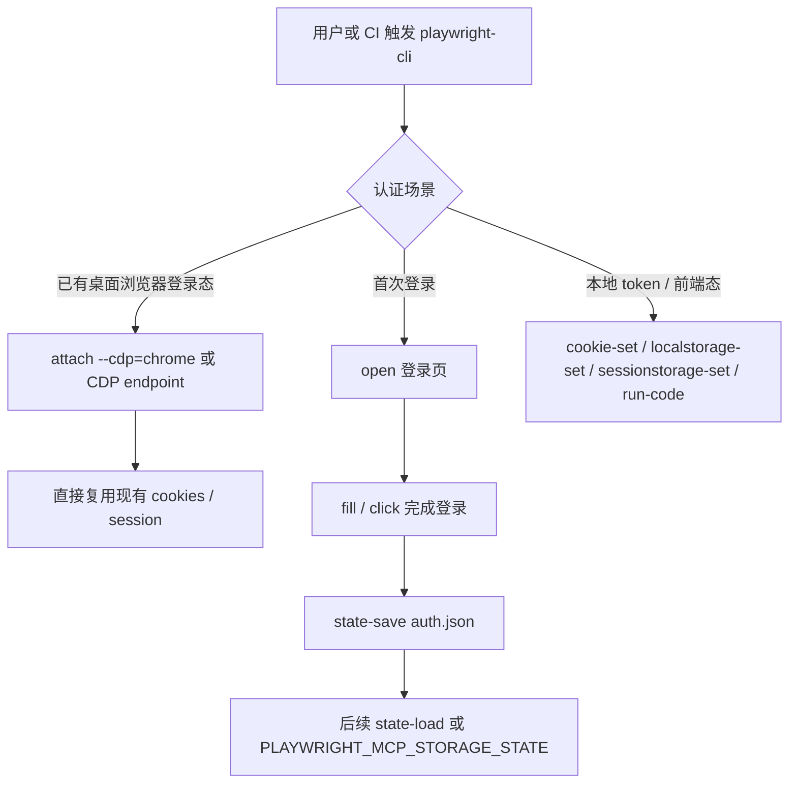

该流程图概括的是官方 README、session-management 技能文档、storage-state 技能文档与 release 说明共同呈现的认证模型。citeturn16view2turn16view1turn15search0turn35search1

再看 `agent-browser`。它提供的认证路径明显更丰富：**从用户浏览器导入已登录状态、持久 profile、自带的 `--session-name` 自动保存/恢复、显式 `state save/load`、auth vault、HTTP Basic Auth、origin-scoped Bearer 头、Cookie import、以及 OAuth/SSO/2FA 的浏览器流**。官方认证文档甚至单独给出 OAuth/SSO、2FA、Token Refresh Handling 等模式化说明。citeturn6view0turn19view0turn24view3turn24view5turn7view1

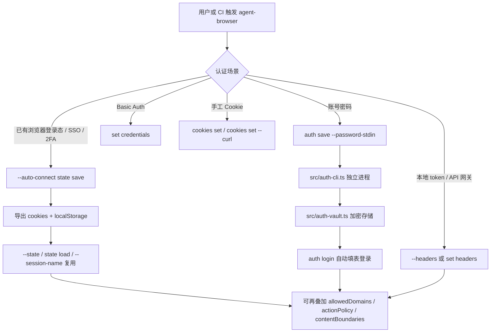

这张图对应的是 `skill-data/core/references/authentication.md`、`docs/src/app/commands/page.mdx`、`docs/src/app/sessions/page.mdx`、`src/auth-cli.ts`、`src/auth-vault.ts` 与 `src/encryption.ts`。citeturn7view1turn24view3turn19view0turn7view0turn26view0turn27view0

### 代码级实现点

`agent-browser` 的认证实现点可以比较明确地定位到源码。`src/auth-cli.ts` 是 auth vault 的独立 CLI 入口，注释里明确写着它被 Rust CLI 直接调用，以避免把密码通过 daemon channel 传递；其 `run()` 会处理 `auth_save`、`auth_list`、`auth_show`、`auth_delete` 等动作。`src/auth-vault.ts` 则实现了 `saveAuthProfile()`、`getAuthProfileMeta()`、`listAuthProfiles()`、`deleteAuthProfile()`、`updateLastLogin()` 等函数，并把 profile 保存到 `~/.agent-browser/auth/`，同时通过 profile name 正则校验防止路径穿越。`src/encryption.ts` 提供 `getEncryptionKey()`、`ensureEncryptionKey()`、`encryptData()`、`decryptData()` 等 AES-256-GCM 工具，支持 `AGENT_BROWSER_ENCRYPTION_KEY` 与 `~/.agent-browser/.encryption-key` 两种取钥方式，并在 Windows 上用 `icacls` 额外约束文件/目录权限。citeturn7view0turn26view0turn27view0

`agent-browser` 的会话状态文件实现也能定位到 `src/state-utils.ts`：`writeStateFile()` 在**存在加密 key** 时会对状态文件进行加密、否则写明文 JSON；`readStateFile()` 在读取到加密 payload 时会要求 `AGENT_BROWSER_ENCRYPTION_KEY`。同一文件还实现了 `isValidSessionName()`、`getAutoStateFilePath()` 等逻辑，显式把 session name 校验写成安全措施，以防通过环境变量绕过 CLI 校验导致路径穿越。citeturn38view0

认证之外，与授权/权限边界最相关的 `agent-browser` 代码点在 `src/actions.ts` 的命令分发层：`executeCommand()` 在真正 dispatch 之前会调用 `checkPolicy()`，还可走 `requestConfirmation()` 分支；`handleNavigate()` 在导航前会先执行 `browser.checkDomainAllowed(command.url)`，并在传入 `headers` 时调用 `browser.setScopedHeaders(command.url, command.headers)`，这意味着**域名白名单与 origin-scoped headers 都在命令执行前被强制处理**。官方命令文档也明确写了 `--headers` 是“HTTP headers scoped to URL's origin”。citeturn32view0turn30view0turn24view4

相比之下，`playwright-cli` 在本次可稳定验证的官方材料里，没有像 `agent-browser` 那样暴露出清晰的“auth module 源码入口”。我能高置信定位到的实现切入点主要是**文档/配置层**：`skills/playwright-cli/references/storage-state.md` 负责 `state-save`/`state-load` 与 cookie/localStorage/sessionStorage 的用法；`skills/playwright-cli/references/session-management.md` 负责 profile、CDP attach 与 extension attach；`README.md` 则公开了 `.playwright/cli.config.json` 配置模式以及 `PLAYWRIGHT_MCP_STORAGE_STATE`、`PLAYWRIGHT_MCP_CDP_HEADERS`、`PLAYWRIGHT_MCP_ALLOWED_ORIGINS`、`PLAYWRIGHT_MCP_BLOCKED_ORIGINS`、`PLAYWRIGHT_MCP_SECRETS_FILE`、`PLAYWRIGHT_MCP_USER_DATA_DIR` 等环境变量。换言之，`playwright-cli` 的认证“实现点”更偏**命令面与配置面**，而不是面向使用者暴露的专门 auth 子系统。citeturn15search0turn16view1turn17view0turn18view0

下表把“代码级实现点”压缩成可直接查源的索引。

| 项目 | 实现点 | 作用 | 依据 |
|---|---|---|---|
| playwright-cli | `skills/playwright-cli/references/storage-state.md` | `state-save` / `state-load`、cookie/localStorage/sessionStorage 管理 | citeturn15search0 |
| playwright-cli | `skills/playwright-cli/references/session-management.md` | `--persistent`、`--profile`、`attach --cdp`、`attach --extension` | citeturn16view1turn36search2 |
| playwright-cli | `README.md` 配置模式与 `PLAYWRIGHT_MCP_*` | `PLAYWRIGHT_MCP_STORAGE_STATE`、CDP headers、origin allow/block、secrets file 等 | citeturn17view0turn18view0 |
| agent-browser | `src/auth-cli.ts::run()` | auth vault 独立入口，避免密码经过 daemon channel | citeturn7view0 |
| agent-browser | `src/auth-vault.ts::saveAuthProfile()` 等 | 认证资料保存、读取、列举、删除、lastLoginAt 元数据 | citeturn26view0 |
| agent-browser | `src/encryption.ts::*` | AES-256-GCM、环境变量/本地 key 文件、权限收紧 | citeturn27view0 |
| agent-browser | `src/state-utils.ts::writeStateFile()` | 状态文件可选加密；session name 安全校验 | citeturn38view0 |
| agent-browser | `src/actions.ts::executeCommand()` / `handleNavigate()` | 动作策略检查、确认流程、allowed domain 检查、origin-scoped headers | citeturn32view0turn30view0turn24view4 |

### 认证能力对比表

| 主题 | playwright-cli | agent-browser | 结论 | 依据 |
|---|---|---|---|---|
| 账号密码登录 | 通过普通页面自动化完成；无独立 auth vault | 有 `auth save` / `auth login`，支持 `--password-stdin` 和自定义 selector | agent-browser 更产品化 | citeturn15search0turn24view3turn25search1 |
| OAuth2/OIDC | 无专门子命令；推荐做法是登录后保存 state，或 attach 到已登录浏览器 | 官方认证文档有 OAuth/SSO 流程示例，可导入已登录 Chrome 状态 | 两者都靠浏览器态，agent-browser 文档更完整 | citeturn10search2turn35search1turn7view1turn6view0 |
| 企业 SSO | attach 到本地 Chrome/Edge 复用“existing logins” | `--auto-connect state save`、`--profile`、`--session-name` 都可复用 SSO 后会话 | 两者都能做，agent-browser 路径更多 | citeturn35search1turn36search2turn19view0turn7view1 |
| 本地 token / Bearer | 无官方“按 origin 作用域 header auth”工作流；可用 cookie/localStorage/sessionStorage/run-code 间接实现 | `--headers` / `set headers`，并且会话文档明确写明按 origin 作用域，不会跨域泄露 | agent-browser 明显更好 | citeturn15search0turn24view4turn19view0 |
| Cookie 导入 | `cookie-set` / `cookie-list` / `cookie-clear` | `cookies set`，还支持 `cookies set --curl` 自动识别 JSON/cURL/Cookie header | agent-browser 对真实请求导入更友好 | citeturn15search0turn24view1turn23view0 |
| HTTP Basic Auth | 官方材料未见专门 CLI 子命令 | `set credentials <u> <p>` | agent-browser 更完整 | citeturn24view0turn24view5 |
| 会话持久化 | 默认内存态；可 `--persistent` / `--profile` / `state-save/load` | `--profile`、`--session-name` 自动保存恢复、`state save/load` | agent-browser 更自动化 | citeturn16view2turn16view1turn19view0turn24view2 |
| 凭证存储 | 官方材料未见“加密凭证金库” | auth vault 永远加密；state 文件在有 key 时加密 | agent-browser 优势很大 | citeturn18view0turn26view0turn27view0turn38view0 |
| 凭证轮换 | 无内建轮换；Playwright 官方 auth 指南提示状态过期后需要删除和重建 | 无自动轮换，但官方文档有 token refresh wrapper 模式；auth profile 带 `lastLoginAt` 元数据 | 两者都缺真正自动轮换，agent-browser 至少给了模式化脚本 | citeturn10search2turn24view5turn26view0 |
| 权限边界 | allow/block origins 存在，但官方强调“不构成安全边界” | 可叠加 `allowedDomains`、`actionPolicy`、`confirm-actions`、`contentBoundaries` | agent-browser 安全控制面更强 | citeturn18view0turn34search1turn21view4turn32view0turn6view2 |

综合判断如下：

- **本地 token 场景**：如果只是前端 token、cookie 或 storage 写入，`playwright-cli` 可以做，但通常要靠 `cookie-set`、`localstorage-set` 或 `run-code` 自己拼；`agent-browser` 直接有 `--headers`、`cookies set --curl`、`set credentials`，且 `--headers` 有 origin 作用域，是更可控的方案。citeturn15search0turn24view1turn24view4turn19view0
- **OAuth2/OIDC 场景**：两者都不是 OAuth client SDK。真正可行的路径是“在浏览器中完成授权，再保存/复用浏览器态”；`agent-browser` 为此给出了更完整的官方 playbook，`playwright-cli` 则更偏底层能力组合。citeturn10search2turn7view1turn35search1
- **SSO 场景**：两者都能借助已登录桌面浏览器绕过复杂 IdP 流；如果你需要在之后把这份状态安全地保存、按 session name 复用、并限制后续代理行为，`agent-browser` 更合适。citeturn35search1turn19view0turn26view0turn21view4

## 安全性评估与风险矩阵

先说结论：**两者最大的共同攻击面都不是“密码框本身”，而是“已登录浏览器权限被自动化接管之后，工具还能去哪里、还能做什么、还能把什么带出来”。** 在这件事上，`playwright-cli` 的官方材料提供的是比较底层、偏 Playwright/MCP 的限制参数；`agent-browser` 则显式补上了 prompt injection、防意外导航、动作审批、域名收束、HAR/截图泄密防范等 AI 代理安全规则。citeturn18view0turn23view0turn34search1

`playwright-cli` 的一个重要安全语义是：`PLAYWRIGHT_MCP_ALLOWED_ORIGINS` / `PLAYWRIGHT_MCP_BLOCKED_ORIGINS` **不构成安全边界**，也**不影响重定向**；另一个重要点是默认会话在内存中，这对敏感操作更安全，但一旦开启 `--persistent` / `--profile` 或保存 storage state，风险就转移到了磁盘文件与 profile 目录。官方 storage-state 文档还明确提示不要把 auth state 文件提交进仓库。另一方面，`attach --cdp=chrome` 能直接驱动“已有登录态”的浏览器，这对 SSO 很方便，但也意味着**你的自动化权限直接继承了真实桌面浏览器权限**。citeturn18view0turn15search0turn35search1turn36search2

`agent-browser` 的长板在于它把许多缓解措施做成了一等能力，但短板也很明确：**这些能力默认都不是强制打开的。** 官方技能文档明确写了默认没有导航、动作、输出限制；只有显式打开 `--content-boundaries`、`--allowed-domains`、`--action-policy`、`--confirm-actions` 等开关，才会形成较像样的安全壳。更进一步，官方信任边界文档把页面内容、console、network response body、DOM 属性、错误遮罩、React 树都定义为**不可信输入**，并特别指出不要把 cookie、token、OAuth code、HAR 内容、state file 内容回显给模型。citeturn34search1turn34search2turn23view0

已知问题方面，`agent-browser` 在认证相关公开材料里至少有两类值得注意的实现风险。第一，2026 年 5 月的 release notes 明确写到：`--state` / `AGENT_BROWSER_STATE` 在 native Rust rewrite 后一段时间里“解析、校验、环境传递都接好了，但真正的 load step 没有接上”，后来才在 `#1241` 修复；这意味着如果你的环境使用的是旧版本，可能会出现“看似加载成功、实际没加载”的风险。第二，Windows 上 headless + persistent profile 存在 cookies/localStorage 关闭后不落盘的问题，官方 issue 将其归因于 Chromium bug，并建议在 Windows 上改用 `--headed`。citeturn19view2turn19view6turn19view3

依赖与漏洞公开面上，`playwright-cli` 有标准的 Microsoft `SECURITY.md` 与 MSRC 报告入口；在本次检索到的官方公开材料里，我没有看到专门针对 `playwright-cli` 的已确认 CVE 或仓库级安全公告。`agent-browser` 的 GitHub security 页面则显示项目尚未设置 `SECURITY.md`，同时仓库 issue 里能找到关于依赖安全/弃用项的报告，例如 `glob@10.5.0` 与 `whatwg-encoding@3.1.1` 的安全/弃用问题。这里要特别说明：**“未检索到公开公告”并不等于“没有漏洞”**，只能说明在我优先审阅的公开官方资料里没有发现已归档的公开 advisories。citeturn22search2turn22search6turn22search14turn37search1

下表给出更实用的风险矩阵。

| 风险项 | playwright-cli | agent-browser | 概率 | 影响 | 说明与证据 |
|---|---|---|---|---|---|
| 已登录浏览器会话被高权限接管 | 高 | 高 | 高 | 高 | 两者都支持复用真实浏览器登录态；Playwright 通过 `attach --cdp`，agent-browser 通过 `--auto-connect`/`--profile`。citeturn35search1turn36search2turn19view0turn7view1 |
| state/profile 泄漏导致 token 外流 | 中到高 | 中 | 高 | 高 | Playwright 文档强调 auth state 文件不可提交；agent-browser 有 auth vault 加密，state 文件可选加密。citeturn15search0turn26view0turn38view0 |
| 跨域/重定向导致最小权限失效 | 高 | 中 | 中到高 | 高 | Playwright 的 allowed/block origins 不构成安全边界且不影响 redirects；agent-browser 可用 allowedDomains 和 origin-scoped headers 缩小面。citeturn18view0turn19view0turn21view4turn8search7 |
| 页面 prompt injection 诱导危险动作 | 中到高 | 中 | 高 | 高 | agent-browser 有 trust-boundaries 与 content boundaries；Playwright CLI 官方材料未见等价“内容边界”能力。citeturn23view0turn34search1turn18view0 |
| 认证状态“看似可复用，实际失效” | 中 | 中到高 | 中 | 中到高 | Playwright 有 session 复用/性能 issue；agent-browser 有 `--state` 旧版本未真正加载、Windows 落盘 bug。citeturn35search5turn37search7turn19view2turn19view3 |
| 规则配置存在但默认未启用 | 中 | 高 | 高 | 中到高 | agent-browser 官方明确安全特性 opt-in；不启用即无导航/动作/输出级限制。citeturn34search1turn34search2 |

基于这些材料，我给出五条具体而且可执行的加固建议：

| 建议 | 适用对象 | 具体做法 | 依据 |
|---|---|---|---|
| 使用“专用浏览器身份”而不是个人主 profile | 两者都适用 | 不要 attach 到日常办公主浏览器；为自动化创建单独 Chrome profile / 测试账号 | citeturn35search1turn19view0 |
| 让认证资产默认加密，并设置生命周期 | 两者都适用，agent-browser 尤其推荐 | agent-browser 设 `AGENT_BROWSER_ENCRYPTION_KEY` 与 `AGENT_BROWSER_STATE_EXPIRE_DAYS`；Playwright 只保留短期 state，过期即删 | citeturn19view0turn21view5turn38view0turn10search2 |
| 不把密码/token 直接放进命令行 | 两者都适用 | agent-browser 用 `--password-stdin`；Playwright 尽量用环境变量或 secrets 文件，不在 shell history 中直接留下密钥 | citeturn24view3turn18view0turn23view0 |
| 限制自动化的可达域与高危动作 | 优先 agent-browser | 打开 `--allowed-domains`、`--action-policy`、`--confirm-actions`；对下载、eval、表单提交做审批 | citeturn21view4turn32view0turn6view2 |
| 在 AI 代理场景开启内容边界并审查 HAR/截图输出 | 优先 agent-browser | 开启 `--content-boundaries`；避免未脱敏的 HAR、state JSON、截图外发 | citeturn34search1turn23view0 |

## 可扩展性、集成、性能与开发者体验

在可扩展性与集成方面，`playwright-cli` 的优势是**天然贴近 Playwright 生态**。它支持运行/调试 Playwright tests、代码生成、request mocking、tracing、video recording，且能直接与 Playwright Test 的 `storageState`、global setup/project dependencies 模式衔接；如果你的目标是“先从代理探索页面，再落地成 Playwright 测试代码”，它的路径非常顺。它还支持 attach 到已有浏览器、extension 模式、remote endpoint，以及 proxy/file access 等 MCP 式基础设施配置。citeturn10search8turn10search6turn10search9turn16view2turn16view1turn18view0

`agent-browser` 的优势是**运行时集成面更广**。官方技能列表里就包括 `vercel-sandbox`、`agentcore`、`ios`、`electron`、`slack` 等技能；release notes 和 README/issue 片段还显示它支持多种 provider 认证方式，例如 Kernel API key、AWS Bedrock AgentCore 的 SigV4 与 AWS credential provider chain（包括 AWS CLI、SSO、IAM roles）。这类能力与网站认证不是一回事，但在“云浏览器 + 企业身份 + 代理执行”的链路里非常关键：它意味着你不仅能给目标网站做认证，还能给**浏览器执行基础设施本身**做认证。`playwright-cli` 的公开材料里，我没有看到等价的 provider 身份管理层。citeturn6view5turn8search5turn20search0turn4search5turn2view4

性能与资源消耗方面，两者都没有在我审阅到的官方材料中给出**同口径、同场景、可复现实验条件**的公开 benchmark，因此无法严谨地下“快多少、占用少多少”的定量结论。高置信度结论只有两点：一是 `agent-browser` 官方明确将自己定位为“Fast native Rust CLI”，并且 daemon 不要求 Node.js；二是 `playwright-cli` 最近 release 专门修过 heavy CPU/memory 与 orphaned Chrome process 问题，同时还有关于 `show` 并行运行导致 `open` 变慢、以及会话复用异常的 issue。也就是说，**从架构上看 agent-browser 更像为长活代理运行时优化过，但从公开证据上仍不应声称它在所有场景都一定更快。**citeturn7view2turn9search4turn35search1turn37search7turn35search5

开发者体验与文档质量方面，`playwright-cli` 的优点是文档短、概念统一、与 Playwright 既有认知兼容，还有官方中文页可供团队成员快速上手；它的短板是认证文档较分散，很多事情需要你“理解 Playwright state/profile/CDP 是什么”之后再自己拼装。`agent-browser` 的优点是认证、会话、安全、信任边界、配置、技能都写得相当操作化；它的短板是材料更多、概念层更厚，且本次检索到的官方文档基本是英文。面向中文团队的现实含义是：**如果团队成员已经熟悉 Playwright，playwright-cli 学习曲线更低；如果团队成员更关心 AI 代理安全运营，agent-browser 的文档更像一本操作手册。**citeturn2view3turn16view2turn15search0turn21view0turn19view0turn23view0

## 迁移与集成建议

如果你当前从 `playwright-cli` 出发，要迁移到 `agent-browser`，最值得做的不是机械替换命令，而是**重新设计认证资产的边界**。`playwright-cli` 项目里常见的资产是 `state-save` 产物、持久 profile 目录、以及 attach 到本地浏览器的使用习惯；迁到 `agent-browser` 后，推荐把这些资产区分为三类：**短期 state 文件、长期 session-name、受保护的 auth vault 凭证**。只有这样，`agent-browser` 提供的安全壳——尤其是加密、expiry、域名白名单、动作策略——才能真正发挥价值。citeturn15search0turn19view0turn26view0turn38view0turn21view4

如果你准备反向迁移，即从 `agent-browser` 回到 `playwright-cli`，需要预先接受一个现实：你会失去一部分“认证管理产品层”。你仍然可以保存/恢复 state、复用 profile、attach 到已登录浏览器，但你需要自己承担更多治理工作，例如 secrets 管理约定、对目标域的限制、对截图/HAR/response body 的外发约束，以及对敏感动作的审批逻辑。也就是说，除非你的最终目标是**把探索性自动化沉淀成 Playwright 测试代码**，否则这通常不是“功能等价迁移”，而更像“回到更底层的控制方式”。citeturn18view0turn15search0turn23view0turn34search1

在 Linux CI 环境与云主机的假设下，我建议把迁移执行成下面这份优先级清单。

| 优先级 | 步骤 | 说明 | 适用方向 |
|---|---|---|---|
| P0 | 盘点现有认证资产 | 列出 storageState JSON、profile 目录、attach 到真实浏览器的作业、CI secrets、截图/HAR 留存位置 | 双向都适用 |
| P0 | 先定认证模式，再选工具 | 本地 token 优先考虑 origin-scoped headers；SSO/OIDC 优先考虑浏览器态导入/attach；密码登录才考虑自动填表 | 双向都适用 |
| P0 | 建立专用身份与专用 profile | 拒绝个人主浏览器/主账号直接接入自动化 | 双向都适用 |
| P1 | 若迁入 agent-browser，先启用安全基线 | `AGENT_BROWSER_ENCRYPTION_KEY`、`AGENT_BROWSER_STATE_EXPIRE_DAYS`、`--allowed-domains`、`--action-policy`、`--content-boundaries` | 迁入 agent-browser |
| P1 | 若迁入 playwright-cli，补齐外部治理 | 用 CI 规范、仓库规则和 secrets 管理替代 agent-browser 的产品内控制 | 迁入 playwright-cli |
| P1 | 重写认证流水线 | Playwright 的 `state-save/load` 映射到 agent-browser 的 `state save/load` 或 `--session-name`；agent-browser 的 `auth vault` 若迁出，则改成外部 secret 管理 + 登录脚本 | 双向都适用 |
| P2 | 统一日志与产物脱敏策略 | 对 screenshot、trace、HAR、state 文件、console/network body 制定保留和清理规则 | 双向都适用 |
| P2 | 用真实业务 SSO 流回归 | 至少选一个 OIDC/SSO 站点做“登录一次、重启后复用、token 失效再恢复”的端到端验收 | 双向都适用 |

一个务实的集成建议是：**两者并不一定要二选一。** 对很多团队来说，最佳组合其实是——**用 `agent-browser` 做受控的认证与代理运行时，用 `playwright-cli` 做 Playwright 代码生成、调试和测试资产沉淀。** 这能把双方长处拆开：认证治理与代理安全由前者负责，测试代码生产率由后者负责。这个结论尤其适合既有 Playwright 测试体系、又想把 AI 代理带进真实登录环境的团队。citeturn16view2turn10search8turn19view0turn24view3turn21view4

## 开放问题与资料缺口

有几处材料缺口需要明确标注，避免把“没查到”误说成“没有”。

首先，`playwright-cli` 的官方公开材料在本次检索范围内**没有像 agent-browser 那样清晰暴露独立的 auth 源码模块**；我能高置信定位的是命令、技能文档与配置项，而不是明确的认证函数名。因此，如果你后续要做安全审计，建议继续定位 `playwright-cli.js` 或其调用链中真正处理 storage state / attach / secrets file 的实现位置。citeturn16view2turn15search0turn18view0

其次，`PLAYWRIGHT_MCP_SECRETS_FILE` 在 README 环境变量表里出现了，但我在本次审阅的官方公开资料里**没有找到它如何与认证命令直接联动**的详细说明；它很可能是更通用的秘密注入能力，而不是面向登录流的专门机制。这个点如果要用于生产，应继续查源码或更细粒度文档。citeturn18view0

再次，`agent-browser` 的 auth vault、state encryption 和 action policy 虽然在官方材料里已经很强，但仍有两个需要继续确认的点：其一，`auth login` 成功后 `lastLoginAt` 的更新路径，我在本次可稳定打开的公开源码片段里只看到了 `updateLastLogin()` 的导出与导入，未直接看到成功调用点；其二，release notes 说明 **auth vault operations bypass policy enforcement**，对于高安全环境，后续应确认这是否可通过配置改成受策略约束。citeturn26view0turn29view1turn6view2

最后，关于**性能与资源消耗**，我没有在官方材料里找到经过统一场景定义的 apples-to-apples benchmark；因此本文对性能只做了**架构层与 issue/release 证据层**分析，而没有给出定量排名。如果你要为 CI 或云主机做容量规划，建议补做一轮你自己环境下的基准：至少比较“首次登录耗时、会话恢复耗时、SSO 跳转成功率、并发代理数、Chrome 进程占用、trace/screenshot 产物体积”这六项。citeturn7view2turn35search1turn37search7turn19view3

综合以上材料，我的最终判断是：**如果你把“认证”理解为简单的登录态保存，二者都能做；如果你把“认证”理解为企业环境里对凭证、会话、权限边界、跨域限制、代理安全和恢复策略的系统治理，那么 `agent-browser` 的完成度显著高于 `playwright-cli`。** 反过来，**如果你的主路径是 Playwright 代码与测试资产沉淀，而不是代理运行时治理，`playwright-cli` 仍然是更贴近现有工程实践的选择。** citeturn16view2turn15search0turn19view0turn24view3turn21view4turn23view0


[ChatGPT](https://chatgpt.com/)

[

](https://chatgpt.com/agents/new)

OpenClaw-CN 企业发行版最佳开源是哪个

  

我先核对“OpenClaw-CN”的具体指代，避免混淆同名或相近项目；随后按开源许可、维护活跃度、部署友好性和商业风险给出企业版选型建议。

Thought for 6m 22s

如果你问的是**“OpenClaw-CN 里最适合企业自建/私有化的开源发行版选哪个”**，我的建议是：

## 首选：`jiulingyun/openclaw-cn` / OpenClaw-CN 中文社区版

理由很直接：它是目前公开资料里最贴近“国内企业私有化 + 开源可二开”的选择。项目 README 明确定位为“私有化部署的 AI 智能助手，完整中文本地化”，并说明这是面向国内用户、适配国内网络环境的非官方 CN 版本；功能上包含本地优先、多渠道支持、技能扩展，并支持飞书、钉钉、企业微信、QQ、微信等国内办公/IM 场景。它也标注为 MIT License。

安装方式也比较简单：

```
npm install -g openclaw-cn@latestopenclaw-cn onboard --install-daemonopenclaw-cn gateway --port 18789 --verbose
```

这些命令来自该项目的快速开始说明。

## 国内企业落地更推荐看 Gitee 的 OpenClaw-CN 组织

如果你的企业更重视国内生态、Gitee、国产模型和企业微信/飞书适配，可以优先跟踪 **Gitee 上的 OpenClaw-CN 组织**。它的公开介绍强调“安全落地版本与本土化生态支持”，包括代码审计/纯净镜像、DeepSeek-V3、通义千问 Qwen、Ollama，以及飞书、企业微信等办公流自动化插件。

## 不要把“企业版”和“开源版”混为一谈

如果你说的“企业发行版”是指 **腾讯云 ClawPro（OpenClaw 企业版）**，那它更像商业托管/管控产品，不是开源发行版。腾讯云页面把它描述为一站式“企业 AI 智能体管控台”，提供统一采购、统一管控、审计、自动化云端部署、管理员管理镜像/skills/模型/token 配额/员工等能力。

所以选择可以这样定：

|场景|推荐|
|---|---|
|想要**开源、可私有化、可二开**|`jiulingyun/openclaw-cn` / OpenClaw-CN 中文社区版|
|国内网络、国产模型、飞书/企微/钉钉适配优先|Gitee 的 OpenClaw-CN 生态|
|要企业统一管控、审计、SLA、低运维|腾讯云 ClawPro，但它不是开源首选|

企业内部部署时要特别注意隔离。Microsoft 安全团队把 OpenClaw 这类 self-hosted agent runtime 视为“带持久凭据的不可信代码执行”，建议不要跑在普通个人或企业工作站上；评估时应放在独立 VM/独立设备中，使用专用低权限账号和非敏感数据。

结论：**最佳开源选择是 OpenClaw-CN 中文社区版；如果要企业级管控能力，再评估 ClawPro 这类商业企业版。**

### 你所在的组织已达到高级功能和模型的使用上限。

你的限额将于 2026年6月13日重置。若想立即获得更多访问权限，请向你的管理员发送请求。

通知管理员


# 2024到2025全球大厂AI投入与产品方向研究报告

## 执行摘要

过去两年，大厂AI投入已经从“单点押注大模型”演进为三层并行的系统工程：上层是前沿模型、推理模型与智能体能力，中层是训练/推理基础设施、数据中心与芯片，下层是分发入口与场景闭环，包括办公套件、搜索、社交、广告、电商、开发者平台与端侧设备。最能说明这一点的不是单一产品，而是资本开支和组织重心同时转向：Alphabet在2025年仍预计约750亿美元资本开支，Microsoft表示FY2025约800亿美元将投向AI数据中心，Meta把2025年资本开支指引上调到640亿至720亿美元，Amazon把FY2025资本开支提高到1000亿美元且“大部分”用于AI数据中心，而OpenAI则在2025年同时推进“星际之门”项目与400亿美元新融资；中国阵营中，阿里巴巴宣布未来三年至少投入3800亿元人民币建设云和AI基础设施。citeturn32search0turn12search0turn42view0turn17search2turn14search7turn14search4turn8search1

产品方向也在明显收敛。几乎所有大厂都在做四类东西：一是“通用助手/智能体”，二是“模型即服务/MaaS与开发平台”，三是“创作与多模态工具”，四是“端侧/隐私优先AI”。不同之处在于谁拥有最强分发和最深工作流：Google把Gemini绑到Search、Workspace、Android和Vertex；Microsoft把Copilot绑到Microsoft 365、Azure、Windows和企业安全；Meta把Llama和Meta AI绑到广告、推荐和社交流量；Amazon把Bedrock、Nova、Q与Alexa+绑到AWS和电商/家庭入口；Apple与华为则更强调端侧、隐私和自有硬件栈；百度、阿里、腾讯、华为、字节则普遍把AI嵌进搜索、云、办公协作、内容分发、电商和行业解决方案。citeturn30view0turn30view1turn30view3turn34search12turn26search3turn16search8turn16search0turn15search0turn10search0turn21search1turn22search1turn24search1turn25search1

从竞争格局看，**最红海**的不是“AI应用”这个大类，而是其中的几个子层：通用基础模型、通用聊天助手、通用图像/视频生成、通用代码补全、以及标准化公有云GPU租赁。原因是这些层正在同时遭遇价格下探、开源替代、同质化和大厂交叉补贴。Gartner判断，2025年GenAI支出将达到6439亿美元，但CIO对高失败率POC和当前结果不满意、会更偏向现成软件而不是自研；同时，OpenAI在GPT‑4o上把API价格较GPT‑4 Turbo降了50%，腾讯混元Turbo S定价相较前代下降数倍，百度在2025年又推出更低价的Turbo系列，阿里则持续加大开源模型供给。citeturn43view0turn36search0turn9search0turn20search2turn22search6

**已被验证**、最值得企业短中期配置的方向，集中在“离钱近、离工作流近、离分发近”的层面：训练/推理基础设施、开发者工具、客服自动化、广告与推荐优化、搜索增强、医疗文书与专业助理、以及云上的企业级Agent平台。Microsoft已披露其AI业务年化收入运行率超过130亿美元，且近70%的《财富》500强在用Microsoft 365 Copilot；Google的AI Overviews月活已超过15亿，Search收入仍保持双位数增长；Meta称Meta AI在2025年Q1已接近10亿月活，广告业务仍在受益于AI；百度文库AI功能月活在2024年12月已到9400万；阿里云AI相关产品收入已连续七个季度保持三位数增长。citeturn34search13turn34search1turn30view0turn42view0turn21search1turn22search3

**想象空间最大**、但还需要3到5年演化的方向，主要有五个：面向企业流程的Agent操作系统、隐私优先的端侧个人AI、主权/私有化AI全栈、物理世界模型与机器人、以及AI安全/治理运行时。McKinsey认为，生成式AI在全球每年可增加2.6万亿到4.4万亿美元价值，其中约75%的价值集中在客服、营销销售、软件工程和研发四个功能；而在2025年调查中，AI高绩效企业在多数职能上将Agent推进到规模化阶段的概率至少是同行的三倍。这意味着“AI的第二曲线”并不主要来自又一个聊天框，而来自把AI嵌进流程、系统与真实执行链路。citeturn44view0turn44view1

## 方法与数据来源

本报告以**2024至2025年公开信息**为主，必要时补充2023年背景。信息优先级依次为：公司官方公告/产品文档/投资者关系材料、权威行业机构报告、官方监管与标准文本，以及少量用于补足市场结构的研究机构公开摘要。核心外部基准包括 Gartner 的2025年GenAI支出预测、IDC 的全球AI与GenAI支出指南及边缘计算支出预测、McKinsey 对生成式AI经济潜力与2025年AI采用现状的研究、Omdia/Canalys 对AI PC与终端趋势的判断、IFR 对工业机器人装机的统计，以及 EU AI Act 与 NIST AI RMF 等治理框架。citeturn43view0turn43view1turn43view3turn44view0turn44view1turn43view4turn40search0turn39search1turn39search2

几个口径需要先说明。第一，**市场规模估计统一采用“2025E全球年度可服务市场”**，但不同方向的口径并不完全同质：纯软件/服务方向以软件、服务与必要推理成本为主；基础设施、芯片与边缘方向则采用软硬件合计口径。第二，缺乏直接统计的方向，采用“总量报告 + 行业价值池 + 设备/广告/云收入代理变量”的方式做区间估算，因此区间宽度本身反映了不确定性。第三，**商业化验证程度**按三档划分：已验证，指大规模用户、收入或可重复ROI已经出现；部分验证，指在若干场景实现规模化，但商业模式或成本结构尚未稳定；未验证，指更多仍停留在试点或战略布局。第四，**竞争强度**按红海/中度/蓝海划分，其中红海通常意味着大厂数量多、价格/开源/渠道竞争同时发生。这个分法是本报告的分析框架，而非外部机构的固定定义。综合看，Gartner预计2025年GenAI支出达6439亿美元，其中80%流向硬件；IDC则估计2024年全球AI IT投资已达3158亿美元，并将在2028年达到8159亿美元；这些总量为本报告各方向的估算提供了上界和约束。citeturn43view0turn43view1

对公司层面的“投入强度”，本报告主要使用四类公开信号综合判断：**资本开支/融资规模、组织与合作动作、产品发布节奏、以及收入或用户验证指标**。需要特别说明的是，Apple、Tencent、Huawei、ByteDance 等公司并不会按外界期望把“AI专项投入”单独拆分披露，因此其“投入强度”判断必然是公开代理变量而非精确会计口径。相反，Google、Microsoft、Meta、Amazon、OpenAI、Alibaba 的基建和融资信号公开度更高。citeturn32search0turn12search0turn42view0turn17search2turn14search0turn14search4turn8search1

如果后续需要把本报告转成董事会或投资决策PPT，最适合的三种可视化是：把“方向级市场规模”做成柱状图，把“成熟度—竞争强度”做成二维象限图，把“公司投入矩阵”做成热力图。对应的数据基础分别来自 Gartner/IDC/McKinsey/Omdia/IFR 与公司官方披露。citeturn43view0turn43view1turn43view3turn44view0turn43view4turn40search0

## 各公司投入领域与主要产品服务

先看一张综合矩阵。符号含义为：**◎** 高投入且已有规模化产品；**○** 中投入或重点业务线，商业化在推进；**△** 有布局但非主战场；**—** 公开信息显示布局有限或非主要方向。该表是基于后文公司梳理作出的综合判断。citeturn14search0turn32search0turn12search0turn42view0turn17search2turn15search3turn8search1turn24search1turn10search7turn25search2

| 公司 | 基础模型 | 训推基础设施 | 企业Agent/生产力 | 搜索推荐/广告 | 创作与多模态 | 开发者/MaaS | 端侧AI | AI芯片/硬件 | 依据 |
|---|---:|---:|---:|---:|---:|---:|---:|---:|---|
| OpenAI | ◎ | ○ | ◎ | ○ | ○ | ◎ | — | — | citeturn36search0turn37search1turn14search7turn14search4turn36search2turn36search3 |
| Google/DeepMind | ◎ | ◎ | ◎ | ◎ | ○ | ◎ | ◎ | ◎ | citeturn30view1turn30view2turn30view3turn30view4turn32search0turn30view0 |
| Microsoft | ○ | ◎ | ◎ | ○ | ○ | ◎ | ○ | ○ | citeturn13search3turn12search10turn12search0turn34search13turn34search1turn34search12turn13search0 |
| Meta | ◎ | ◎ | ○ | ◎ | ○ | ○ | ◎ | ○ | citeturn29search3turn26search3turn26search7turn27search8turn42view0turn27search1 |
| Amazon | ○ | ◎ | ◎ | ○ | ○ | ◎ | ○ | ◎ | citeturn17search0turn17search3turn16search8turn16search2turn16search5turn16search0turn17search2 |
| Apple | △ | △ | △ | — | ○ | — | ◎ | ◎ | citeturn15search0turn15search1turn15search4turn15search7turn15search2turn15search3 |
| 百度 | ◎ | ○ | ○ | ◎ | ○ | ◎ | △ | △ | citeturn21search5turn21search0turn21search1turn20search0turn20search2 |
| 阿里 | ◎ | ◎ | ○ | ○ | ○ | ◎ | ○ | △ | citeturn22search4turn22search2turn22search0turn22search1turn8search1turn22search3turn22search6 |
| 腾讯 | ○ | ○ | ○ | ◎ | ◎ | ○ | ○ | — | citeturn9search3turn23search2turn24search1turn24search2turn7search5turn9search0 |
| 华为 | ○ | ◎ | ○ | △ | △ | ○ | ◎ | ◎ | citeturn10search0turn10search6turn10search2turn10search7turn10search4 |
| 字节跳动 | ○ | ○ | ○ | ◎ | ◎ | ○ | △ | — | citeturn7search7turn25search1turn25search2turn25search4turn25search3 |

整体上，美国四家云与平台巨头的共同点，是都在把AI当成**资本开支驱动的全栈生意**；而中国头部公司的共同点，是把AI更紧地嵌在**既有流量、内容、协同办公、政企云和行业场景**之中。Apple 与 Huawei 则分别代表两种差异化路径：前者是“端侧+隐私+Apple Silicon”，后者是“自主可控+行业化+主权算力栈”。citeturn32search0turn12search0turn42view0turn17search2turn15search0turn10search7

**OpenAI**：2024年，OpenAI把主轴从“更强对话模型”推进到“多模态+推理”：5月发布GPT‑4o，强调端到端音频、视觉和文本实时推理；9月发布o1推理模型家族；10月宣布在1570亿美元投后估值下融资66亿美元；ChatGPT Search也在2024年从SearchGPT原型走向正式产品。2025年，OpenAI明显把竞争维度从模型能力扩展到算力与执行：一方面发布“星际之门”项目，计划四年投资5000亿美元并立即部署1000亿美元建设AI基础设施；另一方面又宣布400亿美元新融资，并推出Operator，将浏览器任务自动执行推向产品化。判断上，OpenAI仍是前沿模型与agent设计的领导者，但其经营重心已从“卖模型”转向“算力供给 + 消费入口 + agent执行”。citeturn36search0turn37search1turn14search0turn36search2turn14search7turn14search4turn36search3

**Google/DeepMind**：Google是这轮AI竞赛中少数同时拥有**芯片、基础模型、云、搜索、移动端与办公套件**的公司。2024年，它先后推进Gemini 1.5 Pro/Flash、2百万token长上下文、Project Astra 和 Gemma 2，并发布第六代TPU Trillium，强调对训练与推理的性能/能耗优势。2025年，Gemini 2.5把“thinking model”做成主线；同年Q1，Sundar Pichai披露AI Overviews月用户已超过15亿，Alphabet仍预计全年约750亿美元CapEx。结论是：Google/DeepMind不是单点产品最激进的玩家，但很可能是**全栈协同效率最高**的玩家，尤其在“搜索增强 + 企业云 + 端侧Android + 自研TPU”联动上最完整。citeturn30view1turn30view2turn30view3turn30view4turn30view0turn32search0

**Microsoft**：Microsoft过去两年的打法最清晰，核心不是“自己必须训练最强模型”，而是把AI嵌进**企业IT主流程**。2024年3月，Mustafa Suleyman与部分Inflection团队并入Microsoft AI；5月又推出Copilot+ PC，将40+ TOPS NPU设备定义为Windows新入口，并通过Build推动Phi‑3、小模型与开发者工具。到2025年，公司表示FY2025约800亿美元将投入AI数据中心；FY2025 Q2披露AI业务年化收入运行率已超过130亿美元；Ignite 2024称近70%的《财富》500强正在使用Microsoft 365 Copilot，而Build 2025又称超过23万家组织、包括90%的《财富》500强，已经用Copilot Studio构建AI agent与自动化。医疗上，Dragon Copilot又把Nuance系能力推进到统一语音AI助手。判断：Microsoft是**当前企业级商业化最被验证**的大厂之一。citeturn13search3turn12search10turn12search0turn34search13turn34search1turn34search12turn13search0

**Meta**：Meta的路线与Microsoft几乎相反：它一边用开源/开放权重建立生态，一边把AI直接喂给广告、推荐和消费产品。2024年，Meta发布新一代AI基础设施与自研芯片，推出基于Llama 3的Meta AI，并在2024年9月称Meta AI月活已超过4亿、周活达1.85亿。到2025年3月，Llama下载量突破10亿；4月推出基于Llama 4的独立Meta AI app；同月Q1财报又称Meta AI已接近10亿月活，同时把2025年资本开支指引上调到640亿至720亿美元。判断：Meta在“开放生态 + 广告推荐现金流 + 可穿戴入口”三者的组合上非常强，但其企业软件与高合规行业渗透相对弱于Microsoft/Google/AWS。citeturn29search3turn26search3turn26search7turn27search8turn27search1turn42view0

**Amazon**：Amazon的AI战略是典型的“基础设施优先，模型不完全自闭环”。2024年3月，Amazon完成对Anthropic总额40亿美元投资的落地，11月再宣布追加40亿美元；同年12月，AWS一方面将Bedrock扩展到100多个模型与市场能力，另一方面推出自有Nova基础模型家族，并给Bedrock增加Automated Reasoning等安全能力。2025年，Alexa+成为其家庭与消费入口的重要升级；AWS相关公开材料则指出，Amazon决定把FY2025资本开支提升到1000亿美元，而其中绝大多数将投向新的AI数据中心。判断：Amazon最强的护城河不在“模型排名”，而在**云分发、企业交付、模型选择权与e-commerce/智能家居场景入口**。citeturn17search0turn17search3turn16search8turn16search2turn16search5turn16search0turn17search2

**Apple**：Apple在2024到2025的公开路径非常一致：不追逐公开榜单，而是把AI定义为**设备能力与隐私能力**。2024年WWDC发布Apple Intelligence，强调大量模型在设备端运行，并通过Private Cloud Compute把更复杂请求交给运行在Apple silicon服务器上的云侧模型；2024年下半年Apple Intelligence逐步上线Writing Tools、Image Playground、Genmoji等功能，并可在需要时调用ChatGPT，且声称不会存储这些请求。2025年，Apple继续扩展Apple Intelligence支持语言和区域，同时宣布未来四年在美国投入超过5000亿美元，这一承诺明确包括AI、芯片工程与人才培养，但并非纯AI专项CapEx。判断：Apple的优势是**端侧、系统级分发与隐私可信度**，短板则是面向企业和开发者的开放模型平台不强。citeturn15search0turn15search1turn15search4turn15search7turn15search2turn15search3turn15search11

**百度**：百度过去两年的AI战略可以概括为“搜索重构 + AI云 + AI应用 + 自动驾驶”。2024年，公司在业绩中强调加速搜索AI原生改造，同时扩大ERNIE家族、提升开发者生态，并在2024年11月披露ERNIE日调用量约15亿次；到2024年12月，ERNIE日调用量进一步升至16.5亿次，百度文库AI功能MAU达到9400万。Apollo Go在2024年实现武汉大范围100%完全无人驾驶，并在2025年2月起在中国全面开启100%完全无人驾驶运营。2025年又发布ERNIE 4.5与首个推理模型ERNIE X1，并在Create 2025推出4.5 Turbo、X1 Turbo和多智能体应用“心响”。判断：百度在中国市场的差异化在于**搜索、知识工具、AI云和Robotaxi**的同源能力，而不是仅靠模型本身。citeturn21search5turn21search0turn21search1turn20search0turn20search2

**阿里**：阿里在中国大厂里最像“Google + AWS + Open Source”的混合体。2024年6月发布开源Qwen2系列，9月在云栖大会发布Qwen2.5和全栈AI基础设施增强，并在一年内把Qwen企业客户数量推到9万家。2025年2月，公司宣布未来三年至少投入3800亿元人民币建设云与AI基础设施；随后推出Qwen2.5‑Max、面向消费者的Quark超级助手，以及端到端全模态模型Qwen2.5‑Omni。财报层面，阿里披露AI相关产品收入已连续七个季度保持三位数增长。判断：阿里的最大优势不只是模型，而是**开源生态 + 云分发 + 电商与信息服务入口**的联动。citeturn22search4turn22search2turn8search3turn8search1turn22search0turn22search1turn22search3turn22search6

**腾讯**：腾讯的AI投入在2024到2025有两个鲜明方向：一是**把AI用在广告、推荐、游戏等现金流业务**，二是把元宝、微信内AI和混元云服务做成新的长期资产。2024年年报中，腾讯明确表示已重组AI团队、增加AI相关资本开支并加大AI原生产品的研发和营销投入；2025年Q1又表示AI已经对效果广告与长青游戏产生实质性贡献，并加大了对元宝应用和微信内AI的投入。产品上，腾讯混元已形成文本、图像、视频、3D等多模态能力，混元Turbo S继续用更快响应和更低成本争取企业API场景。判断：腾讯不是“最强调前沿模型评测”的公司，但它在**流量、社交关系链、广告与游戏商业化**上有极强兑现能力。citeturn23search2turn24search1turn24search2turn9search3turn7search5turn9search0

**华为**：华为的公开AI路线已经非常明确：把AI放进“全面智能化”战略，核心是**主权算力栈 + 行业大模型 + 端侧鸿蒙生态**。2024年HDC上，华为发布盘古大模型5.0与HarmonyOS NEXT，强调原生智能和原生安全；2025年，华为云发布CloudMatrix 384超节点并宣布已在芜湖数据中心规模上线，昇腾云服务则公开强调支持最大16万卡集群规模、超节点架构、主流开源模型迁移与一体化训推工具链。华为2025年年报进一步把“全面智能化（All Intelligence）”写成公司级战略。判断：华为的护城河在于**从芯片、互连、云、模型到行业方案的全栈自主可控**，尤其适合主权、政企和高合规场景。citeturn10search0turn10search6turn10search2turn10search7turn10search4

**字节跳动**：字节的AI打法最像“低成本高频调用模型 + 内容/推荐场景 + 创作者工具”。火山引擎官方对豆包大模型的描述是，其已在字节内部50多个业务场景验证，并承载每日千亿级tokens调用；2024年的春季/冬季FORCE大会则持续强调大模型和企业智能化。2025年1月，豆包大模型1.5正式发布并在火山方舟上线，继续保持“加量不加价”；与此同时，字节Seed团队公开列出的研究方向已经覆盖LLM、语音、视觉、世界模型、AI Infra、下一代交互、AI for Science 与 Robotics，产品落地则覆盖豆包、扣子、即梦、飞书等。判断：字节公开财务披露不像上市公司那样细，但从产品节奏与场景深度看，它在**推荐与内容分发、低成本推理、多模态创作和Agent工具化**上竞争力很强。citeturn7search7turn25search4turn25search1turn25search2turn25search3

## 技术与行业维度竞争格局

下面两张表把“技术方向”和“行业/功能方向”拆开看。所有市场规模均为**2025E全球可服务市场区间**，以美元计；若方向天然以硬件为主，则采用软硬件合计口径。区间来自 Gartner/IDC/McKinsey/Omdia/IFR 与公司披露的综合推算，不宜和单一机构的“标准市场口径”直接对比。citeturn43view0turn43view1turn43view3turn44view0turn43view4turn40search0

**技术方向**

| 方向 | 2025E全球市场规模估计 | 主要玩家 | 技术成熟度 | 商业化验证 | 竞争强度 | 核心判断 | 估算依据 |
|---|---:|---|---|---|---|---|---|
| 基础模型 | 200亿–400亿美元 | OpenAI、Google、Anthropic、Microsoft、AWS、Meta、阿里、百度、腾讯、华为、字节 | 成长 | 部分验证 | 红海 | 需求真实但经济性承压；价格战、开源化和平台捆绑正在快速压缩纯模型租金 | Gartner 2025软件/服务支出、OpenAI/Meta/阿里/腾讯/百度的模型与价格动作。citeturn43view0turn36search0turn27search8turn22search6turn9search0turn20search2 |
| 训练与推理基础设施 | 1500亿–2200亿美元 | NVIDIA、Google、Microsoft、Meta、Amazon、Huawei、Alibaba、AMD/Broadcom生态 | 成长 | 已验证 | 红海 | 这是本轮AI最确定的“赚钱层”；但也是资本最密集、集中度最高的层 | Gartner预测2025服务器GenAI支出1806亿美元；Google/Microsoft/Meta/Amazon/阿里公开持续加码。citeturn43view0turn32search0turn12search0turn42view0turn17search2turn8search1 |
| 开发者工具 | 150亿–300亿美元 | Microsoft/GitHub、OpenAI、Google、AWS、阿里、字节 | 成长 | 已验证 | 中度偏红 | 代码补全已红海，但“从补全到agentic software engineering”仍有增量空间 | McKinsey认为软件工程是四大价值池之一，AI可提升20%–45%函数支出效率；微软披露大规模Copilot采用。citeturn44view0turn34search1turn34search12 |
| 创作与多模态工具 | 100亿–250亿美元 | OpenAI、Google、Meta、Amazon、阿里、腾讯、字节、Apple | 成长 | 部分验证 | 红海 | 图片/视频/音频生成用户需求旺盛，但同质化与版权/安全约束强，B端工作流价值高于纯C端订阅 | 多模态模型密集发布，OpenAI/Google/阿里/腾讯/字节都在做；但Gartner对POC成效保持谨慎。citeturn36search0turn30view1turn22search6turn9search3turn25search1turn43view0 |
| 机器人与自动化 | 200亿–400亿美元 | 华为、百度、Amazon、Google、字节、制造自动化厂商 | 早期到成长 | 部分验证 | 蓝海 | 传统工业自动化已成熟，但“多模态+推理+世界模型”的新一代机器人仍在早期验证 | IFR显示2024年工厂新增工业机器人54.2万台；McKinsey把agents/robots视为未来技能重构核心。citeturn40search0turn40search2turn25search2turn21search1 |
| 边缘AI/IoT | 600亿–1200亿美元 | Apple、Google、Microsoft、Huawei、Alibaba、终端OEM | 成长 | 部分验证 | 中度 | 端侧推理、隐私、本地上下文和低时延会持续拉动需求，但真正爆发取决于“杀手级本地场景” | IDC称2025年边缘计算总支出约2610亿美元，AI是最快增长分项之一；Canalys认为AI PC渗透将快速上升。citeturn43view3turn43view4turn15search0turn10search0 |
| AI芯片与硬件 | 1800亿–3000亿美元 | NVIDIA、Google TPU、AWS Trainium/Inferentia、Huawei Ascend、Apple Silicon、Microsoft/Meta定制硬件 | 成长 | 已验证 | 红海 | 需求确定性极高，但赢家高度集中；后发者只能靠自研、主权替代或系统协同切入 | Gartner称2025年80%的GenAI支出流向硬件；Google/华为/Apple都在强化自有硬件叙事。citeturn43view0turn30view2turn10search2turn15search0 |
| 隐私与安全 | 80亿–200亿美元 | Apple、Microsoft、AWS、Google、Cloud/安全厂商 | 成长 | 部分验证 | 蓝海 | 模型护栏、运行时审计、数据最小化和内容可信标记会成为企业上云前置条件 | Apple把PCC作为差异化底座，AWS把Automated Reasoning等安全能力放进Bedrock；IDC/Omdia均显示企业在安全与边缘侧继续加码。citeturn15search0turn15search1turn16search5turn43view3 |
| AI治理与合规 | 30亿–80亿美元 | Microsoft、Google、AWS、咨询与治理厂商 | 早期 | 部分验证 | 蓝海 | 不是“炫技”赛道，却会成为大企业规模化采纳的门槛赛道 | EU AI Act已于2024年立法，NIST AI RMF已成为事实参考框架，Gartner把AI TRiSM视为独立市场段。citeturn39search1turn39search2turn39search0 |

**行业与功能方向**

| 方向 | 2025E全球市场规模估计 | 主要玩家 | 技术成熟度 | 商业化验证 | 竞争强度 | 核心判断 | 估算依据 |
|---|---:|---|---|---|---|---|---|
| 医疗 | 150亿–300亿美元 | Microsoft、Google、AWS、阿里、百度、腾讯、华为 | 成长 | 部分验证 | 中度 | 最先验证的是临床文书、编码、问答与知识检索；高风险诊疗决策仍受监管与责任边界约束 | McKinsey称生命科学是GenAI影响占收入比例最大的行业之一；微软Dragon/DAX已进入规模化临床文书。citeturn44view0turn13search0turn13search5 |
| 金融 | 250亿–450亿美元 | Microsoft、Google、AWS、阿里、百度、腾讯、华为 | 成长 | 已验证 | 中度 | 风控、客服、投研、合规、知识检索最容易落地；真正的蓝海在“受监管环境下的agent执行” | McKinsey估计银行业年价值潜力可达2000亿至3400亿美元；IDC把银行列为AI投资前三行业之一。citeturn44view0turn43view1 |
| 教育 | 80亿–150亿美元 | Google、Microsoft、OpenAI、阿里、字节 | 早期到成长 | 部分验证 | 中度 | 个性化辅导、教师工具和内容生成已可用，但采购周期长、政策波动大、付费主体分散 | Google把LearnLM整合进Gemini 2.5，微软与Khan Academy合作探索基于Phi‑3的数学辅导。citeturn30view4turn12search2 |
| 制造 | 200亿–350亿美元 | Huawei、Microsoft、AWS、阿里、百度 | 成长 | 部分验证 | 中度 | 传统AI在制造最成熟，GenAI更适合设计、文档、运维与知识协同；与物理自动化结合后空间更大 | IDC边缘支出中制造是第二大部门；McKinsey指出GenAI在制造/供应链的价值低于传统AI，但结合工业场景仍具潜力。citeturn43view3turn44view0turn10search4 |
| 零售 | 150亿–300亿美元 | Amazon、Alibaba、Google、ByteDance、腾讯、Microsoft | 成长 | 已验证 | 红海 | 搜索、推荐、营销、客服、内容生成与商家工具都已能带来直接转化，但差异化依赖交易数据与渠道 | McKinsey估计零售/CPG年价值潜力达4000亿至6600亿美元；Amazon与阿里都在把AI嵌入零售与云。citeturn44view0turn16search0turn22search1 |
| 客服 | 200亿–350亿美元 | Microsoft、OpenAI、AWS、Google、阿里、百度、腾讯、华为、字节 | 成熟到成长 | 已验证 | 红海 | 这是最早大规模兑现ROI的赛道之一，但基础问答已高度拥挤，真正价值在与CRM/工单/支付/知识库深集成 | McKinsey估计客户运营可提升30%–45%函数成本效率；微软、AWS、腾讯、阿里都把客服作为主打场景。citeturn44view0turn13search5turn16search17turn22search6turn9search3 |
| 搜索与推荐 | 250亿–500亿美元 | Google、Meta、字节、腾讯、百度、Amazon、阿里 | 成熟 | 已验证 | 红海 | 这是流量大厂最先兑现现金流的AI方向；模型价值往往被广告、交易与分发能力放大 | Google称AI Overviews月用户超15亿且Search双位数增长；Meta、腾讯均称AI已改善广告效果；百度正以AI改造搜索。citeturn30view0turn42view0turn24search1turn21search5 |

将这两张表放在一起看，最重要的发现是：**AI价值已经从“卖一个模型”迁移到“把模型嵌到工作流、分发和硬件”**。这也是为什么基础模型虽然仍是战略制高点，却并不是企业最优先押注的商业层；反而是开发者工具、客服、搜索推荐、医疗文书、边缘隐私AI和治理运行时，短中期更适合作为资本回报和产品落地的重点。这个判断与 Gartner 关于“CIO从自研POC转向现成软件”、以及 McKinsey 关于“价值集中在四大职能”的观察是高度一致的。citeturn43view0turn44view0

## 红海蓝海与高想象空间

如果把“红海/蓝海/已验证/高想象空间”四个维度压缩成一句话，那就是：**红海最先发生在底层能力同质化处，蓝海最先出现于数据、流程、监管和硬件深耦合处；已验证的是能直接提效获客的场景，高想象空间则来自能让AI真正执行任务的闭环系统。** 这一判断既能从Gartner看到——POC失败率高、企业更愿意买现成方案——也能从McKinsey看到——价值主要集中在客户运营、营销销售、软件工程与研发——还可以从各大厂的产品重心侧面印证：大家越来越少单独讲“模型有多大”，越来越多讲“能不能接系统、能不能进工作流、能不能落到设备端”。citeturn43view0turn44view0turn44view1

**已被验证的方向**，建议高管优先视作“配置项”而不是“可选项”。其一是**云上训推与推理优化**，因为Google、Microsoft、Meta、Amazon、Alibaba 的资本开支与基础设施路线已经表明，算力本身就是收入和服务交付的前提。其二是**开发者工具与生产力Copilot**，微软已经给出收入与采用率信号，Google也把代码与agent能力纳入Gemini 2.5主线。其三是**客服、搜索、推荐和广告优化**，这类方向离现金流最近，百度、腾讯、Meta、Google都已有官方验证。其四是**医疗文书和专业知识助理**，微软的DAX/Dragon路线已经证明“高频、低容错但可审计”的专业场景具备商业可行性。citeturn32search0turn12search0turn42view0turn17search2turn8search1turn34search13turn30view3turn24search1turn21search1turn13search0

**红海方向**，主要有五类。第一，**通用基础模型API**：价格下探、开源替代、模型差距收敛同时发生。第二，**通用聊天助手**：几乎所有平台都有，差异越来越依赖渠道而不是模型。第三，**通用图像/视频创作工具**：需求大，但极易同质化。第四，**通用代码补全**：能力普及速度很快，竞争开始从“补全”转向“端到端软件工程agent”。第五，**无差别企业知识问答**：如果没有系统接入和专有数据，很难形成高价价值。OpenAI、腾讯、百度、阿里、Meta 的公开动作都在侧面说明：底层能力越通用、毛利越容易被挤压。citeturn36search0turn9search0turn20search2turn22search6turn27search8

**蓝海方向**，则普遍具备一个共同特征：不是做“又一个AI前台”，而是把AI嵌进别人难以复制的资源里。典型包括：**主权/私有化AI全栈**，因为需要算力、模型、迁移工具与区域合规；**隐私优先端侧AI**，因为需要操作系统、芯片、设备与上下文协同；**AI治理与运行时安全**，因为这会成为企业规模化部署的门槛；**工业世界模型与机器人**，因为需要真实环境数据、控制闭环和高可靠工程；以及**行业Agent操作系统**，因为壁垒来自与ERP、CRM、EHR、财务、知识库等系统的深度集成。Apple、Huawei、Google、Microsoft、AWS 在这些层的动作，已经明显比“多一个聊天框”更有战略含义。citeturn15search0turn10search7turn32search0turn34search12turn16search5turn39search1turn39search2

下面给出一个适合做汇报的 Mermaid 关系图建议，用来表达“价值真正落在哪里”。其逻辑对应前文各公司与方向分析。citeturn43view0turn44view0turn15search0turn10search7

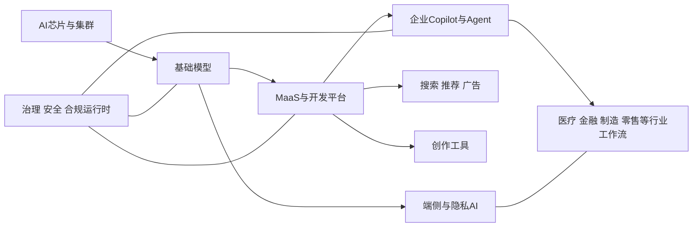

高想象空间方向需要单独看，因为它们不一定在2025年就是最大收入池，但很可能决定2028年前后的新平台格局。下表给出3到5年机会路径和风险点。

| 高想象空间方向 | 未来三到五年机会路径 | 关键风险点 |
|---|---|---|
| 企业Agent操作系统 | 从“问答/摘要”升级到“可验证执行”：先接知识库和工单，再接ERP/CRM/财务/采购，最后做到跨系统多步骤执行和审计；微软Copilot Studio、OpenAI Operator、Google Agent相关能力都在往这条路线走。citeturn34search12turn36search3turn32search0turn44view1 | 幻觉导致错误执行、权限边界不清、ROI依赖流程重构而不是单点试点、与现有系统集成成本高。citeturn43view0turn44view1turn39search2 |
| 端侧个人AI | 从“写作/通知总结”走向“个人语境操作系统”：设备端持续记忆、跨App上下文、图像/语音理解与私密数据协同；Apple Intelligence、Gemini on Android、Copilot+ PC、HarmonyOS原生智能都在铺路。citeturn15search0turn15search4turn32search0turn12search10turn10search0 | 用户价值必须足够高，才能覆盖硬件升级成本；同时面临隐私、功耗、模型体积和NPU生态碎片化问题。citeturn43view4turn15search1turn43view3 |
| 主权/私有化AI全栈 | 政企、金融、公共部门和受监管行业会持续要求“本地算力 + 本地模型 + 本地治理”；Huawei、Google Sovereign AI、Microsoft sovereign cloud、Alibaba 国内云栈都在受益。citeturn10search7turn10search2turn32search0turn34search0turn8search1 | 资本强度极高，芯片和能源约束大；若缺少生态与软件伙伴，容易沦为昂贵但低利用率的算力资产。citeturn43view0turn42view0turn17search2 |
| 机器人与物理AI | 机会不在泛化“人形”概念，而在受控环境下的物料搬运、巡检、仓储、工业质检、自动驾驶与协作机器人；百度Apollo、Huawei工业场景、字节Seed的机器人研究都说明大厂在提前布局。citeturn21search1turn10search4turn25search2turn40search0 | 物理世界数据昂贵、可靠性要求极高、责任界定难；很多估值建立在远期叙事上，而非近端现金流。citeturn40search2turn39search1 |
| AI治理与安全运行时 | 随着EU AI Act、NIST AI RMF 和企业TRiSM落地，未来会出现“模型护栏、数据溯源、策略执行、运行时审计、自动合规”一体化平台；这会成为进入大型行业客户的前提。citeturn39search1turn39search2turn39search0 | 市场教育周期长、预算归属分散、短期不如前台应用“好讲故事”；但若法规收紧，反而会迅速放大需求。citeturn39search1turn39search0 |

## 结论与建议优先级

对于企业高管与产品/投资决策者，我的结论非常明确：**不要把资源平均撒在“所有AI方向”上，而要按现金流距离、系统集成深度和差异化护城河做优先级。** 过去两年的公开事实已经足够说明，单纯押注“更大的通用模型”并不是大多数企业的最优策略；真正可持续的竞争优势来自四件事：专有数据、既有分发、系统接入能力、以及可控的推理成本。这个判断既来自行业报告，也来自大厂的产品与资本开支行为。citeturn43view0turn44view0turn32search0turn12search0turn42view0turn17search2

如果要给出**优先级清单**，我会这样排序：

| 优先级 | 建议方向 | 为什么现在做 | 不建议重仓的前提 |
|---|---|---|---|
| 高 | 客服、搜索增强、推荐/广告优化、开发者工具、企业知识助理 | 这些方向离现金流最近、验证最充分、改造成本相对可控，且已有大量官方采用/收入信号。citeturn44view0turn34search13turn30view0turn24search1turn21search1 | 如果公司没有数据资产、流量入口或现有软件分发能力，只做“又一个前台AI应用” |
| 高 | 推理成本优化、模型路由、数据治理、安全与权限控制 | 未来AI预算的核心不在“试一次”，而在“长期用得起、用得稳、审得过”。citeturn43view0turn39search2turn16search5turn15search1 | 如果组织还停留在零散试点，不愿投入数据与流程治理 |
| 中高 | 行业Agent与工作流自动化 | 大概率是下一阶段企业AI最大增量；壁垒高于通用Copilot，因为需要系统接入和流程重构。citeturn44view1turn34search12turn36search3 | 如果无法拿到业务流程负责人支持，或没有接口/权限治理能力 |
| 中 | 端侧/私有化AI | 对高隐私、高频、低时延场景价值大，且在中国与受监管行业有明显战略意义。citeturn15search0turn10search7turn43view3 | 如果组织没有终端、OS、硬件协同能力，或用户场景不够高频 |
| 选择性布局 | 主权AI栈、机器人/物理AI、科学AI | 这些方向可能产生未来巨大平台价值，但建设周期长、资本密度高、技术不确定性也高。citeturn10search7turn40search0turn40search2 | 如果投资目标要求12到24个月内明确财务回报 |

更具体地说，**企业经营侧**最应该做的是：先从“ROI可测”的场景切入，例如客服、研发辅助、搜索/知识助理、销售支持和专业文书，再把这些能力逐步接入流程与系统，最后再谈Agent自治。**投资侧**则应把注意力从“又一个模型公司”转向“控制关键约束条件的公司”，也就是拥有算力、渠道、行业数据、系统接入权或治理能力的公司。Gartner 对POC失效率的提醒意味着，下一阶段的赢家不是讲故事最多的人，而是把AI嵌进组织系统最深、把成本曲线拉得最低的人。citeturn43view0turn44view1turn34search12turn32search0turn17search2

## 主要参考来源

公司官方与一手材料主要包括：OpenAI 产品与融资公告、Google Blog 与 Alphabet IR、Microsoft 官方博客与投资者关系、Meta Newsroom 与 IR、Amazon About/AWS/IR、Apple Newsroom、百度投资者关系、阿里巴巴集团公告、腾讯投资者关系、华为新闻与年报、火山引擎与字节 Seed 官方页面。citeturn36search0turn14search7turn30view1turn32search0turn12search0turn34search13turn42view0turn17search2turn15search0turn21search1turn8search1turn24search1turn10search7turn25search2

权威行业与监管基准主要包括：Gartner《2025年GenAI支出预测》、IDC《全球AI和生成式AI支出指南》与《边缘计算支出预测》、McKinsey《生成式AI的经济潜力》和《2025年AI现状调查》、Omdia/Canalys 对 AI PC 与终端趋势的公开洞察、IFR《World Robotics 2025》新闻稿、EU AI Act 正式文本、NIST AI Risk Management Framework，以及 Gartner 对 AI TRiSM 市场的公开摘要。citeturn43view0turn43view1turn43view3turn44view0turn44view1turn43view4turn40search0turn39search1turn39search2turn39search0


# 浏览器自动化方案深度对比报告

## 执行摘要

这几类方案并不是同一层级的替代品。**Chrome 远程调试模式**本质上是“协议入口”，提供的是 Chromium/Chrome 暴露出的 CDP 连接能力；**Playwright core、Puppeteer、Selenium**是面向开发者的自动化库或框架；**Microsoft Playwright CLI、Vercel Labs Agent Browser、browser-use CLI/库**则更偏“面向 AI 代理或命令行操作员的上层封装”。如果把它们当作同类产品横比，容易得出失真的结论。更合理的理解是：它们覆盖了从“低层协议”到“高层 agent 工作流”的不同抽象层。citeturn7search1turn28view4turn22search2turn6view1turn20search4turn11view5

若你的核心目标是**通用、可维护、跨浏览器的工程化自动化**，我更倾向于把 **Playwright core** 作为首选基线：它支持 Chromium、Firefox、WebKit，具备浏览器上下文隔离、自动等待、现代 locator、网络拦截、下载/上传、Trace Viewer、视频与截图等成熟能力；如果是大规模企业环境、跨语言团队或已有 Grid 基础设施，**Selenium** 依然最稳，尤其在标准化、组织兼容性与分布式执行方面优势明显。citeturn28view3turn24search2turn18search1turn18search8turn18search10turn18search18turn32search0turn32search1turn20search3turn20search11turn20search1turn26search0

若你的核心目标是**让 coding agent 以低 token 开销操控浏览器**，三者分化很明显。**Playwright CLI**胜在与 Playwright 生态天然衔接，支持 snapshot/ref、生成 locator、文件拖放、视频/trace、可视化 dashboard，以及启动或附着到现有浏览器；**agent-browser**胜在 100% 原生 Rust、直接 CDP、紧凑文本输出、基于无障碍树的 ref、HAR/网络路由、流式 viewport、dashboard、doctor，以及接 Browserbase/Browserless/Browser Use/Kernel 等云提供商；**browser-use**则更偏“LLM 驱动任务执行”与“云浏览器/反检测/代理/CAPTCHA/配置托管”，开源库与 CLI 都很活跃，且其低层 Actor API 刻意做成“像 Playwright，但更接近 CDP 子集”的迁移体验。citeturn4view0turn4view1turn11view0turn29view2turn23search10turn23search11turn23search6turn22search12turn31view1turn31view0turn6view1turn15view0turn5search4turn5search11

如果你只需要**最快速复用“已经登录好的本机 Chrome”**，例如调试现有 Web 会话、复用 Cookie、接管 Electron/WebView2 或做临时脚本，**Chrome 远程调试模式**的成本最低、启动也最“热”，但它的安全边界最弱、抽象最少、需要自己解决等待、容错、定位、日志与可维护性；而且从 **Chrome 136** 开始，`--remote-debugging-port`/`--remote-debugging-pipe` 对默认用户数据目录不再生效，必须配合 `--user-data-dir` 指向非默认目录，这是 Chrome 官方针对 Cookie 窃取风险收紧后的行为变化。citeturn21search0turn21search4turn25search0turn25search10turn8search9turn8search13turn33search4

对你给定的基线环境还要特别提醒两点：**Playwright CLI 明确要求 Node.js 18+**，与你的假设一致；但**Puppeteer 25 当前官方系统要求是 Node 22.12+**，**Selenium JavaScript 绑定当前要求 Node 20+**，因此若必须严格锁定 **Node 18.x**，就不应直接采用它们的“最新 JavaScript 绑定”组合，除非你接受降版本，或者在 Selenium/Playwright 中改用 Python、Java、.NET 等绑定。**browser-use CLI/库需要 Python 3.11+**；**agent-browser** 的“从源码构建”需要 Node 24+、pnpm 11+ 和 Rust，但其运行时 daemon 已不依赖 Node.js。citeturn29view4turn34search1turn34search2turn29view3turn29view2

## 研究范围与方法

本报告以 **Windows 10/11** 与 **Ubuntu 22.04** 作为目标平台，以你给定的 **Node.js 18.x** 作为默认 JavaScript 运行时假设；凡与此假设不一致的方案，我都单独标注。依据主要来自官方仓库、官方文档、官方发布说明，以及最近两年内与稳定性、安全性、性能设计有关的 issue/release 说明；中文官方文档与中文官方安全公告在能用时优先使用。citeturn29view4turn29view3turn34search0turn20search8turn21search0

评价时我把目标拆成三类：**协议层**（Chrome 远程调试/CDP）、**开发者库层**（Playwright core、Puppeteer、Selenium）和 **agent/CLI 层**（Playwright CLI、agent-browser、browser-use）。因此后文评分是“在当前维度下的工程判断”，不是“谁绝对更强”。例如：在“安全边界”上，原生 CDP 接口天然不如受控框架；在“抽象成本”上，原生 CDP 又会更低。citeturn7search1turn25search0turn20search4turn11view5turn28view4turn22search2turn31view0

## 架构与运行模式

先把关系图画清楚，比直接列优缺点更重要。Playwright CLI、agent-browser、browser-use 其实都在尝试解决同一个问题：**让“浏览器自动化”更适合 AI agent 或 shell 工作流**；只是它们选择的底座不同。Playwright CLI 站在 Playwright 能力之上，强调 token-efficient 的 CLI + SKILL；agent-browser 直接走 CDP，采用 Rust CLI + Rust daemon；browser-use 的 Actor/Browser/CLI 也转向 direct CDP，并把云浏览器、代理、CAPTCHA、配置托管纳入一体化体验。citeturn4view0turn29view2turn31view1turn6view1turn5search4

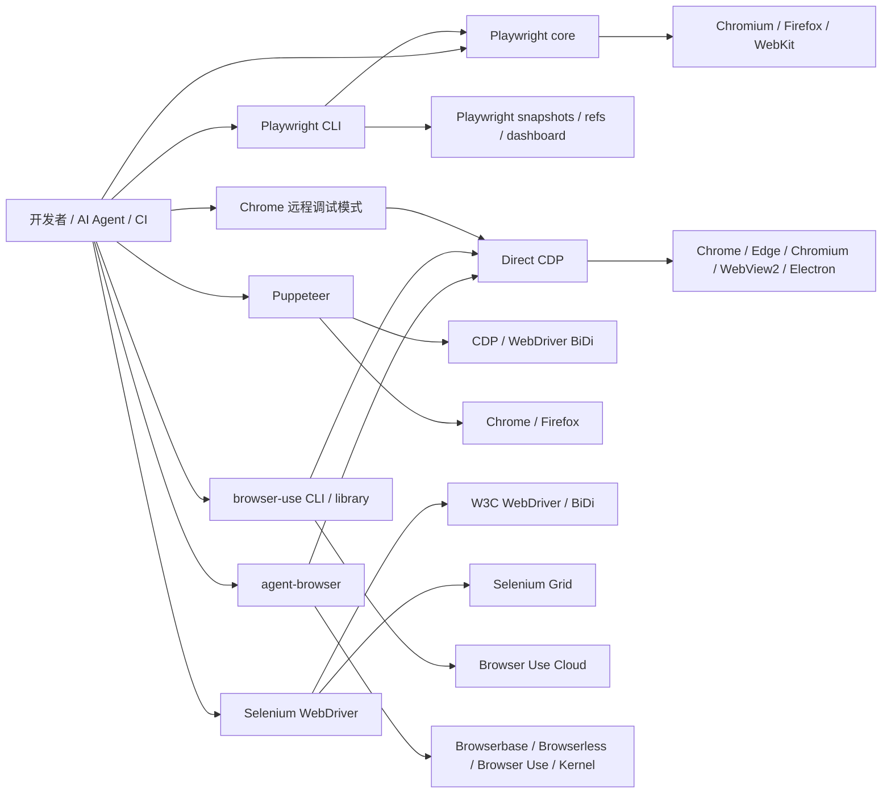

**Playwright CLI** 的核心设计点是：它不是把完整页面树塞进大模型上下文，而是通过命令 + snapshot/ref 的方式，让 agent 只处理必要信息，因此强调 token efficiency。它要求 Node 18+，提供 `open/goto/click/fill/upload/drop/snapshot/eval/highlight/generate-locator` 等命令，支持会话列表、dashboard、save video、save trace、console/network 输出，并支持通过 extension 或 CDP 附着到现有浏览器；配置项还明确列出了 `chrome / firefox / webkit / msedge` 等浏览器取值。citeturn4view0turn4view1turn30view1turn30view2turn11view0

**agent-browser** 的架构已经完全偏离“Node + Playwright daemon”路线。官方当前文档明确说明：它默认是 **100% native Rust**，采用 **Rust CLI + Rust daemon + direct CDP**，daemon 会在首次命令后驻留，以减少后续操作开销；典型工作流是 `snapshot` 先取带 ref 的无障碍树，再对 `@e1/@e2` 操作。它支持 Chrome/Chromium，也引入了 **Lightpanda** 作为另一引擎；支持本地浏览器、自动连接到运行中的 Chrome、以及 Browserbase、Browserless、Browser Use、Kernel 等云提供商。citeturn29view2turn23search9turn23search10turn22search1turn22search12turn23search6

**Chrome 远程调试模式** 则最“原教旨”。浏览器以 `--remote-debugging-port` 暴露 HTTP/WebSocket 端点后，客户端直接对 **CDP** 发消息。CDP 覆盖 DOM、Runtime、Network、Fetch、Page、Accessibility、Performance、Memory、Debugger 等域，所以理论上你能得到极强的控制力；但它只给你协议能力，不给你 Playwright 的 auto-wait、Puppeteer/Playwright 的高层 locator，也不负责失败恢复、重试或测试语义。更重要的是，Chrome 官方已因 Cookie 窃取风险在 Chrome 136 改变远程调试开关行为，要求显式使用非默认 `--user-data-dir`。citeturn7search1turn8search9turn8search13turn33search2turn33search4turn21search0turn21search4

**browser-use** 必须拆成两层看。开源库层面，它是以 **Agent + Browser/Actor** 为核心的 Python 优先方案，Actor 官方明确说其 API “尽量像 Playwright”，但本质是 **built on CDP, not Playwright**，而且是子集；CLI 层面，它采用多会话 daemon 架构，默认 headless Chromium，也可连接真实 Chrome profile、已有 CDP、或 Browser Use Cloud。其显著差异不是“命令多”，而是把 **LLM 任务执行、云基础设施、代理、反检测与配置托管**结合得更紧。citeturn6view1turn31view1turn31view0turn31view2turn5search4turn5search5

**Playwright core**、**Puppeteer**、**Selenium** 则属于更传统的开发者库范式。Playwright core 用一个 API 驱动 Chromium、Firefox、WebKit，并通过 BrowserContext 做低开销隔离；Puppeteer 当前是用高层 API 控制 Chrome 或 Firefox，底层可以是 CDP 或 WebDriver BiDi，在 Chrome 上仍以 CDP 为默认；Selenium 则围绕 W3C WebDriver 和正在推进中的 BiDi 演进，强调浏览器与语言绑定的可互换性、远程执行与 Grid 扩展。citeturn24search4turn24search2turn11view5turn19search14turn20search4turn20search1turn27search8

## 关键维度对比表

评分说明：**5 = 同类强项；4 = 较强；3 = 可用；2 = 明显短板；1 = 不建议作为该维度主选。** 这些分数是基于后文事实与官方资料做的工程判断，不代表官方结论。

| 方案 | 架构适配度 | 安装轻量性 | API/脚本易用性 | 功能广度 | 性能上限 | 稳定性 | 调试与可观测性 | 安全控制 | 扩展/生态 | 迁移成本 |
|---|---:|---:|---:|---:|---:|---:|---:|---:|---:|---:|
| Playwright CLI | 4 | 4 | 4 | 4 | 4 | 4 | 5 | 4 | 4 | 5 |
| agent-browser | 5 | 4 | 4 | 4 | 5 | 4 | 5 | 4 | 4 | 3 |
| Chrome 远程调试模式 | 2 | 5 | 2 | 5 | 5 | 2 | 3 | 1 | 5 | 2 |
| browser-use | 5 | 3 | 4 | 4 | 4 | 3 | 3 | 3 | 4 | 3 |
| Playwright core | 5 | 4 | 5 | 5 | 4 | 5 | 5 | 4 | 5 | 4 |
| Puppeteer | 4 | 3 | 4 | 4 | 4 | 4 | 4 | 3 | 5 | 4 |
| Selenium | 4 | 4 | 3 | 4 | 3 | 5 | 4 | 4 | 5 | 3 |

| 方案 | 运行模式与依赖 | 功能特征摘要 | 已知边界 |
|---|---|---|---|
| Playwright CLI | Node 18+；CLI + snapshot/ref + 会话/附着模式；可保存视频与 trace。citeturn29view4turn30view1turn11view0 | 适合 coding agent；支持 `upload/drop/generate-locator/highlight/dashboard`；可附着现有 Chrome/Edge，也可按配置选择 Firefox/WebKit。citeturn4view1turn30view2turn30view1 | 更偏 agent/shell，而不是完整测试 runner；复杂并发/分布式仍需借 Playwright Test 或外部编排。citeturn28view4turn18search2turn18search6 |
| agent-browser | 原生 Rust CLI + Rust daemon；direct CDP；支持 Chrome、Lightpanda、本地/云 provider。citeturn29view2turn23search0turn22search12 | 强项是 ref + 无障碍树、紧凑文本、dashboard、stream、HAR、network route、doctor。citeturn23search10turn23search11turn23search6turn23search4turn17search12 | 以 Chrome/CDP 生态为中心；跨浏览器标准化不如 Playwright/Selenium。citeturn22search3turn20search4turn24search4 |
| Chrome 远程调试模式 | 直接暴露 CDP 端口；任何支持 CDP 的客户端都可接入。citeturn21search1turn19search2turn25search0 | 协议能力最全：DOM、Runtime、Network、Fetch、A11y、Performance、Memory、Debugger 都可直达。citeturn33search2turn8search9turn8search13turn33search4turn33search11turn33search14turn33search12 | 安全风险最高；Chrome 136 起必须与非默认 `--user-data-dir` 搭配；协议自身不提供等待/容错/工程抽象。citeturn21search0turn21search4turn33search9 |
| browser-use | Python 3.11+；库 + CLI + Cloud；CLI 为多会话 daemon；可接真实 Chrome/CDP/云浏览器。citeturn29view3turn31view0turn31view1turn31view2 | 强项是 LLM agent 闭环、云浏览器、代理、反检测、任务平台；开源库支持 Agent、Browser、Tools、自定义动作。citeturn6view0turn5search4turn5search5turn5search11 | 当前 CLI/Actor 以 Chrome/CDP 为中心；文档明确说明不是 Playwright，且 API 只是相似子集。citeturn6view1turn16view0 |
| Playwright core | Node 项目安装 `playwright`；一套 API 驱动 Chromium/Firefox/WebKit；多语言绑定。citeturn24search3turn24search4turn24search1 | 自动等待、Context 隔离、locator、网络路由、下载/上传、trace/video/screenshot、调试器/UI mode 都很成熟。citeturn28view3turn18search1turn18search8turn18search10turn18search18turn32search0turn32search1 | 如果主要只是短平快的 Chrome 脚本，抽象层可能高于实际需要。citeturn24search4turn24search3 |
| Puppeteer | 当前官方要求 Node 22.12+；默认下载 Chrome for Testing，也支持 Firefox。citeturn34search1turn34search9turn19search10 | Chrome 优先、Node 体验好、连接现有浏览器方便；请求拦截、截图、PDF、locator、BiDi 支持都在推进。citeturn11view5turn19search0turn19search6turn8search2turn19search14 | 文件下载当前官方仍说“不是程序化一等能力”；跨浏览器与测试能力整体不如 Playwright 全栈顺手。citeturn19search4turn24search4 |
| Selenium | JavaScript 绑定当前要求 Node 20+；默认使用 Selenium Manager 自动管理 driver/browser；可上 Grid。citeturn34search2turn26search0turn20search11 | 最大强项是标准化、跨浏览器、跨语言、Grid 分布式、IDE 录制回放、BiDi 日志/网络。citeturn20search4turn20search3turn20search6turn20search9turn20search13 | API 仍相对冗长；下载进度不暴露，官方甚至将下载测试列为 discouraged。citeturn27search2turn27search6 |

**安装与依赖。** 在你给定的 Node 18 基线上，最“匹配”的是 Playwright CLI；Playwright core 本报告按 Node 项目场景比较，但官方首页在当前引文中并未直接给出 Node 下限。Puppeteer 25 的官方系统要求已经提升到 Node 22.12+，最新 Selenium JavaScript 绑定要求 Node 20+，这意味着它们与“严格 Node 18”存在版本门槛；browser-use 则转向 Python 3.11+，agent-browser 的源码构建需要 Node 24+/pnpm 11+/Rust，但 daemon 本身不依赖 Node。citeturn29view4turn34search1turn34search2turn29view3turn29view2

**API 与脚本易用性。** 如果按“人类开发者写脚本”的体验排，Playwright core 仍是最均衡的：locator、auto-wait、BrowserContext、下载/上传与 network mock 的贴合度最高。Puppeteer 紧随其后，尤其适合 Chrome-first 的 JavaScript 团队。Selenium 的问题不在能力不足，而在等待、句柄切换、下载等场景中更容易暴露“经典 WebDriver 心智负担”。如果按“AI agent / shell”体验排，agent-browser、Playwright CLI、browser-use 更自然，因为它们专门针对 snapshot/ref、紧凑输出、驻留会话、技能发现等模式做了设计。citeturn32search6turn24search2turn18search13turn19search12turn19search0turn27search2turn27search1turn23search10turn4view0turn31view1

**功能特性。** Playwright core 在“多浏览器、headless/headed、模拟移动设备、网络拦截、下载/上传、trace/video/screenshot、角色/标签/title/testid 等现代定位方式”方面最完整；Playwright CLI 把其中一部分包装成 agent 友好的命令，并额外提供 highlight、generate-locator、dashboard、attach/detach。agent-browser 在 Chrome/CDP 世界里功能也非常全：无障碍树 snapshot、传统 selector 与语义 locator 并存，支持 upload/download、network route、HAR、pdf、stream、dashboard。browser-use 的开源 CLI 重点是 `state`、索引操作、cookies/tabs、eval、Python 持久会话与 cloud API；其云能力明显超过开源 CLI。Puppeteer 有 request interception、截图、PDF、locator、Firefox/BiDi，但官方仍明确说下载不是程序化一等能力。Selenium 则通过 WebDriver、BiDi、Grid 与 IDE 覆盖“标准执行、网络/日志、分布式、录制回放”，但不是以现代 a11y-first locator 为卖点。原生 CDP 的能力面极广，但都要你自己封装。citeturn28view3turn24search5turn18search13turn18search18turn32search0turn32search1turn4view1turn23search4turn23search6turn23search11turn31view3turn5search5turn19search0turn19search4turn8search2turn20search6turn20search9turn20search11turn8search9turn8search13turn33search4

**性能、稳定性与错误恢复。** 这部分没有一套能完全公平覆盖七类方案的官方统一基准，所以更适合从架构判断。原生 CDP 与 direct-CDP CLI 的上限通常最高，因为中间层少；agent-browser 明确诉求就是 Rust + direct CDP，browser-use CLI 和 agent-browser 都通过驻留 daemon 把冷启动成本摊平，browser-use 还公开给出了约 50ms 的命令延迟说法。Playwright core/Playwright Test 的强项不在“最薄”，而在**稳定**：auto-wait、context isolation、trace、现代 locator 组合能显著压制 flaky 测试。Selenium 的稳定性更多依赖 waits、BiDi 与 Grid 观测配置。Playwright CLI 和 browser-use 的近期 release/issue 也能看出它们仍在快速修复 daemon、进程残留、依赖与连接类问题，这既说明活跃，也说明成熟度仍在上升。citeturn29view2turn31view1turn28view3turn24search14turn27search2turn20search15turn11view0turn16view0

**调试、日志、安全与权限。** Playwright 生态有最成熟的可观测性：UI Mode、Inspector、Trace Viewer、视频/截图、console/network 信息都比较体系化。agent-browser 的优势是本地 dashboard、viewport streaming、doctor、profiler；browser-use CLI 有 `doctor/setup/cli.log` 与 session 状态文件，问题排查路径清晰。原生 CDP 则给了你最底层的 Debugger、DOMDebugger、Performance、Memory 等域，但需要自己做采样与聚合。安全层面，最大的红线在 **Chrome 远程调试**：Chrome 官方已经把它作为攻击者窃取 Cookie 的通道之一来收紧；如果你真的要用，应该只对本机开放、使用临时 `user-data-dir`、避免默认 profile，并尽量让上层框架代你接管。citeturn18search10turn18search11turn18search0turn18search4turn23search6turn23search11turn17search4turn17search12turn29view3turn31view0turn33search12turn33search7turn33search11turn33search14turn21search0turn21search4

**可扩展性、社区与许可。** 社区成熟度看，Puppeteer、browser-use、Playwright 三个仓库当前都在 9 万星左右，Selenium 与 agent-browser 在 3 万级，Playwright CLI 约 1 万级；最近发布节奏上，这几个项目都依然活跃。许可方面，**Playwright core / Playwright CLI / agent-browser / Puppeteer / Selenium** 都是 **Apache-2.0**；**browser-use 开源库**是 **MIT**，但其云服务另有服务条款与计费。浏览器云能力方面，browser-use 与 agent-browser 都明显更积极；Selenium 则把扩展性押在标准、语言绑定与 Grid；Playwright 押在完整生态与跨浏览器一致性。citeturn12view4turn12view3turn15view4turn12view0turn12view1turn14view0turn11view0turn11view1turn16view0turn10search4turn11view3turn10search3turn12view3turn11view2turn14view0turn15view0

## 典型示例代码

以下示例尽量保持**短、可直接改造**。由于你的默认环境是 Node 18.x，我对与该前提不一致的方案会显式标注。

**Playwright CLI**  
运行环境：Node.js 18+，全局安装 `@playwright/cli`。官方定位就是给 coding agent 和 CLI 工作流使用。citeturn29view4turn4view1

```bash
npm install -g @playwright/cli@latest

# 打开页面并获取元素引用快照
playwright-cli open https://example.com --headed
playwright-cli snapshot

# 假设快照里按钮是 e15
playwright-cli click e15
playwright-cli screenshot
playwright-cli close
```

**Vercel Labs agent-browser**  
运行环境：推荐直接安装二进制/包；源码构建才需要 Node.js 24+、pnpm 11+ 和 Rust。daemon 本身不依赖 Node。citeturn29view2turn23search10

```bash
npm install -g agent-browser
agent-browser install

agent-browser open https://example.com
agent-browser snapshot        # 获取带 @eN 的无障碍树
agent-browser click @e2
agent-browser screenshot page.png
agent-browser close
```

```bash
# 连接到已有 Chrome 的 CDP 端口，并做一次网络拦截
agent-browser --cdp 9222 open https://example.com
agent-browser network route "*" --abort --resource-type script
agent-browser reload
agent-browser network requests
```

**Chrome 远程调试模式**  
运行环境：Chrome/Chromium；建议使用临时 `user-data-dir`。Chrome 136 起不应对默认 profile 开远程调试。citeturn21search0turn21search4turn21search1

```bash
# Windows
chrome.exe --remote-debugging-port=9222 --user-data-dir=C:\tmp\chrome-debug
```

```js
// Node.js：用 Puppeteer 连接已开启远程调试的 Chrome
// 说明：Puppeteer 25 当前官方要求 Node 22.12+；若你严格锁定 Node 18，请改用旧版或换 Playwright/Python。 
import puppeteer from 'puppeteer';

const browser = await puppeteer.connect({ browserURL: 'http://127.0.0.1:9222' });
const page = (await browser.pages())[0] ?? await browser.newPage();

await page.goto('https://example.com');
console.log(await page.title());
await browser.disconnect();
```

**browser-use**  
运行环境：Python 3.11+。开源库为 MIT；CLI/库都支持接管真实 Chrome 或远程 CDP。citeturn29view3turn15view0turn31view2

```python
# pip/uv 环境，Python 3.11+
from browser_use import Agent, ChatBrowserUse
import asyncio

async def main():
    agent = Agent(
        task="打开 example.com，读取页面标题，并说明页面上最重要的可点击元素",
        llm=ChatBrowserUse(),
    )
    await agent.run()

asyncio.run(main())
```

```bash
# CLI 版：索引式交互
browser-use open https://example.com
browser-use state
browser-use click 0
browser-use screenshot page.png
browser-use close
```

**Puppeteer**  
运行环境：当前最新官方要求 Node 22.12+；安装 `puppeteer` 会自动下载 Chrome for Testing。citeturn34search1turn34search9

```js
import puppeteer from 'puppeteer';

const browser = await puppeteer.launch();
const page = await browser.newPage();

await page.setRequestInterception(true);
page.on('request', req => {
  if (req.isInterceptResolutionHandled()) return;
  if (req.url().endsWith('.png') || req.url().endsWith('.jpg')) req.abort();
  else req.continue();
});

await page.goto('https://example.com');
await page.screenshot({ path: 'example.png' });
await browser.close();
```

**Selenium**  
运行环境：这里给 JavaScript 绑定示例；当前官方要求 Node 20+。如果必须保持 Node 18，建议改用 Python/Java/.NET 绑定。citeturn34search2turn26search0

```js
const { Builder, Browser, By } = require('selenium-webdriver');

(async function main() {
  let driver = await new Builder().forBrowser(Browser.CHROME).build();
  try {
    await driver.get('https://www.selenium.dev');
    console.log(await driver.getTitle());
  } finally {
    await driver.quit();
  }
})();
```

```js
// 文件上传：Selenium 官方推荐直接 sendKeys 到 input[type=file]
const { Builder, By } = require('selenium-webdriver');

(async function upload() {
  let driver = await new Builder().forBrowser('chrome').build();
  try {
    await driver.get('https://the-internet.herokuapp.com/upload');
    await driver.findElement(By.css('input[type=file]')).sendKeys('/absolute/path/to/file.png');
    await driver.findElement(By.id('file-submit')).click();
  } finally {
    await driver.quit();
  }
})();
```

**Playwright core**  
运行环境：Node 项目安装 `playwright`；官方文档将其定位为通用浏览器自动化库。citeturn24search3turn24search4

```ts
import { chromium } from 'playwright';

const browser = await chromium.launch();
const context = await browser.newContext();
const page = await context.newPage();

await context.route('**/api/**', route =>
  route.fulfill({ status: 200, body: JSON.stringify({ ok: true }) })
);

await page.goto('https://example.com');
console.log(await page.title());

await browser.close();
```

```ts
import { chromium } from 'playwright';
import path from 'node:path';

const browser = await chromium.launch({ downloadsPath: './downloads' });
const page = await browser.newPage();

await page.goto('https://example.com/upload');
await page.getByLabel('Upload file').setInputFiles(path.join(process.cwd(), 'demo.pdf'));

await browser.close();
```

## 限制故障与排查

**Playwright CLI 的典型问题**主要集中在“附着模式”和“长期会话”。官方 release 已记录过长期 CLI/agent 会话中的高 CPU/内存与残留 Chrome 进程问题，后续版本已针对 orphaned processes、extension 连接失败、空浏览器列表等做过修复；此外，`attach` 现在要求显式目标，浏览器扩展缺失时也会给出提示。实践上，排查顺序建议是：先升级到最新 CLI；再用 `list / show / close-all / kill-all` 清会话；最后检查 `--cdp` 或 `--extension` 连接链路。citeturn11view0turn4view1

**agent-browser** 的排查路径最完整。官方已经把 `doctor`、dashboard、streaming、profiler 都做成一等能力；安装阶段在 Linux 可用 `agent-browser install --with-deps`，运行阶段可先看 dashboard 的 viewport/活动流/console，再决定是否启用 profiler。它对 snapshot 的边界也写得很清楚：阻止读取无障碍树的 cross-origin iframe 会被省略，需要显式切 frame 处理。citeturn17search12turn23search6turn17search8turn17search4turn22search4turn29view1

**browser-use** 的常见问题更偏运行环境与 daemon 生命周期。官方文档专门列了 Windows 故障：ARM64 Windows 需安装 x64 Python、PATH 生效问题需要重开终端、`Failed to start daemon` 要清理僵尸 Python 进程与虚拟环境；CLI 文档也给出了 `~/.browser-use/` 下的 socket、pid、state、cli.log 路径。另一方面，官方 README 直接提醒 Chrome 很吃内存、很多 agent 并行难管理，所以生产侧更推荐其 Cloud API 去处理内存、代理、并行与指纹。citeturn29view3turn31view0turn15view0

**Puppeteer** 的典型坑在请求拦截与下载。官方明确说一旦开启 request interception，每个请求都必须被 `continue/respond/abort` 之一处理，否则会挂起；同时它也明确说“当前不提供程序化处理下载的方式”，因此如果你的业务大量依赖下载监控，Puppeteer 不是最舒服的主框架。另一个现实问题是：最新版本系统要求 Node 22.12+，会直接影响你当前的 Node 18 假设。citeturn19search0turn19search11turn19search4turn34search1

**Selenium** 的典型坑是“等待策略不当导致 flaky”。官方直言 race condition 是自动化最常见挑战之一，并明确警告不要混用隐式等待与显式等待；下载测试也被列入 discouraged，因为 API 不暴露下载进度。更可取的做法是：用 WebDriver 处理登录/拿 Cookie，再交给 HTTP 客户端下载；同时在远程环境中打开 Grid observability 和 BiDi logging/network 能力。citeturn27search2turn27search5turn27search6turn20search15turn20search13turn20search9

**Chrome 远程调试模式** 最大的问题不是“会不会连”，而是“默认太危险”。Chrome 官方已经把通过远程调试窃取 Cookie 视为真实攻击路径，并从 Chrome 136 开始要求配合非默认 `user-data-dir` 使用。排查这一路线时，第一步应确认是否用了临时 profile；第二步确认端口只暴露在本机；第三步用 `/json/version` 或客户端库的 `connect/browserURL` 验证端点；第四步再考虑上层库连接质量。若你发现自己需要自行复刻等待、重试、selector 升级、日志归档，那么往往已经到了该换 Playwright/Puppeteer/agent-browser 的时候。citeturn21search0turn21search4turn19search2turn25search1turn25search0

## 性能评测设计

目前我没有找到**同一硬件、同一站点集、同一版本窗口**下，能同时覆盖 **Playwright CLI、agent-browser、原生 CDP、browser-use、Puppeteer、Selenium、Playwright core** 的权威官方统一基准。因此这类比较更适合做**可复现实验设计**，而不是直接相信零散“XX 更快”的宣传数字。现有官方材料能确定的是：agent-browser 与 browser-use CLI 都采用了驻留 daemon／持久会话以减少每步冷启动开销；agent-browser 与 browser-use 都强调 direct CDP；Playwright Test 明确支持 workers 与 sharding；Selenium Grid 明确支持多机分布式；browser-use Cloud 和 agent-browser providers 能把浏览器基础设施外包出去。citeturn29view2turn31view1turn18search2turn18search6turn20search3turn20search11turn5search5turn22search12

我建议测试集至少拆成四类工作负载。**冷启动自动化**：从空进程启动浏览器，访问 10 个轻页面，记录首次可操作时间；**热会话自动化**：连接到已运行且已登录的浏览器，重复执行 100 次“小步骤操作”（click/fill/get text）；**重交互流程**：带上传、下载、网络 mock/HAR、两次新开 tab；**并发流程**：4、8、16 路会话同时跑同一任务，观察成功率与资源曲线。这样才能把“协议成本”“浏览器冷启动”“框架等待策略”“云端基础设施延迟”分开看。citeturn31view1turn23search11turn18search1turn32search1turn23search4turn20search11

指标建议最少包含：**冷启动时间**、**首步完成时间**、**单步 P50/P95 延迟**、**端到端成功率**、**flake rate**、**峰值 RSS/平均 RSS**、**CPU 时间**、**网络请求数与失败数**、**日志/trace 可追溯性**。如果要比较 agent-first CLI，还应额外采集 **snapshot/输出字符数** 以及 **单位任务 token 消耗**，因为 Playwright CLI、agent-browser、browser-use 都把“减少上下文负担”作为设计目标之一。citeturn4view0turn22search2turn31view1

可复现做法上，建议固定：**相同 Chrome/Edge 稳定版本或 Chrome for Testing 版本**、**相同 viewport**、**相同代理与网络节流条件**、**相同测试站点**、**相同 CPU/内存配额**。若涉及原生 CDP，请把“协议客户端”也固定成同一个（例如统一用 Playwright `connectOverCDP` 或 Puppeteer `connect`）以避免把客户端库差异混进“远程调试模式”本身。Chrome/Chromium 的网络节流、下载状态、性能与内存指标都可以从 CDP 的 Network、Browser、Performance、Memory 域采集。citeturn21search3turn25search0turn25search1turn33search1turn33search6turn33search11turn33search14

## 迁移建议与结论

| 场景 | 优先建议 |
|---|---|
| 你已经在用 Playwright，希望让 Claude Code / Copilot / Codex 低 token 地操作浏览器 | **Playwright CLI** |
| 你要做 Chrome-centric 的 agent 浏览、网络路由、HAR、可视化 dashboard、pair browsing | **agent-browser** |
| 你要做“任务型”AI 浏览，且需要云浏览器、代理、反检测、CAPTCHA、托管基础设施 | **browser-use** |
| 你要最快复用本机已登录的 Chrome / Electron / WebView2 会话 | **Chrome 远程调试模式**，但最好通过 Playwright/Puppeteer/agent-browser 接入 |
| 你要写长期可维护、跨浏览器、跨团队复用的自动化代码 | **Playwright core** |
| 你是 Node 团队，Chrome 优先，已有 Puppeteer 资产或依赖 its tooling | **Puppeteer** |
| 你是企业多语言、多浏览器、多机器并发、已有 Selenium 资产与 Grid | **Selenium** |

从**迁移成本**看，最平滑的路径通常有四条。其一，**Playwright core ⇄ Playwright CLI**：同一家生态、同一套核心能力，CLI 还可以生成 locator、运行代码片段，适合把“库脚本”与“agent 工作流”连起来。其二，**原生 CDP → Playwright/Puppeteer/agent-browser**：当你开始重复造 auto-wait、selector、日志与错误恢复时，就应该离开“裸协议”。其三，**Puppeteer → Playwright core**：当你想要更强的跨浏览器、trace、测试工具链时，这通常是收益最高的一跳。其四，**browser-use Actor ↔ Playwright**：browser-use 官方自己就强调它的低层 API 形状尽量接近 Playwright，目的是降低迁移摩擦。citeturn11view0turn24search4turn25search0turn25search1turn6view1

如果必须给出一句“怎么选”的结论，我会这样落地。**工程自动化主线**：选 **Playwright core**；**企业遗产与标准化主线**：守 **Selenium**；**Node + Chrome 快速脚本主线**：选 **Puppeteer**；**AI coding agent 主线**：如果你本来就是 Playwright 用户，选 **Playwright CLI**；如果你要的是更原生、更轻、更偏 Chrome 与云浏览器 provider 的 agent CLI，选 **agent-browser**；如果你要的是“让 LLM 直接把模糊任务做完”，并把浏览器基础设施、代理、反检测一并纳入，选 **browser-use**；而 **Chrome 远程调试模式** 最适合作为这些上层方案的连接底座，而不是长期直接面对的主抽象。citeturn28view4turn20search11turn11view5turn4view0turn22search2turn31view1turn21search4

**开放问题与报告边界。** 一是：最新官方资料下，Puppeteer 与 Selenium JavaScript 绑定已经超出 Node 18 假设，这会直接影响你在“最新版本 + JS 绑定”条件下的可执行性；二是：没有统一官方 benchmark 能公平比较七类方案在相同硬件与同一任务集上的吞吐、延迟和 flake rate，因此性能部分更适合作为复现实验设计而非绝对排行；三是：Chrome 远程调试模式没有独立框架式的“许可/商业限制”边界，它依赖你所选浏览器发行版与客户端库各自的条款。citeturn34search1turn34search2turn33search9turn21search3


# 浏览器自动化方案深度对比报告

## 执行摘要

如果目标是**抓取强反爬站点、尽量模拟真人操作、并且抓取过程本身不消耗 LLM token**，那么最优解并不是 `browser-use`、`agent-browser` 或 `playwright-cli` 这类“为 AI 代理优化的命令行壳层”，而是**以 Playwright 官方或 Puppeteer 为核心控制层，配合真实 Chrome 或 Chrome for Testing、独立用户数据目录、代理体系，以及 Stealth 中间件或自定义初始化脚本**的工程化栈。原因很直接：这些底层自动化库本身不依赖模型推理，没有 token 计费；同时它们提供最完整的输入模拟、网络拦截、持久化会话、脚本注入与容器化能力。相比之下，`playwright-cli` 与 `agent-browser` 的优势在于“对 AI 代理更省上下文 token”，而不是“对目标网站更难检测”；`browser-use` 的 Cloud 路线在 stealth、住宅代理和 CAPTCHA 处理上很强，但其 Agent/Cloud 模式引入了 LLM token 和云服务费用，不符合“零 token 抓数”的主目标。citeturn32search4turn28view0turn13view0turn12view4turn12view5turn11view2turn20view0turn20view1turn19view0turn42view0turn22search1turn22search11

在“单一工具/主框架”层面，我的结论是：**首选 Playwright 官方**；如果你更看重“现成 stealth 插件生态”的成熟度，而不是框架治理与运维体验，那么**Puppeteer + `puppeteer-extra-plugin-stealth`** 是最强的开源 stealth 组合之一。`undetected-chromedriver` 曾经非常流行，但其公开发布版本已明显陈旧，而且项目自己明确声明**不隐藏 IP**，在数据中心 IP 或低信誉 IP 下大概率仍会失败，因此不再适合作为 2026 年的长期主力。`playwright-stealth` 更应被视为轻量补丁，而不是高强度反爬方案；它在 PyPI 项目描述里甚至明确提醒“不要指望它能绕过最简单检测之外的东西”，并把对 `launch_persistent_context` 的支持列为待办。citeturn35view1turn35view0turn34view1turn10view5turn10view6

还要特别指出一点：**`chrome.exe --remote-debugging-port=9222` 不是完整方案，而是一种“接管模式”**。它很适合复用真实 Chrome、已登录状态和日常浏览器指纹，但它本身没有任务编排、元素定位、网络拦截和重试机制，需要配合 Playwright、Puppeteer、`agent-browser` 或其他控制器使用。更关键的是，MDN 明确写到，Chrome 在使用 `--remote-debugging-port`、`--headless` 或 `--enable-automation` 时，`navigator.webdriver` 会为 `true`；所以“只开远程调试端口就天然更隐匿”的说法并不成立。Chrome 136 起还要求远程调试必须同时指定**非默认** `--user-data-dir`，这既是安全要求，也意味着生产环境必须使用独立自动化资料目录。citeturn36view0turn25view4turn25view0turn19view1

最终的推荐可以压缩成一句话：**若你必须严格“零 token 抓数”，请选 Playwright 官方作为主控，接管真实 Chrome 或 Chrome for Testing，并把 stealth 能力放到“中间件/初始化脚本/代理与用户目录策略”这一层来做；若你更看重现成 stealth 生态，则切到 Puppeteer + `puppeteer-extra-plugin-stealth`。** 这一组合在可控性、长期维护、反爬对抗和不依赖 LLM 四个方向上，综合平衡最好。citeturn20view0turn20view1turn19view0turn42view0turn10view6turn33view1turn33view4

## 评估框架与结论先行

这份对比把“浏览器自动化方案”拆成三类来评估。第一类是**底层自动化框架**，例如 Playwright 官方、Puppeteer、Selenium；它们决定你能否稳定做鼠标键盘输入、持久化会话、请求拦截、脚本注入、并发调度与容器化。第二类是**隐匿/反检测增强层**，例如 `puppeteer-extra-plugin-stealth`、`playwright-extra`、`playwright-stealth`、`undetected-chromedriver`；它们并不替代浏览器控制框架，而是在 JS 指纹、UA/语言/平台、`navigator.webdriver`、`navigator.plugins`、WebGL 等层面做补丁。第三类是**AI 代理壳层或托管浏览器平台**，例如 `playwright-cli`、`agent-browser`、`browser-use`；它们优化的是“让模型更方便控制浏览器”或“把浏览器托管给云平台”，并不天然等于“更难被网站识别”。citeturn32search9turn28view0turn13view0turn10view5turn10view6turn34view1turn35view1

在反爬场景里，真正的检测面通常包含三层。第一层是**客户端浏览器指纹**，包括 `navigator.webdriver`、插件列表、`window.chrome`、Canvas/WebGL、字体、语言、平台等；第二层是**网络与会话层信号**，包括 IP 信誉、代理类型、会话连续性、请求头、TLS/JA3/JA4 一类网络指纹；第三层是**行为与机器学习层**，包括滚动、点击、鼠标轨迹、节奏、跳转序列、挑战通过率与整段会话特征。Cloudflare 官方文档明确说明，它会结合启发式检测、JS 检测、机器学习和行为分析；DataDome 官方页面也明确写到，它会综合行为分析、设备指纹、客户端与服务端信号。换句话说，**没有任何一个开源库能通过“单个开关”一次性解决全部检测面**。citeturn38view0turn39search0turn36view0

因此，下面这张表先给出一个“结论先行”的总览。这里的“隐匿性”和“适配度”是基于文档能力、公开测试与维护状态做出的工程判断；不是官方自评。citeturn20view0turn20view1turn19view0turn10view6turn33view1turn35view1turn34view1turn12view2

| 方案 | 是否天然零 token | API 完整度 | 开箱隐匿性 | 长期工程化适配 | 结论 |
|---|---|---|---|---|---|
| Playwright 官方 | 是 | 很强 | 中等，需中间件/自写注入 | 很强 | **综合首选主框架** |
| Puppeteer 官方 | 是 | 强 | 中等，需中间件 | 强 | **如果偏好 stealth 生态，可作首选** |
| Puppeteer + `puppeteer-extra-plugin-stealth` | 是 | 强 | **强** | 强 | **开源 stealth 现成度最高的一档** |
| `playwright-extra` | 是 | 取决于底层 Playwright | 强于原生 Playwright | 强 | **适合作为 Playwright 的 stealth 中间件层** |
| `playwright-stealth` | 是 | 取决于底层 Playwright | 弱到中 | 中等 | 只适合轻度补丁，不适合重反爬长期主力 |
| Selenium | 是 | 强 | 弱到中 | **很强** | 企业通用，但不是最隐匿 |
| `undetected-chromedriver` | 是 | 中 | 中到强 | **偏弱** | 适合存量 Python 项目，不建议新项目长期依赖 |
| `chrome --remote-debugging-port` | 是 | 低，需外部控制器 | 中等 | 中等 | 这是“模式”，不是完整方案 |
| `playwright-cli` | 是 | 中到强 | 中等 | 中等 | 适合 AI 编程工作流，不是反爬主战工具 |
| `agent-browser` | 本地模式是；接云提供商则否 | 中到强 | 本地一般；接 provider 后可增强 | 强 | 适合命令行/Serverless 壳层，不是 stealth 核心 |
| `browser-use` | 直接 CLI 控制可接近零 token；Agent/Cloud 否 | 中到强 | Cloud 很强；开源/本地一般 | 强 | 托管 stealth 强，但与“零 token”目标冲突 | 

上表真正需要读懂的一点是：**“用于 AI 代理的 token-efficient”不等于“爬站不花 token”**。`playwright-cli` 和 `agent-browser` 的“token-efficient”指的是减少模型上下文开销；`browser-use` 的 Agent/Cloud 则会明确统计 token 使用，支持 BYOK 并按提供商价格外加编排费。只有传统自动化框架在“完全由你编程控制”的情况下，抓数本身才不引入 LLM token 费用。citeturn32search4turn28view0turn12view4turn12view5turn11view2

## 核心功能与 API 能力对比

从“能不能把人类在浏览器里的动作高保真地表达出来”这个角度看，Playwright 官方是最均衡的。它提供 `browserContext.addInitScript()`，可以在页面脚本执行前注入环境修补；提供 `browserContext.route()`，可以修改、拦截、mock HTTP/HTTPS 请求；提供 `launchPersistentContext(userDataDir)` 直接管理持久化资料目录；还支持 `connectOverCDP()` 接管现有 Chromium 浏览器。输入模拟上，它原生有 `page.mouse`、`page.keyboard`，以及 `Touchscreen`，但 `Touchscreen` 官方文档明确写到**只支持 tap 级别的触控模拟**，更复杂手势需要额外派发事件。citeturn20view0turn20view1turn19view0turn19view1turn21view0turn21view1turn21view2

Puppeteer 的能力与 Playwright 十分接近，只是工程体验略偏底层。它也提供 `page.mouse`、`page.keyboard`、`page.touchscreen`；支持 `page.evaluateOnNewDocument()`，可在页面脚本运行前改写 JS 环境；支持请求拦截；支持 `userDataDir`；支持通过 WebSocket endpoint 接管现有浏览器。Puppeteer 在 2026 年的一个优势，是它与 `puppeteer-extra`/`stealth` 生态的耦合更紧，很多对抗脚本本来就是针对它打磨的。citeturn22search2turn22search11turn15search5turn42view1turn22search1turn42view3

Selenium 在标准化与跨语言支持上依然非常强。它的 `Actions API` 明确支持键盘、鼠标/笔/触摸，以及滚轮输入；网络侧既能通过 Selenium 4 的 CDP 通路，也能通过 WebDriver BiDi 的 request/response handlers 做拦截和修改；远程执行与并发扩展则由 Selenium Grid 提供。问题在于，Selenium 更像“浏览器自动化标准平台”，而不是“反爬优化框架”，所以你要额外承担更多隐匿层开发工作。citeturn23view3turn23view1turn23view0turn23view2

`playwright-cli` 与 `agent-browser` 都有不错的命令级 API，但它们的设计中心不是“把浏览器做得更像真人”，而是“让命令行和 AI 编码工具更顺手”。`playwright-cli` 支持键盘、鼠标、网络 route、CDP attach、持久化 profile，以及 `initScript/initPage` 配置；`agent-browser` 支持 50+ 命令、`network route`、HAR、`addinitscript`、session 隔离、headers、设备模拟、CDP attach，还额外提供内容边界、域名白名单、动作审批等代理安全功能。不过在桌面常规模式下，`agent-browser` 并没有把“桌面多指触控/复杂手势”作为主要能力暴露出来，触控更多出现在流式输入协议和 iOS provider 场景。citeturn26view0turn26view3turn26view5turn32search9turn28view0turn30view1turn30view2turn30view3turn29view0turn31view3

`browser-use` 需要分成两条线来看。它的**CLI 直接控制模式**其实很实用：官方文档写得很清楚，它支持三种浏览器模式——托管 headless Chromium、真实 Chrome 现有用户 profile，以及 Browser Use Cloud；并且可以直接通过 `cdp_url` 或 CLI 的 `--cdp-url` 接管已有浏览器，保留 daemon 会话。这条路径可以不经 LLM，比较接近零 token 抓取。可是一旦你走它的**Open Source Agent / Cloud Agent** 路线，就进入了“LLM + 浏览器 orchestrator”的世界：文档提供 token 成本统计，Cloud 还支持自带 OpenAI/Anthropic/Google key 并收取 0.2× orchestration fee。也就是说，它可以很强，但它解决的是“AI 智能浏览”问题，不是“零 token 抓数”问题。citeturn13view0turn13view1turn14view0turn14view1turn14view2turn11view2turn12view4turn12view5

下面这张表把功能维度压缩到最关键的工程点。表中的“未说明”表示我在本次优先参考的官方文档/README 中没有找到明确承诺。citeturn20view0turn20view1turn22search11turn23view3turn30view1turn13view0

| 方案 | 鼠标/键盘 | 触控 | 网络拦截 | 脚本注入 | 用户数据目录/持久态 | 备注 |
|---|---|---|---|---|---|---|
| Playwright 官方 | 强 | 中，官方 `Touchscreen` 仅 tap | 强 | 强，`addInitScript` | 强，`launchPersistentContext(userDataDir)` | `connectOverCDP` 可接管现有浏览器，但官方明确说保真度低于原生协议。 citeturn21view0turn21view1turn21view2turn20view0turn20view1turn19view0turn19view1turn42view0 |
| Puppeteer 官方 | 强 | 中 | 强 | 强，`evaluateOnNewDocument` | 强，`userDataDir` | 支持接管已有浏览器 WebSocket endpoint；默认 headless。 citeturn22search2turn22search11turn15search5turn42view1turn22search1turn17search1 |
| Selenium | 强 | 强 | 强 | 中 | 强，通过浏览器 options/参数 | Grid 是它的并行/远程强项。 citeturn23view3turn23view1turn24view0turn23view2 |
| `playwright-cli` | 强 | 未说明 | 强 | 强，支持 `initScript` | 强，支持 persistent/profile/CDP attach | 适合 CLI/技能工作流。 citeturn26view0turn26view3turn26view5turn32search3turn32search9 |
| `agent-browser` | 强 | 桌面未说明；流协议与 iOS provider 支持 touch/tap | 强 | 强，`addinitscript` | 强，session/profile/state | 还有防 prompt injection 与域名白名单等代理安全特性。 citeturn30view1turn30view2turn30view3turn29view0turn27view2turn31view3 |
| `browser-use` CLI | 中到强 | 未说明 | 中到强 | 中到强 | 强，`user_data_dir`/`cdp_url`/真实 Chrome | 直接控制可行；Agent/Cloud 则另外是 LLM 路线。 citeturn13view0turn13view1turn14view0turn14view2 |
| `chrome --remote-debugging-port` | 无，需要外部控制器 | 无，需要外部控制器 | 无，需要外部控制器 | 无，需要外部控制器 | 强，最适合复用真实浏览器状态 | 它是 attach 模式，不是框架。 citeturn25view4turn36view0turn25view1 |
| `playwright-extra` | 继承 Playwright | 继承 Playwright | 继承 Playwright | 继承 Playwright | 继承 Playwright | 价值在于复用 stealth/recaptcha 等插件。 citeturn10view5 |
| `playwright-stealth` | 继承 Playwright | 继承 Playwright | 继承 Playwright | 以 stealth init scripts 为主 | 对 persistent context 支持未完成 | 更像轻量补丁。 citeturn34view1 |
| `undetected-chromedriver` | 继承 Selenium | 继承 Selenium | 继承 Selenium | 继承 Selenium/CDP 调整 | 继承 Selenium | 重点在 patch driver，不在 API 增强。 citeturn35view1turn35view0 |

## 反爬对抗能力与隐匿性分析

反爬不是一个单点问题。Cloudflare 官方文档已经把这件事说明白了：它同时使用启发式规则、JavaScript 检测、机器学习和行为分析；其中 JSD 会识别 headless 浏览器和恶意指纹，ML 又会把请求头、会话特征和浏览器信号放进模型。DataDome 的官方产品页同样强调，它会评估数百个客户端与服务端信号，结合行为分析、设备指纹和不可见挑战来实时判断风险。也就是说，**如果你只在 JS 层修掉 `navigator.webdriver`，而 IP、会话节奏、挑战通过率和资料目录生命周期都很“机器”，照样会被拦。**citeturn38view0turn39search0

在客户端指纹伪装层，`puppeteer-extra-plugin-stealth` 目前仍是公开文档最完整、已知补丁面最清楚的开源方案之一。它的 README 明确列出并更新过多种 evasion：`user-agent-override`、`navigator.vendor`、`navigator.webdriver`、`iframe.contentWindow`、`media.codecs`、`chrome.runtime`、`navigator.plugins`、`webgl.vendor`、`window.outerdimensions` 等；并声称在 `fpscanner`、`bot.sannysoft.com` 和 `areyouheadless` 这类公开检测站上的测试结果明显改善。要注意，这些结果是项目自己的测试，不是独立第三方大样本基准，但它至少告诉你：**它不仅仅隐藏 `webdriver`，而是在一整组常见检测面上做补丁。**citeturn33view0turn33view1turn33view2turn33view3turn33view4turn10view6

`playwright-extra` 的价值，正是让 Playwright 复用这套 `puppeteer-extra` 插件生态。官方 README 明确说明它已兼容 `puppeteer-extra-plugin-stealth`，并给出在 Playwright 中直接 `chromium.use(StealthPlugin())` 的示例；还兼容 `puppeteer-extra-plugin-recaptcha`，能对接 2Captcha 这类服务。换句话说，如果你最终选择 Playwright 作为主框架，而又不想自己从零维护一大堆 init scripts，那么**`playwright-extra` 是最自然的折中层**。citeturn10view5

`playwright-stealth` 则要保守看待。这个项目在 PyPI 的项目描述里写得非常坦诚：它是一个 fork 后继续维护的 Playwright stealth 包，但“不要期望它能绕过最简单检测之外的东西”，更像 proof-of-concept 起点；它还把“让它兼容 `playwright.launch_persistent_context`”列进 Todo。这对长期抓取非常关键，因为长期抓取往往依赖**资料目录老化、cookie/IndexedDB/Service Worker 连续性**来降低可疑度，而这恰恰是 persistent context 的地盘。citeturn34view1

`undetected-chromedriver` 的问题在于，它的 README 与 PyPI 描述一方面继续宣称能避免触发 Distil/Imperva/DataDome/Cloudflare 一类系统，另一方面又非常明确地说：**它不隐藏你的 IP 地址**，在数据中心 IP 上大概率过不去；即便在家庭网络，若 IP 声誉差也可能失败。对 2026 年的工程判断来说，更大的风险是它的公开 PyPI 最新版本停留在 2024 年。这不意味着它完全不能用，但意味着你把主力生产线压在它身上时，要承担更高的版本漂移与维护不确定性。citeturn35view1turn35view0

`browser-use` 的 Cloud 浏览器路线，是这次对比里**开箱 stealth 最强**的一档，但条件是你要接受托管与付费。它的官方 Cloud 文档宣称：每个 session 都运行在 hardened Chromium fork 上，默认启用 stealth；Canvas、WebGL、fonts、navigator 等指纹会按 session 随机化，并能通过 CreepJS、BrowserLeaks 等检测；它还宣称可用于 Cloudflare、PerimeterX 等防护站点，并且默认开启覆盖 195+ 国家/地区的住宅代理。单看 stealth 能力，这条路线非常有吸引力；但这恰恰也解释了为什么它不适合“零 token 抓数”作为主方案——因为它真正的优势集中在 Cloud 托管与 Agent 生态，而不是本地确定性框架。citeturn12view2turn12view3turn11view2turn12view5

`agent-browser` 与 `playwright-cli` 的隐匿性则应被理解为“**控制壳层**”，而不是“**反指纹引擎**”。`agent-browser` 官方强调的是 compact text output、Rust daemon、多 session、serverless、自带安全边界，以及可连接 Browser Use、Browserless、Kernel 等 provider；其中 Browserless provider 甚至把 `BROWSERLESS_STEALTH` 默认设为 `true`。这意味着：如果你把它接到有 stealth 能力的 provider，上层命令体验会很好；但**本地默认浏览器**并没有像 `browser-use` Cloud 那样公开承诺“随机化 Canvas/WebGL/fonts/navigator”。`playwright-cli` 同理，它支持 `initScript`、route、profile、CDP attach，但官方定位是“对 coding agents 更省 token 的 Playwright CLI”，不是“专门的 stealth 浏览器”。citeturn28view0turn30view1turn30view2turn30view3turn26view5turn32search4turn10view1

有一个经常被忽略却非常致命的点是：**`navigator.webdriver` 仍然是第一层低成本检测信号**。MDN 明确写到，Chrome 在使用 `--remote-debugging-port` 或 `--headless` 时，`navigator.webdriver` 为 `true`。这意味着“直接起个 headless Chrome 然后连上去”和“起一个只带远程调试端口的 Chrome”都不是自动隐身；如果你想走“真实浏览器 + 远程接管”路线，就必须在初始化脚本、默认参数、用户目录与会话行为层一并处理，而不是把希望全部寄托在 CDP attach 本身。citeturn36view0turn25view1turn19view1

从检测概率的角度做一个简化判断：**原生 Selenium / 原生 headless / 仅 remote-debugging-port 接管**，通常属于较高暴露面；**Playwright/Puppeteer + 真实 Chrome + 独立 profile + Stealth 中间件 + 高信誉住宅代理**，通常能把暴露面压到可接受区间；**托管 anti-detect 浏览器**进一步降低了客户端指纹层风险，但会引入服务依赖和额外成本。问题不在于哪一个“永远不会被拦”，而在于哪一个最方便你持续做 A/B、迭代补丁和替换代理。就这一点而言，Playwright 与 Puppeteer 明显比 agent 化壳层更可控。citeturn38view0turn39search0turn10view6turn12view2

## 部署运维、成本与安全性

从部署和运维角度看，Playwright 官方仍然是最强的综合选手之一。官方文档明确写到，它支持 Chromium、WebKit、Firefox，覆盖 Windows、Linux、macOS，本地和 CI 都支持，既能 headless 也能 headed；Docker 文档也直接给出官方镜像和运行建议；并且 Playwright Test 提供 worker 并行与 sharding 机制。对于抓取工程来说，这意味着你可以把“浏览器驱动、容器镜像、trace、HAR、视频、并发”统一纳入一套成熟链路。citeturn15search15turn8search2turn15search7turn15search3

Puppeteer 的部署体验也很成熟。它默认 headless，已经切到 Chrome 的新 headless 模式；官方提供 Docker 镜像；支持通过 WebSocket endpoint 或 pipe 与浏览器进程通信；并可用 `userDataDir` 直接管理资料目录。相比 Playwright，它的短板不在单机能力，而在你需要自己补齐更多“大规模编排”的工程脚手架。citeturn17search1turn42view3turn8search3turn22search1turn42view2turn42view1

Selenium 的强项仍然是**远程执行和企业级标准化**。Grid 文档明确写到，它就是为“并行跑在多台机器上”设计的；`docker-selenium` 则把 Grid、容器化、Kubernetes、Helm 等都直接纳入官方生态。对于已经有多语言团队或历史测试基建的组织来说，这一点价值很大。只是如果你的主要目标是“强对抗反爬”，那么 Selenium 的标准化优势通常无法抵消它在 stealth 生态与 Chromium 细粒度控制上的劣势。citeturn23view2turn23view4

`agent-browser` 在受限环境中的适应性非常值得关注。它是原生 Rust CLI，支持 macOS、Linux、Windows；可以多 session 常驻；可以在 Vercel Sandbox microVM 中跑；还支持指定自定义浏览器可执行文件，在 serverless 环境里配合 `@sparticuz/chromium` 把可执行体压到大约 50MB，而不是完整 Chrome 的数百 MB 级别。这说明它很适合“命令行 + 轻运维 + 无需完整 Node 运行时常驻”的场景。只不过，这项优势解决的是**壳层与部署问题**，不是 stealth 本体问题。citeturn28view0turn41view3turn41view2

`browser-use` 的文档则从另一个方向说透了问题：Chrome 很吃内存，多 agent 并行难管理，因此它建议生产场景直接用 Cloud API，由云端代管 memory management、parallel execution、proxy rotation 和 stealth fingerprinting。这个说法本身是成立的，也解释了为什么 `browser-use` 在托管路线下会更好用；但这同时意味着它更接近“托管浏览器平台”，而不是“零 token 的本地抓数工具”。citeturn11view2turn13view1

成本上，这次对比可以分得非常清楚。**Playwright 官方、Puppeteer、Selenium、`playwright-extra`、`playwright-stealth`、`undetected-chromedriver`、`chrome --remote-debugging-port` 本地运行时，本身都不是 token 计费产品**；你的成本主要来自机器、浏览器、代理、验证码服务和运维。而 `playwright-cli`、`agent-browser` 在“仅作为本地 CLI 控制器”时也同样没有模型 token 成本，它们所谓的 token-efficient 指的是给 AI 编码工具节省上下文，而不是向你按抓取量收 token。真正明确有 token 计费的是 `browser-use` 的 Agent/Cloud：官方文档提供了 token 成本追踪，并在 BYOK 模式下写明会收取 0.2× orchestration fee；`agent-browser` 若接 Browser Use provider，也会进入“免费 credits + 后续 pay-as-you-go”模式。citeturn12view4turn12view5turn32search4turn28view0turn10view1

安全性方面，远程调试一定要单独拿出来强调。Chrome 官方博客已经明确说明，远程调试端口曾被攻击者用于提取 Cookie，因此从 Chrome 136 开始，如果你试图调试默认资料目录，`--remote-debugging-port` / `--remote-debugging-pipe` 将不再生效；必须同时使用非默认 `--user-data-dir`。`agent-browser` 的文档也直接提醒：`--remote-debugging-port` 暴露了对浏览器的完整控制，任何本机进程都能连接。对抓取工程来说，这意味着**生产机上绝不要用日常真实个人 profile 直接做远程接管**。citeturn25view4turn25view0turn27view2

另一个容易被忽略的安全点，是“浏览器服务端口”本身也可能成为高风险面。Playwright 文档在 `launchServer` 的 `wsPath` 说明中明确警告：任何知道 `wsPath` 的进程或网页都可能接管 OS 用户，因此默认应使用不可猜测的 token 路径；`browser-use` 文档里也把 `disable_security` 标成“**不推荐**”，并保留 `chromium_sandbox` 作为默认安全选项。在 CI、容器、Serverless 场景里，为了兼容性临时关闭 sandbox 很常见，但这必须是经过威胁建模之后的例外，而不能成为默认配置。citeturn42view0turn14view3turn14view4

## 方案优缺点总表与场景化推荐

下面这张表满足你要求的“每个方案优缺点表格”。我故意把“优点/缺点”写得非常工程化，而不是写成宣传语。citeturn20view0turn10view6turn35view1turn12view2turn28view0

| 方案 | 主要优点 | 主要缺点 | 我的判断 |
|---|---|---|---|
| Playwright 官方 | API 全；`addInitScript`、`route`、persistent context、proxy、Docker/CI、并行成熟；多浏览器支持完整。 citeturn20view0turn20view1turn19view0turn42view0turn8search2turn15search7 | 原生不带 stealth；`connectOverCDP` 官方明确说保真度低于原生协议；触控仅 tap。 citeturn19view1turn21view2 | **最适合作为长期主框架** |
| Puppeteer 官方 | 与 Chrome/CDP 贴近；`evaluateOnNewDocument`、请求拦截、`userDataDir`、headless 新模式成熟；与 stealth 生态耦合最好。 citeturn22search11turn15search5turn42view1turn42view3 | 多浏览器与大规模工程治理稍逊于 Playwright；分布式/调度需自己补。 citeturn17search1turn8search3 | **如果更看重 stealth 生态，可与 Playwright 并列首选** |
| Selenium | W3C 标准、多语言、Actions API、BiDi/CDP、Grid/容器化强。 citeturn23view3turn23view1turn23view2turn23view4 | 隐匿并非它的第一设计目标；需要更多附加改造；对现代反爬的“开箱战斗力”一般。 citeturn36view0turn38view0 | **适合企业既有体系，不是最优隐匿栈** |
| `undetected-chromedriver` | 对 Selenium/Python 老项目迁移成本低；项目自称可避开多种 bot mitigation。 citeturn35view1turn35view0 | 项目自己强调不隐藏 IP；数据中心 IP 容易失败；公开版本停在 2024，维护新鲜度不足。 citeturn35view1 | **不建议作为 2026 年新项目主力** |
| `puppeteer-extra-plugin-stealth` | 已知补丁面最清晰：`webdriver`、plugins、WebGL、UA/lang/platform、`iframe.contentWindow`、`chrome.runtime` 等；公开测试站结果好。 citeturn33view0turn33view1turn33view2turn33view3turn33view4 | 仍是“猫鼠游戏”；结果依赖目标站、IP 与会话；不是万能 bypass。 citeturn10view6turn38view0turn39search0 | **开源 stealth 增强层首选** |
| `playwright-extra` | 让 Playwright 直接吃到 stealth/recaptcha 插件生态。 citeturn10view5 | 它本身只是 wrapper，不解决底层浏览器与代理问题。 citeturn10view5 | **推荐作为 Playwright 的增强层，而非独立方案** |
| `playwright-stealth` | Python 接入轻，适合快速补丁。 citeturn34view1 | 维护者明确说只能对付最简单检测；`launch_persistent_context` 仍是 Todo。 citeturn34view1 | **只适合轻量验证，不适合长期高对抗** |
| `playwright-cli` | Token-efficient CLI；支持鼠标/键盘、network route、profile、CDP attach、init scripts。 citeturn32search4turn26view0turn26view3turn26view5turn32search9 | 核心价值在 agent 工作流，而不是 anti-bot；未见桌面触控主打。 citeturn32search4turn26view2 | **适合 AI 编程协作，不是反爬核心** |
| `agent-browser` | Rust 原生、多 session、HAR、init scripts、CDP、serverless 友好，并带针对代理安全的域名白名单和内容边界。 citeturn28view0turn30view1turn30view2turn30view3turn29view0turn41view3 | 本地默认浏览器并未公开承诺 anti-fingerprint；真正 stealth 更依赖 Browserless/Browser Use/Kernel provider。 citeturn10view1turn31view2 | **壳层优秀，stealth 不是它的主卖点** |
| `browser-use` | CLI 直接控制支持真实 Chrome/profile/CDP；Cloud 具备 hardened Chromium、住宅代理、并发和 CAPTCHA 处理。 citeturn13view0turn12view2turn12view3turn11view2 | 它最强的路线恰恰是 Cloud/Agent，而这会引入 token 与服务费用；Chrome 内存重，官方也建议生产用云。 citeturn12view4turn12view5turn11view2 | **若接受托管可很强；若坚持零 token，不应作为主方案** |
| `chrome --remote-debugging-port` | 最适合接管“真实浏览器 + 已登录状态 + 日常资料目录形态”。 citeturn25view4turn19view1 | 不是框架；`navigator.webdriver` 仍可能为真；安全风险高；Chrome 136 后需非默认 `user-data-dir`。 citeturn36view0turn25view4turn25view0 | **作为模式非常重要，但不要把它当独立工具** |

在你指定的几个典型场景中，我的推荐排序如下。需要强调的是，这里的排序把“是否消耗 token”纳入了较高权重；如果你愿意接受托管与 token，某些云浏览器的名次会明显上升。citeturn12view2turn12view5turn32search4turn28view0

| 场景 | 推荐排序 | 说明 |
|---|---|---|
| 高隐匿长期抓取 | **Playwright 官方 + 真实 Chrome/CDP + stealth 中间件** → **Puppeteer + `puppeteer-extra-plugin-stealth`** → `browser-use` Cloud（仅在接受 token/托管时） → `agent-browser`/`playwright-cli` → Selenium / `undetected-chromedriver` | 长期抓取最需要 profile 生命周期、可控脚本注入、proxy、会话连续性和可维护的补丁层。citeturn20view0turn19view0turn10view5turn10view6turn12view2turn35view1 |
| 一次性大规模抓取 | **Playwright 官方** → **Puppeteer 官方** → **Selenium Grid** → `agent-browser` | 这类场景更看重并发、容器化、资源压缩和远程扩展，而不是最极端 stealth。citeturn15search7turn8search2turn8search3turn23view2turn23view4turn41view3 |
| 受限环境 | **Playwright 官方 headless / Chrome for Testing** → `agent-browser` + 轻量 Chromium / remote provider → `browser-use` Cloud/CLI connect | 如果环境不能稳定安装 GUI 或 root 权限受限，Playwright/Chrome for Testing、agent-browser 的 serverless 能力都很好；但 Cloud 方案会增加外部依赖和费用。 citeturn25view2turn25view1turn8search2turn41view3turn13view0 |

如果你要求我只给一个“最适合你题目目标”的名字，我会给：**Playwright 官方**。如果你允许我给一个更真实的答案，我会给：**Playwright 官方 + `playwright-extra` 或自定义 stealth init scripts + 真实 Chrome/Chrome for Testing + 独立资料目录 + 高信誉代理**。citeturn20view0turn10view5turn19view0turn42view0turn25view2

## 实施建议与示例配置

先给结论化架构。强反爬抓取最稳的做法，不是让模型“自己想怎么点”，而是把控制链条拆成固定层：**任务调度层 → 浏览器控制层 → 隐匿增强层 → 代理/资料目录层 → 持久化与观测层**。这套思路同时兼容 Playwright、Puppeteer，也兼容 `agent-browser` 这类 CLI 壳层。Playwright 与 Puppeteer 提供控制与拦截；stealth 中间件与 init scripts 处理浏览器信号；独立 profile 和代理处理会话信誉；HAR/trace/video 负责复盘。citeturn20view0turn20view1turn19view0turn42view0turn15search5turn10view5turn30view1

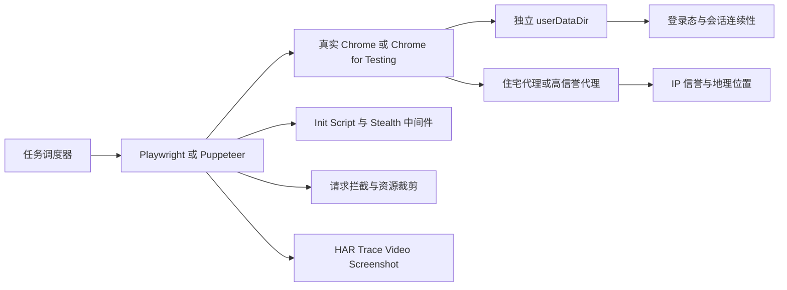

### Chrome 命令行接管模式

Chrome 136 起，远程调试必须配合**非默认** `--user-data-dir`；官方还建议浏览器自动化场景使用 Chrome for Testing。实操上，不要直接接管你日常浏览用的主资料目录；请为自动化建立独立目录，并按“站点/账号/代理”维度做隔离。citeturn25view4turn25view0turn19view0

```bash
# Windows headful，推荐：独立资料目录
chrome.exe ^
  --remote-debugging-port=9222 ^
  --user-data-dir=C:\tmp\chrome-debug-profile

# Windows headless 新模式
chrome.exe ^
  --headless ^
  --remote-debugging-port=9222 ^
  --user-data-dir=C:\tmp\chrome-headless-profile
```

对 profile 的策略，我建议遵循三条原则。第一，**永远不要自动化你的日常默认 profile**；Chrome 官方与 Playwright 官方都在不同文档里提醒了这一点。第二，**同一个 `userDataDir` 不要并发挂多个实例**；Playwright 文档明确写到浏览器不允许多个实例共用同一 User Data Directory。第三，**让 profile 绑定到账号与代理粘性**，而不是每次随机换身份——这一点不是某个官方文档的硬性规定，而是长期抓取里降低行为漂移的关键工程经验。citeturn25view4turn19view0

### Playwright 官方推荐配置

下面这份配置是我最推荐的“零 token 强反爬基础模板”。它使用持久化上下文、代理、早期脚本注入和资源裁剪。这里的 JS 注入不是银弹，只是基础线；对于具体目标站，你通常还需要定制语言、平台、时区、permissions、媒体能力、challenge 前的节奏控制等。Playwright 官方原生支持 `addInitScript`、`route`、persistent context 和 proxy，这也是它比命令行壳层更适合做长期主力的根本原因。citeturn20view0turn20view1turn19view0turn42view0

```ts
import { chromium } from 'playwright';

async function main() {
  const context = await chromium.launchPersistentContext('./profiles/target-a', {
    headless: false,
    proxy: {
      server: process.env.PROXY_SERVER!,
      username: process.env.PROXY_USER,
      password: process.env.PROXY_PASS,
    },
    viewport: { width: 1440, height: 900 },
  });

  await context.addInitScript(() => {
    Object.defineProperty(navigator, 'webdriver', { get: () => undefined });
    Object.defineProperty(navigator, 'language', { get: () => 'zh-CN' });
    Object.defineProperty(navigator, 'languages', { get: () => ['zh-CN', 'zh'] });
  });

  await context.route('**/*.{png,jpg,jpeg,woff,woff2}', route => route.abort());

  const page = context.pages()[0] ?? await context.newPage();
  await page.goto('https://example.com', { waitUntil: 'domcontentloaded' });

  // 你的业务逻辑
  console.log(await page.title());
}

main();
```

如果你需要接管已经启动的真实 Chrome，而不是由 Playwright 启动浏览器，那么可以用 `connectOverCDP()`。但 Playwright 官方写得很明确：**CDP 连接的保真度显著低于 Playwright 原生协议连接**。所以我的建议是：**长期生产用 `launchPersistentContext`，调试或复用登录态时再用 CDP attach。**citeturn19view1turn19view0

```ts
import { chromium } from 'playwright';

async function main() {
  const browser = await chromium.connectOverCDP('http://127.0.0.1:9222');
  const context = browser.contexts()[0];
  const page = context.pages()[0] ?? await context.newPage();
  await page.goto('https://example.com');
}
main();
```

### Puppeteer 与 stealth 插件配置

如果你决定把 stealth 现成度放在第一位，那么这套配置通常是开源社区里性价比最高的起点。`puppeteer-extra-plugin-stealth` 已公开列出多类 evasion，并给出了对检测站的测试结果；Puppeteer 官方又提供 `userDataDir`、请求拦截和 `evaluateOnNewDocument`。这两层叠起来，就是“可用度最高的开源 stealth 组合”。citeturn33view0turn33view1turn33view4turn42view1turn15search5turn22search11

```ts
import puppeteer from 'puppeteer-extra';
import StealthPlugin from 'puppeteer-extra-plugin-stealth';

puppeteer.use(StealthPlugin());

async function main() {
  const browser = await puppeteer.launch({
    headless: false,
    userDataDir: './profiles/target-a',
  });

  const page = await browser.newPage();

  await page.evaluateOnNewDocument(() => {
    Object.defineProperty(navigator, 'webdriver', { get: () => undefined });
  });

  await page.setRequestInterception(true);
  page.on('request', req => {
    if (/\.(png|jpg|jpeg|woff2?)$/i.test(req.url())) req.abort();
    else req.continue();
  });

  await page.goto('https://example.com', { waitUntil: 'domcontentloaded' });
  console.log(await page.title());
}

main();
```

### `agent-browser` 配置片段

`agent-browser` 最适合当作一种“零服务端中间层的壳”。它原生支持 session、profile、headers、network route、`addinitscript`，并且在 serverless/受限环境中的部署体验很好。如果你真的需要命令行范式，而不是 Node/Python 服务，这会是比 `playwright-cli` 更偏系统化的一条路。citeturn28view0turn30view1turn30view2turn30view3turn41view3

```bash
# 启动独立会话并使用持久 profile
agent-browser --session target-a --profile ~/.agent-browser/target-a open https://example.com

# 预设请求头
agent-browser set headers '{"accept-language":"zh-CN,zh;q=0.9"}'

# 注入基础 stealth 脚本
agent-browser addinitscript 'Object.defineProperty(navigator,"webdriver",{get:()=>undefined})'

# 裁剪无关资源，减轻渲染压力
agent-browser network route "*" --abort --resource-type image

# 获取可交互快照
agent-browser snapshot -i
```

### `browser-use` 的正确使用边界

`browser-use` 最容易被误用的地方，是把“CLI 直接控制”和“Agent/Cloud 任务”混为一谈。若你只是使用它的 CLI 去接系统 Chrome、接已有 CDP 会话、跑持久 daemon，那么它是可行的；但如果你走 Agent/Cloud，你就进入了 token 与 orchestration fee 的成本模型。对于你的目标，我更建议把 `browser-use` 视为：**要么是托管 stealth 的付费平台，要么是一个可以借其 CLI 快速接管浏览器的辅助工具，而不是主抓取框架。**citeturn13view0turn13view1turn12view4turn12view5

```bash
# 直接接管已有 Chrome/CDP
browser-use --cdp-url http://127.0.0.1:9222 open https://example.com
browser-use state
browser-use click 5
```

### 代理、用户数据目录与验证码服务策略

代理策略上，不建议把“每个请求都换一个全新代理”当作默认做法。Cloudflare 与 DataDome 都会把会话特征、请求模式和浏览器信号一起纳入判别；`browser-use` Cloud 之所以强调住宅代理与地理一致性，本质上也是在追求会话连续性和信誉一致性。因此更稳妥的思路通常是：**profile 与代理做粘性绑定，账号与代理做稳定映射，只有在封禁或挑战率显著升高时再切换整组身份。** 这是基于官方检测原理与托管 stealth 产品设计逻辑做出的工程推论。citeturn38view0turn39search0turn12view3

验证码与 OCR 集成上，开源世界最成熟的仍然是插件式与 API 式接入。`playwright-extra` 明确兼容 `puppeteer-extra-plugin-recaptcha`，可接 2Captcha；`browser-use` Cloud 则直接把 CAPTCHA solving 写进了其卖点。对强反爬抓取而言，真正要做的是**把验证码求解当作独立能力层**，而不是把它和浏览器控制层绑死。citeturn10view5turn11view2

## 风险、合规与实验设计

在法律与伦理层面，最重要的不是“有没有机器人协议”这一件事，而是**访问授权、合同约束、版权/数据库权、个人信息与账号安全**。OECD 关于公开可访问数据抓取的指南特别强调：即便是公开网页内容，也可能受版权保护，而且不同法域对数据抓取的例外和边界差异很大。美国司法部关于 CFAA 的现行政策则说明，刑事执法会遵循一套更明确的考量标准，但这并不等于民事合同、平台条款、隐私法或版权风险一起消失。换成工程语言就是：**“页面能打开”不等于“可以任意抓”；“公开可见”也不等于“你可以大规模复制并商用”。**citeturn40search0turn40search1

技术合规上，`robots.txt` 至少是一个必须尊重的基础信号。RFC 9309 已把 Robots Exclusion Protocol 正式标准化；Google 的文档也明确说明了 robots 文件的位置、适用范围与错误处理。它不是万能法条，也不是所有网站都会完全依赖它，但如果你的抓取系统连最基础的 robots/速率/站点条款都不检查，后面的法律与信誉风险只会更高。citeturn40search2turn40search8

安全上，必须把“抓取安全”和“浏览器隐匿”区分开。前者关心的是**你自己的浏览器会不会被接管、Cookie 会不会泄露、凭证会不会外流**；后者关心的是**目标网站会不会发现你**。Chrome 远程调试端口、共享 profile、无 sandbox、把凭证明文写入 state 文件，都是前者的大坑。`agent-browser` 在这方面做得最好的一点，是它把内容边界、域名白名单、动作审批和本地加密凭证库明确做成了产品能力；即便你不使用它做主框架，也应该借鉴这套安全分层。citeturn25view4turn27view2turn29view0

### 建议的实验设计

现有公开 benchmark 并不足以替代你的目标站 A/B 测试。`browser-use` 的公开 Stealth Bench V1 确实提供了 71 个反 bot 任务，并把 `browser-use-cloud`、`local_headful`、`local_headless` 等 provider 放进了同一套评测；`puppeteer-extra-plugin-stealth` 也公开拿 `bot.sannysoft.com`、`fpscanner` 和 `areyouheadless` 做了对照。但**没有哪一套公开 benchmark 同时、独立、公平地覆盖你这次列出的全部方案与真实业务目标站**。所以，真正的决策必须落在你自己的实验矩阵上。citeturn12view6turn33view1

我建议把实验分成四组，每组都跑**同样的目标站清单、相同的账号策略、尽量相近的 IP 质量和相同的成功判定标准**：

- **浏览器指纹组**：CreepJS、BrowserLeaks、`bot.sannysoft.com`、`areyouheadless`、`fpscanner`。这一组专门看 `webdriver`、plugins、Canvas/WebGL、UA、媒体能力与语言平台是否异常。公开资料里，`browser-use` Cloud 与 stealth 插件都把这些站点当成核心验证面。citeturn12view2turn33view1  
- **挑战兼容组**：挑选你已获授权的 Cloudflare / DataDome / PerimeterX / Akamai / hCaptcha 目标环境，记录 challenge 率、通行率和复现条件。Cloudflare 与 DataDome 官方都说明了它们会综合 JS、指纹与行为；这组测试必须用真实代理与 profile 生命周期来做。citeturn38view0turn39search0  
- **行为真实性组**：登录、搜索、滚动、翻页、加购、拖拽、表单、iframe、多标签页这些实际业务流，比较“固定脚本节奏”和“带轻微随机等待/轨迹扰动”的差异。学术研究表明，鼠标轨迹与行为生物特征确实能被用于区分人与 bot；公开论文甚至给出了生成类对抗方案，但这更说明行为层会被看见。citeturn37search1turn37search8turn37search12  
- **运维成本组**：统计单 session 峰值内存、CPU、启动时延、平均页面成功时延、每小时成功请求量、单账号平均存活时长、故障恢复时间，并附带 HAR/trace/video/console。Playwright、Puppeteer、Selenium、`agent-browser` 与 `browser-use` 都各自提供了不同层级的观测能力。citeturn20view1turn8search3turn23view4turn30view1turn13view1

指标方面，我建议至少固定以下几项：**页面打开成功率、首个 challenge 触发率、成功提取率、平均封禁前成功请求数、单会话资源消耗、单成功页面综合成本，以及多日连续运行的存活时间**。如果你还在比较“是否值得上 AI agent”，再额外补一个**token/API 费用**指标即可；但按照你的目标，这一列应该很快让纯 Playwright/Puppeteer 路线胜出。citeturn12view4turn12view5turn32search4turn28view0

脚本层面，我建议用同一套测试 harness 跑不同后端，只替换浏览器实现，不替换业务步骤。最简单的做法是把测试定义抽象成：

```text
step: open -> login -> wait -> search -> paginate -> extract -> screenshot -> save_har
backend: playwright | puppeteer | selenium | agent-browser-cli
profile_mode: cold | warm-7d
proxy_mode: datacenter | residential-sticky
head_mode: headful | headless
stealth_mode: off | basic-init-script | stealth-plugin
```

这样你最终拿到的不是“谁口碑更好”，而是“在同一批站点、同一代理组、同一账号生命期里，谁的 challenge 更少、吞吐更高、维护更省”。对强反爬项目来说，这种答案才真正有用。citeturn38view0turn39search0turn12view6turn33view1

### 开放问题与局限

这次调研有几个必须明确标注的边界。第一，**公开的、独立的、跨全部方案的统一 benchmark 很少**；很多 stealth 成绩来自项目方自己的 README 或基准仓库。第二，**音频指纹、TLS/JA3/JA4、WebRTC 泄漏、GPU/驱动一致性**等更深层信号，在大多数项目文档里并没有被完整、系统地“逐项承诺”，很多地方只能标成“未说明”。第三，`browser-use` Cloud、托管浏览器与 anti-detect 浏览器的宣传能力很强，但一旦你的目标严格要求“零 token、零外部编排费”，它们就算技术上更隐匿，也不再是这个题目的最优答案。citeturn12view2turn12view6turn39search0turn38view0turn12view5

综合全部证据，最终可执行的落地建议只有一条：**把 Playwright 官方作为主控底座，把 remote debugging/real Chrome 当作模式，把 stealth 当作可插拔增强层，把代理与用户数据目录当作身份层，把 HAR/trace/挑战率统计当作评估层。** 这样你既能做到“抓取本身不消耗 token”，又能在真正的反爬战场上持续迭代，而不是被某个单点工具的宣传口径绑死。citeturn20view0turn20view1turn19view0turn42view0turn25view4turn10view5turn10view6


## 风险、合规与最终建议

### 风险与合规清单

- **X 条款风险**：X 当前条款明确禁止在无书面同意下 crawling 或 scraping 服务，也禁止绕开技术限制或使用未发布接口；条款还保留账号终止与其他救济措施。对 x.com 首页 “Following” 这种登录态时间线，条款风险是本项目的第一风险。 citeturn4view3turn3view0
- **判例边界风险**：hiQ v. LinkedIn 的讨论对象是公开可见数据，不是登录后受限时间线；不要把它理解成“登录态社交平台内容抓取一律安全”。 citeturn22search2turn22search6
- **账号安全风险**：Playwright 官方明确提醒认证状态文件可能包含可冒充你的敏感 cookies/headers；agent-browser 也提示 state 文件与远程调试端口都很敏感。把这些文件排除出 Git，并视情况做磁盘加密或状态加密。 citeturn9search1turn15view3
- **远程调试暴露风险**：开启 `--remote-debugging-port` 相当于暴露了该浏览器的完全控制权。只能在可信机器、本地回环或受控隧道里启用，任务结束后应关闭浏览器。 citeturn15view3turn16view0
- **默认 profile 污染风险**：不要自动化你的日常 Chrome 主 profile。Chrome 与 Playwright 官方都明确建议使用独立 `userDataDir`。 citeturn16view0turn11view0
- **CAPTCHA/2FA 合规风险**：把验证码当成熔断器，不要把自动绕过当作默认路径。Selenium 文档把 CAPTCHA 和双因素认证列为自动化反模式，这与生产抓取里的“人工接管恢复”思路高度一致。 citeturn31view1turn36view0

### 最终推荐方案

**主推荐方案**

如果你的首要目标是：**反爬表现尽可能稳、最大限度模拟真人、并且抓取数据不消耗第三方 API token**，那么最值得落地的方案是：

**Playwright 官方库 + 独立真实 Chrome profile + 首次人工登录 bootstrap + 日常持久化 profile 抓取 + 本地 JSONL/SQLite/Postgres 存储**

这个组合的优点是：

Playwright 官方库给你**最完整、最工程化、最可测试**的浏览器控制面；独立 profile 解决的是会话持久化与真实性问题；首次人工登录把 2FA/CAPTCHA 从自动化主流程里剥离出去；后续 worker 只负责低频增量刷新、滚动、抽取和落盘。整个链路里，你既不需要 X 官方 API token，也不需要 LLM/云浏览器 token。 citeturn34view1turn10view0turn11view0turn37view0

**推荐的最低可行部署**是：  
一个账号，一个专用 profile 目录，一个稳定代理出口，一个 Playwright worker，一个本地数据库或 JSONL 文件。先做到这一层，再考虑横向扩 worker。不要一开始就上复杂分布式系统；对登录态站点来说，会话质量永远比架构花哨更重要。

### 替代方案

**如果你需要很强的人机协同、临时人工接管与救援能力**，推荐在主方案外再加一个操作层：

- **Playwright CLI**：适合 attach 到已有浏览器、快速截图、保存 state、人工检查 selector 或页面状态。它的设计目标是 token-efficient 的 agent/browser 操作层，但直接命令本身不需要第三方 key。 citeturn36view0turn34view1
- **agent-browser 本地模式**：如果你喜欢 CLI 操作、批处理、profile 快照复用、session 管理、状态加密与 CDP 连接能力，它非常适合作为“运维控制台”或“人工恢复入口”。但若把它当成长期采集主程序，代码层可测试性仍不如官方库。 citeturn29search7turn15view3turn40view0

**如果你团队是 Python-first**，有两个现实路径：

- **Playwright Python**：最接近本报告的主推荐路线，架构一致、维护负担小。 citeturn34view1
- **Selenium + undetected-chromedriver**：在 Python 社区非常现实，尤其当你已经有 Selenium 资产时；但它是补丁型 anti-detect 路线，版本漂移与失效率要纳入维护预算。 citeturn41search2turn31view0

**如果你愿意为了更激进的 anti-detect 实验承担更多维护成本**，可以考虑：

- **Puppeteer + puppeteer-extra-plugin-stealth / Rebrowser**  
  这条路线在“实验性规避”上空间更大，但 patch 面更大、回归更重。我会把它归类为**替代方案**，而不是默认主方案。 citeturn20search0turn32search0turn32search3

**如果你的主要诉求是自然语言驱动的 browser agent，而不是稳定的数据 ETL**，那么：

- **browser-use** 很强，但其官方文档把最强 stealth、captcha、proxy rotation 与 production 配置更多放在 Cloud 路线；这会把你重新带回第三方 key/token 的世界，不符合本次最核心约束。 citeturn14view1turn14view2turn33search0

### 适用场景与部署建议

| 场景 | 最合适方案 | 为什么 |
|---|---|---|
| **Node/TypeScript、登录态采集、强调稳定、不要第三方 token** | **Playwright 官方库 + 持久化 profile** | 最平衡、最可测、最适合演进成长期 worker |
| **需要人工接管、现场排障、快速恢复会话** | **Playwright CLI 或 agent-browser** | attach/会话/profile/tooling 很强 |
| **Python 团队，希望尽量少踩版本补丁坑** | **Playwright Python** | 架构与主推荐一致 |
| **Python 团队已有 Selenium 大量资产** | **Selenium 4；必要时评估 uc** | 便于复用现有体系，但要接受抓取体验不如 Playwright |
| **研究型、实验型 anti-detect 策略** | **Puppeteer + Stealth/Rebrowser** | 灵活，但维护更重 |
| **自然语言浏览器代理、可接受云/key** | **browser-use / agent-browser 云能力** | 更像智能浏览器 agent，而非纯抓取管道 |

### 开放问题与局限

这份报告已经尽量把最高置信度的信息收敛到可执行结论，但仍有几项边界需要你在落地前自己验证：

首先，**x.com 的具体 DOM、按钮文字与登录流会变化**。上面的脚本思路是稳健的，但 selector 和挑战页分支需要你结合当前界面做一次实机校准。  

其次，**不同账号历史、地区、代理质量、2FA 开启状态**，会显著影响“首次人工登录之后能稳定复用多久”。这不是某个库能完全解决的问题，而是账号画像与访问策略问题。  

最后，**本报告没有把任何自动 CAPTCHA 绕过服务列为推荐路径**。这是有意为之：对 x.com 这类登录态平台，把验证码设计成“人工接管点”通常更稳，也更容易和法务/合规边界对齐。


# 浏览器自动化与抓取方案深度评估

## 执行摘要

如果把目标严格拆成四件事——**尽量降低被站点识别为自动化**、**抓取链路本身不消耗 LLM token**、**能稳定复用登录态**、**在非登录场景下成本最低**——那么结论其实相当清晰：

从**“最强反爬/最像真人”**看，真正决定效果的通常不是 “你用 Playwright CLI 还是 agent-browser”，而是**底层浏览器形态**：本地普通 Chromium/Chrome、附着到你自己的真实 Chrome、还是带隐身加固与住宅代理的云浏览器。MDN 明确写明，Chrome 在 `--remote-debugging-port`、`--headless` 或 `--enable-automation` 下会让 `navigator.webdriver` 为 `true`；Castle 则进一步列出 HeadlessChrome UA / client hints、缺失 `Accept-Language`、CDP 副作用以及 Playwright 注入全局变量等检测信号。因此，**“真实浏览器内核”不等于“天然抗检测”**。在本次比较对象里，官方文档中**唯一明确宣传“加固 Chromium + 指纹随机化 + 默认住宅代理 + Cloudflare/PerimeterX 绕过能力”**的是 Browser Use Cloud；如果你用它提供的**原始浏览器/CDP**而不是 agent 任务，可以做到**不走 LLM token**，但会产生浏览器基础设施与代理成本。citeturn16view0turn16view1turn16view2turn16view3turn17search0turn28search9

从**“最省成本且不消耗 token”**看，首选仍然是传统的两级分流：**静态页面用 `requests + BeautifulSoup/lxml`**，动态页面或需要无限滚动/执行前端脚本时用 **Playwright**。Requests 的基本 HTTP API 非常直接；Beautiful Soup 文档也说明它会选择已安装的最佳解析器，并把 `lxml` 排在最优、且明确提到在 `lxml` 作为底层 parser 时解析会显著更快。对于这类场景，抓取链路完全不依赖 OpenAI / Anthropic / Gemini 之类按 token 计费的模型。citeturn7view0turn8view0turn5search1

从**“登录态网站，尤其是 x.com”**看，最稳的实现顺序是：**专用 Chrome 用户数据目录 + 手动登录一次 + 后续通过 CDP 附着复用会话**。这条路径最大的好处，是它把“登录、2FA、风险验证”尽量留给人一次性完成，后续脚本只做刷新、增量抽取与存储。要特别注意，Chrome 官方已在 2025 年宣布，自 Chrome 136 起，`--remote-debugging-port` / `--remote-debugging-pipe` **不会再对默认 Chrome 数据目录生效**；必须配合 `--user-data-dir` 指向**非默认目录**。Playwright 官方也同步警告：**不要把 `userDataDir` 指向你日常使用的默认 Chrome 主目录**，否则可能导致页面不加载或浏览器退出。citeturn18search2turn18search5turn24view3

从**“工程化易实现”**看，最值得优先落地的仍然是 **Playwright（库）**，而不是更“炫”的 AI/browser agent。官方文档覆盖完备，支持 Chromium / Firefox / WebKit 与 branded Chrome / Edge，支持代理、持久化上下文、`storageState` 认证复用、网络监听、事件订阅、Trace Viewer、截图与 HAR/trace 等调试能力。Playwright CLI 很适合 shell-first 或 coding-agent 工作流，并且官方 README 明确把它定位为 **CLI interface into Playwright**，强调对 agent 更 “token-efficient”；但从抓取效果上看，它本质仍然继承了 Playwright 的能力和局限。换句话说，**Playwright CLI、agent-browser、browser-use CLI 主要解决的是“开发者/agent 交互方式”，不是“反爬魔法”本身**。citeturn31search11turn24view0turn24view3turn30search0turn31search1turn13view2turn13view1turn40view2turn14view0

最后必须单独强调一条合规底线：**X 的条款与自动化规则，都不鼓励你通过脚本去抓取/自动化网站本身。**X Terms of Service 明确写明，未经 X 明确书面许可，不得抓取服务，也不得绕过其技术限制；X 的 Automation Rules 还明确写明，**“Use non-API-based forms of automation, such as scripting the X website” 可能导致永久封禁。**因此，下面关于 x.com 的实现，应理解为**你自己的账号、你自己的数据、你明确接受账号与合规风险的技术方案评估**，而不是“生产环境默认推荐做法”。citeturn21view0turn22view1

## 假设与评估方法

本报告将“**不消耗 token**”定义为：**抓取链路本身不调用按 token 计费的 LLM API**。因此，下面几类成本**不算 token 成本**：云主机成本、浏览器云会话成本、代理成本、验证码人工处理成本、磁盘与存储成本。反过来，只要方案必须通过 OpenAI / Anthropic / Gemini / Browser Use agent model 等模型来决定动作或抽取结构化结果，就不属于“零 token 抓取”。

由于你没有指定并发规模、目标站点反爬强度、是否允许付费代理/反指纹服务，本报告按四种常见使用情形评估：**个人/小规模自用**、**中等规模动态站抓取**、**强反爬站点**、以及**需要长期登录态复用**。评价维度包括：浏览器是否为真实内核、是否支持 headed / headless、是否能复用 profile / user data dir / storage state、是否能控制速率与行为轨迹、是否能接代理或浏览器池，以及是否天然依赖 AI/LLM。Playwright、Puppeteer、Selenium 等官方文档都把自己描述为浏览器自动化框架；Requests 和 Beautiful Soup 则分别对应 HTTP 获取与 HTML 解析；Chrome Recorder / Puppeteer Replay 与 Selenium IDE 更偏录制/回放。citeturn31search11turn25view0turn33search3turn7view0turn8view0turn26view0turn34search1

需要特别说明的是，表格里的“**指纹暴露**”是按**越低越好**打分，而不是“功能越多越好”。MDN 把 `navigator.webdriver` 定义为“用户代理是否由自动化控制”的标准信号，并明确点名 Chrome 在 `--remote-debugging-port`、`--headless`、`--enable-automation` 下会暴露这一信号。Castle 对 Playwright/Headless Chrome 的检测文章又补充了更多线索：HeadlessChrome UA 与 client hints、缺失 `Accept-Language`、CDP 序列化副作用、以及 Playwright 注入的全局变量。也就是说，**“我开了真 Chrome”只能解决一部分问题；如果你是远程调试 / headless / 被注入了明显自动化痕迹，站点仍然能识别你。**citeturn16view0turn16view1

## 核心方案对比

下面的表格将“项目/工具链”与“底层抓取模式”放到同一层比较。表中“反爬能力”使用五维简写：**指纹暴露 / 行为模拟 / 速率控制 / 代理池支持 / 浏览器配置与用户目录**。其中“指纹暴露”是**越低越好**，其余是**越高越好**。表中的“示例代码片段”只给出最短入口；后文会给出 x.com 登录态的完整实现方式。

| 项目名 | 架构 / 运行模式 | 无头 / 有头 | 是否支持真实浏览器内核 | 反爬能力简评 | 是否需要额外付费 / token | 易用性 | 生态 / 社区 | 示例代码片段 | 适用场景 | 主要风险与缓解 |
|---|---|---|---|---|---|---|---|---|---|---|
| `requests + BeautifulSoup/lxml` citeturn7view0turn8view0turn5search1 | 纯 HTTP 抓取 + HTML 解析 | 不适用 | 否 | 指纹暴露：**高**；行为模拟：**无**；速率控制：**强**；代理/池：**需自行做 HTTP 层**；Profile：**无** | **无 token**；仅机器 / 带宽 / 代理成本 | **最高** | Python 生态极成熟 | `requests.get(url)`<br>`BeautifulSoup(html, "lxml")` | 静态网页、列表页、公开资讯页、成本最敏感场景 | 遇 JS 渲染、挑战页、WAF 容易失败；缓解：先判定是否真的是静态页面，再决定是否升级到浏览器渲染 |
| Playwright citeturn31search11turn24view0turn24view3turn24view0turn30search0turn31search1turn16view1 | 官方浏览器自动化库；脚本 / 测试 / 抓取三用 | 支持无头与有头 | 是，支持 Chromium / Firefox / WebKit，并可用 branded Chrome / Edge | 指纹暴露：**中到高**；行为模拟：**中到高**；速率控制：**强**；代理：**强**；配置/Profile：**强** | **无 token**；若你自己再接 LLM 才会产生 token | **高** | 文档与语言绑定成熟 | `chromium.launchPersistentContext(dir)` | 动态站抓取、登录态复用、工程化首选 | Headless / CDP / Playwright 痕迹可被检测；缓解：优先 headed、独立 profile、保守频率、必要时加 sticky 住宅代理 |
| Playwright CLI citeturn13view2turn13view1turn13view3turn13view0turn37view0 | Shell-first CLI；底层仍是 Playwright | 默认无头，可 `--headed` | 是，可附着现有 Chrome / Edge | 反爬上限≈Playwright；额外优势在 `attach --cdp`、会话管理、`--persistent` | **无 token**；官方强调对 agent 更 token-efficient，但 CLI 自身不强制把页面塞进 LLM | **高** | 依托 Playwright 主生态；CLI 本身较新 | `playwright-cli attach --cdp=chrome` | shell 化运维、快速试验、coding-agent 驱动、手动排障 | 容易被误解成“自带 stealth”；实际上只是 Playwright 的 CLI 入口；缓解：把它看成操作层，而不是反检测层 |
| Chrome Remote Debugging + Playwright / Puppeteer citeturn18search2turn18search5turn16view0turn41view0turn25view1turn25view2 | 手工启动 Chrome + 开放 CDP + 脚本附着已有会话 | 一般用于有头真实 Chrome，也可 headless | 是，直接复用本机 Chrome | 指纹暴露：**中到高**；行为模拟：**高**；速率控制：**强**；代理：**中**；配置/Profile：**很强** | **无 token** | **中到高** | 基于 Chrome DevTools 协议，通用性强 | `chrome.exe --remote-debugging-port=9222 --user-data-dir=...`<br>`chromium.connectOverCDP(...)` | 自己的登录态、自用账号、人工先登录后自动刷新 | **这不是 stealth 方案，而是会话复用方案**；且 `--remote-debugging-port` 会暴露 `navigator.webdriver`；缓解：仅用于你自己的登录态、保守频率、独立目录、别把 9222 暴露到公网 |
| agent-browser citeturn40view2turn23view3turn23view2turn23view1turn40view4turn12view1turn40view0 | Rust CLI + 持久 daemon + 仪表盘；可本地 Chrome，也可接 Browserless / Browser Use / Kernel 等云浏览器 | 支持无头 / 有头 | 本地默认 Chrome for Testing；也支持 Chrome/Lightpanda/CDP/Safari iOS | 本地模式≈普通 Chrome 自动化；若接 Browserless/Kernel 等 provider，反爬能力取决于 provider | 普通 CLI **无 token**；`chat` / AI Chat 需要 Vercel AI Gateway；接云 provider 可能有浏览器费用 | **高** | 命令、仪表盘、会话管理体验很好 | `agent-browser open example.com --headed` | 团队共享 CLI、需要仪表盘 / live viewport / 多 provider 抽象 | 本地模式并不天然 stealth；缓解：用于工程运维时很好，用于强反爬时应配合云 stealth provider 或代理策略 |
| browser-use 开源 / CLI citeturn14view0turn29view0turn29view1turn27view0turn27view1 | 一套工具里同时有**直接浏览器控制**和**AI agent**两条路 | 支持无头 / 有头 / real Chrome | 是，可接系统 Chrome、storage state、CDP | 本地 real-Chrome/CLI 模式≈Playwright 级别；Agent 模式取决于模型与浏览器配置 | **CLI 直控可无 token**；**Agent 模式通常需要模型 API key / token** | **中到高** | 开源项目活跃，文档完备 | `browser-use connect`<br>`browser-use state` | 想同时要“直接控制”和“AI agent”两用 | 容易把“browser-use”与“browser-use agent”混为一谈；缓解：如果目标是零 token，就走 CLI / 直连浏览器，不走 agent.run |
| Browser Use Cloud 浏览器 via CDP citeturn16view2turn16view3turn17search0turn28search9turn28search6turn28search8 | 云端加固 Chromium / 住宅代理 / profile；你可用 Playwright / Puppeteer 直接连 raw browser | 默认云端浏览器，可调屏幕与超时 | 是，官方称 hardened Chromium fork | 指纹暴露：**低**；行为模拟：**中到高**；速率控制：**中**；代理：**强**；配置/Profile：**强** | **无需 LLM token 也能用 raw browser**；但需要 Browser Use API key / 浏览器基础设施成本 | **中** | 适合把 stealth 作为能力外包 | `p.chromium.connect_over_cdp(WSS_URL)` | 强反爬、跨地区、需要云 profile / 住宅代理 / stealth | 付费、供应商绑定、云端基础设施依赖；缓解：把它当“浏览器层”，上层提取逻辑仍写在 Playwright/Puppeteer 中 |
| Puppeteer + Chrome Recorder / `@puppeteer/replay` citeturn25view0turn25view1turn26view0turn26view1 | Chrome DevTools 录制用户流，再导出 Puppeteer / Replay 脚本 | 支持无头 / 有头 | 是（Chrome / Firefox via protocol 支持） | 指纹暴露：**中到高**；行为模拟：**中**；速率控制：**中**；代理：**中**；配置/Profile：**中** | **无 token** | **高**（原型期特别高） | Chrome 官方 + Puppeteer 官方组合 | `npx @puppeteer/replay flow.json` | 快速录制流程、原型化提取、回归检查 | 录制脚本常对 DOM 变动敏感；缓解：把其作为“生成初稿”的工具，再手工抽象成稳定选择器 / 数据抽取逻辑 |
| Selenium / Selenium IDE citeturn33search3turn33search4turn15search4turn34search1turn34search0 | WebDriver 标准；IDE 负责录制回放 | 支持无头 / 有头；IDE 更偏有头 | 是，原生驱动各浏览器 | 指纹暴露：**高**；行为模拟：**中到高**（Actions API 强）；速率控制：**强**；代理：**中**；配置/Profile：**中** | **无 token** | **中**；IDE 原型更易 | 标准化最强，跨浏览器历史最长 | `driver = new ChromeDriver()`<br>`Actions(...).perform()` | 传统测试、跨浏览器验证、已有 Selenium 资产团队 | WebDriver 暴露面明显，强反爬站点通常不占优；缓解：若目标是抓取而非测试，优先考虑 Playwright 或真实 Chrome 附着 |

这张表背后有一个关键判断：**对“反爬/真人模拟”来说，工具本身的“编程接口形态”远没有“浏览器形态 + 网络形态 + 节奏控制”重要。**Playwright CLI 官方自己把它定位为 “CLI interface into Playwright”，agent-browser 则是“browser automation CLI for AI agents”，browser-use CLI 则同时支持 managed headless Chromium、real Chrome with existing profiles/logins、以及 cloud-hosted browsers。也就是说，**这些 CLI 主要改善的是可操作性、会话管理、可观测性与 agent 友好度；真正决定你能不能过反爬的，仍是你是否在用 dedicated profile、headed 真浏览器、合理代理与保守节奏，或者直接外包到 stealth cloud browser。**citeturn13view2turn40view2turn14view0

如果只看“**零 token 抓取**”，则需要把 Browser Use 分成两层看：其开源 agent 教程和支持模型文档都明确要求你选择模型并配置 API key；但其 Cloud quickstart 又把 **Agent** 与 **Browser** 明确分开，其中 `browsers.create()` / Playwright-Puppeteer-Selenium 连接方式对应的是**原始浏览器 via CDP**，并不要求你把任务交给 LLM 去执行。因此，**Browser Use 这个品牌下既有“会消耗 token 的 agent 路线”，也有“不会消耗 token 的 stealth browser 路线”**。如果你的目标是“只抓数据、不走 LLM”，你要选的是后者，而不是 `client.run("...")` 这种 agent 风格接口。citeturn27view0turn27view1turn28search9turn17search0

## x.com 登录态抓取实现

先给结论：对 x.com 这类**必须登录、会做人机风控、界面持续变化**的网站，技术上最稳的路径不是“自动化登录”，而是**先准备一个专用 Chrome 会话，人工登录一次，再让脚本附着这个会话做刷新与增量抽取**。这么做能最大限度减少脚本碰登录页、密码页、2FA 页、可疑登录提示页的次数。Chrome 官方从 Chrome 136 开始已经要求 `--remote-debugging-port` 必须搭配**非默认 `--user-data-dir`**，Playwright 也警告不要把自动化直接指到你的日常 Chrome 主目录。citeturn18search2turn18search5turn24view3

在继续之前，需要明确合规风险。X Terms of Service 明确写明，你不能在未经书面许可的情况下抓取服务，也不能绕过技术限制；X Automation Rules 在 2026 年 4 月更新时进一步明确写道，**不要使用“对 X 网站进行脚本化”的非 API 自动化方式**，并说明违规可能导致账户处理甚至永久封禁。所以下面的方案，只适合**你自己的账号、你接受账号风控风险、并且你不是把它作为面向公众的大规模生产抓取服务**。citeturn21view0turn22view1

建议的落地步骤如下。第一步，创建一个**专用调试 profile**，例如 Windows 上放在 `C:\tmp\chrome-x-bot`。第二步，用这个 profile 打开 Chrome，并启用 CDP 端口。第三步，在这个专用 Chrome 中**手动登录 X**，并进入 Home 页面，必要时切到 Following。第四步，后续脚本只附着这个浏览器，不再重复登录。这个模型与 Playwright 的 `launchPersistentContext(userDataDir)`、Playwright Auth 的 `storageState`、以及 browser-use 的 real browser / storage state 思路一致：**认证状态要么保存在 profile 目录，要么保存在状态文件，不要每次都重新走登录流程。**Playwright 官方还特别提醒，认证状态文件可能包含敏感 cookies 与 headers，不应提交到仓库。citeturn24view3turn30search0turn30search1turn29view1

下面给出一个**可执行的 Node.js + Playwright CDP** 示例。这段代码的目标不是“全自动模拟真人乱点”，而是更务实的三件事：**附着已登录会话、定时刷新 Following feed、去重保存未见过的内容**。示例里使用了非常保守的策略：单浏览器、单账号、随机刷新间隔、轻微鼠标/滚轮动作、按 `status/<id>` 去重。它没有硬编码 X 的内部 GraphQL endpoint，因为这部分经常变化；默认走 DOM 抽取，后文再讲如何升级成 network-first。

```bash
# Windows：先启动一个专用的调试 Chrome
chrome.exe --remote-debugging-port=9222 --user-data-dir=C:\tmp\chrome-x-bot
```

```js
// x-following-monitor.js
import { chromium } from 'playwright';
import fs from 'node:fs/promises';

const DEBUG_URL = 'http://127.0.0.1:9222';
const HOME_URL = 'https://x.com/home';
const SEEN_FILE = './seen-x-status-ids.json';

// 建议保守一些，不要高频刷新
const REFRESH_MIN_MS = 60_000;
const REFRESH_MAX_MS = 180_000;

const sleep = (ms) => new Promise((r) => setTimeout(r, ms));
const rand = (min, max) => Math.floor(Math.random() * (max - min + 1)) + min;

async function loadSeen() {
  try {
    return new Set(JSON.parse(await fs.readFile(SEEN_FILE, 'utf8')));
  } catch {
    return new Set();
  }
}

async function saveSeen(seen) {
  await fs.writeFile(SEEN_FILE, JSON.stringify([...seen], null, 2), 'utf8');
}

async function ensureFollowingTab(page) {
  // X 的界面语言和 DOM 会变化，这里用最保守的 role + 名称匹配
  const names = [/Following/i, /关注/i];
  for (const name of names) {
    const tab = page.getByRole('tab', { name }).first();
    try {
      if ((await tab.count()) > 0) {
        await tab.click({ timeout: 3000 });
        await page.waitForTimeout(rand(1200, 2500));
        return;
      }
    } catch {
      // ignore
    }
  }
}

async function tinyHumanMotion(page) {
  const body = page.locator('body');
  const box = await body.boundingBox().catch(() => null);
  if (!box) return;

  const x = rand(80, Math.max(120, Math.min(900, Math.floor(box.width) - 40)));
  const y = rand(80, Math.max(120, Math.min(700, Math.floor(box.height) - 40)));
  await page.mouse.move(x, y, { steps: rand(8, 20) });

  if (Math.random() < 0.7) {
    await page.mouse.wheel(0, rand(150, 900));
  }
}

async function extractPosts(page) {
  return await page.evaluate(() => {
    const out = [];
    const articles = [...document.querySelectorAll('article')];

    for (const article of articles) {
      const anchors = [...article.querySelectorAll('a[href*="/status/"]')];
      const statusUrl = anchors.map(a => a.href).find(Boolean);
      if (!statusUrl) continue;

      const match = statusUrl.match(/status\/(\d+)/);
      const id = match?.[1];
      if (!id) continue;

      const text = (article.innerText || '').trim();
      if (!text) continue;

      out.push({
        id,
        url: statusUrl,
        text,
        capturedAt: new Date().toISOString(),
      });
    }

    return out;
  });
}

async function main() {
  const seen = await loadSeen();

  // 如果你使用的是较新 Playwright，可给 connectOverCDP 传 noDefaults: true
  // 以尽量少改动用户现有默认上下文。
  const browser = await chromium.connectOverCDP(DEBUG_URL);
  const context = browser.contexts()[0];

  let page = context.pages().find(p => p.url().includes('x.com'));
  if (!page) page = await context.newPage();

  page.setDefaultTimeout(15_000);

  await page.goto(HOME_URL, { waitUntil: 'domcontentloaded' });
  await page.waitForTimeout(rand(2000, 4000));
  await ensureFollowingTab(page);

  while (true) {
    if (/login|i\/flow\/login/.test(page.url())) {
      throw new Error('X 会话疑似失效，页面回到了登录流程。请手动重新登录后再继续。');
    }

    await tinyHumanMotion(page);
    await page.waitForTimeout(rand(1000, 2500));

    // 用 page.reload 即可，没必要模拟 Ctrl+R
    await page.reload({ waitUntil: 'domcontentloaded' });
    await page.waitForTimeout(rand(2500, 5000));
    await ensureFollowingTab(page);

    const posts = await extractPosts(page);
    const fresh = posts.filter(p => !seen.has(p.id));

    if (fresh.length) {
      for (const item of fresh) seen.add(item.id);
      await saveSeen(seen);

      // 实际落地可改为写入 SQLite / JSONL / Kafka
      console.log(JSON.stringify({
        ts: new Date().toISOString(),
        count: fresh.length,
        items: fresh,
      }, null, 2));
    } else {
      console.log(`[${new Date().toISOString()}] no new posts`);
    }

    await sleep(rand(REFRESH_MIN_MS, REFRESH_MAX_MS));
  }
}

main().catch(err => {
  console.error(err);
  process.exit(1);
});
```

这段代码使用的是 Playwright 的 **`connectOverCDP`**，官方 API 文档明确说明它可以把 Playwright 附着到一个现有浏览器实例上，默认上下文可从 `browser.contexts()` 访问；同时官方也明确提醒，**通过 CDP 的连接保真度低于 Playwright 自有协议连接**。这意味着：**如果你的需求是“复用我已登录的真实 Chrome”，CDP attach 是最佳路径；如果你的需求是“功能最全、行为最可控、最适合长期工程化”**，那么更推荐使用 Playwright 的 **`launchPersistentContext(userDataDir)`**，让你自己控制一个独立持久化浏览器，而不是附着到外部浏览器。citeturn41view0turn41view1turn41view3turn24view3

如果你想把会话从“专用 profile 目录”转成“**可复制的状态文件**”，可以用 Playwright 的 `storageState()`。官方认证文档说明，Playwright 可以把已认证上下文的 state 保存到文件，并在后续上下文中复用；Java/Python 文档也明确指出 cookies、localStorage 与 IndexedDB 都可以跨上下文复用。这对 CI / cron / headless 环境尤其有用。citeturn30search0turn30search1turn30search9

```js
import { chromium } from 'playwright';

(async () => {
  const context = await chromium.launchPersistentContext('./pw-x-profile', {
    channel: 'chrome',
    headless: false,
  });

  const page = context.pages()[0] || await context.newPage();
  await page.goto('https://x.com/home');

  // 第一次运行时手动登录一次，随后保存状态
  await page.waitForTimeout(30_000);
  await context.storageState({ path: './x-auth.json' });

  await context.close();
})();
```

在**自动刷新策略**上，不建议用“秒级死循环”，而应该用“**保守随机区间 + 增量去重 + 单会话串行**”。对自己的 Following feed 这类场景，我更推荐持续模式使用 **60–180 秒抖动刷新**；如果你是临时盯盘，缩到 **15–30 秒** 也可以，但不建议长时间运行。抓取结果不要按“每次全量覆盖”，而要按**状态 ID / 帖子 URL / 首见时间**做增量去重；同时，一个账号最好只维持**一个活跃浏览器会话**，避免同一账号在多 IP、多会话上频繁刷新。这样做不是因为文档规定了某个“安全阈值”，而是因为 X 的自动化规则对 bulk / aggressive 行为明显更敏感。citeturn22view1turn22view3turn22view4

在**反爬对策**上，真正值得做的是那些**不会明显伤害稳定性**的动作：第一，优先用有头模式或真实 Chrome profile，而不是默认 headless；第二，用小幅随机鼠标移动、轻微滚轮与自然等待，而不是机械固定间隔；第三，如果必须上代理，登录态场景优先**sticky 住宅代理**，不要在同一会话中频繁换 IP；第四，把验证码与“可疑登录验证”视为**人工接管点**，而不是默认自动解题点。Browser Use Cloud 官方文档确实把 CAPTCHA solving、住宅代理和 stealth 作为卖点，但如果你的核心诉求是“零 token + 自己的 x.com 账号”，技术上最稳的仍然是**人工先登录 + 脚本只做轻量刷新**。citeturn16view2turn16view3turn17search3turn11search4

如果后续你发现 DOM 抽取太脆，下一步不要急着换框架，而应该改成**network-first**。Playwright 官方网络文档说明，页面发出的 XHR 和 `fetch` 请求都可以被监听、修改或处理；`page.on('request')`、`page.on('response')`、`page.on('requestfinished')` 会按顺序发出，`response` 对象也允许你读取 headers、body 与 JSON。对 X 这类 SPA，这通常比死抓 DOM 更稳。但具体 endpoint 名称和 payload 结构变化很快，所以最佳做法是**先用 DevTools/Playwright trace 抓一次 live traffic，再白名单你真正需要的 timeline 响应**，而不是把别人博客里的 endpoint 名字硬编码进系统。citeturn31search1turn31search3turn31search7turn31search6

## 非登录态抓取的最佳实践

对于**不需要登录态**的场景，最优策略不应该是“统一上浏览器”，而应该是**先静态、后动态、最后再上真实用户会话**。Requests 文档表明它的 HTTP API 极其直接；Beautiful Soup 文档也说明你可以直接把 HTML 丢给构造器，并让它选择合适 parser，而在可用时 `lxml` 会被优先选择，且解析速度通常更好。因此，只要目标内容已经出现在首包 HTML 或可通过简单 JSON 接口获得，**先用 `requests + BeautifulSoup/lxml`** 几乎总是最省钱、最稳、也最不消耗资源。citeturn7view0turn8view0turn5search1

一旦页面是**SPA、无限滚动、依赖客户端渲染或交互后加载**，就切到 **Playwright / Puppeteer**。Playwright 文档明确支持网络监听、JS 执行、事件订阅、页面截图、认证状态保存与恢复；Puppeteer 官方则同样强调其通过 CDP / WebDriver BiDi 驱动 Chrome / Firefox，并支持 launch / connect 到已有浏览器。对“非登录动态站”来说，**Playwright 通常优先于 Puppeteer**，原因不是 Puppeteer 不能做，而是 Playwright 在等待、断言、跨浏览器与持久上下文上更完整，工程体验更统一。citeturn31search11turn31search1turn31search2turn25view0turn25view1turn25view2

当页面需要**真实扩展、真实媒体栈、真实已登录 profile、或必须人工协同**时，才考虑 **Chrome remote debugging / CDP attach**。它很适合“我已经在浏览器里能看到内容，只想附着后自动抽出来”的情况，但它不是默认第一选择，因为 MDN 和 Chrome 官方都明确给出了自动化/安全方面的信号与约束。换言之，**CDP attach 用来“复用真实会话”很强，用来“当 stealth 引擎”并不强。**citeturn16view0turn18search2turn41view0

至于**浏览器录制/回放**，Chrome DevTools Recorder 可以直接把用户流导出为 JSON、`@puppeteer/replay`、Puppeteer 脚本等格式；Selenium IDE 则是浏览器扩展，用于记录和回放浏览器动作。这两者都很适合**快速生成原型流程、回归脚本、问题复现脚本**。但它们更像“流程录制器”，不是“抓取系统”；真正上线前，通常还需要你把录制出来的脚本抽象成稳定选择器、增加重试与去重逻辑，并接入存储和监控。citeturn26view0turn26view1turn34search1turn34search0

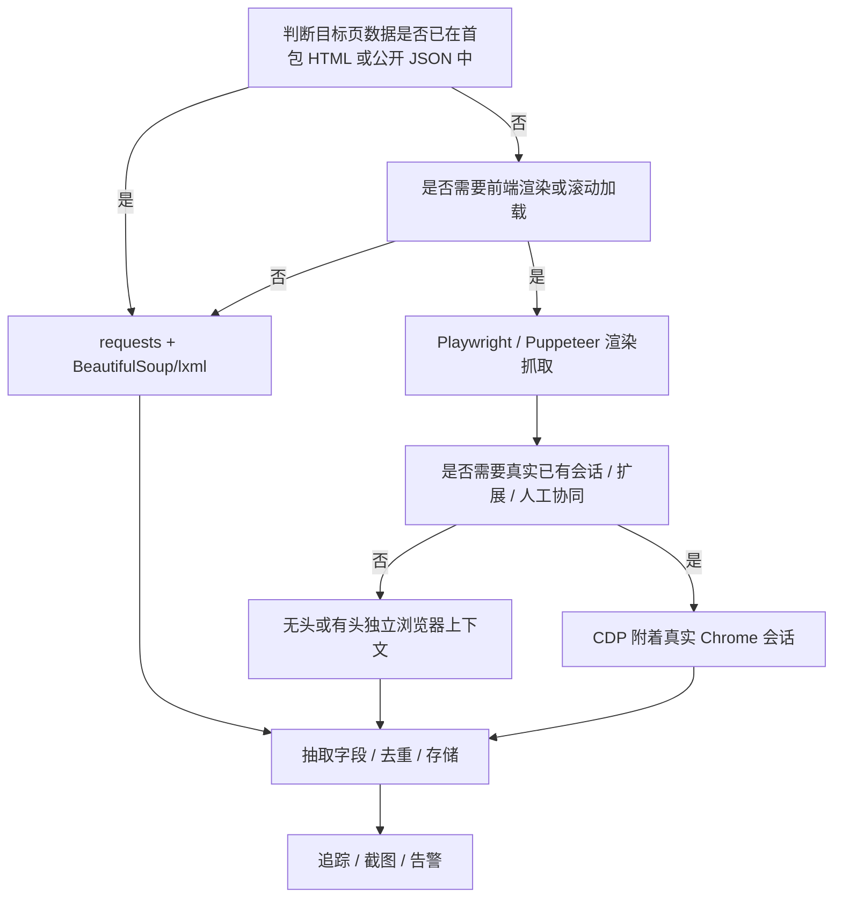

对非登录场景，我的推荐可以一句话概括：**能不用浏览器就不用浏览器；必须用浏览器时优先 Playwright；只有当“真实用户环境”本身就是需求的一部分时，再去附着真实 Chrome。**如果你在这里直接上 browser-use agent、Stagehand 之类 AI browser agent，通常是在**花 token 解决一个本来不需要模型的问题**。对采集系统来说，这往往不是成本最优解。citeturn27view0turn27view1turn13view1

## 测试复现与监控

如果你要在本地或云环境做一个有说服力的 A/B 评测，建议把测试拆成**四类用例**。第一类是**静态公开页**，验证 `requests + BS4/lxml` 与浏览器渲染的成本差；第二类是**普通 SPA 动态页**，验证 Playwright / Puppeteer / CLI wrapper 的稳定性；第三类是**登录态页**，比如你自己的 x.com Following feed，验证 profile 复用、刷新成功率与会话持续时间；第四类是**挑战测试页**，例如指纹检测页或自建 canary 页面，用来测 webdriver、UA/client hints、权限、Canvas/WebGL 等暴露情况。Browser Use Cloud 文档甚至直接把 “passes CreepJS, BrowserLeaks” 当作 stealth 说明项，这也说明这类基准测试是有意义的。citeturn16view2

我建议记录以下指标：**成功率**、**首次可抽取时间**、**刷新到抽取完成时间**、**验证码/挑战触发率**、**会话失效率**、**提取的新内容数**、**单会话 CPU / RAM 占用**，以及**单千页成本**。其中，最关键的其实不是平均值，而是**P95 / P99 尾延迟**和**连续失败次数**，因为反爬系统往往不是“偶尔慢一点”，而是“突然整个账号/IP/profile 进入高风险状态”。这些指标是工程建议，但完全可以借助官方支持的 tracing / dashboard 能力来采集。citeturn36search0turn36search2turn40view4

对于 Playwright 体系，最值得利用的是 **Trace Viewer**。官方文档说明，Trace Viewer 可以查看记录的操作时间线、页面前后状态、日志、网络、错误和控制台；tracing API 则可以收集并保存 traces。对抓取系统来说，这意味着你可以在失败时自动保存 trace、截图和页面 HTML，后续不用“猜测脚本为什么挂了”，而是直接在 trace 里看见当时的 DOM、网络响应与控制台报错。citeturn36search0turn36search2turn36search4turn36search8

如果你偏 CLI / 运维式管理，agent-browser 的 dashboard 也很有价值。它的 README 明确写明，可观测面板会展示 live viewport、activity feed、console output，并且各会话会自动可见。这对“长时间跑、偶尔需要人工插手”的登录态抓取特别有用：你不需要时时盯着，但在挑战页、会话失效、按钮变更时，可以立刻接管。citeturn40view4turn40view1

报警策略上，我建议非常朴素但有效的三层设计。第一层是**即时错误**：比如连续 3 次刷新失败、页面跳回登录页、或挑战页关键字命中，就立刻告警。第二层是**趋势退化**：比如过去 1 小时成功率下降超过 20%、验证码率升高 3 倍、平均刷新耗时飙升到平时两倍。第三层是**数据质量**：比如以前每小时能抓到 50 条新内容，突然只剩 0–2 条，也要告警，因为这往往意味着你不是“今天没人发帖”，而是脚本失效、tab 没切到 Following、或者 feed 只抓到了置顶/缓存内容。对于非登录站点，还应把 `robots.txt` 读取进策略里；Python 标准库的 `urllib.robotparser` 提供 `can_fetch()`、`crawl_delay()` 与 `request_rate()` 等能力，可以作为你调度器的输入。citeturn35search0

## 结论与限制

**最强反爬 / 最像真人**：如果你接受付费浏览器基础设施，但又明确不希望“抓取本身消耗 LLM token”，我最推荐 **Browser Use Cloud 的 raw browser via CDP + Playwright/Puppeteer**。理由很简单：官方文档明确给了 hardened Chromium、指纹随机化、默认住宅代理、多国家代理、Cloudflare / PerimeterX 等反爬能力，而且 `Agent` 与 `Browser` 是分开的，你可以直接连 raw browser，不把任务交给模型。第二推荐是 **headed 真实 Chrome + Playwright（专用 profile / persistent context 或 CDP attach）+ sticky 住宅代理**。它不如前者 stealth 完整，但对“自己的登录态”与“小到中规模的动态抓取”是最稳妥、最可控的组合。citeturn16view2turn16view3turn17search0turn28search9turn24view3turn41view0

**最省成本 / 无 token**：对于**非登录静态站**，第一推荐永远是 **`requests + BeautifulSoup/lxml`**；这是最低成本、最低资源占用、最不需要维护浏览器状态的方案。对于**动态站或登录态站**，最省成本且依然零 token 的是 **Playwright（库）或 Playwright CLI**。Playwright 官方能力完整，而 Playwright CLI 又提供壳层会话管理、持久化与 `attach --cdp=chrome` 之类非常实用的入口。相比之下，browser-use 的 agent 路线与其他 AI browser agent 往往会把一个“浏览器工程问题”升级成“浏览器 + 模型推理问题”，除非你确实需要自然语言规划，否则不划算。citeturn7view0turn8view0turn13view1turn13view3turn24view3turn31search11

**最易实现 / 最适合工程化**：第一推荐仍然是 **Playwright**。原因是它在代理、持久化上下文、认证状态保存、事件订阅、网络监听、JS 执行、Trace Viewer 与多语言支持上非常平衡。第二推荐是 **Chrome Remote Debugging + Playwright**，但它的定位要说准确：**不是 stealth，而是“复用真实已登录会话”的最快方式**。如果你的核心问题是“我已经能登录，只想自动刷新我的 Following feed”，它特别合适；如果你的核心问题是“我要大规模对抗复杂 WAF”，它并不是最终答案。citeturn24view0turn24view3turn30search0turn31search1turn36search2turn16view0

**对你这个问题最直接的推荐分层**，可以收敛成一句话：  
如果是 **x.com 登录态、自用账号、想自动刷新关注页**，优先用 **专用 Chrome profile + CDP attach + Playwright**；  
如果是 **非登录公开站**，优先 **requests + BS4/lxml**；  
如果是 **强反爬且预算允许**，优先 **stealth cloud browser via CDP**，而不是再叠一层会消耗 token 的 agent。citeturn18search2turn24view3turn7view0turn16view2turn17search0

最后的**限制与开放问题**也需要坦诚写清。第一，x.com 的 DOM、可访问性名称和内部网络接口变化较快，因此本文给出的示例代码是**可执行框架**，但具体选择器需要你在当前页面上用 DevTools 校验。第二，我没有在真实 x.com 登录会话上做在线实测，因此没有给出“当前版本 X 在某 IP/某账号下的真实成功率”。第三，反爬效果高度依赖**账号年龄、IP 信誉、设备指纹、刷新频率、地理位置与历史行为**，任何单一框架都无法保证“永不触发挑战”。第四，在合规层面，X 的 TOS 与 Automation Rules 对网站脚本抓取都非常不友好；如果是企业生产用途，应优先评估**官方 API、获授权数据源或合法导出接口**，而不是直接把网站脚本抓取作为默认方案。citeturn21view0turn22view1