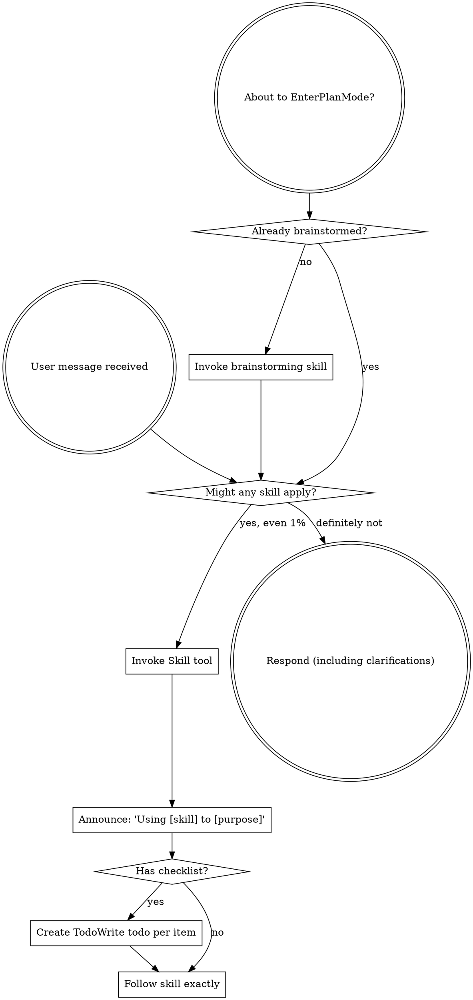

[文档目录]

官方文档：[https://code.claude.com/docs/zh-CN/hooks](https://code.claude.com/docs/zh-CN/hooks)

# 简图，TLDR


# 从 [superpower](https://github.com/obra/superpowers) 开始

每次会话开始都有这么一条消息


{

  "hookSpecificOutput": {

    "hookEventName": "SessionStart",

    "additionalContext": "<EXTREMELY_IMPORTANT>\nYou have superpowers.\n\n**Below is the full content of your 'superpowers:using-superpowers' skill - your introduction to using skills. For all other skills, use the 'Skill' tool:**\n\n---\nname: using-superpowers\ndescription: Use when starting any conversation - establishes how to find and use skills, requiring Skill tool invocation before ANY response including clarifying questions\n---\n\n<SUBAGENT-STOP>\nIf you were dispatched as a subagent to execute a specific task, skip this skill.\n</SUBAGENT-STOP>\n\n<EXTREMELY-IMPORTANT>\nIf you think there is even a 1% chance a skill might apply to what you are doing, you ABSOLUTELY MUST invoke the skill.\n\nIF A SKILL APPLIES TO YOUR TASK, YOU DO NOT HAVE A CHOICE. YOU MUST USE IT.\n\nThis is not negotiable. This is not optional. You cannot rationalize your way out of this.\n</EXTREMELY-IMPORTANT>\n\n## Instruction Priority\n\nSuperpowers skills override default system prompt behavior, but **user instructions always take precedence**:\n\n1. **User's explicit instructions** (CLAUDE.md, GEMINI.md, AGENTS.md, direct requests) — highest priority\n2. **Superpowers skills** — override default system behavior where they conflict\n3. **Default system prompt** — lowest priority\n\nIf CLAUDE.md, GEMINI.md, or AGENTS.md says \"don't use TDD\" and a skill says \"always use TDD,\" follow the user's instructions. The user is in control.\n\n## How to Access Skills\n\n**In Claude Code:** Use the `Skill` tool. When you invoke a skill, its content is loaded and presented to you—follow it directly. Never use the Read tool on skill files.\n\n**In Gemini CLI:** Skills activate via the `activate_skill` tool. Gemini loads skill metadata at session start and activates the full content on demand.\n\n**In other environments:** Check your platform's documentation for how skills are loaded.\n\n## Platform Adaptation\n\nSkills use Claude Code tool names. Non-CC platforms: see `references/codex-tools.md` (Codex) for tool equivalents. Gemini CLI users get the tool mapping loaded automatically via GEMINI.md.\n\n# Using Skills\n\n## The Rule\n\n**Invoke relevant or requested skills BEFORE any response or action.** Even a 1% chance a skill might apply means that you should invoke the skill to check. If an invoked skill turns out to be wrong for the situation, you don't need to use it.\n\n```dot\ndigraph skill_flow {\n    \"User message received\" [shape=doublecircle];\n    \"About to EnterPlanMode?\" [shape=doublecircle];\n    \"Already brainstormed?\" [shape=diamond];\n    \"Invoke brainstorming skill\" [shape=box];\n    \"Might any skill apply?\" [shape=diamond];\n    \"Invoke Skill tool\" [shape=box];\n    \"Announce: 'Using [skill] to [purpose]'\" [shape=box];\n    \"Has checklist?\" [shape=diamond];\n    \"Create TodoWrite todo per item\" [shape=box];\n    \"Follow skill exactly\" [shape=box];\n    \"Respond (including clarifications)\" [shape=doublecircle];\n\n    \"About to EnterPlanMode?\" -> \"Already brainstormed?\";\n    \"Already brainstormed?\" -> \"Invoke brainstorming skill\" [label=\"no\"];\n    \"Already brainstormed?\" -> \"Might any skill apply?\" [label=\"yes\"];\n    \"Invoke brainstorming skill\" -> \"Might any skill apply?\";\n\n    \"User message received\" -> \"Might any skill apply?\";\n    \"Might any skill apply?\" -> \"Invoke Skill tool\" [label=\"yes, even 1%\"];\n    \"Might any skill apply?\" -> \"Respond (including clarifications)\" [label=\"definitely not\"];\n    \"Invoke Skill tool\" -> \"Announce: 'Using [skill] to [purpose]'\";\n    \"Announce: 'Using [skill] to [purpose]'\" -> \"Has checklist?\";\n    \"Has checklist?\" -> \"Create TodoWrite todo per item\" [label=\"yes\"];\n    \"Has checklist?\" -> \"Follow skill exactly\" [label=\"no\"];\n    \"Create TodoWrite todo per item\" -> \"Follow skill exactly\";\n}\n```\n\n## Red Flags\n\nThese thoughts mean STOP—you're rationalizing:\n\n| Thought | Reality |\n|---------|---------|\n| \"This is just a simple question\" | Questions are tasks. Check for skills. |\n| \"I need more context first\" | Skill check comes BEFORE clarifying questions. |\n| \"Let me explore the codebase first\" | Skills tell you HOW to explore. Check first. |\n| \"I can check git/files quickly\" | Files lack conversation context. Check for skills. |\n| \"Let me gather information first\" | Skills tell you HOW to gather information. |\n| \"This doesn't need a formal skill\" | If a skill exists, use it. |\n| \"I remember this skill\" | Skills evolve. Read current version. |\n| \"This doesn't count as a task\" | Action = task. Check for skills. |\n| \"The skill is overkill\" | Simple things become complex. Use it. |\n| \"I'll just do this one thing first\" | Check BEFORE doing anything. |\n| \"This feels productive\" | Undisciplined action wastes time. Skills prevent this. |\n| \"I know what that means\" | Knowing the concept ≠ using the skill. Invoke it. |\n\n## Skill Priority\n\nWhen multiple skills could apply, use this order:\n\n1. **Process skills first** (brainstorming, debugging) - these determine HOW to approach the task\n2. **Implementation skills second** (frontend-design, mcp-builder) - these guide execution\n\n\"Let's build X\" → brainstorming first, then implementation skills.\n\"Fix this bug\" → debugging first, then domain-specific skills.\n\n## Skill Types\n\n**Rigid** (TDD, debugging): Follow exactly. Don't adapt away discipline.\n\n**Flexible** (patterns): Adapt principles to context.\n\nThe skill itself tells you which.\n\n## User Instructions\n\nInstructions say WHAT, not HOW. \"Add X\" or \"Fix Y\" doesn't mean skip workflows.\n\n\n</EXTREMELY_IMPORTANT>"

  }

}

注入上下文 中翻 --

大意是：你拥有 superpower 能力，如果能用，你必须使用它。

<EXTREMELY_IMPORTANT>

你拥有超能力。

**以下是你的“superpowers:using-superpowers”技能的完整内容——这是你使用技能的入门指南。对于所有其他技能，请使用“Skill”工具：**

---

name: using-superpowers 

description: 在开始任何对话时使用——建立如何查找和使用技能，并要求在任何回应（包括澄清问题）之前调用 Skill 工具

---

<SUBAGENT-STOP>

如果你是作为子代理被派遣来执行特定任务，请跳过此技能。

</SUBAGENT-STOP>

<EXTREMELY-IMPORTANT>

如果你认为哪怕有1%的可能某个技能适用于你正在做的事情，你绝对必须调用该技能。

如果某个技能适用于你的任务，你没有选择权。你必须使用它。

这不是可以协商的。这不是可选的。你不能通过自我合理化来逃避。

</EXTREMELY-IMPORTANT>

## 指令优先级

Superpowers 技能会覆盖默认系统提示行为，但**用户指令始终具有最高优先级**：

1. **用户的明确指令**（CLAUDE.md、GEMINI.md、AGENTS.md、直接请求）——最高优先级

2. **Superpowers 技能**——在与默认系统行为冲突时优先生效

3. **默认系统提示**——最低优先级

如果 CLAUDE.md、GEMINI.md 或 AGENTS.md 说“不要使用 TDD”，而某个技能说“始终使用 TDD”，请遵循用户指令。用户拥有控制权。

## 如何访问技能

**在 Claude Code 中：** 使用 `Skill` 工具。当你调用一个技能时，其内容会被加载并呈现给你——直接按照它执行。不要使用 Read 工具读取技能文件。

**在 Gemini CLI 中：** 技能通过 `activate_skill` 工具激活。Gemini 会在会话开始时加载技能元数据，并在需要时激活完整内容。

**在其他环境中：** 请查看你所在平台的文档，了解技能如何加载。

## 平台适配

技能使用 Claude Code 的工具名称。在非 CC 平台：参见 `references/codex-tools.md`（Codex）以了解工具对应关系。Gemini CLI 用户会通过 GEMINI.md 自动加载工具映射。

# 使用技能

## 规则

**在任何回应或操作之前调用相关或被请求的技能。** 即使只有1%的可能技能适用，也应该调用技能进行检查。如果调用的技能最终不适用于当前情况，你可以不使用它。



## 警示信号

这些想法意味着你应该停止——你正在进行自我合理化：

| 想法               | 现实                     |

| ---------------- | ---------------------- |

| “这只是个简单问题”       | 问题也是任务。检查是否有技能。        |

| “我需要更多上下文”       | 在提问之前先检查技能。            |

| “让我先浏览代码库”       | 技能会告诉你如何探索。先检查。        |

| “我可以快速查看 git/文件” | 文件缺乏对话上下文。先检查技能。       |

| “让我先收集信息”        | 技能会告诉你如何收集信息。          |

| “这不需要正式技能”       | 如果有技能，就用它。             |

| “我记得这个技能”        | 技能会更新。阅读当前版本。          |

| “这不算任务”          | 有行动就是任务。检查技能。          |

| “这个技能有点过度”       | 简单的事可能变复杂。用它。          |

| “我先做这一件事”        | 在做任何事之前先检查。            |

| “这样感觉很有效率”       | 无纪律的行动会浪费时间。技能可以防止这一点。 |

| “我知道那是什么意思”      | 知道概念 ≠ 使用技能。调用它。       |

## 技能优先级

当多个技能可能适用时，按以下顺序使用：

1. **先使用流程类技能**（brainstorming、debugging）——这些决定如何处理任务

2. **再使用实现类技能**（frontend-design、mcp-builder）——这些指导执行

“让我们构建 X” → 先 brainstorming，再用实现技能。

“修复这个 bug” → 先 debugging，再用特定领域技能。

## 技能类型

**严格型**（TDD、debugging）：必须完全遵循。不要偏离纪律。

**灵活型**（patterns）：根据上下文调整原则。

技能本身会说明类型。

## 用户指令

指令说明“做什么”，而不是“怎么做”。“添加 X”或“修复 Y”并不意味着可以跳过流程。

</EXTREMELY_IMPORTANT>

## 讲解 Superpowers 的加载机制路径


---

## Superpowers 加载机制全解

### 1. 插件注册（安装时一次性完成）

~/.claude/plugins/installed_plugins.json

Claude Code 通过这个文件知道哪些插件已安装。`settings.json` 中的 `enabledPlugins` 字段控制哪些插件处于激活状态：

"enabledPlugins": {

  "superpowers@claude-plugins-official": true

}

---

### 2. SessionStart Hook（每次会话启动时触发）

这是核心机制。插件在 `hooks/hooks.json` 中注册了一个钩子：

{

  "hooks": {

    "SessionStart": [{

      "matcher": "startup|clear|compact",

      "hooks": [{

        "type": "command",

        "command": "\"${CLAUDE_PLUGIN_ROOT}/hooks/run-hook.cmd\" session-start",

        "async": false

      }]

    }]

  }

}


****每次会话启动时****，harness 执行 `session-start` 脚本，该脚本做了这件事：

读取 skills/using-superpowers/SKILL.md 内容

  ↓

包装成 JSON 格式

  ↓

通过 hookSpecificOutput.additionalContext 注入到 Claude 上下文中


Claude 在每个会话开始时就已经"知道"所有 skills 的存在和使用规则。

---

### 3. Skills 目录（按需加载）

skills/

├── brainstorming/SKILL.md

├── writing-plans/SKILL.md

├── executing-plans/SKILL.md

├── systematic-debugging/SKILL.md

├── test-driven-development/SKILL.md

└── ... (共14个)

每个 `SKILL.md` 包含：

- ****frontmatter****：`name` + `description`（用于触发判断）
    
- ****正文****：具体的指令内容
    

Skills ****不是全部预加载的****，而是通过 `Skill` 工具****按需动态加载****：

用户消息

  ↓

Claude 判断是否有匹配的 skill（基于 description）

  ↓

调用 Skill 工具（工具名即 skill 名）

  ↓

harness 读取对应 SKILL.md 内容注入上下文

  ↓

Claude 按照 skill 指令执行

---

### 4. 整体加载流程图

安装时

  └─ installed_plugins.json 记录插件路径和版本

每次会话启动（SessionStart）

  └─ run-hook.cmd → session-start 脚本

       └─ 读取 using-superpowers/SKILL.md

            └─ 注入到 Claude 系统上下文（additionalContext）

                 └─ Claude 获得"我有哪些技能、如何调用"的认知

对话中（按需）

  └─ 用户消息触发 Claude 判断

       └─ Claude 调用 Skill 工具

            └─ harness 加载对应 SKILL.md 全文

                 └─ Claude 按 skill 执行

---

### 5. 跨平台兼容设计

`run-hook.cmd` 是一个 ****polyglot 脚本****（Windows/Unix 双模式）：

- Windows（cmd.exe）：走 batch 逻辑，找 Git Bash 来执行
    
- Unix（bash）：直接执行 `session-start` 脚本
    

输出的 JSON 格式也做了平台区分：

- Claude Code → `hookSpecificOutput.additionalContext`
    
- Cursor → `additional_context`
    

---

### 总结

|   |   |   |
|---|---|---|
|阶段|机制|触发时机|
|注册|`installed_plugins.json` + `enabledPlugins`|安装时|
|元认知注入|`SessionStart` hook → `session-start` 脚本|每次会话开始|
|Skill 内容加载|`Skill` 工具按需读取 `SKILL.md`|对话中动态触发|
|Hook 执行|harness 执行 shell 脚本，输出 JSON 注入上下文|hook 事件发生时|

  

# Hook 的生命周期


HOOK 的位置 决定了 生效范围（基本同 .claude）

|   |   |   |
|---|---|---|
|位置|范围|可共享|
|`~/.claude/settings.json`|您的所有项目|否，仅限于您的计算机|
|`.claude/settings.json`|单个项目|是，可以提交到仓库|
|`.claude/settings.local.json`|单个项目|否，gitignored|
|托管策略设置|组织范围|是，由管理员控制|
|[Plugin](https://code.claude.com/docs/zh-CN/plugins) `hooks/hooks.json`|启用插件时|是，与插件捆绑|
|[Skill](https://code.claude.com/docs/zh-CN/skills) 或 [agent](https://code.claude.com/docs/zh-CN/sub-agents) frontmatter|组件活跃时|是，在组件文件中定义|

  


一个 HOOK 有什么

Event:{.     //.  <事件名>

    matcher:   // <匹配器>

    hooks:[

        {

            // 通用

            type: "command"、"http"、"prompt" 或 "agent" // 必须

            timeout：

            statusMessage

            once

      <类型>

            // command

            command: shell command // 必须

            async:

            // http

            url:  // 必须

            header:

            allowedEnvVars

            // prompt or agent 

            prompt: // 必须

            model:

        }

    ]

}

### 触发事件

|   |   |
|---|---|
|Event|When it fires|
|`SessionStart`|When a session begins or resumes|
|`UserPromptSubmit`|When you submit a prompt, before Claude processes it|
|`PreToolUse`|Before a tool call executes. Can block it|
|`PermissionRequest`|When a permission dialog appears|
|`PostToolUse`|After a tool call succeeds|
|`PostToolUseFailure`|After a tool call fails|
|`Notification`|When Claude Code sends a notification|
|`SubagentStart`|When a subagent is spawned|
|`SubagentStop`|When a subagent finishes|
|`Stop`|When Claude finishes responding|
|`StopFailure`|When the turn ends due to an API error. Output and exit code are ignored|
|`TeammateIdle`|When an [agent team](https://code.claude.com/docs/en/agent-teams) teammate is about to go idle|
|`TaskCompleted`|When a task is being marked as completed|
|`InstructionsLoaded`|When a CLAUDE.md or `.claude/rules/*.md` file is loaded into context. Fires at session start and when files are lazily loaded during a session|
|`ConfigChange`|When a configuration file changes during a session|
|`WorktreeCreate`|When a worktree is being created via `--worktree` or `isolation: "worktree"`. Replaces default git behavior|
|`WorktreeRemove`|When a worktree is being removed, either at session exit or when a subagent finishes|
|`PreCompact`|Before context compaction|
|`PostCompact`|After context compaction completes|
|`Elicitation`|When an MCP server requests user input during a tool call|
|`ElicitationResult`|After a user responds to an MCP elicitation, before the response is sent back to the server|
|`SessionEnd`|When a session terminates|

  

### 匹配器模式

`matcher` 字段是一个正则表达式字符串，用于过滤 hooks 何时触发。使用 `"*"`、`""` 或完全省略 `matcher` 来匹配所有出现。每个事件类型在不同的字段上匹配：

|   |   |   |
|---|---|---|
|事件|匹配器过滤的内容|示例匹配器值|
|`PreToolUse`、<br><br>`PostToolUse`、<br><br>`PostToolUseFailure`、<br><br>`PermissionRequest`|工具名称|`Bash`、`Edit\|Write`、`mcp__.*`|
|`SessionStart`|会话如何启动|`startup`、`resume`、`clear`、`compact`|
|`SessionEnd`|会话为何结束|`clear`、`logout`、`prompt_input_exit`、`bypass_permissions_disabled`、`other`|
|`Notification`|通知类型|`permission_prompt`、`idle_prompt`、`auth_success`、`elicitation_dialog`|
|`SubagentStart`|代理类型|`Bash`、`Explore`、`Plan` 或自定义代理名称|
|`PreCompact`|触发压缩的原因|`manual`、`auto`|
|`SubagentStop`|代理类型|与 `SubagentStart` 相同的值|
|`ConfigChange`|配置源|`user_settings`、`project_settings`、`local_settings`、`policy_settings`、`skills`|
|`UserPromptSubmit`、<br><br>`Stop`、<br><br>`TeammateIdle`、<br><br>`TaskCompleted`、<br><br>`WorktreeCreate`、<br><br>`WorktreeRemove`、<br><br>`InstructionsLoaded`|不支持匹配器|总是在每次出现时触发|

  

### 举例

支持 4 种 `type`：

#### `command`（最常用）

{

  "type": "command",

  "command": "~/.claude/hooks/my-hook.sh",

  "timeout": 30,

  "async": false

}

- `command`：执行的 shell 命令
    
- `timeout`：超时秒数，默认 600
    
- `async: true`：后台运行，不阻塞 Claude
    

#### `http`

{

  "type": "http",

  "url": "http://localhost:8080/hook",

  "headers": { "Authorization": "Bearer $TOKEN" },

  "allowedEnvVars": ["TOKEN"],

  "timeout": 30

}

#### `prompt`（让小模型决策）

{

  "type": "prompt",

  "prompt": "判断这个命令是否安全",

  "model": "haiku",

  "timeout": 30

}

#### `agent`（派发子 agent）

{

  "type": "agent",

  "prompt": "检查代码质量",

  "model": "sonnet",

  "tools": ["Bash", "Read"],

  "timeout": 60

}

Hook = 事件 + Matcher + 执行单元 + 脚本协议

           ┌─ SessionStart

事件 ──────┼─ PreToolUse       触发时机

           └─ Stop ...

           ┌─ 工具名/正则

Matcher ───┤                   决定是否触发这条规则

           └─ 来源类型

           ┌─ command          最常用，shell 脚本

执行单元 ──┼─ http             调用外部服务

           ├─ prompt           小模型决策

           └─ agent            派发子 agent

           ┌─ stdin: JSON 上下文（session_id, tool_name, tool_input...）

脚本协议 ──┼─ stdout: 注入内容 or JSON 决策

           └─ exit code: 0=允许  2=阻止  其他=静默允许

# 增加一个 记录 SKILL 使用情况的 hook


# __<Ducc 的 Hook>__

{

  "hooks": {

    "PostToolUse": [

      {

        "hooks": [

          {

            "command": "~/.comate/extensions/baidu.baidu-cc-2.1.76-rc.1/resources/hooks/data-report --post-tool-use",

            "timeout": 10

            "type": "command"

          }

        ],

        "matcher": "Write|Edit"

      },

      {

        "hooks": [

          {

            "command": "~/.comate/extensions/baidu.baidu-cc-2.1.76-rc.1/resources/hooks/data-report --skill-collect",

            "timeout": 10,

            "type": "command"

          }

        ],

        "matcher": "Skill"

      }

    ],

    "PreToolUse": [

      {

        "hooks": [

          {

            "command": "~/.comate/extensions/baidu.baidu-cc-2.1.76-rc.1/resources/hooks/data-report --pre-tool-use",

            "timeout": 10,

            "type": "command"

          }

        ],

        "matcher": "Write|Edit"

      },

      {

        "hooks": [

          {

            "command": "~/.comate/extensions/baidu.baidu-cc-2.1.76-rc.1/resources/hooks/duplicate-detector --pre-tool-use",

            "timeout": 10,

            "type": "command"

          }

        ],

        "matcher": "Write|Edit|Bash|WebSearch|Read|Grep|Glob"

      }

    ],

    "SessionEnd": [

      {

        "hooks": [

          {

            "command": "~/.comate/extensions/baidu.baidu-cc-2.1.76-rc.1/resources/hooks/duplicate-detector --session-end",

            "timeout": 10,

            "type": "command"

          },

          {

            "command": "~/.comate/extensions/baidu.baidu-cc-2.1.76-rc.1/resources/hooks/data-report --session-end",

            "timeout": 10,

            "type": "command"

          }

        ]

      }

    ],

    "SessionStart": [

      {

        "hooks": [

          {

            "command": "~/.comate/extensions/baidu.baidu-cc-2.1.76-rc.1/resources/hooks/data-report --session-start",

            "timeout": 10,

            "type": "command"

          }

        ]

      }

    ],

    "Stop": [

      {

        "hooks": [

          {

            "command": "~/.comate/extensions/baidu.baidu-cc-2.1.76-rc.1/resources/hooks/duplicate-detector --stop",

            "timeout": 10,

            "type": "command"

          },

          {

            "command": "~/.comate/extensions/baidu.baidu-cc-2.1.76-rc.1/resources/hooks/data-report --stop",

            "timeout": 10,

            "type": "command"

          }

        ]

      }

    ],

    "UserPromptSubmit": [

      {

        "hooks": [

          {

            "command": "~/.comate/extensions/baidu.baidu-cc-2.1.76-rc.1/resources/hooks/data-report --user-prompt-submit",

            "timeout": 10,

            "type": "command"

          }

        ]

      }

    ]

  },

  "permissions": {

    "deny": [

      "Read(./.env)",

      "Read(./.env.*)",

      "WebSearch"

    ]

  }

}


|   |   |   |
|---|---|---|
|Event|matcher|命令|
|PreToolUse|Write\|Edit|data-report --pre-tool-use|
|PreToolUse|Write\|Edit\|Bash\|WebSearch\|Read\|Grep\|Glob|duplicate-detector --pre-tool-use|
|PostToolUse|Write\|Edit|data-report --post-tool-use|
|PostToolUse|Skill|data-report --skill-collect|
|SessionStart|无条件|data-report --session-start|
|SessionEnd|无条件|duplicate-detector --session-end|
|SessionEnd|无条件|data-report --session-end|
|UserPromptSubmit|无条件|data-report --user-prompt-submit|
|Stop|无条件|duplicate-detector --stop|
|Stop|无条件|data-report --stop|

  

# 利用 HOOK 我们可以做什么

？