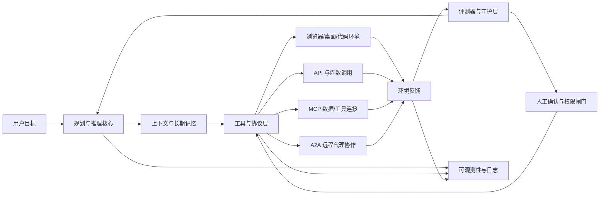

# 现在 AI Agent 发展的最新方向研究报告

## 执行摘要

在 2024—2026 这一轮演进中，AI Agent 的核心变化，不是“把大模型再包一层 UI”，而是从**单次问答模型**转向**可持续运行的系统**：它们开始具备更强的多步推理、工具调用、跨系统执行、长期状态管理、观测与评测，以及在必要时与人协同的能力。OpenAI 将构建重心放在 Responses API、Agents SDK、AgentKit、内置工具和评测体系上；Anthropic 则将重点推进到 context engineering、MCP、computer use、managed agents 与 agent evals；Google DeepMind 则明确把“通用 AI 助手”作为方向，将 Gemini、Project Astra、Project Mariner、A2A、ADK 与 Agent Engine 串成一条产品和研究主线。本文的判断是：**Agent 正从“模型能力问题”快速转为“系统工程问题”**。citeturn26view0turn31view1turn29view3turn30view0turn38view0

从技术层面看，最新方向可概括为六条主线：**推理模型与规划能力增强、长期记忆与状态化、工具与协议标准化、多代理与分布式协作、多模态与计算机/浏览器操作、具身与世界模型**。这些方向已经不再是分散的科研点，而是逐步在产品中汇合：例如，OpenAI 的推理模型开始“agentically use and combine every tool”；Anthropic 将“上下文工程”视为比传统 prompt engineering 更关键的新范式；Google 则把 Project Astra 的视频理解、屏幕共享、记忆与电脑控制并入“通用 AI 助手”的路线图。citeturn31view0turn29view5turn30view0turn30view1

但与此同时，Agent 的“可用性边界”仍然很清晰。WebArena、OSWorld、AssistantBench、SWE-bench、LoCoMo、MemBench 等现实场景评测说明，开放环境中的网页导航、跨应用操作、长期记忆与稳定执行仍远未完全解决；尽管成绩从 2024 到 2026 有明显提升，例如 Claude Sonnet 4.5 在 OSWorld 上达到 61.4%，但这并不意味着通用 Agent 已在所有真实任务上达到人类水平。现实部署中最突出的难题，依然是**提示注入、过度授权、隐私泄露、不可逆操作、长链路错误传播和评测困难**。citeturn4search1turn35view0turn35view1turn35view3turn35view2turn29view6turn3search14turn28view3turn28view4turn22search5

对技术决策者而言，最具确定性的机会不是“全能个人 AGI 助手”本身，而是三类更现实的方向：**高价值垂直 Agent、Agent 运行时与安全治理基础设施、以及围绕协议和连接器的企业级集成层**。在未来一到三年，AI Agent 的竞争焦点很可能从“谁的模型更强”转向“谁能更安全地把模型接到真实世界并稳定交付结果”。citeturn31view1turn29view3turn26view3turn26view4turn27search2

## 定义与分类

结合中国网信办 2026 年《智能体规范应用与创新发展实施意见》、中国信通院 2025 年政务智能体报告，以及近两年的 Agent 综述文献，本文采用一个偏工程化的定义：**AI Agent 是具备自主感知、记忆、决策、交互与执行能力，能够在目标约束下通过工具、环境与人协同完成任务的智能系统**。这一界定比“会对话的大模型应用”更严格，因为它强调外部行动能力、持续状态与任务闭环。citeturn26view4turn27search1turn6search1

从能力结构看，当前 Agent 可以大致分为几类。第一类是**单模态 Agent**，主要围绕文本输入、知识检索、分析写作、代码修改与工作流编排展开，常见于客服、研究、法务、投研和软件开发。第二类是**多模态 Agent**，同时使用文本、图像、音频、视频或界面像素进行理解和行动，代表方向包括浏览器代理、桌面代理、手机代理与视觉辅助系统。Project Astra、OpenAI computer use、Anthropic computer use 都属于这一类。citeturn30view1turn28view5turn29view1

第三类是**工具使用型 Agent**，也是目前商业化最快的一类。这类系统通过 API、函数调用、数据库、RAG、代码执行器、浏览器、文件系统等外部能力来“补足模型天花板”，其关键问题已从“是否会调用工具”转向“如何在正确时机调用正确工具，并在失败后恢复”。OpenAI Responses API、Anthropic 的 advanced tool use 与 Google 的 ADK/Agent Engine 都在朝这一方向收敛。citeturn26view0turn28view6turn37search10turn38view0

第四类是**内省型或反思型 Agent**。这类系统强调可控推理、元推理、自我检查、错误恢复与上下文管理。其典型信号包括 OpenAI reasoning + tools、Anthropic 的 hybrid reasoning、visible/extended thinking、“think” tool，以及 Google/DeepMind 的自发现推理结构研究 SELF-DISCOVER。这里的核心变化并不是把推理过程“展示出来”，而是把推理从一次性文本技巧，升级为可嵌入执行循环的系统能力。citeturn31view0turn37search7turn37search0turn7search7

第五类是**协作型与分布式多代理系统**。这一方向在 2025—2026 年明显升温：Anthropic 把 Research 做成并行子代理系统；Microsoft 的 Magentic-One 采用 orchestrator + specialist agents 的架构；CrewAI、AutoGen 等开源框架把多代理协作标准化；Google 进一步把 agent-to-agent 通讯协议 A2A 推向开放标准。它们反映出一个重要趋势：**复杂任务不再由单个“万能代理”解决，而是由多个专长代理分工协同。**citeturn29view4turn35view6turn26view7turn33view2turn26view3

第六类是**具身 Agent**。这类系统不只理解数字世界，还要在物理或仿真环境中规划与行动。Google DeepMind 的 Genie 2、Gemini Robotics、Gemini Robotics-ER、SIMA 2，都表明“世界模型 + embodied reasoning + action interface”正在成为长期前沿方向。就成熟度而言，这一方向仍主要处于研究和受限试点阶段，但它对中长期产业格局影响很大。citeturn30view3turn30view4turn30view6turn30view5

## 关键技术进展

最近两年的第一个关键进展，是**推理模型与规划能力从“答题增强”转向“行动增强”**。OpenAI 在 2025 年明确表示，推理模型首次可以在 ChatGPT 中“agentically use and combine every tool”，并把这视为迈向更具代理性的系统；Anthropic 则把 Claude 3.7 及后续模型定义为 hybrid reasoning model，并通过 “think” tool、extended thinking 和 context engineering 把复杂推理融入工具调用；Google 将 Gemini 2 解释为“thinking、reasoning、tool use 的基础”，Gemini 3 则把这些能力合并为 agent foundation。换言之，Agent 规划正在从“链式提示模板”走向**可调度的 reasoning runtime**。citeturn31view0turn37search7turn37search3turn29view5turn26view2turn24search15

第二个关键进展，是**记忆与状态化从外挂式 RAG 迈向可写、可管、可评测的长期记忆系统**。Letta 已把 stateful agent、memory blocks、shared memory 和 read-only memory 做成基础概念；LoCoMo 与 MemBench 则说明，仅仅延长上下文窗口不足以解决长期对话和长期任务问题，模型在时间因果、跨会话一致性和多模态长期记忆方面仍显著落后于人类；Mem0 等记忆架构则尝试用显著性提取、合并和图结构记忆来降低 token 成本并提升长期效果。这里的最新方向不是“更长 context”，而是**把记忆做成一层独立于模型的系统能力**。citeturn33view0turn33view1turn35view3turn35view2turn6search2

第三个关键进展，是**工具调用正在标准化和协议化**。OpenAI 在 Responses API 中把 web search、file search、computer use 和 remote MCP 放到同一工具面；Anthropic 推出 MCP，把模型接入数据源、工具与工作流的方式从“每家各写一套 connector”重构为通用协议；Google 则推进 A2A，试图解决“代理之间如何发现、认证、互通与协作”的问题。MCP 更像“模型—工具/上下文”层的标准，A2A 更像“代理—代理”层的标准。二者叠加意味着 AI Agent 的系统栈正逐渐形成类似互联网协议分层的生态。citeturn26view0turn28view6turn29view0turn32view0turn26view3turn32view2turn38view0

第四个关键进展，是**长时运行与执行架构的系统化**。Anthropic 2026 年提出“decoupling the brain from the hands”，把 session、harness、sandbox 拆开；OpenAI 在 2025 年则强调 background mode、prompt caching、events/webhooks 等长期运行原语；Google 的 Agent Engine UI 也正在把 trace、session、deployment 做成生产环境管理界面。这说明生产级 Agent 的问题已明显超出 prompt 与模型精度——它需要状态存储、任务恢复、错误处理、权限管理和运行时隔离。citeturn29view3turn29view2turn31view4turn38view0

第五个关键进展，是**多模态感知与界面操作正在从演示走向受控部署**。Anthropic 在 2024 年公开 computer use，OpenAI 在 2025—2026 年把 computer use 做成通用工具回路，Google 的 Project Mariner 从浏览器原型发展到最多同时处理十项任务，Project Astra 则把视频理解、屏幕共享、记忆与设备间连续性整合为“通用 AI 助手”路线图。与此同时，OSWorld、WebArena 和 AssistantBench 这些真实环境 benchmark 把焦点拉回现实：Agent 必须面对网页、应用、文件、外设、网络延迟和不可预期页面状态，而非只在干净 API 里执行。citeturn29view1turn28view5turn30view0turn30view1turn35view0turn35view4turn35view1

第六个关键进展，是**强化学习、自动评测与外部验证器正在成为 Agent 提升的关键路径**。OpenAI 的 RFT 让开发者通过 grader 对 reasoning models 进行强化微调；Anthropic 明确提出 agent evals 的核心难点是多轮工具调用与环境状态修改；Google DeepMind 的 AlphaEvolve 则把模型、自动验证器和进化搜索结合起来做算法发现。一个明显趋势是：**Agent 的能力不再只靠更大的预训练获得，而是越来越依赖“模型 + grader/evaluator + 环境反馈”的闭环。**citeturn31view2turn31view3turn29view6turn24search0

第七个关键进展，是**具身智能与世界模型开始与 Agent 主线合流**。Genie 2 可以从单张图像生成可交互的 3D 环境，作为训练和评估 embodied agents 的无限课程；Gemini Robotics 通过 VLA 与 embodied reasoning 双模型路线，把感知、规划与物理动作打通；SIMA 2 则从 instruction-following 升级为会对话、会推理、能长期改进的虚拟世界 agent。虽然这些系统仍远未进入广泛商业部署，但它们清楚表明：中长期真正的“代理化”不会只停留在浏览器和办公软件里。citeturn30view3turn30view4turn30view6turn30view5

下图概括了 2025—2026 年最典型的生产级 Agent 架构。它反映的是行业收敛方向，而非某一家公司的唯一实现。该图基于 OpenAI 的 Responses/Tools 体系、Anthropic 的 session-harness-sandbox 架构、MCP/A2A 协议，以及 Google/Anthropic 对长期运行、多代理与安全确认的公开做法综合抽象而成。citeturn26view0turn29view3turn32view0turn26view3turn38view0turn28view5

## 产业化与产品化案例

当前产业化最成熟的落地方向，集中在四类场景：**研究与知识工作、软件开发与运维、企业流程自动化、以及多系统办公协同**。Research agent、coding agent 和 browser/computer-use agent 是最典型的三条主线：OpenAI deep research 面向高强度知识工作者；Anthropic 与 OpenHands、Jules 则重点占领 agentic coding；Google、OpenAI、Anthropic 共同推动浏览器与桌面任务自动化；中国本土产品如 Manus、扣子、阿里云百炼/灵码等，则更强调办公、开发和企业应用的可快速交付。citeturn31view5turn33view3turn30view2turn29view1turn34view0turn21search0turn34view2turn34view3

| 平台/项目 | 近两年代表能力 | 典型场景 | 交付形态与商业路径 | 代表依据 |
|---|---|---|---|---|
| OpenAI Agents SDK / Responses API / AgentKit / deep research | 统一 Responses API、内置 web/file/computer tools、多代理工作流、Agent Builder、Evals、RFT、研究型 agent | 深度研究、客服、企业助手、流程自动化 | API 调用 + 企业平台 + 可视化工作流 + 内置评测 | citeturn26view0turn31view1turn31view5turn31view2 |
| Anthropic MCP / computer use / Managed Agents / Research | MCP 标准、computer use、multi-agent research system、managed agents、context engineering、agent evals | 编码、研究、金融、浏览器任务、长时任务 | 平台 API + 托管 agent + 协议生态 + 行业模板 | citeturn29view0turn29view1turn29view3turn29view4turn29view6 |
| Google DeepMind / Google Cloud Agents | Gemini 通用助手路线、Project Astra、Project Mariner、Jules、ADK、Agent Engine、A2A | 浏览器操作、跨系统任务、编码、云端企业代理 | 云平台 + SDK + 协议 + 研究原型转产品 | citeturn30view0turn30view1turn30view2turn26view3turn38view0 |
| Meta Llama Stack | 将 inference、storage、safety、tool calling、agent orchestration 做成统一 OpenAI-compatible server | 私有化部署、企业自建 agent 平台、开放生态 | 开源/开放栈 + 服务端抽象 + 多提供方接入 | citeturn23search1turn11search4turn23search0 |
| LangGraph / LangSmith | 长时、可恢复、可追踪的 agent orchestration；可观测、评测、部署一体化 | 企业工作流、复杂状态机、生产级代理监控 | 开源编排框架 + SaaS/私有化 observability/evals | citeturn26view6turn18search0turn18search4 |
| AutoGen / Magentic-One | 多代理对话和协作框架；orchestrator 指挥专长代理；配套 benchmark 工具 | 通用复杂任务、网页与文件混合任务、研究实验 | 开源框架 + 研究基准 + 可扩展多代理系统 | citeturn26view7turn35view6 |
| OpenHands | 软件代理 SDK、CLI、Local GUI、Cloud、Enterprise，自带代码/系统交互能力 | 代码修复、测试编写、自动审查、开发协作 | 开源 SDK + 商业 Cloud/Enterprise | citeturn33view3turn13search0turn13search9 |
| Manus | 自主通用 agent、沙盒环境、互联网访问、持久文件系统、自定义工具 | 办公任务、研究、内容生成、结果交付 | 订阅式产品 + 面向个人与团队的 agent 平台 | citeturn34view0turn21search3 |

如果从开源社区的演化看，LangGraph、AutoGen、CrewAI 和 OpenHands 更接近当前“生产可用”的基础设施层；AutoGPT 与 BabyAGI 则更像上一阶段的重要启蒙项目，它们推动了任务规划、自主循环、基准测试和函数/触发式执行环境等理念扩散，但在 2025—2026 的主流生产栈中，其角色更多转向生态启发与原型孵化。citeturn26view6turn26view7turn33view2turn33view3turn8search3turn33view4

中国市场的路线也已逐渐清晰。Manus 明确把自己定义为“拥有自己电脑的虚拟同事”；阿里云百炼与灵码则把“智能体应用调用”“自定义智能体”“subagent 调度”和独立工具权限做成官方开发入口；扣子则把 AI Agent 办公平台和跨设备、跨渠道行动力作为主要卖点。与国际厂商相比，本土产品更强调“办公结果交付”和“企业场景快速接入”，而不是先做大而全的研究型 agent。citeturn34view0turn34view2turn34view3turn21search0

就商业模式而言，当前最稳固的并不是“卖一个会思考的模型”，而是四种组合：**按调用计费的 Agent API、按席位收费的企业助手、面向企业的托管工作流平台、以及围绕监控/评测/安全/连接器的基础设施服务**。OpenAI、Anthropic、Google、LangChain、OpenHands 的产品路径几乎都在向这四类模式聚拢，这也是判断行业进入“系统层竞争”的重要依据。citeturn31view1turn29view3turn38view0turn18search0turn33view3

## 风险、治理与合规

AI Agent 的头号安全问题已经从一般意义上的“幻觉”升级为**提示注入驱动的越权行动**。OpenAI 明确把 prompt injection 定义为 frontlier security challenge；Anthropic 则指出，对于 browser-based agents 来说，每个网页、嵌入文档、广告和动态脚本都可能成为攻击向量；OWASP 2025 中文版则进一步把“过度自主性”“系统提示泄露”“无限制消耗”等纳入高风险项。这意味着：一旦 Agent 能浏览网页、连企业知识库、执行命令或发邮件，它的风险形态就更接近“操作系统和浏览器安全”，而不再只是 NLP 输出质量问题。citeturn28view3turn28view4turn22search5turn22search1

因此，生产级 Agent 的安全设计必须默认采用**零信任外部内容**。OpenAI 的 computer use 指南建议在隔离浏览器或容器中运行工具、为域名与动作建立 allow-list、对购买与破坏性操作保留 human in the loop；Anthropic 的浏览器防护实践则强调针对 prompt injection 的强化学习与持续对抗评测；Meta 的开发者指南也明确提出应设定 agent use policies，限定智能体可采取的动作范围。高质量 Agent 的安全，不是靠一道 system prompt，而是靠**权限、隔离、确认、评测与审计**的组合。citeturn28view5turn28view4turn23search5

隐私与数据治理同样正在成为 Agent 设计的一级约束。NIST 2024 的 Generative AI Profile 明确将可信度纳入设计、开发、使用和评估全过程；OpenAI 在 Responses API 中强调 business data 默认不用于训练，并通过 connector、remote MCP、workspace controls 等方式增强企业控制；Google 的 Agent Engine UI 和 A2A 标准化认证机制，也说明企业部署越来越依赖可追踪的 session、trace 和身份边界。对于 Agent 来说，**能接入多少数据和工具，不该只取决于“模型是否足够聪明”，更要取决于组织是否能证明其边界可控。**citeturn28view1turn26view0turn38view0turn32view1

从监管与标准化看，2025—2026 的最大变化，是全球主要司法辖区都在从“原则讨论”转向“落地机制”。欧盟 GPAI Code of Practice 已在 2025 年发布，并聚焦透明度、版权、安全与系统性风险；中国网信办在 2026 年发布《智能体规范应用与创新发展实施意见》，明确提出任务理解、任务规划、工具使用、长期记忆、互认互通、群体协同等技术攻关，并要求布局数据交换、质量评测、安全保障、可信认证等标准体系；中国 2024 版《国家人工智能产业综合标准化体系建设指南》则为更宽泛的质量、安全、数据和产业标准化提供框架。可以说，**Agent 正在从“产品创新对象”转变为“治理对象”与“标准对象”。**citeturn28view2turn26view4turn19search1

一个特别值得关注的趋势是**协议层合规**。MCP 已把 authorization 机制纳入规范讨论，A2A 也在 v0.2 及后续版本中推进标准化认证与更轻量的 stateless interaction。这意味着未来企业会越来越关注：代理如何被发现、如何声明能力、如何认证、如何在跨组织调用中回溯责任。这一层如果不成熟，多代理系统越开放，风险就越高。citeturn32view1turn38view0turn32view2

## 路线图、产业机会与建议

综合近两年的研究、产品发布与治理文件，本文给出一个简化的成熟度判断。需要说明的是，这不是行业统一标准，而是基于公开证据的分析性归纳。citeturn26view0turn29view3turn30view0turn27search2

| 方向 | 2024 关键信号 | 2025—2026 状态 | 成熟度判断 |
|---|---|---|---|
| 工具使用型数字 Agent | Responses API、computer use、MCP、ADK 初步成型 | 已进入企业试点和部分规模化部署，成为最确定的商业化主线 | **高** citeturn26view0turn29view0turn38view0 |
| 浏览器/电脑操作 Agent | Project Mariner、Anthropic computer use、OSWorld | 仍需受控部署与人工确认，但能力提升极快 | **中高** citeturn29view1turn30view0turn35view0 |
| 长期记忆与状态化 | LoCoMo 暴露能力缺口，Letta/Mem0 等架构出现 | 技术已进入系统化建设阶段，但长期一致性仍未解决 | **中** citeturn35view3turn33view0turn33view1turn6search2 |
| 多代理协作与分布式系统 | AutoGen、Magentic-One、Anthropic Research system | 在研究、编码、复杂知识任务中已有明显价值 | **中高** citeturn26view7turn35view6turn29view4 |
| 协议互通与连接器标准 | MCP、A2A 启动开放生态 | 2025—2026 进入快速标准化与企业集成阶段 | **中高** citeturn32view0turn26view3turn38view0 |
| 具身 Agent 与世界模型 | Genie 2、Gemini Robotics、SIMA 2 | 仍以研究与受限试点为主，中长期潜力最大 | **中低** citeturn30view3turn30view4turn30view5turn30view6 |

从机会看，短期最可做的是**高价值、低容错损失、成功标准明确**的垂直流程，例如研究分析、代码修复、合规初筛、文档工作流、客服分流和内部知识运维。Anthropic 自己也强调，Agent 最适合“有清晰成功标准、允许反馈循环、且有人类监督”的任务；OpenAI 与 Google 的产品路径也基本围绕这些高价值知识工作展开。citeturn26view1turn31view1turn30view0

中期最值得布局的是**Agent 基础设施层**。包括：统一工具协议网关、连接器治理、可观测与 trace grading、长期状态与可删除记忆层、权限策略与审批流、以及以 session/harness/sandbox 为核心的执行运行时。这些东西通常不如“模型升级”吸引眼球，但更可能构成难以替代的工程壁垒。citeturn29view3turn29view6turn18search0turn32view0turn32view1

长期则应关注**世界模型与具身执行**。Google DeepMind 已经把通用 AI 助手、世界模型、机器人 embodied reasoning 放到同一叙事里；中国信通院的 2025 年产业报告也把“探索世界模型”和“具身智能走出比特世界”视为关键路径。对于制造、物流、零售、公共服务等面向物理环境的行业，这条线会比纯办公 Agent 更具结构性价值。citeturn30view0turn30view3turn30view4turn27search2

基于上述研究，给出五条可操作建议：

- **优先做“窄场景、强闭环、可评测”的 Agent，而不是追求全能助手。** 最合适的切入点是有明确目标函数、可验证结果和可插入人工审批的流程。citeturn26view1turn29view6turn31view1
- **把连接器与协议层独立出来，优先兼容 MCP，并关注 A2A。** 这会显著降低未来模型和平台替换成本，也更利于企业治理。citeturn29view0turn32view0turn26view3turn38view0
- **在正式扩容前，先建设 evals、trace 与回放体系。** 未来真正拉开差距的，往往不是模型首轮回答，而是你是否能发现失败、定位失败并持续修复失败。citeturn29view6turn31view3turn18search0
- **采用“脑与手分离”的 runtime 设计。** 让推理核心、会话日志、执行沙盒、外部工具和权限控制彼此解耦，能显著提升安全、恢复性和跨环境部署能力。citeturn29view3turn29view2turn28view5
- **把长期记忆当作产品能力来治理，而不是简单打开长上下文。** 应从一开始就设计可写、可共享、可审计、可删除的记忆层，并明确 retention、更新与权限策略。citeturn33view0turn33view1turn35view3turn35view2

## 开放问题与局限

本文主要依据 2024—2026 年公开论文、官方技术文档、政策文件与公司公告整理而成，但仍有三点局限。其一，部分最新性能结果来自厂商自有评测或自有产品发布，跨平台横向可比性有限。其二，2025—2026 的不少能力仍处于 beta、research preview 或 limited access 阶段，产品形态和政策边界可能快速变化。其三，中国公开材料目前在治理、政务和产业趋势层面较强，但在统一的通用 Agent 标准 benchmark 与可复现对比方面，仍不如国际英文研究社区丰富。citeturn29view1turn31view1turn30view1turn27search1turn27search2