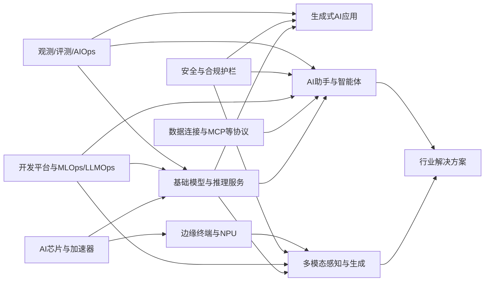
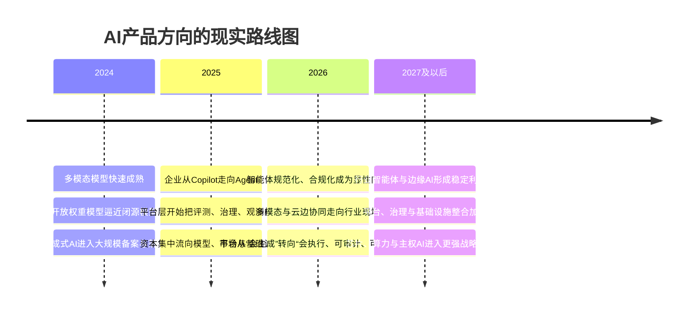

# 最新AI产品方向研究报告

## 执行摘要

近两年，AI 产品竞争的重心已经明显从“谁的基础模型更强”转向“谁能把模型嵌入工作流、控制成本、满足合规、形成可复制收入”。从总盘子看，IDC 预计全球 AI IT 投资将由 2024 年的 3,158 亿美元增至 2028 年的 8,159 亿美元，五年复合增长率为 32.9%；其中生成式 AI 到 2028 年将达到 2,842 亿美元，五年复合增长率高达 63.8%。中国市场方面，IDC 预计 2028 年中国 AI 总投资将突破 1,000 亿美元，五年复合增长率为 35.2%；中国生成式 AI 投资到 2028 年将超过 300 亿美元，五年复合增长率为 51.5%。同时，IDC 指出中国 AI 市场中“智能基础设施调配”已经占到约四成支出，说明算力与平台层仍是近两年的大头。citeturn32view0

但“会用 AI”和“能把 AI 做成生意”之间仍有明显鸿沟。McKinsey 2025 年全球企业调研显示，88% 的受访组织已经在至少一个业务职能中常态化使用 AI，但只有约三分之一真正进入规模化阶段；仅 23% 的受访者表示其组织在某些场景中已规模化部署 Agentic AI，而 39% 仍处于实验阶段。更关键的是，McKinsey 定义的 AI 高绩效企业仅占约 6%，其共性不是“模型更大”，而是“重构工作流、领导层牵引、把评测与人工校验嵌入流程”。这意味着未来三年的价值高地，不会主要来自再做一个通用模型，而会来自“场景化智能体 + 多模态输入 + 数据连接 + 治理/观测”。citeturn24view0

同时，模型层本身正在快速“去差异化”。斯坦福 HAI《2025 AI Index》显示，头部开源权重模型与闭源模型的差距已经缩小到 1.70%，领先模型与第十名模型在 LMSYS Chatbot Arena 上的差距也从 11.9% 收敛到 5.4%。中国与美国头部模型的性能差距也在迅速收窄：2024 年美国机构发布 40 个代表性模型，中国为 15 个，但在多个主流基准上的表现已接近同一量级。对产品公司而言，这意味着“模型本身”越来越像可采购部件，真正的护城河将转移到行业数据、流程嵌入、渠道分发、私有化交付与合规可信。citeturn24view4turn25view0

在未指定行业、预算和团队规模的前提下，我的核心判断是：**短期最值得投入的方向，是企业级 AI 助手/Agent 与可证明 ROI 的工作流自动化；中期最值得投入的方向，是带多模态能力的垂直行业智能体；长期最值得形成平台壁垒的方向，是 AI 开发平台、评测/观测/治理一体层，以及端云协同的边缘 AI。** 相比之下，通用基础模型自研和 AI 芯片/加速器虽然战略价值极高，但对大多数产品团队并不是最优的一号创业/转型方向，因为资本强度、生态门槛和上市时间都显著高于软件与平台赛道。这个结论与当前全球资本流向、平台整合趋势、政策要求和企业采购行为是一致的。citeturn42view1turn30view8turn30view9turn30view7

## 研究口径与方法

本报告覆盖时间以 2024—2026 年为主，地域同时覆盖中国市场与全球市场。信息优先级按“官方发布/监管文件/上市公司披露/权威研究机构/主流厂商文档/高质量行业研究”排序；其中市场规模与增长率主要采用 IDC、Gartner、Stanford HAI、McKinsey、KPMG 等公开材料，产品能力与商业模式则优先采用 OpenAI、Microsoft、AWS、Google Cloud、NVIDIA、阿里云、百度智能云、华为云等官方页面或年报。citeturn32view0turn24view0turn38view1turn24view4turn42view0

需要说明的是，不同机构对“AI 市场”“生成式 AI”“边缘 AI”“MLOps”“AI 治理”“AIOps”的口径并不完全一致，因此本报告在比较产品方向时，采用的是**最接近该方向的公开可得市场口径**，更适合做战略排序与资源配置，不应直接替代投委会级财务预测模型。涉及跨口径比较之处，我会明确写成“邻近市场”或“支出池 proxy”，并把它当作方向判断而非精确财务口径。citeturn32view0turn35view8turn35view7turn39view0

一个关键背景是，中国与全球市场在产品化路径上已经出现明显分化。全球市场更偏向“模型 + 云平台 + SaaS 入口”的一体化打法，中国市场则更强调国产模型、合规备案、行业落地和云边协同。CNNIC 2025 年报告显示，截至 2025 年 6 月，中国生成式 AI 用户规模已达 5.15 亿，普及率为 36.5%；超过 90% 的用户会优先选择国产大模型。到 2026 年 4 月 30 日，中国累计已有 868 款生成式 AI 服务完成备案，530 款应用或功能完成登记。这意味着，中国市场里“可上线、可备案、可私有化、可交付”的产品工程能力，本身就是重要门槛。citeturn17search2turn36view0

## 赛道全景与代表产品

把近两年的 AI 产品生态拆开看，本质上可以分成九个主要方向：生成式 AI、垂直行业大模型、AI 助手/Agent、多模态感知、边缘 AI、AI 开发平台、AI 安全与合规、AI 运维/监控，以及 AI 芯片与加速器。这些方向并不是平行孤立的，而是上下游强耦合：芯片和云基础设施决定成本边界，基础模型决定通用能力，多模态和 Agent 决定产品表现力，开发平台决定交付效率，治理和观测决定能否进入生产环境。这个结构，在全球主流平台产品中已经相当清晰。citeturn25view1turn25view3turn25view4turn25view9turn30view6turn31view9

上图反映的不是理论框架，而是过去两年主流厂商的现实产品形态：OpenAI、Anthropic、微软、AWS、Google、Databricks、NVIDIA、阿里云、百度智能云、华为云，都在同时推进“模型—Agent—工具连接—治理—观测—行业场景”的全链条布局。Anthropic 在 2024 年末把 MCP 定义为连接 AI 助手与业务系统的开放标准；微软、AWS、Google、Databricks 分别把 Agent、工具连接、观测与治理做成开发平台；NVIDIA 则将推理部署、Guardrails 与基础设施打包成企业级微服务。citeturn31view6turn25view3turn25view4turn31view4turn31view5turn30view6turn25view6

| 产品方向 | 核心技术 | 典型产品/厂商 | 关键应用场景 | 常见商业模式 | 当前成熟度与判断 |
| --- | --- | --- | --- | --- | --- |
| 生成式 AI 与内容生产 | Transformer、MoE、扩散模型、文本/图像/视频生成、多模态推理。 | OpenAI GPT‑4o、ChatGPT Enterprise；Google Gemini 2.5；阿里 Qwen3；字节豆包；快手 Kling。 | 搜索问答、办公创作、营销内容、视频生成、代码生成、知识检索。 | Freemium、订阅制、API 按量付费、广告/电商分发、企业授权。 | **成熟度高，但同质化加速。** GPT‑4o 将语言、视觉、音频统一到一个模型中；Qwen3 强调推理与非推理模式统一；Kling 已把视频生成做成独立产品能力。随着开源/开放权重差距缩小，护城河更依赖分发、数据和场景。citeturn27search0turn7search2turn16search3turn28search0turn25view0 |
| 垂直行业大模型 | 行业语料微调、RAG、知识图谱、规则引擎、行业工具调用。 | 华为盘古行业模型；百度千帆；阿里云百炼；ServiceNow 行业工作流 AI。 | 金融风控、工业设计/质检、医疗文书与影像辅助、政务、能源、矿山。 | 年费订阅、项目制交付、私有化部署、运维与咨询服务。 | **成熟度中高，最适合中国市场形成壁垒。** 华为强调“AI for industries”，盘古已在 30 多个行业、400 多个场景落地；China IDC 也显示中国 AI 投资最集中的前三行业是软件与信息服务、通信、银行。citeturn14search1turn16search0turn32view0 |
| AI 助手与 Agent | 工具调用、任务规划、长期记忆、多智能体协作、Computer Use、RAG。 | ChatGPT agent；Claude Computer Use；Azure AI Foundry Agent Service；Amazon Bedrock Agents；Google Vertex AI Agent Builder；微软 Copilot Studio；百度千帆 Agent 平台。 | 知识助理、客服、销售协同、IT 服务台、研究分析、文档流转、流程自动化。 | 按席位收费、按调用/动作收费、平台订阅、实施费。 | **成熟度中。** 有明显需求，但边界要收窄。Anthropic 明确将 computer use 定义为“experimental”和“error-prone”；McKinsey 显示仅 23% 组织在某处规模化部署 agentic AI。 bounded workflow 已可商业化，完全自治仍需谨慎。citeturn25view2turn25view3turn25view4turn31view4turn46view0turn24view0 |
| 多模态感知与生成 | VLM、语音识别/合成、视频理解、文档智能、世界模型、视觉智能体。 | GPT‑4o；盘古世界模型；百度一见视觉智能体平台；Kling O1；豆包视觉理解。 | 文档/票据理解、视频生成、工业质检、门店巡检、车端感知、语音助手。 | SaaS 按量付费、项目制、边缘设备捆绑、API/SDK 授权。 | **成熟度分化。** 文档理解、图像理解、视觉质检已较成熟；世界模型、长视频生成仍在快速迭代。百度一见已明确走“云边协同、自主进化”的企业视觉平台路线，盘古则把世界模型用于智能驾驶和具身机器人训练。citeturn28search2turn28search1turn28search4turn27search6turn27search0 |
| 边缘 AI | 模型压缩、量化、蒸馏、端侧推理、NPU、端云协同。 | AI PC、GenAI 手机；Qualcomm 端侧 AI；Windows/PC 生态；企业边缘网关。 | 本地总结、会议转写、隐私优先助手、离线推理、工厂/零售现场感知。 | 硬件溢价、设备捆绑软件订阅、OEM 授权、企业终端升级。 | **成熟度中高。** Gartner 预计 2025 年 AI PC 出货量 7,780 万台，占全球 PC 31%，2026 年将增至 1.43 亿台、占比 55%；Counterpoint 指出 2025 年 Q1 GenAI 手机已占全球智能手机市场 30%。端侧价值在“隐私、延迟、单位成本”，但需要硬件刷新周期配合。citeturn31view1turn41search0turn41search3 |
| AI 开发平台 | 模型接入网关、向量检索、评测、提示词版本管理、模型服务、连接器、MLOps/LLMOps。 | Azure AI Foundry；Amazon Bedrock；Google Vertex AI Agent Builder；Databricks Mosaic AI；阿里云百炼；百度千帆。 | 企业级 AI 应用开发、模型路由、数据接入、应用上线与治理。 | 平台订阅、消费计费、企业版 license、专业服务。 | **成熟度高。** 这是未来三年最重要的平台层。微软在 2025 年报中披露 Copilot Studio 已有 23 万+ 组织使用；Azure Foundry 强调 1,400+ 连接器和企业级治理；Databricks 已将 Agent Bricks、MLflow 3.0、AI Gateway 做成完整链路。citeturn46view0turn25view3turn31view5turn25view9turn16search1 |
| AI 安全与合规 | Guardrails、PII 检测、策略引擎、运行时监控、内容水印、合规编排。 | Amazon Bedrock Guardrails；NVIDIA NeMo Guardrails；Microsoft Purview；Lakera；Google Cloud + Wiz。 | 受监管行业、企业内网、客服/法务/财务机器人、内容分发。 | 安全订阅、按量扫描、合规审计、平台附加包。 | **成熟度中，增长确定性高。** Gartner 预计 AI governance 支出 2026 年达 4.92 亿美元，到 2030 年将超过 10 亿美元；Bedrock Guardrails、NeMo Guardrails 已把“幻觉筛查、PII、越狱防护、运行时治理”做成显性产品。citeturn38view1turn25view5turn25view6turn10search1turn18search1turn30view9 |
| AI 运维与监控 | Tracing、评测、成本监控、OpenTelemetry、LLM/Agent observability、自动告警。 | Datadog LLM Observability；Elastic LLM Observability；LangSmith；MLflow 3.0；Snowflake Cortex AI Observability。 | 生产环境模型监控、成本控制、幻觉检测、性能回放、根因定位。 | Usage-based SaaS、企业版订阅、监控 seat、平台附加功能。 | **成熟度中高，但标准仍在形成。** OpenTelemetry 明确指出 AI agent observability 标准仍在演进；Elastic 与 Datadog 已把性能、安全、成本和敏感信息扫描纳入统一可观测层。citeturn31view7turn31view8turn31view9turn31view5turn22search2 |
| AI 芯片与加速器 | GPU/NPU、互连、推理引擎、rack-scale、编译器/运行时、系统级优化。 | NVIDIA Blackwell/NVL72/NIM；AMD Instinct + ZT Systems/Silo AI；华为昇腾与 CloudMatrix 384；阿里云灵骏智算。 | 模型训练、推理服务、主权 AI、行业大模型底座、端侧加速。 | 硬件销售、云算力租赁、软件订阅、运维与集成。 | **成熟度高但门槛极高。** NVIDIA 2025 财年 Q2 数据中心收入 411 亿美元，Blackwell 数据中心收入环比增长 17%；中国 2025 上半年加速服务器市场规模已达 160 亿美元，同比翻倍以上。该赛道是战略高地，但不适合大多数软件团队作为主攻起点。citeturn30view7turn30view6turn30view4turn13search2turn34search3 |

从全景表可以看到，**真正有吸引力的不是单一赛道，而是“组合赛道”**：智能体需要多模态输入，垂直行业需要治理与私有化，开发平台离不开评测与观测，边缘 AI 需要云端大模型协同，安全与合规正在从“补丁”变成采购前置项。对于产品策略而言，这意味着未来最佳打法通常不是做一个单点功能，而是做一个**以一个高价值场景切入、再向平台能力外溢**的组合产品。这个判断与国内外主流厂商的产品栈演进方向是一致的。citeturn25view3turn25view4turn31view5turn30view0turn36view0

## 市场、资本与竞争格局

从需求侧看，全球与中国市场都进入了“高增长，但结构分化”的阶段。全球层面，IDC 预计生成式 AI 的增速明显高于整体 AI；中国层面，2028 年中国生成式 AI 投资占 AI 总投资的比重将由 2024 年的 18.9% 升至 30.6%。但与此同时，IDC 也指出中国 AI 市场最大的应用场景仍然是基础设施调配，约占四成支出，这意味着在未来两三年里，AI 的利润池不会只停留在前端应用层，而会同时落在平台、基础设施和行业落地层。citeturn32view0

下表对各主要产品方向做了适合高管决策的关键属性比较。表中“市场规模”尽量采用公开口径；拿不到严格同口径数字的方向，我使用了最接近的邻近市场或支出池作为 proxy，并在“市场指标”一栏中直说。

| 产品方向 | 市场指标 | 进入门槛 | 竞争强度 | 主要盈利模式 | 上市速度 | 方向判断 |
| --- | --- | --- | --- | --- | --- | --- |
| 通用生成式 AI 应用/助手 | 全球 GenAI 到 2028 年达 2,842 亿美元；中国 GenAI 到 2028 年超 300 亿美元。citeturn32view0 | 中等 | **极高** | 订阅、API、广告、电商/办公渗透 | 快，约 3—6 个月可出 MVP | 市场大、验证快，但差异化最难，容易被平台型入口挤压。 |
| 企业级 Agent 与工作流自动化 | 企业 adoption 广，但规模化仍少；23% 已在某处规模化 agentic AI，39% 仍实验。citeturn24view0 | 中高 | 高 | 按席位、按动作量、实施费、运维费 | 快到中，约 4—9 个月 | **最适合短期切入。** 只要 ROI 可量化，就容易签单。 |
| 垂直行业大模型/行业智能体 | 中国 AI 投资前三行业为软件与信息服务、通信、银行；盘古已落地 30+ 行业、400+ 场景。citeturn32view0turn14search1 | 高 | 中高 | 年费订阅、私有化 license、项目交付 | 中，约 6—12 个月 | **最适合中期做壁垒。** 依赖行业 know-how，但后续替代率低。 |
| 多模态现场感知/视觉智能体 | 邻近支出池：全球边缘计算 2025 年 2,610 亿美元，2028 年 3,800 亿美元；中国政策强推终端与现场智能化。citeturn31view0turn32view0 | 中高 | 中 | 项目制、SaaS、硬件/边缘盒子捆绑 | 中，约 6—12 个月 | 在制造、零售、物流、安防最有机会，适合具备行业资源的团队。 |
| AI 开发平台/LLMOps/MLOps | MLOps 邻近市场 2024 年 21.9 亿美元，2030 年 166.1 亿美元，CAGR 40.5%；Databricks AI 产品 run-rate 已超 10 亿美元。citeturn35view8turn31view3 | 高 | 高 | 平台订阅、按量调用、企业版授权 | 中，约 6—12 个月 | 长期价值高，但要么深耕某一开发者生态，要么做强行业化。 |
| AI 安全/治理 | Gartner 预计 AI governance 支出 2026 年 4.92 亿美元、2030 年超 10 亿美元；TRiSM 市场 2024 年 23.4 亿美元、2030 年 74.4 亿美元。citeturn38view1turn35view7 | 中高 | 中 | 安全订阅、按扫描/策略收费、审计服务 | 快到中，约 4—8 个月 | **适合作为附加层或平台层。** 单独切赛道也成立，但需强合规与安全口碑。 |
| AI 运维/监控 | AIOps 估算市场约 15 亿美元，2020—2025 年 CAGR 约 15%；AI 观测正在向 GenAI 扩展。citeturn39view0turn31view9 | 中高 | 中 | Usage-based SaaS、企业监控 license | 快到中，约 4—8 个月 | B2B 现金流质量好，但需要与主流模型/框架深度集成。 |
| 边缘 AI/端侧 AI | Gartner 预计 2025 年 AI PC 出货 7,780 万台、2026 年 1.43 亿台；Counterpoint 指出 2025 年 Q1 GenAI 手机已占 30% 市场。citeturn31view1turn41search0 | 高 | 中高 | 硬件溢价、OEM、订阅、系统集成 | 中到慢，约 9—18 个月 | 适合有终端生态或线下场景控制力的玩家。 |
| AI 芯片与加速器 | 全球半导体市场 2025 年已超 8,300 亿美元；中国加速服务器 2025 上半年达 160 亿美元，同比翻倍。citeturn34search2turn34search3 | **极高** | 寡头化 | 硬件、云算力、软件栈订阅 | 慢，约 24—48 个月以上 | 战略价值极高，但不适合大多数产品团队。 |

资本面也验证了这一排序。斯坦福 HAI 统计显示，2024 年美国私人 AI 投资达到 1,091 亿美元，生成式 AI 全球私人投资达到 339 亿美元；KPMG 则指出，2025 年 Q1 全球 VC 投资增至 1,263 亿美元，AI 由大型 megadeal 驱动，OpenAI 一笔融资就达到 400 亿美元，Anthropic 完成 45 亿美元级别融资。与此同时，KPMG 也指出亚洲 VC 在 2025 年 Q1 仍偏弱，但中国 DeepSeek R1 的发布明显冲击了全球市场预期，并带动腾讯、阿里等中国厂商迅速推出更高能效模型，说明中国市场的技术竞争正在影响全球产品节奏。citeturn24view4turn42view0turn42view2turn42view3

并购方向则更值得管理层关注，因为它揭示了大厂真正愿意花钱买什么。过去两年最典型的几类是：  
其一，**买 AI 工作流入口与前端体验**。ServiceNow 在 2025 年完成对 Moveworks 的收购，目的就是把企业搜索、前端 AI assistant、reasoning engine 与自身工作流平台合并，打造“AI-native front door”。citeturn30view8  
其二，**买 AI 安全与治理**。Google 完成对 Wiz 的收购，明确把它定义为“AI 时代的安全平台”；Check Point 则收购 Lakera，以补齐 Agentic AI 应用的运行时安全。citeturn30view9turn18search1  
其三，**买端到端基础设施与人才**。AMD 先后完成对 Silo AI 和 ZT Systems 的收购，分别加强模型/软件与数据中心系统设计能力，这反映出在 AI 基础设施时代，芯片公司也必须向“系统公司”演进。citeturn35view6turn13search1

基于上述事实，我的竞争格局判断是：**应用层将继续碎片化，但入口会迅速集中；平台层会向云与数据平台寡头集中；基础设施层会向少数芯片与云厂商集中；中国市场会在行业落地与本土化合规上形成第二套竞争体系。** 这也是为什么“单点工具”越来越难长期防守，而“工作流 + 数据 + 治理 + 交付”越来越重要。citeturn46view0turn31view3turn30view7turn32view0turn17search2

## 合规、风险与商业化约束

如果只看技术，很多 AI 产品已经“够用”；但如果看商业化，真正决定生死的往往是合规、稳定性和交付边界。中国市场最重要的监管信号有四个：第一，《生成式人工智能服务管理暂行办法》已经把训练数据、内容安全、标识、备案等责任框架化；第二，国家网信办披露到 2026 年 4 月底已累计备案 868 款生成式 AI 服务、登记 530 款应用或功能；第三，《人工智能生成合成内容标识办法》已于 2025 年 3 月发布，并明确自 2025 年 9 月 1 日起施行，要求显式和隐式标识；第四，2026 年 5 月发布的《智能体规范应用与创新发展实施意见》把智能体的安全、可靠、可信明确为底线要求，并要求发展测试、部署、运维、安全治理等工具链。对中国市场而言，这意味着“模型能力”只是准入条件，**合规工程能力**才是产品能力的一部分。citeturn2search1turn36view0turn47search0turn30view0

国际市场也在迅速收紧。欧盟《AI Act》已于 2024 年 8 月 1 日正式生效，并采用风险分级框架，对透明度风险、高风险和不可接受风险场景施加不同义务；NIST 在 2024 年发布了《AI RMF: Generative AI Profile》，把生成式 AI 风险管理做成跨行业配套资源。再往前看，Gartner 预计到 2030 年，碎片化 AI 监管将扩展到全球 75% 的经济体，AI 治理支出将突破 10 亿美元。也就是说，未来三到五年，AI 产品经理不能把“治理”当法务条线的事情，而必须把它当作产品设计的一部分。citeturn35view0turn35view2turn38view1

另一个常被低估的风险，是**技术成熟度与宣传强度之间的差距**。以 Agent 为例，Anthropic 在发布 Claude Computer Use 时明确写到该能力“still experimental—at times cumbersome and error-prone”。McKinsey 的数据也显示企业大多仍在 pilot。换言之，Agent 确实是方向，但它更像一项“需要狭域约束与人工接管机制”的产品能力，而不是已经无条件可以替代人的“自治员工”。如果项目一开始就承诺“跨系统自治执行”，失败概率会显著高于承诺“处理一个或两个高价值工作流”。citeturn25view2turn24view0

与之对应，生产环境里的需求也在变化：企业越来越需要看到“这个模型为什么贵、为什么慢、为什么错、为什么不合规”。Elastic 已经把性能、安全、支出、防护措施监测做成统一的 LLM observability 层；Datadog 直接把敏感信息扫描与 LLM Observability 绑定；OpenTelemetry 社区也在推进 AI agent observability 语义约定。这说明可观测性不再只是研发工具，而会逐步变成企业采购 AI 系统的标配条件。citeturn31view9turn31view8turn31view7

| 主要风险 | 典型表现 | 对商业化的影响 | 现实应对路径 |
| --- | --- | --- | --- |
| 幻觉与事实错误 | 检索答非所问、总结失真、自动决策不可靠。 | 直接拖累客户信任，尤其是财务、法务、医疗、客服。 | 把 RAG、自动推理、人工校验链路前置。AWS 已把“自动推理检查”做成 Guardrails 能力。citeturn25view5 |
| 数据泄露与隐私风险 | Prompt 中含 PII、企业知识库被误暴露、日志泄漏。 | 在政企、金融、医疗采购中会直接卡住。 | 数据分级、脱敏、权限隔离、私有化部署、日志留存与审计。Datadog、Purview、NeMo Guardrails 都在围绕这一点做产品化。citeturn31view8turn10search1turn25view6 |
| 监管碎片化 | 中国备案/标识、欧盟风险分级、跨境数据要求差异。 | 多区域上线成本显著提高。 | 用治理平台做统一政策编排与持续合规，而不是手工对单点义务打补丁。citeturn36view0turn47search0turn35view0turn38view1 |
| 集成与数据质量问题 | 系统连接复杂、业务主数据脏、知识库过期。 | AI 看似可用，但迟迟做不出稳定 ROI。 | 先做高频窄流程；把连接器、知识更新、模型评测放进正式项目范围。McKinsey 指出真正高绩效企业会重构流程。citeturn24view0 |
| 单位经济性不清晰 | Token 成本高、推理延迟高、边缘设备硬件成本高。 | 用户增长不一定转化为利润增长。 | 模型路由、小模型替代、缓存、量化、端云协同、成本可观测。citeturn30view6turn31view9turn31view5 |
| 组织变革不足 | 一线员工不用、流程 owner 不配合、领导层只看 demo。 | 项目停留在试点，无法扩大采购。 | 用“节省时长、提升转化、减少工单、降低错误率”而不是“模型更强”来卖。McKinsey 的 6% 高绩效企业说明管理机制极关键。citeturn24view0 |

综合来看，**AI 产品最大的风险不是“模型不够强”，而是“在真实流程中不够稳、不够省、不够合规”**。这也是为什么治理、观测、评测和私有化部署能力，在过去两年从“后台能力”上升为“可售卖能力”。citeturn38view3turn31view9turn31view8

## 优先级建议与实施路线

在默认对象是“希望未来 12—24 个月形成可复制收入的软件/平台型团队”的前提下，我建议把方向优先级排成下面这样。排序并不是按“技术性感”排，而是按**市场需求密度、可验证 ROI、进入壁垒、交付难度、资金效率**综合排序。

| 优先级 | 建议方向 | 周期 | 为什么值得做 | 关键实施要点 | 资源与时间线建议 |
| --- | --- | --- | --- | --- | --- |
| **最高优先级** | 企业级 AI 助手/Agent，聚焦一个高价值工作流。 | 短期 | 企业 AI 渗透已广，但真正能规模化的仍少；谁能把某个流程做出可量化 ROI，谁就最容易获客和扩单。微软、OpenAI、AWS、Google 都在把 Agent 做成入口能力。citeturn24view0turn46view0turn25view1turn25view3turn25view4turn31view4 | 不要做“万能助手”，先做 1—2 个场景，例如客服工单、销售知识检索、法务条款审阅、IT 服务台。内核必须同时具备：数据连接、权限体系、评测、回放、人工接管。 | 典型团队：产品 1、前后端 4—6、ML/Prompt 2、数据/集成 2、解决方案 1、合规/安全 1。 8—12 周做 MVP，4—6 个月拿首批付费试点。 |
| **高优先级** | 垂直行业智能体，优先制造、金融、医疗、政企。 | 中期 | 中国市场更偏好国产、合规、私有化、行业 know-how；盘古、千帆、百炼都在走这条路。行业模型的价值不在“大”，而在“嵌入行业流程”。citeturn17search2turn36view0turn16search0turn25view9turn16search1 | 选择一个监管或流程复杂行业，形成“模型 + 流程 + 数据连接 + 交付模板”。尽量把项目型能力产品化，例如沉淀成模板、规则库、评测集、行业知识组件。 | 典型团队：行业专家 2—3、产品 1—2、ML 3、数据工程 2、交付/售前 2。 6—9 个月形成行业版产品，9—18 个月扩展第二行业。 |
| **高优先级** | AI 评测/观测/治理一体层。 | 中短期 | 这是所有 AI 项目的“刚需附加层”。Gartner 预计治理支出 2030 年超 10 亿美元；Datadog、Elastic、Databricks 都证明这层可以单独卖，也可以增强主产品粘性。citeturn38view1turn31view8turn31view9turn31view5 | 切入点可从“成本可视化 + 敏感信息扫描 + 幻觉评测 + 审计日志”四件事开始。最适合和主业务产品绑定销售，而不是从零独立做大而全平台。 | 典型团队：产品 1、后端/平台 3—4、AI 评测工程师 1—2、安全工程师 1。 10—16 周可形成 V1，最适合作为 enterprise SKU。 |
| **中优先级** | 多模态现场感知与边缘 AI。 | 中长期 | 边缘/现场场景有真实预算，且更容易形成物理世界数据壁垒；但交付比纯软件复杂。适合制造、零售、物流、安防、能源。citeturn31view0turn28search2turn28search1turn31view1 | 路线不是“先做通用边缘平台”，而是先从一个现场问题切入，例如巡检、质检、门店运营。再逐步形成云边协同能力、端侧部署能力与模型压缩能力。 | 典型团队：产品 1、视觉/语音算法 2—3、边缘工程 2、后端 2、交付 2。 6—12 个月形成一个行业方案，12—24 个月平台化。 |
| **选择性布局** | AI 开发平台/Agent builder。 | 中长期 | 平台价值高，但强烈依赖生态与开发者心智；更适合已有云、数据或开发者分发能力的公司。citeturn31view3turn25view3turn31view4turn25view9turn16search1 | 如果没有大分发，就不要做通用平台，而要做“行业 Agent builder”“私有数据 Agent builder”或“多模态文档智能 builder”。 | 需要平台工程、模型服务、连接器与商业生态的持续投入。通常要 12—24 个月才会显现平台复利。 |
| **谨慎进入** | AI 芯片/加速器。 | 长期 | 市场大，但资本、供应链、生态、编译器、客户验证门槛都极高；对大多数产品公司不是一号方向。citeturn30view7turn34search3turn34search2 | 只有在具备资本、硬件经验、系统软件团队和特定客户基础时才考虑；否则更现实的做法是做“推理优化软件、模型服务、行业算力集成”。 | 一般需要多年度投入，24—48 个月以上才有明显商业结果。 |

如果把这些建议压缩成一句管理层可以直接执行的话，那就是：**先做“能算赢”的窄场景 Agent，再把治理、观测、多模态和行业知识逐步抽象成平台能力。** 这条路径比“先做一个大而全平台”更现实，也比“从零造底模/造芯片”资金效率更高。这个判断与 McKinsey 关于 AI 高绩效企业的结论、以及 ServiceNow/Moveworks 这类并购对“工作流入口”的重视高度一致。citeturn24view0turn30view8

就实施路径而言，我建议按“短中长期三段式”推进：

短期，聚焦一个高频、标准化程度较高、能明确算账的工作流。最合适的是客服、销售、知识检索、IT 服务台、财务报销审核、法务条款比对这类流程。短期的成功标准不是模型评分，而是三项业务指标：单次请求成本是否下降、处理时长是否缩短、人工回退率是否可控。只要把这三项指标做实，就能把 AI 从“试验预算”拿到“业务预算”。这一阶段最重要的资源不是训练算力，而是系统连接器、权限体系、日志审计与评测集。citeturn24view0turn25view3turn25view4turn31view9

中期，围绕一个行业把产品做深。制造业适合“视觉智能体 + 质检/巡检/工序管理”，金融适合“知识与流程智能体 + 合规审校”，医疗更适合“文书/辅助分诊/非核心诊疗运营智能体”，政企适合“知识处理、材料审核、问答工单”。中期产品的关键不是再追前沿基准，而是沉淀可复制交付模板：行业知识库、权限模型、评测规则、领域工具调用链、私有化交付方案。谁先做到这一步，谁就会从“卖模型能力”升级到“卖行业操作系统”。citeturn16search0turn28search2turn32view0

长期，再决定是否平台化。如果前两阶段已经拿到足够多的真实流程、真实日志、真实评测数据，那么可以顺势把底层能力抽象出来，做成开发平台、治理平台或多租户产品线。如果没有真实场景沉淀，直接做平台往往会陷入“功能很多、客户很少”的困境。长期价值最大的产品通常不是最先看起来最酷的，而是最早沉淀出**数据、流程、治理、观测闭环**的产品。citeturn31view5turn38view3turn24view0

最后给出一个明确排序：  
**短期首选**：企业级 AI Agent / workflow copilot。  
**中期首选**：垂直行业智能体，优先多模态、强合规场景。  
**长期首选**：AI 开发平台与评测/观测/治理一体层；若具备终端/线下控制力，再加码边缘 AI。  
**审慎进入**：通用基础模型自研与 AI 芯片。  

如果只能押注一个方向，我建议押注**“行业化 Agent 产品”**，而不是“单纯 Agent 平台”或“通用聊天助手”。因为前者最容易把 ROI、合规和壁垒同时做出来。这个方向同时顺应了中国市场对国产化、可备案、可私有化的要求，也顺应了全球市场从 Copilot 向 Agent、从 demo 向 workflow、从模型分数向业务结果迁移的大趋势。citeturn17search2turn36view0turn24view0turn46view0turn30view8

近期产业动态参考如下，便于跟踪后续变化：  
navlist近期AI产品与资本动态turn21news44,turn28news44,turn18news45,turn19news40