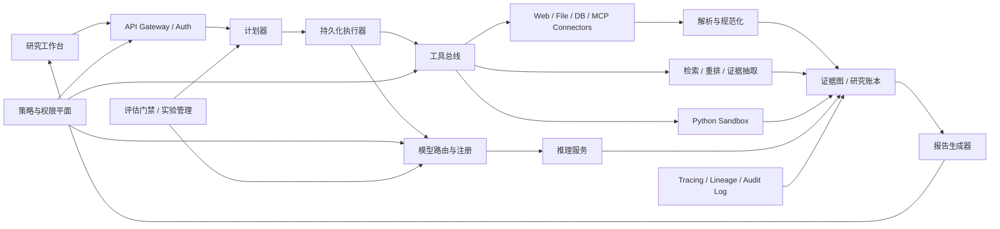
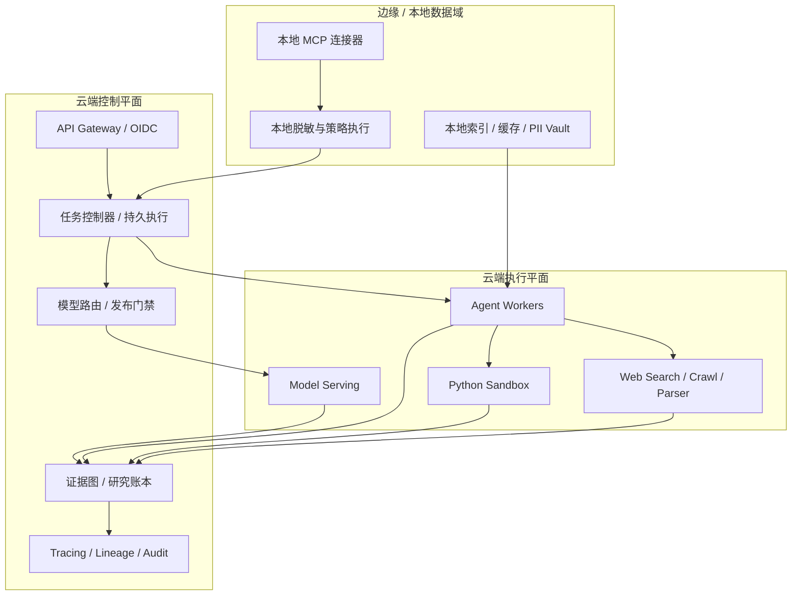
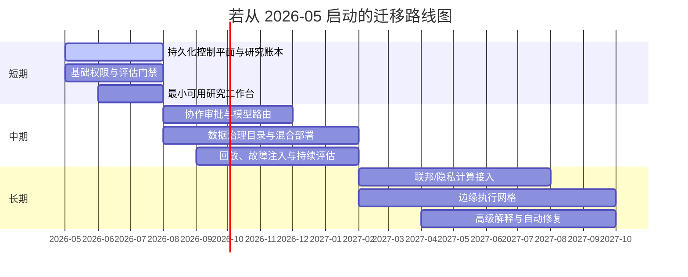

# 下一代 Deep Research 系统的结构件蓝图

## 执行摘要

当前深度研究系统已经形成一条清晰的能力主线：以浏览器/搜索为外部感知，以长上下文与多步推理做中枢，以文件处理、代码沙盒和带引用报告做输出。消费级产品方面，entity["company","OpenAI","ai company"]把 Deep Research 定义为“推理、研究、综合”的文档化报告能力，可结合上传文件、公共 Web、指定站点和已启用应用；entity["company","Google","technology company"] 的 Gemini Deep Research 已公开到开发者 API，强调迭代式研究计划、细粒度引用、JSON 结构化输出，以及对复杂 Web 研究任务的专门训练；entity["company","Perplexity","ai search company"] 把 Deep Research 描述为几十次自动搜索、阅读数百来源并在数分钟内生成报告；entity["company","xAI","ai company"] 则突出实时 Web/X 搜索与工具调用。学术系统则进一步把重点放在训练范式：WebDancer 用“浏览数据构造—轨迹采样—SFT 冷启动—RL 强化”的四阶段路线，WebResearcher 把深度研究重写成带工作区与阶段性总结的 MDP，REDSearcher 又把任务合成、中训练、后训练和本地模拟环境联动起来做成本优化。citeturn19view0turn19view1turn28view0turn19view2turn19view3turn26view0turn26view1turn26view2

但下一代系统真正缺的，并不是“再大一点的模型”或“再长一点的上下文”，而是**结构化控制能力**。现有公开系统和基准共同暴露出几个核心瓶颈：General AgentBench 指出顺序扩展存在 context ceiling，平行扩展存在 verification gap；ToolSandbox 说明真实工具使用里最难的是状态依赖、信息不足和中间里程碑判断；WebArena 早就显示复杂长程网页任务远未被解决，原因包括主动探索与失败恢复不足；OpenAI 的系统卡则直接把 prompt injection、个人信息拼装风险、代码执行隔离、幻觉与评测污染列为实战问题；entity["organization","NIST","us standards institute"] 与 entity["organization","OWASP","security nonprofit"] 也分别从生成式 AI 风险管理与 LLM Top 10 风险给出系统级提醒。citeturn24view5turn25view5turn5search16turn22view0turn23view1turn23view3turn21view0turn21view1

因此，下一代 Deep Research 更像一个“研究操作系统”，而不是一个“会搜会写的聊天功能”。它至少需要四个新的平面：**持久化任务控制平面、证据与溯源平面、策略与权限平面、评估与发布平面**；如果只选一个总缺口来命名，那么最关键的是“**统一的研究溯源控制平面**”——把 claim、source、tool output、model version、data snapshot、human approval 和 audit log 连成一张可查询、可回放、可审计的图。中文侧落地还必须预先纳入entity["organization","国家互联网信息办公室","china cyberspace admin"]规则和entity["organization","中国信息通信研究院","china ict institute"]治理框架所强调的数据安全、分级分类、评测评估与敏捷治理要求。citeturn19view8turn21view2turn20view4turn19view10turn20view11turn2search1turn2search2turn2search3turn17search12turn17search13

| 优先级 | 最缺的结构件 | 为什么它是硬缺口 | 不补会怎样 |
|---|---|---|---|
| P0 | 持久化任务控制平面 | 长程研究不是单轮问答，需要 checkpoint、resume、rollback、超时与补偿动作 | 任务一长就丢状态，失败恢复靠重跑，成本和不确定性同步上升 |
| P0 | 证据图与研究账本 | 当前系统能给 citations，但通常缺少 claim→source→tool/output→snapshot 的统一对象模型 | 结果“看似有引用”，但不可复跑、不可审计、不可定位责任 |
| P0 | 策略与权限平面 | prompt injection、个人信息拼装、越权读取、跨租户泄露都已是已知风险 | 一旦进企业/政务/科研场景，就无法上线到高价值流程 |
| P0 | 评估与发布门禁 | 公共 Web 评测易污染，模型/工具/提示词轻微变更就可能回归 | 系统性能波动无法归因，发布只能靠经验和运气 |
| P1 | 标准化工具总线与 trace envelope | MCP 解决“连得上”，但 trace context 仍未标准化；HTTP/OpenAPI 与推理接口也各自为政 | 跨工具链的追踪、回放、对账会在接缝处断掉 |
| P1 | 数据治理与隐私计算 | 私有语料、敏感文档、分布式数据源是企业常态 | 不是不能研究，而是不敢研究、不能大规模研究 |
| P1 | 协作/审批工作台 | 真实研究是团队活动，不是单人聊天 | 结果难以 review、复核、批注、交接、沉淀 |
| P1 | 成本感知模型路由 | 深推理、长链路、并行搜索都直接烧钱 | 质量可提升，但单位报告成本不可控 |
| P2 | 机理解释工具箱 | 可以帮助理解失败模式，但短期不应成为主控制手段 | 研发端缺洞察，但生产端影响相对次要 |
| P2 | 边缘执行网格 | 当数据不能离开本地网络时，边缘就不是可选项 | 架构只能停在云端 PoC，无法进入受限数据域 |

上述优先级判断，直接对应当前公开系统的已知风险与标准缺口：任务持久性来自长时有状态工作流的工程要求；研究账本来自 OpenLineage 和 W3C PROV 对 lineage/provenance 的明确对象化要求；策略与权限来自 OPA / OpenFGA 的分层授权模型与生成式 AI 风险治理；工具总线则必须正视 MCP 之上 trace context 尚未统一的现实。citeturn19view4turn19view5turn19view8turn21view2turn20view4turn21view4turn19view6turn21view6

## 现状诊断

从公开资料看，现有深度研究系统已经覆盖了“搜、读、算、写、引”的基本链条，但它们的重心仍然偏向能力展示和任务完成，而非企业级控制面建设。工业系统擅长把深度研究压缩成一条对用户友好的产品路径；学术系统擅长把长程信息寻求做成可训练、可 benchmark 的 agent；两者之间空出来的，恰好就是治理、权限、复现、审计、协作和运维这些“看不见但决定能不能规模化”的结构件。citeturn19view0turn19view1turn19view2turn26view0turn26view1turn26view2

| 系统/方向 | 核心功能 | 公开架构信号 | 主要短板或未闭环点 | 依据 |
|---|---|---|---|---|
| OpenAI Deep Research | 多步网页研究、文件读取、Python 分析、文档化报告 | Web/文件/应用接入；浏览优化模型；安全数据与 RL 训练；沙盒化 Python | 公开资料重心在能力与安全，企业级权限、可导出 provenance、版本化复跑能力未形成公开规范；系统卡也承认 prompt injection、隐私拼装、幻觉和评测污染是持续问题 | citeturn19view0turn22view0turn23view1turn23view3 |
| Gemini Deep Research | 复杂主题探索、迭代计划、引用报告、API 化、结构化输出 | 长时上下文 gathering/synthesis；多步 RL for search；可分析文档与 Web；支持 JSON 输出 | 互操作层仍在演进，Google 自己把 MCP 支持列为后续扩展；说明“接入”和“可追踪接入”还不是一回事 | citeturn19view1turn28view0 |
| Perplexity Deep Research | 极快的多轮搜索与报告生成 | 自动执行几十次搜索、读数百来源、数分钟出报告 | 速度出色，但公开资料较少披露持久执行、审计、跨租户权限、实验门禁等平台结构件 | citeturn19view2 |
| Grok 实时搜索路线 | 实时 Web/X 搜索、工具调用 | Web Search 与 X Search 工具化，强调 up-to-date 内容 | 更强在实时性与“现在”，不自动等于强审计、强复现、强治理 | citeturn19view3turn1search11 |
| WebDancer | 端到端信息寻求代理训练 | 浏览数据构造、轨迹采样、SFT、RL 四阶段 | 更像“训练范式论文”，不是完整平台蓝图 | citeturn26view0 |
| WebResearcher | 迭代式研究、工作区、并行思考 | 把 deep research 形式化为 MDP，定期 consolidating report，强调 focused workspace | 已经开始触碰“结构件”，但仍以 benchmark SOTA 为导向，协作/权限/审计不足 | citeturn26view1 |
| REDSearcher | 面向长程搜索代理的成本优化训练框架 | 任务合成 + 中训练 + 后训练 + 本地模拟环境 | 解决的是训练成本与轨迹稀疏，不直接解决生产治理与组织协作 | citeturn26view2 |

现有架构大致可以归为三类。第一类是“单代理 + 工具链 + 长上下文”的产品架构，优点是交互简洁、起效快，但一旦任务跨多个系统与多名协作者，状态管理和证据管理就会膨胀。第二类是“迭代工作区 / 多代理 / 并行搜索”的研究架构，优点是更能对抗上下文拥塞和噪声污染。第三类是“沙盒 benchmark 环境”，比如 WebArena/ToolSandbox，用于让 agent 行为可验证、可复现实验化。下一代系统需要把这三类的长处合并，而不是停在其中任何一类。citeturn26view1turn25view5turn25view4

关键短板已经被多个基准交叉验证。GAIA 证明“人类觉得概念简单”的多工具问题，对 AI 仍然很难；BrowseComp 说明浏览智能体要擅长的是“难找但易验证”的信息，不只是搜到热门事实；WebArena 指出复杂网页任务真正难在主动探索和失败恢复；ToolSandbox 则把真实工具使用的难点收束到状态依赖、规范化和信息不足；General AgentBench 更进一步，直接指出顺序扩展受 context ceiling 限制，平行扩展受 verification gap 限制。换言之，今天最短缺的不是“多一次搜索”，而是“知道什么时候该停、为什么可相信、失败后如何恢复、换模型后怎么对账”。citeturn27view0turn27view1turn25view4turn25view5turn24view5

安全与合规短板同样不是附属项。OpenAI 的系统卡明确把 prompt injection、个人信息拼装、代码执行隔离、偏见和幻觉列为要单独评估的风险；NIST 的生成式 AI 风险画像强调需要把生成式特有风险纳入组织化治理；OWASP 已把 prompt injection、输出处理不安全、训练数据投毒、DoS、供应链漏洞等列为 2025 版重点风险。中国场景下，如果系统面向境内公众提供生成式 AI 服务，还要同时满足《生成式人工智能服务管理暂行办法》以及备案/登记要求，并与《个人信息保护法》《数据安全法》的数据分类分级和最小化原则兼容。citeturn22view0turn23view1turn23view2turn23view3turn21view0turn21view1turn2search1turn2search5turn17search12turn17search13

## 必需的结构件

下一代系统的结构件，不应按“模型、检索、前端”这种传统三层来拆，而应按**面**来设计：控制平面处理任务状态与发布门禁；证据平面处理引用、来源、快照与研究账本；策略平面处理身份、权限、红线与预算；数据平面处理检索、浏览、解析、模型推理和沙盒代码；协作平面则把审批、批注、回放、复核和交付组织起来。这样拆的好处是：模型可替换、工具可扩展、审计可贯穿、协作可插入，而不是把所有逻辑都压进“一个大 agent prompt”。citeturn19view6turn20view9turn19view8turn21view2turn20view4turn21view5

| 结构件 | 要解决的问题 | 最低上线要求 | 推荐标准/组件 | 优先级 |
|---|---|---|---|---|
| 持久化任务控制器 | 长任务中断、重试、回滚、补偿 | 状态机、checkpoint、resume、idempotency key | Temporal、LangGraph、事件总线 | P0 |
| 计划器/执行器/验证器分离 | 计划漂移、盲目搜索、无终止条件 | 显式 agenda、阶段性验证、停止准则 | 计划 JSON schema、验证器接口 | P0 |
| 证据图与研究账本 | 引用可读不可审、结果不可复跑 | claim-source 绑定、snapshot id、artifact 哈希 | OpenLineage、W3C PROV、不可变对象存储 | P0 |
| 工具总线 | 工具接入碎片化 | 原生 MCP，OpenAPI 回退，统一 tool manifest | MCP、OpenAPI、KServe V2 | P0 |
| 模型注册与路由 | 模型切换不可控、成本失控 | registry、routing policy、approve/promote | MLflow Registry、OpenFeature、KServe | P0 |
| 数据治理与隐私层 | 私有语料、跨域数据使用风险 | catalog、contracts、quality、retention、PII 标签 | DataHub/Atlas、Iceberg、GX | P0 |
| 策略与权限层 | 越权读取、跨租户泄漏、违规输出 | OIDC/OAuth2、RBAC、ABAC、PDP/PEP | Kubernetes RBAC、OPA、OpenFGA | P0 |
| 可观测与审计层 | 失败不可解释、事故不可追责 | trace、lineage、audit、replay | OpenTelemetry、OpenLineage、PROV | P0 |
| 协作/审批层 | 团队研究难 review 与签发 | workflow、comment、diff、sign-off | 审批工作流 + 报告工作台 | P1 |
| 运行时与硬件池 | 抓取/检索/推理/沙盒争抢资源 | GPU/CPU/IO 分池、缓存层、TEE 节点 | Kubernetes、Ray、vLLM、Triton、TEE | P1 |
| 机理解释工具箱 | 深层失败模式难理解 | 可选而非强依赖 | SHAP、LIME、Captum、circuit tracing | P2 |

如果只抓住一个核心结构件，我会把它定义为“**研究账本**”：它不是日志，也不是简单的 citation 列表，而是一张把**问题分解、搜索动作、来源快照、解析结果、模型调用、工具输出、人工审批、最终结论**串起来的 provenance 图。没有这层，所谓“深度研究”很容易停留在“结果像研究、过程像黑箱”。有了这层，系统才可能做到可回放、可比对、可质控、可签发。citeturn19view8turn21view2turn20view11turn22view0

## 结构件设计与接口

下面这张表给出面向工程落地的结构件设计要点。它不是“组件购物清单”，而是“最小可演进协议”。原则上，先把接口和边界订清，再替换底层模型和中间件；不要反过来先堆产品，再在事故之后补审计和权限。这个顺序决定了系统能否从 demo 过渡到平台。citeturn20view9turn19view6turn19view10turn19view11turn20view4turn21view4

| 结构件 | 具体设计要点 | 接口规范 | 依赖关系 | 优先级 | 替代方案 |
|---|---|---|---|---|---|
| 持久化任务控制器 | Run/Step/Attempt 三层对象；显式状态机；失败补偿；超时与预算阈值 | HTTP/gRPC Run API；事件总线；workflow DSL | 依赖认证、模型路由、工具总线 | P0 | 先 Temporal 后 LangGraph；或 LangGraph + 自建 durable store |
| 计划器 | 输出可审阅的 agenda，而不是隐式 CoT | JSON Schema 形式的 task plan；阶段性 success criteria | 依赖模型注册、评估器 | P0 | 单代理 planner；或多代理分工 |
| 执行器 | 工具调用、搜索、解析、代码执行必须幂等且可重放 | Tool call envelope；tool result schema；retry policy | 依赖工具总线、沙盒、证据层 | P0 | Ray worker；或传统 job runner |
| 验证器 | 区分“找到答案”和“证据足够支撑答案” | Claim verifier API；evidence completeness score | 依赖证据图与评估集 | P0 | rule-based verifier；或 LLM judge + 人工抽检 |
| 证据图/研究账本 | 每条 claim 绑定 source span、tool output、snapshot id、model/tool version | PROV 风格对象模型；OpenLineage facet；artifact hash | 依赖对象存储、解析器、trace | P0 | 简化版 SQL ledger，但审计性较弱 |
| 工具总线 | MCP 优先，HTTP 服务走 OpenAPI，推理走 KServe V2 / OpenAI-compatible | MCP、OpenAPI、KServe V2、JSON Schema | 依赖授权、trace、版本管理 | P0 | 私有 SDK，但后续互操作成本高 |
| 数据治理与隐私 | 采集、解析、分片、标签、保留期、质量、删除权、快照 | Catalog API、data contract、snapshot id | 依赖元数据平台、数据湖、质量校验 | P0 | 轻量目录 + 手工约定 |
| 策略与权限 | 研究任务、文档、工具、模型、租户都要做资源化授权 | OIDC/OAuth2；PDP check API；属性上下文 | 依赖 IdP、PDP、UI、工具 PEP | P0 | 只做 RBAC；细粒度能力会不足 |
| 模型注册与路由 | provider/model/version/prompt/tool bundle 全部版本化；成本和风险感知路由 | model manifest；evaluation bundle hash；feature flag | 依赖评估门禁、trace、账本 | P0 | 单模型固定化；上线后僵化 |
| 可观测与审计 | 统一 traces、metrics、logs、lineage、report replay | OpenTelemetry；OpenLineage；PROV export | 依赖所有平面 | P0 | 传统日志；难做多步回放 |
| 协作工作台 | 计划预览、证据侧栏、diff、批注、审批、rerun on snapshot | workspace API；comment schema；approval status | 依赖账本、权限、报告生成器 | P1 | 纯聊天界面；可用性和治理都弱 |
| 运行时与硬件池 | GPU 推理池、CPU/IO 抓取解析池、NVMe 缓存、TEE 节点、边缘连接器节点 | K8s node class / labels；Ray resources | 依赖集群调度、存储、网络 | P1 | 单一资源池；高峰时相互拖垮 |

接口层最关键的设计，不是“选哪一个协议”，而是**把协议拼接成一条可追踪链**。推荐顺序是：工具和数据连接优先 MCP；传统 HTTP 服务继续用 OpenAPI；模型推理层对内对外都尽量兼容 KServe V2 或 OpenAI-compatible API；追踪统一进 OpenTelemetry；数据 lineage 用 OpenLineage；研究级 provenance 用 W3C PROV；模型与实验资产进 MLflow/Kubeflow；授权由 OPA/OpenFGA 组合完成；数据快照和可复现查询则落在 Iceberg 一类支持 time travel 的表层之上。这样做的价值不是“追新标准”，而是降低未来替换模型、切换供应商、接入新工具时的系统摩擦。citeturn19view6turn20view9turn19view7turn19view8turn21view2turn19view10turn19view11turn20view4turn21view4turn20view2

## 技术路线与实现难点

模型管理的首要问题，不是“哪个模型最强”，而是“**如何把模型换代变成可控变更**”。从平台角度看，至少要支持三种模式：第一，直接调用托管 API，换来更快迭代，但版本漂移和黑箱供应链更强；第二，自托管开源模型，换来更强控制，但要自己承担 serving、容量和安全责任；第三，混合模式，把高风险/低延迟/私有数据任务放到自有运行时，把广谱开放研究放到托管模型。这里推荐把**模型注册、评估门禁、流量路由、feature flag**放在一起，而不是分散在前端配置和后端脚本里。MLflow 已经把 model lineage、registry 和 tracing 打通；OpenFeature 提供运行时开关抽象；KServe V2 给推理接口一个统一面；vLLM 和 Triton 则分别代表了开源 LLM serving 与多框架 inference server 的主路径。citeturn19view10turn20view11turn21view5turn19view9turn20view5turn20view6

数据管道的关键，不是“能抓到多少页”，而是“**抓到的内容能否变成可治理、可复验、可删除的研究资产**”。下一代系统应把 Web、PDF、数据库、内部文档统一做成：原始采集层、规范化层、证据层、报告层四级资产；原始层不可变，规范化层可复算，证据层可查询，报告层可签发。DataHub/Atlas 适合作 metadata catalog 与数据契约，Great Expectations 适合作质量门槛，Iceberg 适合作快照、time travel 和回滚。真正的难点有两个：一是动态 Web 会让“同一问题、不同时间”天然不可重现；二是公开 Web 评测容易被污染。OpenAI 的系统卡已经明确指出，对深度研究类模型，光把评测题从训练集里排除还不够，连公共互联网可搜索到的答案都可能污染评测，因此必须引入 held-out、snapshot 和私有评测切片。citeturn20view0turn13search1turn20view3turn20view2turn22view0

资源调度是另外一个常被低估的结构件。研究系统里同时有抓取、解析、重排、向量检索、模型推理、代码沙盒和报告渲染，不应共用一套盲目的“自动扩缩容”。Ray 适合做分布式任务/actor 调度，Kubernetes 适合做集群级资源管理、HPA/VPA 和多租户隔离；对于训练和多节点推理类 all-or-nothing 任务，Kubernetes 新的 Workload API / gang scheduling 路线很有价值。要注意的是，多节点/多 GPU 推理并不天然等于易扩缩：KServe 对 vLLM 多节点推理的文档明确提示，标准模式下多节点目前不支持 autoscaling，且依赖 RWX PVC。这意味着“更大模型”会直接把架构拖进存储和调度约束。citeturn20view7turn20view8turn24view0turn24view1turn24view2

隐私与跨域数据协同不应只靠脱敏日志。联邦学习适合做分布式训练或局部适配，让数据留在边缘/本地，只上传聚合更新；Confidential Computing/TEE 则适合在“数据不能被运行环境所有者看到”的场景中做 in-use protection。两者各有边界：联邦学习的难点是 non-IID、通信成本和评估统一性；TEE 的难点是 attestation、性能开销、运维复杂度和开发者心智负担。更稳妥的路线通常不是“全系统联邦化”，而是把 FL 用在局部排序器/领域适配，把 TEE 用在高敏索引、文档解析或受控推理路径，把差分隐私只用在统计汇总和日志分析，不强行套在每一步 agent 执行上。citeturn21view9turn21view8turn23view4turn23view5turn8search3

可解释性方面，生产系统不应把“模型机理解释”与“业务可解释”混为一谈。对于 Deep Research，最先要做的是**过程级解释**和**证据级解释**：为什么检索这个源、为什么丢弃那个源、这个结论由哪些 span 支撑、哪个工具步骤失败了。OpenTelemetry + 研究账本就能覆盖这 80% 的生产价值。SHAP、LIME、Captum 更适合作为系统内部窄模型——比如风险分类器、reranker、quality scorer——的解释工具；而像 entity["company","Anthropic","ai company"] 的 circuit tracing 这类机理解释研究很有价值，但在短中期更适合作为研发诊断工具，而非上线依赖。换句话说，下一代系统需要“先有可回放，再谈看懂神经元”。citeturn19view7turn21view2turn9search0turn9search1turn9search2turn21view11

| 职能 | 候选方案 | 优点 | 代价/限制 | 建议 |
|---|---|---|---|---|
| 任务编排 | LangGraph | 贴近 agent 工作流；有状态；上手快 | durability 与企业控制面仍需补强 | 适合作为 agent graph 层 |
| 任务编排 | Temporal | crash-proof execution 强；天然适合长任务 | agent 语义要自行封装 | 适合作为 durable execution 核心 |
| 任务编排 | AutoGen | 多代理模式成熟，研究灵活 | 生产治理需要额外系统件 | 适合实验与研究原型 |
| 推理服务 | 托管 API | 快速、模型新、运维最轻 | 版本与可审计性最弱 | 适合开放 Web 研究与快速试错 |
| 推理服务 | vLLM | OpenAI-compatible；连续 batching；成本效率高 | 主要服务于 LLM，周边能力需自拼 | 适合作为主力开源 LLM serving |
| 推理服务 | Triton | 多框架；动态 batching；状态模型支持 | LLM 生态灵活度不如 vLLM | 适合异构模型统一服务 |
| 检索层 | pgvector | 与事务数据同库；JOIN 和恢复方便 | 大规模向量场景不一定最优 | 适合中小规模、强一致场景 |
| 检索层 | Milvus | 向量与 hybrid search 能力强 | 额外运维复杂度 | 适合大规模语义检索 |
| 检索层 | Elasticsearch | 关键词 + 向量 + 过滤一体化 | 成本与调优门槛较高 | 适合需要统一搜索栈的组织 |
| 权限层 | RBAC + OPA | 简洁、策略即代码、适合平台面治理 | 细粒度对象关系表达不够自然 | 适合作为基础权限与 guardrails |
| 权限层 | OpenFGA / SpiceDB | 细粒度对象关系强；ABAC 扩展更好 | 需要单独建模与运维 | 适合作为文档/证据/租户级授权 |

上表取舍，分别对应官方组件的已公开能力边界：LangGraph 面向长时状态工作流，Temporal 面向 durable execution，AutoGen 面向研究型多代理；vLLM 强在 OpenAI-compatible 与吞吐效率，Triton 强在多框架与状态模型；Milvus、pgvector、Elasticsearch 则分别代表纯向量、事务型向量和统一搜索栈三种路线；权限上，OPA 适合 policy-as-code，OpenFGA 适合对象关系授权。citeturn19view4turn19view5turn12search2turn20view5turn20view6turn11search0turn11search1turn11search2turn20view4turn21view4

## 模块化架构与部署拓扑

建议把下一代系统设计为“**控制平面 + 执行平面 + 证据平面 + 协作平面**”四层，而不是把所有逻辑塞进一个 agent runtime。控制平面负责认证、任务生命周期、策略和发布；执行平面负责调用模型、搜索、抓取、解析、代码沙盒；证据平面负责引用、溯源、快照和审计；协作平面负责计划预览、批注、审批和签发。这样做的关键收益，是把“能力提升”和“可信交付”彻底解耦：模型可持续换代，但系统的 provenance、授权、审计和协作不应随模型迭代而漂移。citeturn19view6turn19view7turn19view8turn21view2turn20view4turn19view10

接口互操作层建议采用“双轨制”。一轨面向工具和数据源：MCP 为首选，OpenAPI 为回退；另一轨面向模型推理：KServe V2 或 OpenAI-compatible API 作为统一调用面。这里有一个必须正视的现实：MCP 已经很好地解决了“LLM 应用如何连工具和外部数据”，但 OpenTelemetry 对 MCP 的语义约定明确指出，MCP 工作在 JSON-RPC 之上，而标准 trace context 还不能自动覆盖流式请求/响应中的消息交换；同时，GenAI semantic conventions 本身仍在演化中。这意味着下一代系统必须在标准之上自补一层 **Trace Envelope / Run Context**，把 run_id、step_id、tenant_id、snapshot_id、policy_decision_id 明确穿透到每次 tool call。citeturn19view6turn21view6turn21view7

部署拓扑方面，**混合架构**应作为默认方案，而不是最后兜底。原因很简单：公开 Web 搜索和大模型推理天然适合云端弹性；本地文档、数据库、代码仓和高敏资料又常常不能出域；机密计算文档也明确指出，Confidential Computing 的核心诉求正是在 on-prem、public cloud 和 edge 横跨的场景里保护 data in use。对大多数组织来说，最佳形态不是“全云”或“全边”，而是“云端控制平面 + 本地/边缘连接器 + 按风险分层的数据落点”。citeturn21view8turn19view7

| 拓扑 | 数据落点 | 优势 | 限制 | 建议 |
|---|---|---|---|---|
| 云端 | 搜索、推理、索引、账本都在云 | 起步最快，组件最齐 | 合规与私有数据压力最大 | 只适合开放数据、低敏场景 |
| 边缘/本地 | 主要数据与推理都在本地 | 数据主权强，低外发风险 | 运维复杂，扩展与模型更新慢 | 适合极高敏场景，但成本高 |
| 混合 | 控制与公域推理在云，敏感接入在本地 | 兼顾弹性、治理和数据边界 | 系统设计复杂，需要清晰边界 | **默认推荐** |

需要补充的一点是：部署难点不只在网络与权限，还在资源弹性。KServe 的多节点 vLLM 推理明确限制了 autoscaling，说明大模型场景的“横向扩”并不总成立；因此架构上应尽量通过预算路由、小/中/大模型分层、任务分阶段执行和局部缓存来避免全系统被最大模型绑架。citeturn24view2turn20view5

## 评估指标与实验流程

下一代 Deep Research 的评估体系，不能再用“单一正确率”或“主观观感”做总指标。GAIA、BrowseComp、WebArena、ToolSandbox 和 General AgentBench 已经共同表明：研究代理要同时跨越搜索、浏览、推理、工具使用、策略遵循、失败恢复和多步验证；HELM 也早就指出，语言模型评估应是多维画像而非单一分数。再往前看，GAIA2 这类新基准开始引入异步环境、时间约束、噪声事件和多代理协作，METR 则提醒我们，agent 能独立完成的任务时长正在快速增长。因此，评估设计必须从“回答对不对”升级到“过程可不可信、行为稳不稳、成本划不划算”。citeturn27view0turn27view1turn25view4turn25view5turn24view5turn5search15turn4search6turn24view4

| 维度 | 核心指标 | 应关注的失败信号 | 推荐评测来源 |
|---|---|---|---|
| 研究质量 | 任务成功率、答案完整性、引用覆盖率、source diversity、unsupported claim rate | 找到结论但证据不足；引用存在但不支撑结论；覆盖面失衡 | GAIA、BrowseComp、内部黄金任务集 |
| 安全 | prompt injection 攻击成功率、违规输出率、unsafe action rate | 被页面内容带偏；错误调用高风险工具；绕过拒答 | OWASP LLM Top 10、NIST 风险画像、红队集 |
| 隐私 | PII 泄露率、跨租户泄露率、最小化采集达标率 | 通过拼装公开碎片过度刻画个人；日志过采；租户边界穿透 | 个人信息/数据安全策略用例、人工审计 |
| 鲁棒性 | tool failure recovery rate、timeout 恢复率、状态一致性 | 一步失败全局崩；重复调用；中间状态污染下游 | WebArena、ToolSandbox、故障注入 |
| 可解释性/可控性 | trace completeness、claim-to-evidence 覆盖、人工 override 可用性 | 结果能看不能问；不能回放；不能定位哪一步错 | OTel/账本回放、人工复核 |
| 性能 | p50/p95 总时长、阶段耗时、并行效率 | 某一阶段成为瓶颈；长任务饥饿 | 压测、真实历史任务回放 |
| 成本 | 单报告 token 成本、搜索成本、GPU/CPU 秒、缓存命中率 | 质量上升但单位成本不可承受 | 成本 telemetry、A/B 实验 |
| 可复现性/审计 | 固定 snapshot 重跑一致性、artifact 完整性、审计日志覆盖率 | 同配置重跑结论漂移过大；关键中间件无记录 | Iceberg snapshot、PROV、OpenLineage |

实验流程建议分成七步，而且每一步都要版本冻结。第一，冻结 **model/prompt/tool/data snapshot/policy**，生成 bundle hash；第二，跑离线基准，至少覆盖 GAIA、BrowseComp、WebArena、ToolSandbox 和自有黄金任务集；第三，增加安全/隐私红队切片，覆盖 prompt injection、PII 组装、regulated advice、越权读取；第四，单独做动态环境切片，避免只在静态 Web 上过拟合，GAIA2 这类异步 benchmark 的思想值得借鉴；第五，在真实历史研究工单上做 shadow run；第六，通过 feature flag 做小流量 canary；第七，把生产 traces 反哺到持续评估与事故复盘。注意，OpenAI 系统卡已经明确指出，Web 型能力的评估必须考虑互联网泄露和污染，所以“线上看起来更准”不一定意味着“真实能力更强”。citeturn27view0turn27view1turn25view4turn25view5turn24view5turn4search6turn21view5turn22view0

从工程门槛看，安全和隐私指标不应只做报告展示，而要成为发布 gate。对于高风险任务，至少要做到三道门：**策略门**确认请求是否合法，**证据门**确认结论有足够支持，**审批门**确认输出进入业务系统前经过人类签发。没有这三道门，Deep Research 只是一个更会引用的自动化写手，而不是一个能进入组织关键流程的研究系统。citeturn20view4turn21view4turn21view0turn21view1

## 迁移路径与落地路线图

由于目标规模、团队规模、预算、行业监管等级和数据敏感度均**未指定**，下面给出的不是容量规划，而是**结构件优先级路线图**。一个合理的落地顺序应遵循“先控制、后扩展；先审计、后自动化；先混合、后边缘化”的原则。这样做的原因在于，METR 给出的趋势表明 agent 能处理的长任务正在快速增加，而风险框架又同时提醒这种能力会放大组织的治理缺口；也就是说，越往后做，返工代价越高。citeturn24view4turn21view0turn21view1

| 时段 | 目标 | 必交付件 | 人员估算 | 预算估算 |
|---|---|---|---|---|
| 短期 | 把系统从“会搜会写”变成“可控可审” | 持久化任务控制器、研究账本、基础授权、最小评估门禁、报告工作台原型 | 未指定 | 未指定 |
| 中期 | 把系统从“单用户工具”变成“团队研究平台” | 协作审批、混合部署、模型路由、数据治理目录、故障注入与回放 | 未指定 | 未指定 |
| 长期 | 把系统从“平台”变成“跨域研究基础设施” | 联邦/隐私计算、边缘执行网格、成本自治、机理解释与自动修复能力 | 未指定 | 未指定 |

若要把这份路线图压缩成一句话：**短期先补“控制与账本”，中期再补“协作与治理”，长期才补“边缘与机理解释”。** 这是因为今天公开系统里最稀缺的，不是更强的 research loop，而是能够把 research loop 关进制度与工程边界里的结构件。一旦把这层补上，模型、工具、基准和 UI 都能持续升级；如果不补，这些升级只会更快地放大不可控性。citeturn24view5turn22view0turn19view6turn21view2