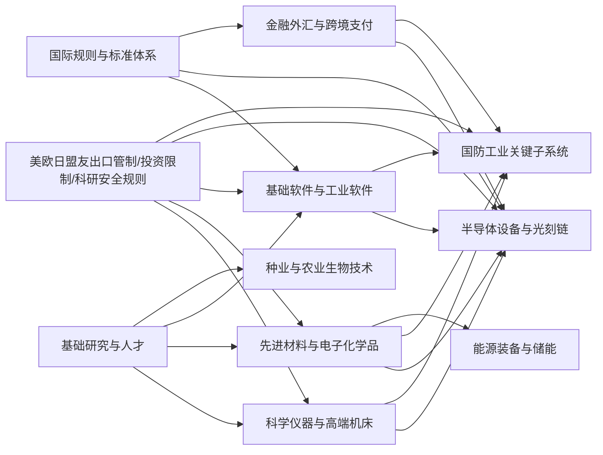

## 执行摘要

中国真正的“短板”不是总量资金，而是被美欧日盟友体系控制、且会沿着“工具—材料—软件—人才—规则—金融”链条放大的复合性瓶颈。未来最值得长期重仓的，不是单点替代，而是能把材料、设备、软件、标准与订单闭环打通的平台型产业：半导体设备与EDA/材料、工业软件与科学仪器、航空发动机与工业母机、新型储能与电网、种业与北斗商业航天。未来三到五年决定脆弱性强弱，八到十年决定能否形成不可逆替代。 citeturn20search0turn20search1turn20search6turn23search0turn5search1turn42view0

## 短板概念与判断框架

本文把“短板”定义为：在国家安全与中长期竞争中，一旦遭受外部限制，便会在三到十年内显著抬高中国的技术、军工、能源、金融或国际规则成本，且不能依靠简单采购与短期补贴立刻替代的关键能力。判断时我采用五个维度：外部可控性、国内供给缺口、替代所需时间、对全局的外溢影响、以及是否需要长期 tacit knowledge 和制度信任积累。这个定义与中国“统筹发展和安全”“科技自立自强”“产业基础高级化、产业链现代化”的政策表述是一致的。 citeturn0search0turn21search2turn9search0turn10search3

在用户列出的维度之外，我补充两个必须单列的维度：**工业软件与基础软件**、**科学仪器与高端机床/精密机械**。原因很简单：半导体、军工、能源、生物育种、先进材料能否持续迭代，最终都要落到这两类“看不见但离不开”的底座能力上。工信部已经把工业软件、基础软件、操作系统列为核心方向；中国科学院也在 2025 年集中展示了自主研制科学仪器体系，说明这两块已被明确视为国家级能力建设问题。 citeturn9search0turn9search5turn26search0turn26search2

下图概括了主要短板之间的依赖关系：上游是基础研究、人才、规则与金融，中间层是仪器、材料、软件、精密装备，下游才是芯片、军工、能源、粮食与商业航天。外部施压往往不是打终端产品，而是打中间层与制度层。 citeturn21search2turn20search0turn20search1turn23search0turn35search2

## 中国主要短板地图

整体看，**高脆弱性短板**主要集中在半导体设备/EDA/高端光刻、工业软件、科学仪器与高端机床、航空发动机等；**中等脆弱性短板**主要在能源与粮食安全、金融外汇与国际规则；而稀土、造船、电网等则更多是中国的相对优势甚至反制能力来源，不应被笼统视作“全面短板”。例如，2025 年中国造船三大指标国际市场份额连续 16 年全球领先，而能源侧则已形成较强的电力与可再生能源支撑，但油气与大豆仍是结构性约束。 citeturn43search0turn42view0turn41view0turn12search0

| 维度 | 现状判断 | 主要成因 | 美/盟友可施压手段 | 时间窗口 | 脆弱性强度 | 主要来源与发布时间 |
|---|---|---|---|---|---|---|
| 半导体设备、光刻、EDA、先进算力芯片 | 最硬短板仍在高端制造设备、EUV/高端DUV、全流程EDA、先进GPU与相关 IP/工艺生态。中国在成熟制程、封测、部分设备和先进封装上进步较快，但最先进环节仍被卡在“设备+软件+服务”联动封锁上。 | 起步晚；工艺知识与软件生态积累深；需要长周期工程验证；高端市场由少数美欧企业寡头控制。 | BIS 对先进计算和半导体制造物项管制；荷兰对 ASML DUV/EUV 许可；日本对半导体设备许可；美国对华半导体/AI/量子领域对外投资限制。 | 现在到五年最关键 | 高 | BIS 公告（2022-10、2023-10）、美国财政部对外投资规则（2024-10，2025-01生效）、ASML 声明（2024-08/09） citeturn20search0turn20search1turn23search0turn20search6turn20search3 |
| 电子材料、电子化学品、精密零部件与关键矿产 | 中国在稀土上游并不弱，反而具有重要筹码；真正短板在高纯电子材料、光刻胶、电子特气、CMP、溅射靶材、精密阀泵和某些高端零部件。很多环节不是“有没有矿”，而是“能否稳定做到极高纯度与一致性”。 | 材料提纯与检测能力、工艺窗口理解、质量控制和装备配套长期积累不足。 | 许可管制、设备与维护断供、化学品与部件卡供、航运和保险配合施压。 | 两到六年 | 高 | 国务院《稀土管理条例》（2024-06公布，2024-10施行）、司法部解读《矿产资源法实施条例》（2026-05）、中国工程院关于关键电子材料研究（2025） citeturn17search0turn17search2turn27search0turn25search6 |
| 基础软件、工业软件与操作系统 | 信创政企市场推进很快，但在工业场景真正难的不是桌面替换，而是 CAD/CAE/PLM/MES/仿真/控制系统与底层操作系统的协同生态。工信部已提出到 2027 年更新约 200 万套工业软件、80 万台套工业操作系统，说明问题已从“有没有”转向“能不能大规模可用”。 | 软件生态、行业 know-how 和工业数据库积累不足；龙头企业工艺知识软件化封装不足；用户端切换成本高。 | 商业软件禁售/停更、云服务与补丁断供、开源治理与标准排斥、认证体系壁垒。 | 一到五年先看 B 端，五到十年再看大生态 | 中高 | 工信部《“十四五”软件和信息技术服务业发展规划》（2021-11）、中国政府网解读工业软件更新目标（2024-10） citeturn9search0turn9search5turn32search2 |
| 高端机床、精密机械与科学仪器 | 这是被低估的底层短板。工信部明确承认高端数控机床“自给率低”；科学仪器虽有自主突破，但要形成稳定、可校准、可运维、可出口的平台化体系，仍需更长时间。 | 高精度传动、控制算法、轴承/丝杠/编码器、校准标准、软件与零部件协同不足。 | 双用途出口管制、校准与认证限制、关键零部件与升级维护卡断。 | 三到八年 | 高 | 工信部关于高端数控机床表述（2025-03）、《工业母机高质量标准体系建设方案》（2025）、中科院《自主研制科学仪器 2025》 citeturn18search0turn18search1turn26search0turn26search2 |
| 基础科学与人才 | 资金总量已不低：2024 年全国 R&D 经费 3.63 万亿元、基础研究经费 2500.9 亿元、占 R&D 比重 6.88%；2025 年 R&D 强度首次超过 OECD 国家平均水平。但基础研究、原创方法学、顶尖青年人才与国际合作环境仍是慢变量短板。同时，人口下降和老龄化会抬高长期人力成本。 | 历史积累不足；评价体系偏短期；青年科研稳定支持不够；跨学科组织化能力仍在建设；人口结构变化加大约束。 | 签证与科研合作限制、研究安全规则、人才计划打击、顶尖数据库/软件/装置合作收紧。 | 五到十五年 | 中高 | 国家统计局《2024 年全国科技经费投入统计公报》（2025-09）、新华社/国新办关于 2025 年 R&D 强度（2026-06）、习近平在加强基础研究座谈会上的部署（2026-04/05）、美国 Proclamation 10043 与 NSF 研究安全更新（2020；2025） citeturn5search1turn5search4turn21search2turn21search1turn22search2turn22search5 |
| 国防工业关键子系统 | 中国军工并非“全面短板”；造船、导弹、无人系统和部分电子系统已很强，但发动机、燃气轮机、特种材料、某些传感器与高可靠基础软件仍是核心约束。民用航空发动机更难，因为还叠加适航与全球服务网络问题。 | 长寿命高可靠要求极高；验证周期长；军民双重标准严格；商业适航生态与全球 MRO 网络建设慢。 | 双用途出口管制、材料/仿真软件/设备限制、适航与认证生态壁垒。 | 五到十二年 | 中高 | 工信部航空发动机及燃气轮机专栏、民用航空发动机自主发展战略研究（2024）、中国商飞进展、BIS 管制文件 citeturn19search1turn36search2turn36search3turn20search0turn20search1 |
| 能源与粮食安全 | 中国电力与可再生能源体系明显增强：2025 年风电光伏累计装机突破 18 亿千瓦、可再生能源装机占比超过六成；粮食总产量达到 71488 万吨。但油气进口依赖、海上通道安全、LNG 运输链，以及大豆高进口依赖，仍是显著短板。 | 资源禀赋决定油气约束；农业结构中蛋白供给偏弱；海运通道与保险结算外部性强。 | 霍尔木兹—马六甲航道扰动、运输保险和金融制裁、先进油气设备限制、农产品供应国协同施压。 | 油气是即期到中期；种业是中长期 | 中 | 国家能源局 2025 年能源形势发布会（2026-01）、国家统计局 2025 粮食产量公告（2025-12）、农业农村部关于大豆供应链韧性文章（2025-10） citeturn42view0turn41view0turn12search0 |
| 金融外汇、国际规则与软实力 | 外储仍稳，2025 年末外储为 33579 亿美元；人民币跨境使用和 CIPS 扩张很快，CIPS 已覆盖 189 个国家和地区，但如果按 SWIFT 口径看，人民币全球支付份额仍大约在 2.9% 左右、通常处于第 5 至第 6 位。国际标准影响力上升明显，2025 年中国向 ISO/IEC 提出 505 项国际标准提案；软实力外部评估中，中国 2025 年已升至全球第 2，但在联盟动员、叙事合法性和制裁规则塑造上仍弱于美国同盟体系。 | 美元体系网络效应强；金融信任与法治预期建设慢；国际机构话语权与规则供给能力需长期积累。 | 美元清算与二级制裁、资本市场限制、标准俱乐部、舆论与叙事联盟、法律长臂管辖。 | 三到十五年 | 中 | SAFE 外储数据（2026-01）、《人民币国际化报告（2025）》、CIPS 覆盖数据（2025-09）、SWIFT RMB Tracker（2025-06/2026-04）、市场监管总局国际标准数据（2026-01）、Brand Finance Global Soft Power Index 2025 citeturn37search2turn13search1turn35search0turn14search0turn14search1turn15search1turn15search3 |

从这个表可以看出，最值得优先处理的不是“所有短板一起补”，而是先抓那些**外部可控性最高、又会传导到全行业的共性底座**：半导体设备/EDA、工业软件、科学仪器/工业母机、基础研究与人才。这些领域一旦突破，会向军工、能源、生物医药、汽车、商业航天等多个方向外溢。相反，金融与软实力虽然也重要，但更像长期制度建设问题，不宜幻想用单次大投入快速解决。 citeturn20search0turn20search1turn9search5turn18search0turn21search2turn15search1

## 重投入补短板的可行性

结论先说：**中国大多数短板都能通过“花大钱下大工夫”显著收窄，但不能仅靠砸钱解决。** 资金最有效的场景，是工程复制、规模试错、首台套验证、国产替代导入和下游场景牵引；资金最无力的场景，是需要长期生态、原始理论突破、全球认证与制度信任积累的环节。中国已经具备超大市场、财政与国资工具、完整工业链和场景验证优势；但同样面临地方重复投资、低水平内卷、短期考核与人才激励不匹配的风险。 citeturn33search2turn5search1turn9search5turn33search0turn21search2

下面的资金区间为**“新增资源需求的粗略推算”**，不是官方预算；它们主要根据公开政策、现有行业基金、行业资本开支强度、以及实现“从可用到可规模替代”所需的试错成本推算而来。比如，国家集成电路产业投资基金三期注册资本已达 3440 亿元，这意味着真正补齐半导体短板不可能只是“几百亿”级别；基础研究若要把占 R&D 比重从当前 6.88%显著抬升，同样需要持续多年、每年千亿元级别的追加投入。 citeturn33search2turn5search1

| 短板 | “花大钱”有效性 | 技术路径与政策工具 | 粗略新增投入区间 | 时间周期 | 成功概率 | 主要风险 |
|---|---|---|---|---|---|---|
| 半导体设备/材料/EDA | 对成熟制程、先进封装、部分设备材料有效；对 EUV、顶级 EDA 全流程与最先进 GPU 生态只能部分有效 | 国家基金、首台套保险、国企订单、并购整合、产学研联合攻关、开放代工与验证平台 | 每十年约 0.8–1.5 万亿元，属“万亿级” | 三到十年；最前沿可能更长 | **中等**；成熟环节中高，最前沿中低 | 地方重复投资、设备堆砌而非工艺闭环、国际限制继续升级 citeturn33search2turn20search0turn20search1turn20search6 |
| 工业软件/基础软件/操作系统 | 高度可补，但前提是强场景导入与龙头企业深度共创 | 龙头工厂联合开发、国产化替换清单、工艺数据库建设、开源社区与国企采购协同 | 五到十年约 2000–5000 亿元 | 两到八年 | **中高**；政企/B 端高，消费生态中等 | 用户不愿迁移、生态碎片化、接口与标准割裂 citeturn9search0turn9search5 |
| 高端机床/科学仪器/精密机械 | 资金有效，但必须和工艺、标准、校准体系一起投 | 首台套示范、质量追溯、行业标准、科研院所与龙头共建应用中心、进口替代目录 | 五到十年约 3000–8000 亿元 | 三到十年 | **中等偏高** | 只买设备不建校准体系、低端替代挤出高端攻关、需求端不给试错成本 citeturn18search0turn18search1turn26search0 |
| 基础科学与人才 | 有效但见效最慢；必须“长期稳定+容错” | 提高基础研究占比、青年 PI 稳定支持、重大科研基础设施、国际合作替代网络 | 十年约 0.8–1.5 万亿元新增资源较合理 | 五到十五年 | **中等** | KPI 化、短期论文导向、青年人才流失、国际合作受限 citeturn5search1turn21search2turn21search1turn22search5 |
| 国防工业关键子系统 | 极适合举国体制，但周期长、验证难 | 军民协同、型号牵引、全寿命试车平台、适航/可靠性体系建设 | 十年约 5000–10000 亿元 | 五到十二年 | **中高**；军用高于民用适航 | “有型号、无生态”，以及商用适航认证与服务网络短缺 citeturn36search2turn36search3turn19search1 |
| 能源与粮食安全 | 电网储能和种业最适合大投入；油气只能部分缓解 | 特高压、电化学/长时储能、战略储备、深海深地油气、种源攻关、农业装备与节水 | 五到十年约 2–5 万亿元 | 两到十年 | **高**（电网储能、粮食）；**中等**（油气） | 资源禀赋天花板、国际航道和保险金融外部性 citeturn42view0turn33search0turn41view0turn33search5 |
| 金融外汇、国际规则、软实力 | 钱能改善基础设施与渠道，但不能直接买来国际信任与规则权威 | 扩大人民币贸易结算、完善 CIPS、推进标准国际化、提高国际公共产品供给 | 五到十年约 1000–3000 亿元制度与基础设施投入 | 五到十五年 | **中等** | 地缘冲突时信任回撤、联盟政治、资本项目与法治预期约束 citeturn13search1turn35search0turn15search1turn15search3 |

最重要的判断是：**越像“工程系统”的短板，越适合中国用钱、订单和组织能力去补；越像“生态系统”和“规则系统”的短板，越要把时间当作核心资本。** 因此，半导体、工业软件、科学仪器、种业、储能电网这些领域适合持续投入；而软实力、国际规则、全球金融货币地位更多需要十年以上的制度耐心。 citeturn9search5turn33search0turn33search5turn15search1turn13search1

## 长线茅台级战略投资方向

这里的“长线茅台”不是指短期高弹性题材，而是指**长期需求刚性、高进入壁垒、政策确定性强、替代一旦完成就能形成高复购和高黏性**的赛道。在中国当前环境下，最符合这一特征的是“工具型平台”“认证型寡头”“基础设施型龙头”和“不可中断的安全能力”。 citeturn20search0turn9search5turn18search1turn33search0

| 领域 | 为什么像“长线茅台” | 关键里程碑 | 代表企业/机构 | 潜在投资方式 | 时间周期 | 资金规模 | 财务回报判断 | 战略价值 | 可替代性 | 外部阻力 |
|---|---|---|---|---|---|---|---|---|---|---|
| 半导体设备、电子材料与 EDA 平台 | 一旦形成整线导入与验证，客户黏性极高，替换成本巨大；同时具备国家安全溢价与产业链溢出效应 | 国产设备在更多主流产线形成稳定良率；材料通过大厂认证；EDA 从点工具走向流程平台 | 北方华创、中微公司、华大九天、概伦电子、沪硅产业、中芯国际；中科院微电子所 | 国家大基金、地方引导基金、链主并购、国企订单、一级股权/二级龙头配置 | 中长期 | 万亿级 | **高波动、高上限**；真正的平台龙头具备长期复利潜力 | 极高 | 低 | 极高 citeturn33search2turn20search0turn20search1turn20search6turn32search3 |
| 工业软件、操作系统、数据库与工控生态 | 软件是“用出来”的寡头行业；一旦进入核心流程，替换成本和维护收入都很高 | 在钢铁、化工、能源、交通等行业形成大规模替换；国产工控与 OS/DB 中间件闭环成熟 | 华为 openEuler/OpenHarmony 生态、麒麟软件、达梦数据、中望软件、宝信软件、中控技术 | 国企主导采购、行业联合体、 SaaS/订阅化、并购整合、政策目录入围 | 中长期 | 千亿级 | **中高**；消费端不确定，B 端和工控端更稳健 | 极高 | 中低 | 高 citeturn9search0turn9search5 |
| 科学仪器、高端机床与精密零部件 | 看似分散，实则一旦形成标准与服务体系，现金流很稳且护城河极深；是所有先进制造的底座 | 自主仪器进入高校/科研/药企核心实验流程；工业母机进入头部工厂高端产线 | 科德数控、华中数控、国机精工、聚光科技；中科院系统实验室、长春光机所、沈阳自动化所 | 国企+民企混合；首台套政策；政府采购；产业基金 | 中长期 | 千亿级 | **中高、慢热**；长期胜在稳健复购 | 极高 | 低 | 高 citeturn18search0turn18search1turn26search0 |
| 航空发动机与燃气轮机 | 典型的“认证型寡头”；一旦通过长期验证，竞争者极少，而且 MRO 与备件业务极厚 | 关键型号寿命、可靠性、推重比和适航达到新台阶；军民双线形成规模 | 中国航发、中国商飞、航发动力；北航、西工大 | 国企主导、国家专项、军民协同基金、长周期订单 | 超长期 | 千亿级 | **财务回报偏后置，但战略回报极高** | 极高 | 极低 | 极高 citeturn36search2turn36search3turn19search1 |
| 新型储能、电网与电力电子 | 既有能源安全属性，也有全球产业链竞争力；装机、运维和系统集成形成长期现金流 | 长时储能、储能安全与电网调度协同成熟；特高压与新型电力系统持续扩张 | 宁德时代、比亚迪、亿纬锂能、南网储能、中国西电、国家电网体系；中科院物理所 | 国企主导基础设施 + 民企技术龙头 + 产业政策基金 | 中长期 | 万亿级 | **稳健中高**；基础设施回报偏稳，龙头制造回报弹性更高 | 极高 | 中 | 中高 citeturn33search0turn33search4turn42view0 |
| 种业与农业生物技术 | 刚需、可复购、政策确定性强；“种子+数据+育繁推一体化”一旦形成平台，长期价值类似消费品龙头与技术龙头结合 | 高产稳产新品种放量；南繁硅谷与联合攻关体系形成成果转化闭环；大豆、玉米等单产继续提升 | 隆平高科、大北农、登海种业；中国农科院、国家南繁硅谷、崖州湾实验室 | 国家专项、央地基金、龙头企业研发投入、农业保险与订单农业联动 | 中长期 | 千亿级 | **稳健中高**；不如芯片刺激，但胜在需求稳定 | 极高 | 中低 | 中 citeturn33search5turn12search0turn41view0 |
| 北斗、商业航天与时空信息 | 兼具国家安全与民用扩张空间；从导航、遥感到卫星互联网，平台效应明显 | 低轨星座与北斗规模应用扩大；时空信息服务进入交通、物流、能源、应急等核心场景 | 中国卫星、航天科技/航天科工体系、银河航天、垣信卫星；中科院空天信息创新研究院 | 国企主导 + 民企创新 + 地方基金 + 应用场景订单 | 中长期 | 千亿级 | **高弹性，但节奏波动大** | 高 | 中 | 中高 citeturn34search2turn34search3turn34search1turn34search0 |

如果只能在这些领域里优先挑三类，我会选：**半导体设备/材料/EDA 平台、工业软件与科学仪器/工业母机、新型储能与电网。** 原因不是它们最“性感”，而是它们同时满足四个条件：卡脖子程度高、应用场景广、国产替代可验证、成功后能向其它行业外溢。种业和商业航天更像第二梯队中的高确定性补充；航空发动机则是战略价值极高、但财务回报兑现最慢的“国运型资产”。 citeturn20search0turn9search5turn18search0turn33search0turn36search2

## 政策建议与核心结论

### 国家层面

| 优先级 | 建议 | 为什么可执行 |
|---|---|---|
| 高 | 把“首台套—首批次—首版本”政策真正做成闭环：财政补贴、保险补偿、国企首单、长期运维合同一体化 | 中国很多短板不是研发不出来，而是没有足够昂贵、足够真实的应用试错场景。对工业软件、科学仪器、机床特别有效。 citeturn9search5turn18search1turn26search0 |
| 高 | 将基础研究增量资金明确向“青年团队稳定支持+重大科研基础设施+跨学科平台”倾斜 | 目前 R&D 总量很高，但基础研究占比与原创策源能力仍需提高；青年人才与跨学科组织化是慢变量中的关键。 citeturn5search1turn21search2turn21search1 |
| 高 | 对半导体、工业软件、机床、航发建立“全国一盘棋”的并购整合与退出机制 | 当前最大风险之一不是没钱，而是分散、重复、内卷。应允许失败退出，把资源集中到能形成平台效应的链主。 citeturn33search2turn18search0turn9search5 |
| 中高 | 把能源、粮食、跨境支付当作安全型基础设施统一规划，而非分散部门工程 | 油气、豆粕蛋白、航运保险、结算体系本就是相互耦合的；分割治理会削弱韧性。 citeturn42view0turn12search0turn35search2turn13search1 |
| 中高 | 用标准国际化、海外工程、科研合作替代网络和公共产品供给，逐步增厚规则与软实力 | 规则与软实力不是宣传问题，而是能否持续提供“别人愿意采用”的标准、系统与公共产品。 citeturn15search1turn15search5turn15search3 |

### 企业与投资者层面

| 优先级 | 建议 | 为什么可执行 |
|---|---|---|
| 高 | 优先投“平台型底座”而不是只投终端成品：设备、材料、软件、仪器、核心零部件优先于组装型制造 | 底座决定议价权和存续时间，且更具外溢性；终端容易价格战。 citeturn20search0turn9search5turn18search0 |
| 高 | 把“客户验证进度”放在估值前面：是否进入头部客户、是否形成长期服务合同，比单年营收更重要 | 在军工、科研仪器、工业软件、半导体设备中，验证门槛比市场故事更关键。 citeturn18search1turn26search0turn20search6 |
| 中高 | 对回报预期分层：将赛道分为“高波动高上限”“稳健复利”“低财务高战略”三类，不要用同一估值框架 | 航发、商业航天、基础设施、软件平台在财务兑现节奏上完全不同。 citeturn36search2turn34search2turn33search0 |
| 中高 | 重视并购和生态位，不迷信单点技术领先 | 中国下一轮补短板很多不是从零发明，而是通过整合工艺、客户、软件和服务，把单点拼成平台。 citeturn33search2turn9search5turn30search2 |
| 中 | 主动做外部冲击压力测试：出口管制、金融制裁、海运中断、核心人员流失都应纳入投前模型 | 当前地缘竞争下，“抗打击能力”本身就是估值变量。 citeturn20search0turn23search0turn42view0 |

### 核心结论与行动项

**核心结论**

- 中国最危险的短板，不是资源总量，而是被盟友体系锁住的高端工具、基础软件、精密装备、人才与规则网络。 citeturn20search0turn20search1turn9search5turn22search5
- 大多数短板都能靠重投入显著收窄，但凡是涉及生态、标准、适航、全球信任的能力，时间比资金更稀缺。 citeturn21search2turn15search1turn13search1
- 最优投资方向不是追逐单点替代，而是优先配置能把“材料—设备—软件—标准—订单”打通的平台型底座赛道。 citeturn20search6turn9search5turn18search0turn33search0

**投资/政策行动项**

- 国家应把首台套、首版本、首批次的长期采购与保险补偿机制立成硬制度，优先覆盖半导体设备、工业软件、科学仪器和工业母机。 citeturn9search5turn18search1turn26search0
- 企业与投资者应把资源集中到半导体设备/材料/EDA、工业软件与仪器/母机、储能电网这三类“共同底座”上，而非平均撒网。 citeturn33search2turn9search5turn33search0
- 对基础研究、青年人才、国际合作替代网络的持续增投，应被视为国家安全投资，而不是普通科研支出。 citeturn5search1turn21search2turn22search5