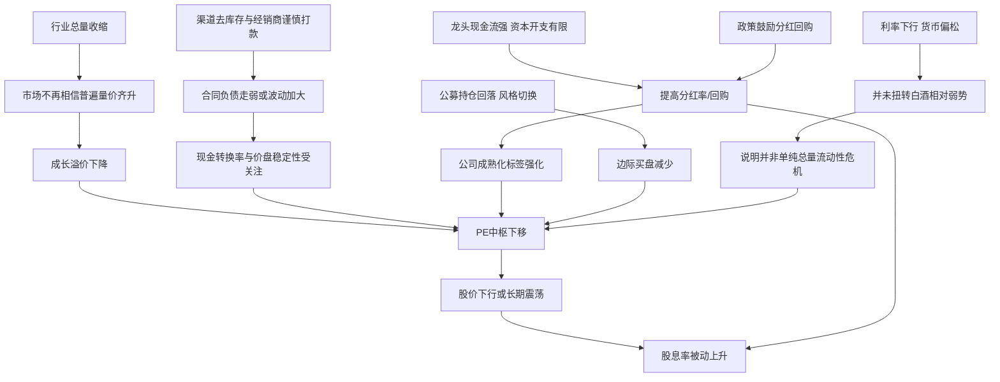

# 中国白酒龙头高股息与股价下行的深层原因研究

## 执行摘要

这轮白酒龙头“股息率普遍抬升到4%上下甚至更高、但股价仍下行或横盘”的核心，并不是一个单一变量能解释的现象。更准确地说，它是**“高分红成熟化”**与**“成长溢价塌缩”**同时发生的结果：一方面，龙头酒企现金流普遍仍强、资本开支相对有限、监管又鼓励分红和回购，因此分红率上升；另一方面，资本市场对行业未来三到五年的**量价增速、渠道资本周转、经销商预付款意愿和资金偏好**重新定价，导致估值中枢持续下移。中证白酒指数截至2026年5月29日股息率已达4.45%，PE为20.19倍，但年初至今仍下跌18.05%，近一年下跌24.62%，说明“高股息”本身并没有阻止估值继续压缩。citeturn3search1turn47search1turn47search2

从基本面看，白酒行业并非“利润崩塌”，而是进入了**总量萎缩、利润集中、增长放缓**的新阶段。官方/行业口径显示，2016年全国规模以上白酒产量约1358.4万千升，而到2024年仅为414.5万千升；但2024年行业销售收入仍为7963.84亿元、利润总额2508.65亿元，意味着行业在“卖得更少”的同时“赚得更集中”，盈利更多向头部集中。资本市场据此不再给整个板块统一的高成长估值，而是把不同公司拆分为“稳现金流高股息资产”“修复博弈资产”“潜在分红陷阱资产”三类来交易。citeturn48search2turn25view4turn28view0

因此，若要回答“深层次原因是什么”，我的结论是：**不是简单的流动性紧张，也不是所有龙头都发生了价值坍塌，而是白酒龙头的定价逻辑从‘高增长稀缺消费股’切换成了‘低增长、高现金流、强分红的成熟行业’，而在这一切换过程中，资金撤离、渠道去库存和估值溢价收缩，比静态股息率更有定价权。**对茅台这类绝对高端龙头，更多是“成长溢价坍塌”；对洋河这类中高端价位承压公司，则已经出现了更明显的“现金流与分红错配、盈利中枢下修”的压力。citeturn22view0turn25view4turn35view2turn42view0turn52search2

## 研究设定与口径

本文按用户未指定公司名单的前提，采用A股白酒板块中最具代表性的五家龙头/次龙头作为核心样本：**贵州茅台、五粮液、泸州老窖、山西汾酒、洋河股份**；古井贡酒作为补充估值样本。时间范围以**2016—2025/2026**为主，其中财务与经营数据以**2024年年报**为最新完整年度，二级市场估值、股息率采用**2026年6月初**附近的公开页面数据。由于公开网页对**PB、EV/EBITDA、日频资金净流入、换手率全量历史序列**披露不完全一致，本文优先使用公司年报、证监会指定披露平台、央行/国家统计局/中证指数公司、以及可追溯的公开估值页面；对缺口部分，使用明确标注的**近似口径**或给出**复现方法**，不硬填数据。citeturn21search4turn28view0turn35view0turn35view1turn35view2turn3search1

一个重要前提是：**股息率上升本身往往是股价下跌的结果，而不是股价一定会止跌的原因。**因为股息率=每股股息/股价，只要价格下跌幅度快于分红下降幅度，股息率就会上升。白酒板块近年的真实问题，不是“分红不够高”，而是市场把未来增长、价格体系、渠道周转和资金偏好放在了比当期分红更靠前的位置。这个定价逻辑，从2024—2026年的板块表现、基金持仓变化、以及龙头公司合同负债和库存变化中都能看出来。citeturn3search1turn47search1turn47search2turn25view4turn42view0

## 关键发现

- **高股息是结果，不是原因。**截至2026年5月29日，中证白酒指数股息率4.45%、PE 20.19倍，但年初至今下跌18.05%、近一年下跌24.62%，表明“股息率升高”更多来自价格回撤与分红率提升，而非市场对行业重新乐观。citeturn3search1
- **行业不是利润崩塌，而是增长模式切换。**2016年规模以上白酒产量约1358.4万千升，2024年降至414.5万千升；但2024年行业销售收入7963.84亿元、利润总额2508.65亿元，说明总量收缩、利润集中、头部分化加剧。citeturn48search2turn25view4turn28view0
- **龙头之间分化很大。**茅台2024年营收增长15.71%、归母净利增长15.38%，但合同负债同比下降32.09%，反映经销商预付款节奏放缓；洋河则直接出现营收下降12.83%、归母净利下降33.37%，其主力中端和次高端价位段承压更明显。citeturn22view0turn25view4turn35view2turn42view0
- **资金面不是“纯流动性危机”，而是“板块买方结构变了”。**央行2025年仍执行适度宽松货币政策，且2025年5月20日1年期LPR已降至3.0%、5年期以上LPR降至3.5%；但同期食饮/白酒公募重仓比例继续回落，2026Q1大消费重仓仍处历史低位，说明压制白酒的不是单纯无钱，而是边际资金不愿再为高估值消费支付溢价。citeturn10view1turn11view0turn47search1turn47search2
- **监管强化分红与回购，进一步推动了“成熟化定价”。**新“国九条”落地后，2024年A股上市公司分红2.4万亿元、回购近1500亿元；茅台发布三年分红规划并首次启动回购，五粮液承诺2024—2026年每年现金分红率不低于70%、且每年分红金额不低于200亿元。监管强化股东回报本是利好，但副作用是市场更容易把白酒龙头当作“高分红低增长”资产，而不再给其过去那种高成长溢价。citeturn50search0turn22view0turn27search1

## 数据图表与比较

下表用“关键时点”替代完整日频长序列，目的是在公开可核验数据约束下，仍然把“量、利润、资金、估值”的转换过程清楚地展示出来。

| 关键时点 | 核心信号 | 可核验数据 | 解释 |
|---|---:|---:|---|
| 2016 | 行业总量高位 | 白酒产量约1358.4万千升 | 白酒仍带有较强总量扩张逻辑 |
| 2024 | 行业量缩利增 | 产量414.5万千升；销售收入7963.84亿元；利润2508.65亿元 | 总量收缩，但利润向头部集中 |
| 2025 | 宏观消费修复偏温和 | 社零总额501202亿元，同比+3.7%；餐饮收入57982亿元，同比+3.2% | 需求并未塌陷，但也不支持“普遍高增长” |
| 2025Q3 | 板块买方力量减弱 | 食品饮料基金重仓4.73%；白酒3.69%；剔除茅台后白酒2.21% | 公募对白酒边际减仓 |
| 2026-05-29 | 高股息与低回报并存 | 中证白酒PE 20.19倍、股息率4.45%、YTD -18.05%、近1年 -24.62% | 典型“高股息但仍杀估值” |

注：2016年数据来自商务部/国家统计局口径，2024年行业数据来自龙头公司年报引用的国家统计局与中国酒业协会口径，2025年消费数据来自国家统计局，2025Q3基金重仓来自公开研报摘要，2026年板块估值与收益来自中证指数公司。citeturn48search2turn25view4turn28view0turn47search3turn47search1turn3search1

图示地看，资金侧更像是在做“撤出高估值消费”的风格切换，而不是简单地撤出整个A股消费：

```text
公募持仓强弱示意
食品饮料（2025Q3）      4.73%   ██████████
白酒（2025Q3）          3.69%   ████████
白酒剔除茅台（2025Q3）   2.21%   █████
2026Q1大消费板块重仓：仍处历史低位  ↓
```

这意味着白酒板块在2025—2026年遭遇的是**边际买方衰减**：不是没有钱，而是有钱也不愿意继续堆在白酒上。citeturn47search1turn47search2

再看横截面估值，可以更直观看到“高股息并不等于同一种逻辑”：

| 公司 | 2026年6月初股息率 | PE_TTM | 3年PE分位 | 读法 |
|---|---:|---:|---:|---|
| 贵州茅台 | 4.09% | 19.24 | 1.52% | 典型“增长溢价塌缩，但现金流仍强” |
| 五粮液 | 6.36% | 24.98 | 76.17% | 高股息但PE并不低，市场仍在博弈修复 |
| 泸州老窖 | 6.60% | 12.96 | 11.72% | 低估值高股息，偏价值型 |
| 山西汾酒 | 5.38% | 13.56 | 0.14% | 明显被从高成长股重估为价值股 |
| 洋河股份 | 3.34% | 63.80 | 96.69% | 不是“低PE高股息”，而是利润下滑导致PE被动抬高 |
| 古井贡酒 | 4.73% | 16.50 | 38.34% | 区域龙头，估值回落但未到极端低位 |

注：估值与股息率取自2026年6月1日至6月5日附近公开页面，不同公司日期略有差异。citeturn16search0turn15search1turn16search6turn17search1turn17search0turn17search2turn18search0turn19search4turn18search2turn18search3turn19search1turn19search2

公司端的现金流、库存和渠道预付款信号，则更能解释“为什么分红高，价格还跌”：

| 公司 | 营收 | ROE | 经营现金流 | Capex代理 | FCF代理 | FCF率 | 库存期末 | 合同负债期末 | 库存周转率 |
|---|---:|---:|---:|---:|---:|---:|---:|---:|---:|
| 贵州茅台 | 1708.99 | 36.02% | 924.64 | 41.74 | 882.90 | 50.7% | 543.43 | 95.92 | 0.27 |
| 五粮液 | 891.75 | 23.35% | 339.40 | 26.66 | 312.74 | 35.1% | 182.34 | 116.90 | 约0.83 |
| 泸州老窖 | 310.92 | 30.44% | 191.82 | 11.88 | 179.94 | 57.9% | 133.93 | 39.78 | 约0.31 |
| 山西汾酒 | 360.11 | 39.68% | 121.72 | 6.38 | 115.34 | 32.0% | 132.70 | 86.72 | 约0.69 |
| 洋河股份 | 288.76 | 12.07% | 46.29 | 14.54 | 31.75 | 11.0% | 197.33 | 103.44 | 约0.40 |

注：金额单位均为亿元。Capex代理定义为“购建固定资产、无形资产和其他长期资产支付的现金”；茅台因公开文本口径限制，采用年报披露的“基本建设投资实际额”替代，因此FCF为近似值。除茅台库存周转率直接采用年报披露值外，其余按“营业成本/平均存货”估算。可以看到：多数龙头仍然是高现金流行业，但这一事实并没有阻止股价下行，因为市场在压缩的是**未来增长与渠道效率预期**，而非否定其当期现金创造能力。citeturn22view0turn23view4turn25view4turn28view0turn29view0turn29view3turn31view1turn37view3turn38view0turn36view0turn45view0turn45view3turn46view0turn46view1turn45view5turn35view2turn40view0turn42view0turn43view0

如果把“分红覆盖率”拉出来看，结论会更有区分度：

| 公司 | 2024年度已披露/实施分红 | 2024年度分红支付率 | FCF/现金分红 |
|---|---:|---:|---:|
| 贵州茅台 | 年报分红346.71亿元 + 中期分红300.01亿元 | 75.00% | 约1.36x |
| 五粮液 | 年报分红123.01亿元 + 中期分红99.99亿元 | 70.01% | 约1.40x |
| 洋河股份 | 年报分红34.90亿元 + 中期分红35.10亿元 | 104.90% | 约0.45x |

这张表非常关键：**高股息不能一概而论。**茅台、五粮液属于“现金流覆盖分红”的高股息；洋河则更接近“盈利和现金流承压下仍提高股东回报”的情形，市场会担心可持续性，因此更容易出现“股价不买账”。citeturn52search0turn19search0turn52search2turn22view0turn29view0turn35view2turn43view0

## 深层次因果分析

### 公司层面

公司层面的第一层原因，是**白酒龙头越来越像成熟现金牛，而不是高再投资成长股**。茅台2024年营收1708.99亿元、归母净利862.28亿元、经营现金流924.64亿元，加权平均ROE 36.02%，并首次发布三年分红规划、首次启动30亿—60亿元回购，典型特征就是“现金太多、可高回报再投资项目相对有限、管理层更愿意把钱还给股东”。这会抬高分红率，也会抬高股息率，但同时告诉资本市场：公司已经进入更成熟、增长更稳而非更快的阶段。citeturn22view0turn23view4

第二层原因，是**市场不再按“当期盈利”给价，而是按“未来增长斜率”给价**。最典型的对照是茅台与洋河：茅台2024年收入和利润仍保持双位数增长，但合同负债同比下降32.09%，年报直接解释为“经销商预付货款减少”；洋河更直白，年报明确写到行业进入存量竞争阶段、公司主力产品集中的中端和次高端价位段承压较大，全年营收下降12.83%、归母净利下降33.37%，合同负债也从111.05亿元降至103.44亿元。资本市场看到的不是“今年还能分多少红”，而是“未来三年还能不能保持原来的量价增速”。citeturn25view4turn35view2turn42view0

第三层原因，是**高股息对白酒只提供‘下限’，不给‘上限’**。五粮液2024年在公司口径里仍属板块内相对稳健者：公司称第八代五粮液价格基本稳定，2024年白酒行业处于深度调整期但公司仍实现营业总收入891.75亿元、净利润318.53亿元，并在2024年成为19家白酒上市公司中唯一股价正增长企业；与此同时，公司把2024—2026年的年度现金分红率底线提高到70%，且不低于200亿元。也就是说，分红确实能托住底部，但它只能把公司从“成长股”变成“收益型资产”，无法单凭本身重建过去那种高估值。citeturn27search1turn28view0turn19search0

### 行业层面

行业层面的核心，是**总量收缩与结构升级同时发生**。2016年规模以上白酒产量约1358.4万千升，2024年仅414.5万千升，九年间产量收缩接近七成；但2024年行业销售收入和利润仍分别达到7963.84亿元与2508.65亿元。这说明白酒不是“卖不动了”，而是越来越依赖高端化、头部化和集中化来创造利润。过去资本市场把这种现象理解为“龙头享受永久成长”；如今则更倾向于理解为“成熟寡头赚现金，但行业总需求天花板更清楚”。citeturn48search2turn25view4turn28view0

需求侧的变化并不一定表现为“所有消费都差”，而是表现为**白酒需求结构不再支持普遍提价与全面扩张**。2025年社会消费品零售总额同比增长3.7%，餐饮收入同比增长3.2%，这说明消费在恢复，但恢复速度不高，也不够广泛，难以给所有白酒价位带都带来同步变好。结果是：绝对高端还能靠品牌稀缺性与配额体系维持韧性，次高端和中高端则更依赖宴席、商务和区域渠道周转，一旦终端动销慢、经销商回款谨慎，股价会先于利润做出更剧烈的反应。citeturn47search3turn22view0turn35view2

渠道层面的深层变化，是**过去白酒“经销商垫资+预付款滚动”的资本化红利在下降**。五粮液年报明确写明其经销模式“以经销模式为主，采用先款后货”的结算方式，专卖店数与经销商数仍在扩张；而茅台、洋河的合同负债下降，说明最能反映渠道预付款意愿的指标在走弱。换言之，市场过去愿意给白酒高估值，不仅因为品牌稀缺，还因为渠道能替厂家“预融资”；当这部分融资属性削弱时，股权估值自然要让位给更朴素的现金流与增长定价。citeturn28view0turn25view4turn42view0

### 宏观与资金面

宏观层面，判断“是不是流动性问题”必须区分**系统流动性**和**板块流动性**。系统层面，中国人民银行在2025年一季度货币政策执行报告中延续“适度宽松”取向，2025年5月20日1年期LPR为3.0%、5年期以上LPR为3.5%。如果白酒下跌的主因只是“没钱”，那么在利率下行、政策偏松的背景下，它不应持续跑输到这种程度。事实恰恰相反，这说明压制白酒的更像是**风险偏好、增速预期和板块配置权重**，而非总量货币条件。citeturn10view1turn11view0

资金面真正的关键，是**白酒正在失去过去那种“机构抱团核心资产”的配置地位**。公开研报摘要显示，2025年三季度食品饮料基金重仓比例降至4.73%，白酒降至3.69%，剔除茅台后仅2.21%；而2026年一季度，大消费板块重仓比例仍处历史低位。资金并没有完全离开消费，但它更偏向有新故事的细分消费、服务消费或其他赛道，而不愿继续为白酒支付系统性溢价。对白酒来说，这意味着“股息率上升”很可能只是补偿，而不是催化剂。citeturn47search1turn47search2

从估值语言上说，白酒过去十年最值钱的部分不是“今年能赚多少钱”，而是“未来很长时间都能持续量价齐升”的确定性。一旦资金开始相信行业已经从“成长”切换到“成熟”，那么哪怕利润没崩、分红更高，估值倍数也会下降。这个过程在山西汾酒、泸州老窖、贵州茅台身上体现为**PE分位大幅滑落**；在洋河身上则体现为**盈利分母下行，把PE被动抬高**。这就是为什么同样是“高股息”，不同公司背后的市场含义完全不同。citeturn16search0turn16search6turn17search1turn17search0

### 会计治理与监管

会计与治理层面，我更倾向于认为，**主线不是财务真实性坍塌，而是渠道现金转动效率成为更核心的质量指标**。例如泸州老窖年报中，审计机构把收入与合同负债作为关键审计事项，并对主要经销商执行函证和走访程序。这说明市场和审计都把“经销商真实打款、渠道真实消化”视为核心变量。换句话说，投资者担心的重点并不是“酒企会不会突然不赚钱”，而是“利润是不是还能稳定地转成现金、渠道是不是愿意继续预付、价格体系能否守住”。citeturn37view0turn38view0

监管层面对分红与回购的政策强化，也改变了市场对这类公司的标签。新“国九条”出台一年后，证监系统披露2024年上市公司分红2.4万亿元、回购近1500亿元；茅台、五粮液等龙头都显著提高了股东回报承诺。这种政策环境让高股息成为优势，但也让市场更容易按“类债券、类公用事业”的思路去看部分消费龙头。**一旦一个行业被从“成长资产”重标为“收益资产”，高分红并不会推高估值，反而可能固化低增长预期。**citeturn50search0turn22view0turn27search1turn52search0turn19search0



## 结论与投资含义

结论可以压缩成一句话：**白酒龙头高股息而股价不涨，并不是“分红失效”，而是市场在用更低的估值去折现一个更慢、更成熟、更依赖渠道质量的行业。**所以，深层原因首先不是“资金没了”，而是**资金不再把白酒当成长资产**；其次也不是“所有白酒都价值坍塌”，而是**不同龙头的价值属性发生了重新分层**。citeturn3search1turn47search1turn47search2

如果从投资角度看，我认为至少要把样本分成三类。第一类是**高现金流、分红可覆盖、估值已去成长化**的公司，如茅台、泸州老窖、山西汾酒，这类公司更像“高质量收益资产”；第二类是**高股息但仍处修复博弈**的公司，如五粮液，关键不在分红本身，而在价盘和渠道修复能否兑现；第三类是**盈利承压、分红覆盖不足或接近不足**的公司，如洋河，这类公司更容易出现“股息率看着不低，但其实是分红陷阱”风险。citeturn52search0turn19search0turn52search2turn35view2turn42view0

如果从政策与治理角度看，真正有助于改善估值的，不是继续单纯提高分红率，而是**提高渠道与终端动销披露透明度**：例如更稳定地披露经销商回款、合同负债拆分、核心价位带真实批价、库存结构和促销投放效率。因为今天白酒估值被压缩的原因，已经不是“公司能不能赚钱”，而是“市场能不能相信这种赚钱方式还能持续多久”。只要这个问号不消失，股息率再高，也只能是防御属性，而不是重估催化。citeturn37view0turn25view4turn42view0

## 研究局限与复现方法

本文的局限主要有三点。第一，**PB、EV/EBITDA、日频净流入、换手率**在公开网页层面缺少统一、可直接核验的同口径连续序列，因此本文用**PE、股息率、基金重仓比例、合同负债、库存**作为替代核心指标。第二，白酒的存货中大量是**基础酒/半成品酒**，天然具有陈化周期，不能把库存上升机械理解为“卖不动”。第三，合同负债会受到发货节奏、节庆备货、渠道结构调整影响，因此应与价格体系、终端动销和利润质量一起看，而不能单独下结论。citeturn25view4turn28view0turn38view0turn42view0

若需要复现，可按以下字段和公式操作：

| 模块 | 字段 | 公式/说明 |
|---|---|---|
| 股息率 | 近四季度每股现金分红、收盘价 | 股息率_TTM = 近四季度每股分红 / 当前股价 |
| 分红支付率 | 年度现金分红额、归母净利润 | 分红支付率 = 现金分红额 / 归母净利润 |
| FCF | CFO、Capex | FCF = 经营活动现金流净额 - 购建固定资产等长期资产支付的现金 |
| 分红覆盖率 | FCF、现金分红额 | 分红覆盖率 = FCF / 现金分红额 |
| 库存周转 | 营业成本、期初/期末存货 | 存货周转率 = 营业成本 / 平均存货 |
| 渠道强弱 | 合同负债、应收账款、经销商数 | 重点看合同负债同比、应收是否显著上升、结算方式是否仍为先款后货 |
| 资金面 | 行业基金重仓比例、板块指数收益率 | 看“重仓比例变化 + 指数收益率 + 成交活跃度” |

若用 Wind/Choice/同花顺/聚源 做进一步精化，建议把样本扩展到 8 家，并增加三张图：**日频股价与股息率滚动图、机构持仓比例与行业PE图、批价/合同负债/库存联动图**。这样就可以把“高股息—低股价”从一个静态现象，完整还原成“需求—渠道—现金流—资金偏好—估值”的动态链条。