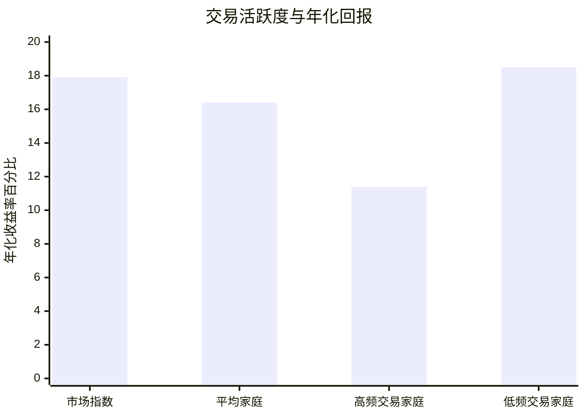
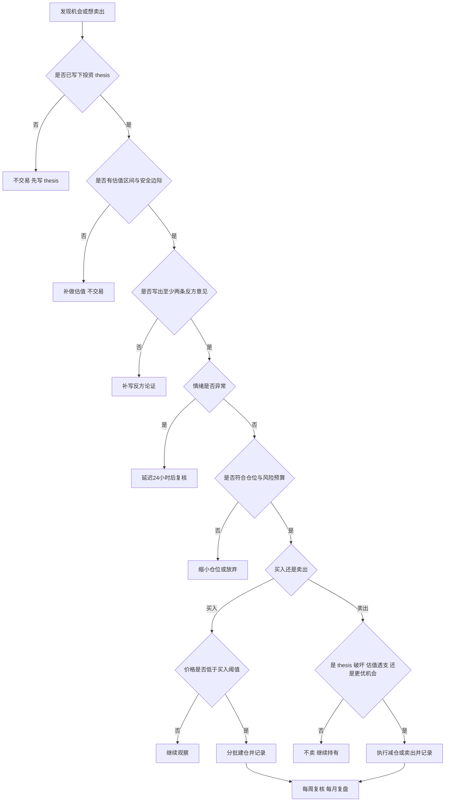

## 执行摘要

你所反思的矛盾，核心不在于“你是否逆势”，而在于**你的买卖触发器到底是价格，还是内在价值**。如果一个人嘴上反感“追涨杀跌”，但实际操作却常常“下跌时不断加仓、稍有反弹就卖出”，并把这种做法称为“价值投资”，那么他并不是在实践经典意义上的价值投资，而更可能是在用“价值”语言包装一种**价格驱动、情绪驱动、参考点驱动**的交易行为。行为金融学里，这与“处置效应”“损失厌恶”“锚定”“确认偏误”“后见之明”“短视型损失厌恶”等现象高度一致。citeturn15view0turn22view0turn18search0turn24search1turn28search0turn29search0turn27view1

经典价值投资并不等于“股价跌了就买”。本杰明·格雷厄姆把“安全边际”视为投资的中心概念，并强调真正的投资必须有**可以由数字、逻辑推理和实际经验证明的安全边际**；沃伦·巴菲特则把“内在价值”定义为未来现金流折现后的价值，并明确表示应当按企业的长期进展而非股价的月度波动来衡量成败。换言之，**下跌本身不是价值证据，便宜也不等于有安全边际，更不等于应该无条件加仓**。citeturn20view1turn20view2turn20view3turn17view1turn9view3turn24search2

从结果上看，“追涨杀跌”和“追跌杀涨”方向相反，但本质相通：二者都让价格走势而不是企业价值支配决策。前者往往“买在情绪高潮、卖在恐慌低点”；后者则常常“把下跌错当便宜、把反弹错当兑现机会”，于是形成“亏损仓位越抱越久、盈利仓位越拿越短”的结构性缺陷。Terrance Odean 对 10,000 个账户的研究发现，投资者显著更愿意卖出盈利资产而不是亏损资产；Barber 与 Odean 对 66,465 个家庭账户的研究进一步发现，交易最频繁的一组年化收益仅 11.4%，显著低于市场的 17.9%。citeturn22view0turn23view0turn23view2

在没有你个人交易记录的前提下，本报告把你所描述的状态视为一种常见的“**价值投资话术下的价格反应型行为**”，并给出一套可直接落地的改进框架：包括每日、每周、每月流程，书面化投资 thesis，量化或半量化买卖信号，仓位与风险规则，情绪自检清单，交易记录模板，以及 6 个月与 1 年的改进衡量指标。其目标不是保证你不犯错，而是把“犯错方式”从情绪化、不可复盘、不可积累，改造成制度化、可追踪、可纠偏。citeturn34view2turn34view3turn16view3turn11search5turn35view0

## 问题分析

在本报告中，“追涨杀跌”可定义为：**因为价格上涨和市场热度而买入，因为价格回落、情绪恐慌或趋势走坏而卖出**；“追跌杀涨”则可定义为：**因为价格下跌而不断加仓，自认为在“捡便宜”，但一旦价格出现小幅反弹、回本或短期盈利，又急于卖出兑现**。前者的买点常常过高、卖点常常过低；后者则容易把“跌了很多”误当“低于内在价值”，同时把“涨了一点”误当“应该落袋为安”。二者虽然表面相反，但都属于以近期价格轨迹为主导的行为，而不是以内在价值评估为主导。citeturn14view3turn15view0turn22view0turn18search0

更具体地说，**追涨杀跌**的主要后果是“高位接盘、低位割肉”，深交所投教案例就展示了一个典型场景：在基本面并无显著变化的情况下，题材概念、媒体热度和操纵行为制造出上涨假象，吸引投资者追高，最终使投资者在高位被套。**追跌杀涨**则更隐蔽，因为它披着“逆向”“理性”“别人恐惧我贪婪”的外衣，但如果你没有独立估值、没有更新 thesis、没有区分“临时波动”和“永久减值”，那它很容易滑向“接飞刀”和“赚小钱、亏大钱”的组合。citeturn14view3turn16view0turn15view0turn22view0

你的行为与价值投资原则之间，至少存在四个具体矛盾。第一，**价值投资要求基于内在价值买入**，而不是基于“比前高跌了多少”买入；巴菲特把内在价值明确界定为未来现金流折现值，格雷厄姆则反复强调价格与价值之间必须有可证明的安全边际。第二，**价值投资要求安全边际**，而“跌了很多”只是价格事实，不是安全边际证据。第三，**价值投资强调长期持有的是好企业的长期进展，而不是亏损仓位的情绪性拖延**。第四，**价值投资的卖出依据应当是估值回归、基本面破坏或更优机会成本**，而不是“终于回本了”或“先落袋再说”。citeturn17view1turn9view3turn20view1turn20view2turn20view3turn24search2

格雷厄姆在《聪明的投资者》中强调，真正的投资必须具有**由数字、论证和经验支持的安全边际**，并明确怀疑“押注市场涨跌方向”能否算作有安全边际的投资。这个判断几乎直接击中你反思中的关键矛盾：如果你买卖的根本依据，是跌了、涨了、快回本了、离成本价不远了，那么你实际上依赖的是**参考点与路径**，而不是价值。citeturn20view3turn29search0turn18search0

下表是两类行为与价值投资原则的对照归纳。表格中的“追跌杀涨”并不是标准学术术语，而是对你描述行为模式的操作性定义；其逻辑基础主要对应行为金融中的处置效应、损失厌恶与锚定。citeturn15view0turn22view0turn18search0turn29search0

| 维度 | 追涨杀跌 | 追跌杀涨 | 价值投资的要求 |
|---|---|---|---|
| 买入触发 | 价格上涨、情绪高涨、怕错过 | 价格下跌、觉得“终于便宜了” | 价格显著低于可验证内在价值 |
| 卖出触发 | 回撤、恐慌、趋势变坏 | 回本、小赚、短期反弹 | 估值回归、 thesis 破坏、机会成本更优 |
| 主要心理 | 从众、FOMO、情绪传染 | 损失厌恶、锚定、确认偏误 | 独立判断、概率思维、价格/价值分离 |
| 常见结果 | 高买低卖 | 亏损持仓过久、盈利持仓过短 | 盈亏比、持有期、仓位都围绕价值逻辑 |
| 最大误区 | 把上涨当质量 | 把下跌当价值 | 把价格当信息，而非把价格当结论 |

## 认知偏差与心理机制

这类自相矛盾行为之所以顽固，是因为它通常不是单一错误，而是多个偏差叠加。最底层的是**展望理论**：Kahneman 与 Tversky 发现，人们并不是围绕财富绝对水平做决策，而是围绕某个参考点看“得失”；并且对损失的敏感度高于对收益的敏感度，导致人在盈利区更偏向保守，在亏损区更偏向冒险。Benartzi 与 Thaler 后来进一步提出“短视型损失厌恶”，指出“损失厌恶 + 频繁评估”会把人推向短期化、反应化的投资。citeturn18search0turn18search13turn24search1turn24search3

Terrance Odean 对 10,000 个账户的经典研究把这种心理落到了交易记录上：投资者整体上更倾向于卖出赚钱的股票而继续持有亏损的股票，全年盈利实现比例 PGR 为 0.148，而亏损实现比例 PLR 仅为 0.098，意味着账面上涨的股票被卖出的概率明显更高。这个现象正是“**逢涨先卖、逢跌再等等**”的学术对应物，也是你所说“追跌杀涨”最典型的结果结构。citeturn22view0turn21view4

下表把几种关键偏差放到买卖决策链条中来看。表内内容是基于经典论文、心理学词典定义、行为金融综述以及机构实践经验所做的归纳。citeturn28search0turn28search1turn29search0turn27view1turn26view1turn29search7

| 偏差 | 在买入时如何发作 | 在卖出时如何发作 | 典型自我叙事 |
|---|---|---|---|
| 损失厌恶 | 下跌后急于“摊低成本”，因为不愿承认原判断错误 | 不愿在亏损时卖出，宁可继续等 | “只要不卖就不算亏” |
| 处置效应 | 对新跌下来的标的更愿意补，而不是重新比较更优标的 | 盈利稍有出现就急于兑现 | “先把到手的利润锁住” |
| 确认偏误 | 买入后只找支持“被错杀”的信息，忽略恶化证据 | 不愿承认 thesis 已破裂 | “市场终会发现我是对的” |
| 锚定 | 锚定买入价、前高、目标价，把它们当价值代理 | 以“回本”“接近前高”为卖点 | “都跌回这个位置了，不可能更差” |
| 过度自信 | 过高估计自己识别“暂时下跌/永久损伤”的能力 | 以为自己能精确拿捏反弹与拐点 | “别人看不懂，我看得懂” |
| 后见之明 | 把偶然反弹当作自己当初判断正确的证据 | 把卖飞或割肉后走势解释成“本来就明显” | “其实当时迹象很清楚” |
| 情绪传染 | 在社媒、群聊、新闻情绪中强化恐惧或兴奋 | 在群体一致看空/看多时丧失独立判断 | “大家都这么看，应该没错” |
| 短期主义 | 频繁看盘，价格波动压过业务分析 | 过度关注日周涨跌，损害长期持有能力 | “先处理波动，基本面以后再说” |

**确认偏误**会让你在买入下跌股后，主动搜索“低估”“错杀”“主力洗盘”之类的支持性材料，而对利润下滑、竞争恶化、资本开支失控、治理问题等不利证据视而不见。Nickerson 对确认偏误的综述，和 APA 对其定义，都把这一点概括为：人会偏好收集与解释能支持既有观点的证据，而忽略反证。citeturn28search0turn28search1

**锚定**会把“成本价、前高、阶段高点、某位分析师目标价”变成你脑中的伪内在价值。APA 将 anchoring bias 定义为以最初信息为锚来影响后续判断。投资里最常见的表现，就是你不是在问“这家公司今天值多少”，而是在问“它离我买的时候还有多远”。一旦判断从“价值”滑向“相对过去某个价格”，你就已经偏离了价值投资。citeturn29search0turn17view1turn9view3

**后见之明偏差**会污染复盘。Fischhoff 的研究表明，一旦人知道结果发生了，就会高估这个结果本来就“显而易见”的程度，并错误地记忆自己此前的概率判断。放在投资上，就是你会把偶然反弹说成“我本来就知道会反弹”，把一次踩雷说成“其实当时早看出不对劲”，从而阻断真正的纠错。citeturn27view1

**情绪传染与叙事传播**解释了为什么很多人明明自认独立，最后还是做出高度相似的交易。Shiller 在《非理性繁荣》中把投机泡沫描述为：价格上涨会激发热情，而这种热情会通过“心理传染”在人与人之间扩散，并不断放大那些能为上涨辩护的故事；即使投资者对真实价值有所怀疑，也会因为羡慕他人成功或赌博式兴奋而卷入。这个机制既解释“追涨”，也解释“在下跌中不断为自己补仓找故事”。citeturn26view0turn26view1turn26view2turn26view3

## 理论与案例支持

格雷厄姆的框架，对你当前的矛盾最有穿透力。他在《聪明的投资者》中反复强调三点：第一，股票首先是企业的一部分，不只是代码；第二，市场在过度乐观与过度悲观之间摆动，理性投资者应当向乐观者卖出、向悲观者买入；第三，安全边际取决于你支付的价格，而真正的投资必须有可由数字、推理和经验支持的安全边际。换成中文要点就是：**价值投资不是“见跌就买”，而是“价格相对价值有充分余量时才买”；也不是“赌市场迟早回来”，而是“即使未来预测不完全准确，也能被安全边际保护”**。citeturn20view0turn20view1turn20view2turn20view3

巴菲特的相关论述，则把格雷厄姆的原则落到了企业分析与持有纪律上。他在 1989 年股东信中把内在价值定义为一家企业未来现金流按适当利率折现后的价值；在伯克希尔《Owner’s Manual》中又写得更直白：衡量可口可乐或美国运通这类持仓，不应看股价月度波动，而应看企业长期进展。到了 2004 年股东信，他更直接批评了投资者常见的“停停走走式择时”——往往在涨势持续很久后才进场，却在停滞或下跌后离场。也就是说，**价值投资者不是没有交易纪律，而是把纪律建立在企业价值和资本配置上，而不是建立在情绪与价格冲动上**。citeturn9view3turn17view1turn24search2turn16view0

巴菲特 2024 年股东信还提供了一个对“追跌杀涨”尤其有教育意义的反例：他坦承，1965 年接管伯克希尔是自己的错误，因为“看起来便宜”的纺织业务实际上正走向衰亡。这几乎是“跌得多、估值低、看着便宜，但商业质量已永久受损”的经典价值陷阱案例。对你而言，这个案例的重要启示是：**便宜可以是真的，但便宜背后的生意可能更烂；价格低不是安全边际，商业质量与资本回报才决定价格低是不是机会。**citeturn31view0turn32view0

彼得·林奇的语言更贴近个人投资者的实际操作。他在 Fidelity 的访谈中说得很明确：如果你不理解公司做什么、资产负债表如何，那么股价下跌时你就没有理由自信地继续买；同时，如果你一年内就要用钱，那就算不上合格的长期投资者。他还谈到在高波动环境中把自己的三条投资 thesis 写下来，再回到 thesis 本身去检查。这个建议之所以重要，是因为它把“我觉得它便宜”变成了“我能否清楚写出：为什么买、预期看到什么、哪些事实会证明我错了”。citeturn33view0turn33view1turn33view2

从中国市场的具体案例看，深交所投教案例说明了“追涨杀跌”的直接伤害：在一个 23 个交易日上涨 55.1% 的个股中，基本面变化并不突出，但操纵账户通过对倒、虚假委托、拉抬股价等手法营造热度，最终在涨停板上吸引跟风资金接盘。这个案例提醒你：**价格上涨可能是价值被发现，也可能只是噪音、拥挤和操纵；同理，价格下跌也可能是价值浮现，也可能是价值塌陷的前奏。** 因此，单纯以价格路径决定买卖，本身就暴露于巨大的误判风险。citeturn14view3

行为金融学的实证研究则给出了可量化的证据。Odean 的研究显示，投资者卖出盈利资产的倾向显著强于卖出亏损资产；Barber 与 Odean 对 66,465 个家庭账户的研究显示，交易最频繁的投资者年化回报仅 11.4%，显著低于市场的 17.9%，也低于低换手组的 18.5%。这并不意味着“永不交易”最好，而是说明**频繁的、情绪化的、无流程的交易，会系统性侵蚀回报**。citeturn22view0turn23view0turn23view4

上图数据来自 Barber 与 Odean 对美国家庭账户的研究：市场年化收益约 17.9%，平均家庭 16.4%，高频交易家庭仅 11.4%，而低频交易家庭达到 18.5%。在这项研究里，平均家庭的股票组合年换手率超过 75%，最高换手组甚至超过 250%。这组证据对你的启发很直接：**你真正需要克服的，不是“顺势还是逆势”的标签问题，而是“是否把交易冲动制度化地关进笼子里”。** citeturn23view0turn23view1turn23view2turn23view3turn23view4

## 大师与现代投资者的防错方法

经典投资大师并不是靠“更能忍”来避免追涨杀跌或追跌杀涨，而是靠**把主观判断嵌进客观流程**。巴菲特和格雷厄姆的方法，核心是“以企业为单位、以价格/价值关系为中心、以资本配置为约束”——这使得他们不会因为单日或单周的波动自动改变看法。伯克希尔《Owner’s Manual》明确写道，他们看的是企业长期进展而非股价月度波动；2024 年股东信则再次强调，股票持有更像是对企业的部分所有权，而不是靠灵巧买卖赚差价。citeturn24search2turn24search17turn31view0

霍华德·马克斯的方法更强调“温度计”而不是“预测仪”。他在 Oaktree 的备忘录中多次提醒：市场短期波动更多反映投资者感知在“无望”与“完美”之间的摇摆，而不是冷静衡量价值；底部无法准确识别，因此不应等“确认见底”才行动，而应在能以便宜价格获得价值时逐步买入。这种方法本质上是在用**估值纪律 + 分步执行**，取代“猜底”或“跟随群体情绪”。citeturn16view2turn16view3

现代机构投资者则进一步把这种纪律工具化。上海证券与鹏华投教基地在行为金融专栏中就提到，面对羊群效应可建立“反羊群清单”，面对处置效应可使用机械化再平衡，面对锚定效应可采用多模型估值。AQR 把再平衡视为相对于买入并持有的一种主动逆向策略，并强调设计再平衡时必须同时考虑风险、收益与成本。换句话说，真正成熟的投资流程，并不依赖“我这次一定更冷静”，而依赖**预先写好的规则**。citeturn14view2turn11search5turn16view4

团队机制也非常关键。Ray Dalio 在 Bridgewater 的原则体系中，一方面强调“有害情绪是高质量决策的大敌”，另一方面强调“先学习、后决策”的两步法；在组织层面，又通过邀请不同意见、按可信度加权、避免群体同温层，来降低情绪与确认偏误对单人判断的绑架。Bridgewater 关于文化的公开材料明确指出，他们通过鼓励 dissent 来防止 groupthink，并利用 believability-weighted decision making 对意见进行加权。对个人投资者而言，这意味着即便没有团队，也要人为制造“反方席位”——比如让自己的每个新仓在执行前必须经过一次书面反对意见审查。citeturn34view0turn34view1turn34view2turn34view3

至于“止损/止盈规则”，需要特别区分**价格型规则**与** thesis 型规则**。对于基于内在价值投资的人来说，单纯固定百分比止损未必总是合适，因为它可能把“正常波动”误判成 thesis 失败；但完全没有退出规则同样危险。更稳妥的做法，通常是把“ thesis 破坏”“估值透支”“更优机会出现”作为主要卖出条件，再辅以组合层面的风险阈值、仓位上限和阶段性复核。这一安排并不是否定止损，而是把它从“价格自动反应”升级为“**价值判断失效后的纪律执行**”。这是基于格雷厄姆、巴菲特、Fidelity 的 exit strategy 观念以及现代再平衡实践所做的制度化推论。citeturn20view3turn17view1turn35view0turn11search5turn14view2

## 可执行改进方案

如果把你的问题压缩成一句话，那么改进方向就是：**把“跌了很多所以买、涨了一点所以卖”改造成“ thesis 成立且有安全边际才买、 thesis 破坏或估值透支才卖”。** 下面这套方案默认你是一般个人投资者，而不是全职职业经理人，因此强调低复杂度、可坚持、可复盘。其设计依据来自格雷厄姆的安全边际、巴菲特的内在价值框架、林奇的书面 thesis、Dalio 的制度化原则、AQR 的再平衡逻辑以及 Oaktree 的分步执行思想。citeturn20view3turn17view1turn33view2turn34view2turn11search5turn16view3

先给出总流程。关键点只有四个：**先写、再判、后下单、必复盘**。没有 thesis 不交易；没有估值区间不加仓；没有反方论证不重仓；情绪明显异常时延迟执行。citeturn33view2turn34view3turn35view0

在交易信号上，我建议你使用“**量化主框架 + 半量化复核**”。买入可分为三层：第一层是“进入观察区”——当现价低于你估算内在价值的 80% 时，开始重点跟踪，但不一定买；第二层是“可建仓区”——当现价低于内在价值的 70% 且 thesis 未恶化时，可开 1/3 初始仓位；第三层是“可加仓区”——只有在**价格进一步低于估值区间**，同时基本面与原 thesis 仍成立，才允许加仓。相反，如果只是价格下跌而 thesis 变弱，那么**下跌不是加仓信号，而是重估信号**。这正是把“跌得多”与“真的便宜”区分开的核心。其价值逻辑来自格雷厄姆的安全边际原则与巴菲特对内在价值的定义。citeturn20view2turn20view3turn17view1turn9view3

卖出信号也建议做成三层。第一层是“ thesis 破坏型卖出”，例如核心竞争力削弱、管理层资本配置恶化、财务结构明显变差、行业格局长期性逆转，这一层优先级最高；第二层是“估值透支型卖出”，当价格高于你估值上限，或已不再具备风险补偿；第三层是“机会成本型卖出”，即更高质量、折价更深的标的出现，而你的持仓已缺乏足够安全边际。这样的规则可避免“刚回本就卖”的冲动，因为回本并不是价值事件，只是成本锚定的心理事件。citeturn29search0turn17view1turn20view3turn35view0

仓位与风险控制方面，如果你目前最容易犯的错是“越跌越想买、越涨越想卖”，那么首要任务不是提高收益率，而是切断错误的放大机制。我建议采用如下通用约束：普通 conviction 的单笔初始仓位 1%–3%，高 conviction 机会 3%–5%；单一股票上限不超过 10%，单一行业不超过 25%；任何一次加仓都必须附带**新的书面估值更新**与** thesis 未破坏说明**；单一持仓自最近一次买入价下跌 10% 时触发快速复核，下跌 20% 时触发强制重写 thesis，但这不是自动卖出，而是自动进入“不能自欺”的程序。这个做法的精神，与格雷厄姆把安全边际和分散视为一体、以及机构通过机械化约束减少处置效应的实践是一致的。citeturn20view3turn14view2

日、周、月三个时间尺度的流程，应当分别承担不同功能。**每日**只做信息更新，不做情绪交易：限定查看行情次数，记录是否出现影响中长期现金流的实质信息；若仅是股价下跌而无新事实，不作交易。**每周**做持仓体检：更新每个持仓的“ thesis 是否更强/更弱/不变”、安全边际是否收窄、是否出现更优替代。**每月**做组合复盘：统计所有买卖是否符合流程、哪些交易是价格驱动、哪些交易是 thesis 驱动、最大错误来自估值、事实判断还是情绪。这样安排的理论基础，是短视型损失厌恶会被频繁评估放大，因此应把“看价格”的频率低于“看业务”的频率。citeturn24search1turn24search3turn24search2

下面给出一个可直接复制的交易决策记录表样例。你真正要防的不是“写得麻烦”，而是“因不写而把情绪误认成逻辑”。彼得·林奇关于写下三条投资 thesis 的建议，非常适合做这个模板的最小骨架。citeturn33view2

| 日期 | 标的 | 动作 | 现价 | 估算内在价值区间 | 安全边际 | thesis 三要点 | 反方证据 | 触发类型 | 初始/目标仓位 | 情绪评分 | 最终决定 |
|---|---|---:|---:|---:|---:|---|---|---|---|---:|---|
| 2026-06-16 | A公司 | 买入 | 48 | 65–72 | 26%–33% | 行业格局改善；现金流稳定；管理层回购 | 行业增速放缓；资本开支上升 | 价值折价 | 2% / 4% | 4/10 | 建 1/3 仓 |
| 2026-06-23 | A公司 | 加仓复核 | 43 | 63–70 | 32%–39% | thesis 未变；业绩预告未恶化；市场恐慌性回撤 | 若下季利润率继续下行则 thesis 受损 | 估值扩大 | 2% / 4% | 5/10 | 可加至 3% |
| 2026-07-15 | B公司 | 卖出 | 92 | 78–86 | 负安全边际 | 估值已透支；替代机会更优；基本面无新惊喜 | 或仍可继续上涨，但赔率下降 | 估值透支 | 5% / 0% | 3/10 | 分两次卖出 |

再给出一个心理自检清单。建议每次准备下单前，强制回答这些问题；只要有两题答不上来，就自动延期 24 小时。这个清单的目的，是用问题打断损失厌恶、锚定与确认偏误。citeturn18search0turn28search1turn29search0turn34view3

| 自检问题 | 若回答为“否”或“说不清” | 说明 |
|---|---|---|
| 我买它是因为便宜，还是因为它刚跌很多？ | 不交易 | 区分“价值”与“路径” |
| 若我今天没有持仓，我会不会以这个价格新开仓？ | 重新评估 | 打破成本锚定 |
| 我能否写出两条最强反方理由？ | 不交易 | 对抗确认偏误 |
| 我能否说明哪些事实会证明我错了？ | 不交易 | 建立 thesis stop |
| 我若三年看不到报价，还愿意持有吗？ | 缩小仓位或放弃 | 检查是否真按企业思考 |
| 我是不是因为想回本、怕错过、怕卖飞而下单？ | 延迟 24 小时 | 识别情绪触发 |

最后，月度复盘不要只看盈亏，还要看**流程合规率**。后见之明的危险在于，很多人只在乎“这次赚没赚”，却不问“这次是否按正确程序做了”。月度复盘应至少回答四件事：我有没有在没有估值的情况下交易；有没有在没有 thesis 更新的情况下加仓亏损股；有没有因为回本而卖出；有没有因为短期热度而交易。citeturn27view1turn34view3

| 复盘月份 | 新开仓笔数 | 有完整 thesis 的占比 | 价格驱动交易占比 | 无 thesis 更新的亏损加仓次数 | 回本型卖出次数 | 平均持有期 | 最大个股回撤 | 备注 |
|---|---:|---:|---:|---:|---:|---:|---:|---|
| 第一个月 | 6 | 67% | 50% | 2 | 2 | 21天 | -18% | 仍明显受情绪影响 |
| 第三个月 | 5 | 100% | 20% | 0 | 1 | 46天 | -11% | 流程开始稳定 |
| 第六个月 | 4 | 100% | 10% | 0 | 0 | 73天 | -9% | 基本摆脱“追跌杀涨” |

## 衡量指标与结论

如果你想知道自己有没有真正改善，不能只看收益率，因为 6 个月甚至 1 年内，市场风格本身就可能掩盖流程质量。更可靠的，是同时看**过程指标**与**结果指标**。在 6 个月窗口里，我建议优先看四个过程指标：其一，新交易中“有完整书面 thesis、估值区间和反方论证”的比例是否达到 90% 以上；其二，价格驱动交易占比是否比起点下降至少 50%；其三，在没有 thesis 更新的前提下加仓亏损股的次数，是否降到 0；其四，因“回本”或“小赚”而卖出的次数，是否显著减少。以上指标的理论依据，都来自行为金融对处置效应、锚定、确认偏误与短视型损失厌恶的研究。citeturn22view0turn28search1turn29search0turn24search1

在 1 年窗口里，再加入三个结果指标。第一，**持有期结构**是否改善：过去如果你总是“亏损仓位拿很久、盈利仓位拿很短”，那么 1 年后应至少看到盈利仓位的中位持有期不再显著短于亏损仓位。第二，**换手率**是否下降到与你的风格相匹配的水平，因为 Barber 与 Odean 的研究表明高频交易会显著侵蚀家庭投资者净回报。第三，**决策归因**是否更清楚：年末时你应该能明确说出，收益主要来自哪些 thesis 正确、哪些是运气、哪些亏损来自事实误判、哪些来自流程失守。citeturn23view0turn23view4turn27view1

如果把整份报告压缩成一句结论，那就是：**你嫌弃别人的“追涨杀跌”，并不 automatically 让你站在价值投资一边；如果你的买卖仍然由价格路径、成本锚定和情绪缓解决定，那么你只是把非理性换了一个方向。** 真正的价值投资不是“跌了买、涨了卖”，而是“只在安全边际充足时买，只在 thesis 破坏、估值透支或机会成本更优时卖”。格雷厄姆、巴菲特、林奇、马克斯、Dalio、AQR 等人的共同点，不是他们从不犯错，而是他们都试图让错误在**流程中暴露，而不是在情绪里伪装**。citeturn20view3turn17view1turn24search2turn33view2turn16view3turn34view2

在没有你个人交易数据的前提下，我对你的最直接判断是：你当前最需要修正的，不是观点，而是**决策架构**。一旦你开始坚持书面 thesis、估值区间、加仓前重估、卖出前分类、月末复盘，你会发现很多原来看似“价值投资”的动作，其实只是“价格波动下的自我安慰”。从那一刻起，你才算真正开始从“会讲价值投资”走向“会做价值投资”。citeturn33view2turn34view3turn14view2turn11search5