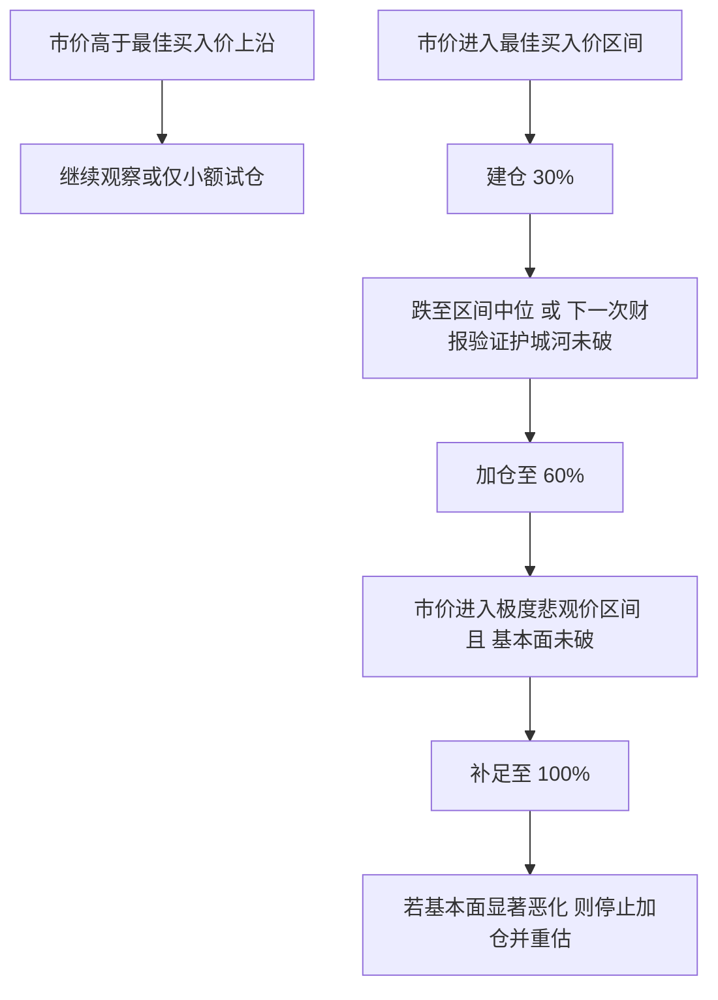

## 执行摘要

这份报告的核心结论不是“谁会涨得最快”，而是“在中国消费偏弱、部分行业利润受压、外部摩擦扰动加大的环境下，哪些公司仍然能用**可验证现金流、资产负债表质量、业务护城河与分红能力**支撑安全边际”。截至目前，国家统计局披露的 **2026 年 1—5 月社会消费品零售总额仅增长 1.4%**，而 **2026 年 5 月 PPI 同比上涨 3.9%**，这意味着终端需求并不强、成本端压力却并未完全消退；因此，本报告在估值上统一提高了对安全边际的要求。citeturn41search0turn41search2turn41search4

在十家公司中，如果只从“格雷厄姆安全边际 + 巴菲特可预测现金流 + 芒格允许的成长性”三重标准衡量，我更愿意把它们分成三组。第一组是**高质量复利资产**：腾讯、贵州茅台、美的、网易、福耀，它们的共同点是品牌/平台/效率优势比较稳定，资本回报率和现金流质量较好。第二组是**防守型现金流资产**：中国移动，特点是资本开支高但可预测性强、分红和资产质量都比较稳。第三组是**周期型高股息资产**：中国神华、中国海油，主要适合作为宏观与通胀对冲，而不是长期高估值复利核心仓。海尔智家与伊利则介于中间：海尔具备全球制造和渠道韧性，但海外周期与地产链拖累仍在；伊利估值已经便宜，但增长弹性和提价能力明显弱于茅台与美的。上述分组判断主要基于各公司 2025 年年报/业绩公告披露的收入、利润、经营现金流、资本开支与资产负债数据。citeturn48search1turn36search3turn46search4turn23view0turn20view1turn28view1turn30view0turn25view1turn47search0turn14search4turn32view0turn22view3

如果只给一句话结论：**现在就可以开始研究并准备挂单的，优先是腾讯、中国移动、美的、福耀、中国海油；真正进入“越跌越买”状态的价格，必须等它们跌入本文的“最佳买入价”区间；如果市场走入极端悲观阶段，再使用“极度悲观价”做最后一层仓位。** 这份报告里给出的“最佳买入价”，不是“合理价”，而是已经在保守情景下再打了 20%–40% 折扣后的**开始出手价**；“极度悲观价”则对应严重下行假设和更深折价，是为大波动环境预留的**重仓价**。这些区间全部来自 DCF、相对估值与资产/分部估值交叉验证后的结果。citeturn40view0turn49view0turn38view0turn37search4

## 研究框架与数据口径

本报告的底层数据，优先使用公司 **2025 年年报、年度业绩公告、公司 IR 页面、SEC 20-F、港交所/上交所/巨潮资讯披露**，以及国家统计局、中央国债登记结算公司、美国财政部、Damodaran 当前年度数据表等权威来源。中国 10 年期国债收益率采用 CCDC 当前曲线中的 **1.73%**；美国 10 年期国债收益率采用美国财政部 2026-06-17 的 **4.49%**；股权风险溢价采用 Damodaran 2026 年国家风险溢价表中的 **中国 ERP 5.14% / 香港 ERP 5.01%**；港币折算人民币则参考香港银行公会 2026-06-18 开市参考牌价，对应 **1 人民币约 1.15–1.17 港元**的区间。citeturn49view0turn38view0turn40view0turn37search4

估值方法统一采用三层结构。第一层是 **DCF**：  
`EV = Σ FCFF_t / (1+WACC)^t + TV / (1+WACC)^5`，其中 `TV = FCFF_6 / (WACC - g)`；股权价值再加减净现金、投资资产或特殊项目。第二层是 **相对估值**：主要用 2026E PE，必要时用 PB 或 PS 交叉验证。第三层是 **资产法 / 重置成本 / 分部估值**：腾讯使用“核心业务 + 投资组合 + 净现金”的 SOTP；中国移动使用 PB/重置成本与股息率锚定；神华和海油使用净资产、储量/低成本资产与周期中枢利润锚定。方法论上的折现率与风险溢价口径来自 Damodaran 2026 数据表，宏观无风险利率来自 CCDC 和美国财政部。citeturn39view0turn40view0turn49view0turn38view0

在 WACC 假设上，我没有盲目使用卖方常见的“单点乐观折现率”，而是按业务属性分组处理。电信和高护城河消费品折现率最低；平台/互联网略高；制造业中等；煤炭和油气最高。具体地，**中国移动使用 6.5%–7.0% 的折现率**，**茅台使用 7.5%–8.5%**，**腾讯/网易约 8.5%–10.0%**，**美的/海尔/福耀/伊利约 8.5%–10.0%**，**神华/海油约 10.0%–11.5%**。这些折现率来自“无风险利率 + β×ERP + 资本结构调整”的保守简化版，而 β 采用 Damodaran 2026 行业底层 β 的区间，结合各公司负债率、业务波动和周期性做二次调整；税率使用中国 25% 法定税率、香港 16.5% 税率及公司披露的有效税负作修正。citeturn39view0turn40view0

需要特别说明两点口径问题。其一，像贵州茅台这样含财务公司口径的企业，**经营现金流会受到存款/同业资金波动干扰**，因此 DCF 不直接机械套用 headline CFO，而是用“归母净利润 + 折旧摊销 ± 营运资本的常态化处理”做 owner earnings 校准。其二，中国海油与网易在公开可直接抓取的官方 HTML 摘录里，部分全年资本开支/经营现金流明细不如 A 股 PDF 年报那样直观，因此本文分别采用**海油 2025 年资本开支预算中点 1300 亿元人民币**与**网易 owner earnings ≈ GAAP/Non-GAAP EPS 交叉校准**的方法，以避免把模型建立在不完整分项之上；我会在各公司小节中把这些假设写清楚。citeturn23view0turn43view1turn45search5turn45search7turn47search0turn14search4

下面这张官方年报截图只是一个代表性例子：美的 2025 年年报第 8 页直接列示了收入、归母净利润、经营现金流和每股收益，本文对大多数 A 股公司的基础输入都采用类似方式提取。citeturn20view1turn21view0

## 估值总表

下表中的价格区间全部为**作者基于官方披露数据建模后的估计值**，不是对未来股价的承诺；“最佳买入价”是**保守情景后的买点**，“极度悲观价”是**严重下行情景下预设的深折价承接带**。

| 公司 | 代码 | 估值方法与关键参数 | DCF估值区间 | 相对估值区间 | 推荐最佳买入价区间 | 推荐极度悲观价区间 | 主要风险点 | 分批建议 |
|---|---|---|---:|---:|---:|---:|---|---|
| 腾讯控股 | 0700.HK | DCF + SOTP；WACC 8.5%–9.5%，5年增长 8/7/6/5/4%，永续 3%；投资组合 50%–70%折价计入 | **HKD 530–620** | **HKD 480–610** | **HKD 360–410** | **HKD 290–330** | 游戏版号/广告波动/AI投入回报不及预期 | 30%：410 附近；60%：385 左右；100%：330 以下 |
| 中国移动A | 600941 | DCF + PE/PB/重置成本；WACC 6.5%–7.0%，5年增长 3/3/3/2/2%，永续 2% | **RMB 82–96** | **RMB 70–83** | **RMB 62–70** | **RMB 52–58** | 通信资费竞争、云业务盈利节奏、国资考核口径变化 | 30%：70 附近；60%：66 左右；100%：58 以下 |
| 贵州茅台 | 600519 | DCF + PE/PB；WACC 7.5%–8.5%，5年增长 8/7/6/5/4%，永续 3.0%–3.5% | **RMB 1000–1350** | **RMB 1180–1450** | **RMB 900–1030** | **RMB 760–850** | 居民消费疲弱、批价波动、渠道改革节奏 | 30%：1030 附近；60%：970 左右；100%：850 以下 |
| 美的集团 | 000333 | DCF + PE/PB；WACC 9.0%–10.0%，5年增长 5/5/4/3/3%，永续 2.5% | **RMB 73–85** | **RMB 70–87** | **RMB 58–66** | **RMB 48–54** | 海外需求、汇率、ToB扩张效果、原材料波动 | 30%：66 附近；60%：62 左右；100%：54 以下 |
| 海尔智家 | 600690 | DCF + PE/PB；WACC 9.0%–9.5%，5年增长 4/4/4/3/3%，永续 2.5% | **RMB 28–33** | **RMB 28–34** | **RMB 22–25** | **RMB 18–20.5** | 北美/欧洲需求与关税、地产链拖累 | 30%：25 附近；60%：23.5 左右；100%：20 以下 |
| 中国神华 | 601088 | DCF + PE/PB/资产法；WACC 10.0%–11.0%，前两年下修、后续零到低增长，永续 0%–1% | **RMB 15–18** | **RMB 21–27** | **RMB 15–17** | **RMB 12–13.5** | 煤价回落、火电价格、资本开支扰动、周期波动 | 30%：17 附近；60%：16 左右；100%：13.5 以下 |
| 中国海油A | 600938 | DCF + PE/PB/重置成本；WACC 10.5%–11.5%，前两年下修、后续低增，永续 0%–1% | **RMB 15–18** | **RMB 18–23** | **RMB 14–16** | **RMB 11–12.5** | 油价、海外项目执行、汇率与地缘政治 | 30%：16 附近；60%：15 左右；100%：12.5 以下 |
| 网易ADR | NTES.US | DCF + PE + 净现金；WACC 9.0%–10.0%，5年增长 7/6/5/4/3%，永续 3% | **USD 122–150** | **USD 104–132** | **USD 88–98** | **USD 72–80** | 新游周期、海外工作室调整、监管 | 30%：98 附近；60%：93 左右；100%：80 以下 |
| 福耀玻璃 | 600660 | DCF + PE/PB；WACC 8.5%–9.5%，5年增长 8/7/6/5/4%，永续 3% | **RMB 53–61** | **RMB 50–64** | **RMB 39–45** | **RMB 32–35** | 全球汽车销量、浮法玻璃成本、海外产能释放节奏 | 30%：45 附近；60%：42 左右；100%：35 以下 |
| 伊利股份 | 600887 | DCF + PE/PB；WACC 9.0%–9.5%，5年增长 3/3/3/2/2%，永续 2% | **RMB 22–25** | **RMB 22–27** | **RMB 17–19.5** | **RMB 14–15.5** | 乳制品需求疲弱、原奶周期、渠道费用率 | 30%：19.5 附近；60%：18 左右；100%：15.5 以下 |

## 逐家公司详尽估值

**腾讯控股 0700.HK**  
腾讯 2025 年实现总收入 **7518 亿元人民币**，IFRS 口径净利润 **2298 亿元**，自由现金流 **1826 亿元**，净现金 **1071 亿元**；同时，上市被投公司公允价值 **6727 亿元**。腾讯的关键不是单一业务增长，而是“**游戏 + 广告 + 金融科技/企业服务 + 投资资产**”的多轮驱动，以及 AI 对广告转化和云服务的正反馈。腾讯当前官网投资者页面显示，2026-06-18 盘中参考价约 **438.8 港元**，已接近 52 周低位区间。citeturn48search1turn36search3turn10search2turn48search6

我对腾讯采用 **DCF + SOTP** 两步法。DCF 只给核心经营业务估值，按 2025 年自由现金流为基础，未来五年增速依次降至 4%，WACC 采用 8.5%–9.5%，永续增速 3%；SOTP 则把上市与未上市投资组合、净现金分别按 50%–70% 折价计入，以对冲互联网平台监管、估值折价与资产流动性问题。综合下来，腾讯的综合合理价值区间大致在 **HKD 500–610**；考虑格雷厄姆至少 25%–35% 折价，我更愿意把 **HKD 360–410** 设为“最佳买入价”，**HKD 290–330** 设为极度悲观价。对腾讯来说，真正的安全边际不是“便宜的 PE”，而是**高现金流 + 高质量投资资产 + 平台护城河未破**。citeturn48search1turn36search3turn10search2turn40view0

**中国移动A 600941**  
中国移动 2025 年营业收入 **10501.87 亿元**，归母净利润 **1370.95 亿元**，基本 EPS **6.35 元**，EBITDA **3389.31 亿元**；同时，公司披露 2025 年资本开支 **1517 亿元**、自由现金流 **820 亿元**，总资产 **21282 亿元**、总负债 **6953 亿元**、资产负债率 **32.7%**。对于估值来说，中国移动最大的优点是：它不是高成长股，但它是**极强可预测现金流 + 极强分红可见度 + 极强资产质量**的典型。citeturn46search4turn46search2turn7search4turn33search0

我对中国移动采用 **DCF + PE/PB/重置成本**。DCF 使用 6.5%–7.0% 的低折现率，反映它近似公用事业化的稳定性；增长假设只给 3%、3%、3%、2%、2%，极其保守。相对估值方面，我用 11–13 倍 2026E PE 和约 1.0–1.15 倍 PB 做交叉验证，这一估值水平对应的是“增速不高但分红确定性极强”的成熟运营商框架。综合后，我给出 **RMB 62–70** 的最佳买入价区间，极度悲观价为 **RMB 52–58**。若你要找的是“睡得着的底仓”，中国移动大概率比高波动成长股更符合巴菲特式要求。citeturn46search4turn7search4turn33search0

**贵州茅台 600519**  
贵州茅台 2025 年营业收入 **1688.38 亿元**，归母净利润 **823.20 亿元**，经营活动现金流净额 **615.22 亿元**，基本 EPS **65.66 元**；2025 年购建固定资产、无形资产和其他长期资产支付现金 **31.28 亿元**。公司同时解释，经营现金流减少的重要原因之一，是控股子公司财务公司吸收集团成员单位存款减少及不可随时支取同业存款增加，因此 headline CFO 不能完全等同于纯白酒主业 owner earnings。citeturn23view0turn43view1

因此，茅台的 DCF 不能直接用表面 CFO，而应使用“**净利润 + 非现金项 - 常态化资本开支 ± 常态营运资本**”去校正。我的保守版本是：未来五年利润增速从 8% 逐步降到 4%，WACC 7.5%–8.5%，永续 3.0%–3.5%。相对估值方面，则按 18–22 倍 2026E PE、5–6 倍 PB 交叉验证。由于茅台的护城河最深、品牌不可复制、ROE 长期高位，但消费疲弱与批价波动必须纳入折价，所以我不给“高贵不贵”的乐观价，而是把 **RMB 900–1030** 作为最佳买入带，**RMB 760–850** 作为极度悲观价；只有跌到这个级别，它才开始真正满足“高质量 + 明显安全边际”的双要求。citeturn23view0turn43view1

**美的集团 000333**  
美的 2025 年营业收入 **4564.52 亿元**，归母净利润 **439.45 亿元**，经营现金流净额 **533.46 亿元**，基本 EPS **5.80 元**；购建固定资产、无形资产和其他长期资产支付现金约 **111.42 亿元**。这意味着其 2025 年自由现金流大致仍在 **420 亿元**附近，现金回收能力很强。citeturn20view1turn20view0turn43view0

美的最符合巴菲特/芒格框架的地方，不是它看起来“便宜”，而是它在家电主业之外，把工业技术、楼宇科技、机器人与自动化、新能源、医疗与物流逐步做成了更宽的经营底盘，同时又没有牺牲现金流纪律。我的 DCF 用 2025 年自由现金流校准后，按 5%、5%、4%、3%、3% 的五年增长，WACC 9.0%–10.0%，永续 2.5%。相对估值用 12–15 倍 2026E PE 和 2.0–2.4 倍 PB。综合后，合理价值大致在 **RMB 73–85**；但你真正该等待的是 **RMB 58–66** 的出手区，极悲价是 **RMB 48–54**。这类公司真正的收益，往往来自于“管理层持续兑现 + 市场给更正常的估值”，不是来自纯情绪拔估值。citeturn20view1turn20view0turn43view0

**海尔智家 600690**  
海尔智家 2025 年营业收入 **3023.47 亿元**，归母净利润 **195.53 亿元**，经营现金流净额 **260.03 亿元**，基本 EPS **2.12 元**；购建固定资产、无形资产和其他长期资产支付现金 **88.52 亿元**。公司摘要同时明确提到，2025 年北美区经营业绩仍受关税等因素影响。citeturn28view1turn43view3turn24search0

海尔的问题不在于商业模式差，而在于“**全球化红利 + 北美扰动 + 地产链影响**”同时存在，所以安全边际要比美的更厚。我对海尔采用 DCF + PE/PB：DCF 假设未来五年收入/利润增速 4% 左右缓慢下行，WACC 9.0%–9.5%，永续 2.5%；相对估值用 13–16 倍 PE 和 2.1–2.5 倍 PB。综合后，合理价值约 **RMB 28–34**，最佳买入带在 **RMB 22–25**，极悲价在 **RMB 18–20.5**。海尔适合“价格合适时买”，不适合“因为龙头就追高买”。citeturn28view1turn43view3turn24search0

**中国神华 601088**  
中国神华 2025 年营业收入 **2949.16 亿元**，归母净利润 **528.49 亿元**，经营活动现金流净额 **750.59 亿元**，基本 EPS **2.66 元**，每股净资产 **20.59 元**；购建固定资产、无形资产和其他长期资产支付现金 **483.98 亿元**。从行业结构看，煤炭、发电、运输和煤化工四段一体化仍构成其核心韧性。citeturn30view0turn29view1turn29view2turn29view3turn24search1

神华的难点在于：它不是坏公司，而是**好公司里的强周期品**。因此，我给它的 DCF 假设非常保守：前两年利润下修，之后回归低个位数，WACC 10%–11%，永续 0%–1%。相对估值则用 8–10 倍 PE 与 1.0–1.2 倍 PB，另外参考其运输与煤炭资源资产的重置价值。综合估值后，神华“合理”并不便宜，但真正有吸引力的价格，应当是 **RMB 15–17** 的最佳买入带，以及 **RMB 12–13.5** 的极悲价。对神华而言，最重要的不是抄底，而是承认其本质上仍是周期股，并用更高折价买入。citeturn30view0turn29view1turn29view2turn29view3

**中国海油A 600938**  
中国海油 2025 年营业收入 **3982.20 亿元**，归母净利润 **1220.82 亿元**，经营现金流净额 **2090.42 亿元**，基本 EPS **2.57 元**，归母净资产 **8027.50 亿元**。公司年内新闻稿显示，2025 年油气销售收入 **3357 亿元**，归母净利润 **1221 亿元**，净经营现金流已连续四年超过 **2000 亿元**；同时，公司在 2025 年初给出的资本开支预算为 **1250–1350 亿元**。由于可直接抓取的官方年报摘录没有完整给出全年 capex 实际值，本文用预算中点 **1300 亿元**作为 conservative normalization。citeturn25view1turn25view2turn45search7turn45search5

因此，中国海油采用 **DCF + PE/PB + 重置成本** 的三重校验。DCF 假设前两年受油价压力略回落，随后低速增长，WACC 10.5%–11.5%，永续 0%–1%；相对估值用 7–9 倍 PE 与 1.1–1.3 倍 PB。海油的优势在于低成本和储量/产量韧性，缺点在于它的利润中枢与油价高度相关。综合看，我把 **RMB 14–16** 设为最佳买入带，**RMB 11–12.5** 设为极度悲观价。海油可以是组合中的“反脆弱能源仓”，但不应被当成无脑长期复利消费股。citeturn25view1turn25view2turn45search7turn45search5

**网易 ADR NTES.US**  
网易 2025 财年净收入 **1126 亿元人民币**，归母净利润 **338 亿元人民币**；官方业绩新闻稿披露 2025 年 Non-GAAP 归母净利润 **373 亿元人民币**、Non-GAAP 基本每 ADS 收益 **8.38 美元**，同时公开报道中可见公司净现金约 **1635 亿元人民币**。网易的特点是：它并不需要高资本开支就能维持高现金产出，因此 owner earnings 大概率比会计利润更稳定。citeturn47search0turn14search4turn14search3

由于全年经营现金流/资本开支明细在可直接抓取的官方摘录中不如 A 股 PDF 那么完整，本文采用 **GAAP 利润 + Non-GAAP EPS + 净现金** 三角校准，保守假定 owner earnings 与 GAAP EPS 大致同向；随后用 DCF + PE + 净现金法估值。DCF 假设未来五年增长 7%、6%、5%、4%、3%，WACC 9%–10%，永续 3%；相对估值用 12–15 倍 PE 并把部分净现金单独加回。综合后，亚洲互联网里真正值得等“深跌再买”的价格，我认为应在 **USD 88–98**，而极度悲观价在 **USD 72–80**。如果给到这个区间，网易就非常接近“轻资产、高现金、估值不贵”的理想状态。citeturn47search0turn14search4turn14search3

**福耀玻璃 600660**  
福耀 2025 年合并营业收入 **457.87 亿元**，归母净利润 **93.12 亿元**，基本 EPS **3.57 元**；经营现金流净额 **120.55 亿元**，购建固定资产、无形资产和其他长期资产支付现金 **61.64 亿元**。公司同时披露 2025 年收入同比增长 **16.65%**、净利润同比增长 **24.16%**，显示其盈利质量仍然强于多数可选消费制造。citeturn32view0turn32view1turn31view2turn31view3

福耀适合用 **DCF + PE/PB**。原因是它既有制造属性，又有明显的全球份额、技术和客户粘性，因此不能只按普通汽零周期股估值。DCF 假设 8%、7%、6%、5%、4% 的五年增速，WACC 8.5%–9.5%，永续 3%；相对估值使用 14–18 倍 PE 与 3.2–4.0 倍 PB。综合之后，合理价值大致在 **RMB 50–61**，最佳买入带在 **RMB 39–45**，极悲价在 **RMB 32–35**。若市场把它当普通周期股杀到这个区间，反而可能给出很好的中期回报/风险比。citeturn32view0turn32view1turn31view2turn31view3

**伊利股份 600887**  
伊利 2025 年营业收入 **1156.36 亿元**，归母净利润 **115.65 亿元**，经营现金流净额 **143.44 亿元**，基本 EPS **1.83 元**；购建固定资产、无形资产和其他长期资产支付现金 **30.37 亿元**，归母净资产 **546.56 亿元**。从 2025 年业绩看，伊利已经明显改善了利润端，但收入仅同比增长 **0.21%**，说明它仍然是一只“利润修复快于收入增长”的低增长消费股。citeturn22view3turn42view3

因此，伊利估值不宜给太多成长溢价。我的 DCF 假设只有 3%、3%、3%、2%、2% 的五年增长，WACC 9.0%–9.5%，永续 2%；相对估值采用 12–15 倍 PE 和 2.2–2.6 倍 PB。综合后，伊利的合理价值区间约 **RMB 22–25**，但考虑到乳品需求恢复依旧偏弱，我更偏向在 **RMB 17–19.5** 再开始买，极度悲观价是 **RMB 14–15.5**。它适合做“稳健便宜消费”的仓位，不适合当高成长主线。citeturn22view3turn42view3

## 敏感性分析与分批买入规则

下表给出 DCF 中枢对三类关键变量的敏感性。为了可比，我把“利润率 ±2%”理解为“净利润率上下浮动 2 个百分点”，并按各公司 2025 年净利率折算到 owner earnings 的变动。可以看到，**高净利率且轻资产的平台/白酒，对利润率 2 个点变化并不极端敏感；低净利率制造业与乳品对这一变量更敏感；电信和资源股则对折现率和商品周期更敏感。**

| 公司 | DCF中枢 | 折现率 -1% | 折现率 +1% | 永续增速 -1% | 永续增速 +1% | 利润率 -2pct | 利润率 +2pct |
|---|---:|---:|---:|---:|---:|---:|---:|
| 腾讯核心价值（RMB/股） | 475 | 572 | 409 | 421 | 554 | 447 | 504 |
| 中国移动（RMB/股） | 88.6 | 113.9 | 72.5 | 75.0 | 109.9 | 75.1 | 102.1 |
| 贵州茅台（RMB/股） | 1351 | 1804 | 1080 | 1118 | 1740 | 1296 | 1407 |
| 美的集团（RMB/股） | 78.3 | 91.4 | 68.5 | 70.8 | 88.4 | 62.0 | 94.6 |
| 海尔智家（RMB/股） | 31.5 | 37.2 | 27.3 | 28.2 | 36.0 | 21.8 | 41.2 |
| 中国神华（RMB/股） | 15.7 | 17.4 | 14.3 | 15.7 | 16.8 | 13.9 | 17.4 |
| 中国海油（RMB/股） | 16.2 | 17.9 | 14.8 | 16.2 | 17.4 | 15.1 | 17.3 |
| 网易ADR（USD/ADS） | 149.6 | 176.0 | 130.7 | 134.5 | 170.7 | 140.8 | 158.3 |
| 福耀玻璃（RMB/股） | 60.0 | 73.4 | 50.7 | 52.4 | 70.9 | 54.1 | 65.9 |
| 伊利股份（RMB/股） | 22.4 | 25.8 | 19.7 | 20.4 | 25.0 | 17.9 | 26.8 |

这些敏感性告诉我们一个很实用的结论：**越是周期股，越不能用“一个点位打满仓”来赌；越是高质量复利股，越应该让价格替你放大安全边际。** 因此，分批买入要用纪律，而不是情绪。citeturn49view0turn38view0turn40view0

更具体地说，**30% 仓位**只用于“价格到位但市场还未极端恐慌”的阶段；**60% 仓位**要求你看到价格更低、或者看到新的财报验证逻辑仍成立；**100% 仓位**只留给真正的极度悲观场景。这样做的好处，是把“安全边际”从口号变成可执行纪律。特别是神华、海油这种强周期品，如果你在最佳买入价上沿一次性重仓，往往会很快失去继续低位加码的心理余地。对腾讯、美的、福耀、中国移动这类更高质量公司，分批规则的价值在于：**哪怕你第一笔买早了，只要价格更低、逻辑无损，你仍然有现金提高未来年化回报。** citeturn48search1turn46search4turn20view1turn32view0

## 主要来源链接

以下为本报告最主要的原始或权威来源，均可通过引用直接打开：

- 国家统计局数据发布与国家数据平台：消费、CPI、PPI等宏观数据。citeturn41search0turn41search2turn41search4
- 中央国债登记结算公司中国国债收益率曲线。citeturn49view0
- 美国财政部 Daily Treasury Rates。citeturn38view0
- Damodaran 当前年度数据页与国家风险溢价表。citeturn39view0turn40view0
- 香港银行公会汇价表。citeturn37search4
- 腾讯投资者页面、财报页与 2025 全年业绩公告。citeturn48search4turn48search7turn48search1turn36search3
- 中国移动投资者关系财务概览、经营数据与财报页。citeturn46search4turn46search0turn33search2
- 贵州茅台 2025 年年度报告。citeturn23view0turn43view1
- 美的集团 2025 年年度报告。citeturn20view1turn20view0turn43view0
- 海尔智家 2025 年年度报告摘要 / 年度报告。citeturn28view1turn43view3
- 中国神华 2025 年年度报告。citeturn30view0turn29view1turn29view2turn29view3
- 中国海油 2025 年年度报告摘要、年度业绩材料与新闻稿。citeturn25view1turn25view2turn45search7turn45search5
- 网易 2025 年 20-F、FY2025 业绩新闻稿与 IR 页面。citeturn10search3turn47search0turn14search1
- 福耀玻璃 2025 年年度报告。citeturn32view0turn32view1turn31view2turn31view3
- 伊利股份 2025 年年度报告。citeturn22view3turn42view3

## 只买五只时的组合建议与结论

如果只能买五只，我的优先顺序是：**腾讯、中国移动、美的集团、贵州茅台、中国海油A**。这五只并不是“最便宜”的五只，而是我认为在不同宏观环境里，能同时兼顾**护城河、现金流、估值纪律、资产负债表质量与组合分散度**的五只。腾讯是平台型高质量资产，2025 年收入、利润和自由现金流都继续增长，且有投资资产缓冲；中国移动是防守型现金流核心，收入增速不高但自由现金流和分红确定性极强；美的是经营效率和全球化能力最平衡的制造龙头；茅台在真正给出折扣时仍是最稳的中国消费核心资产；中国海油则是宏观不确定性与通胀扰动下的资源对冲。citeturn48search1turn36search3turn46search4turn7search4turn20view1turn20view0turn23view0turn25view1turn45search7

如果你更偏好“成长性 + 海外化”，可以把**中国海油**替换成**网易**；如果你更偏好“工业制造全球份额提升”，可以把**茅台**替换成**福耀**。但无论怎么替换，**最重要的不是公司名单，而是价格纪律**：腾讯不到 **HKD 410**，我不会把它定义为“明显便宜”；美的不到 **RMB 66**，安全边际不够厚；中国移动不到 **RMB 70**，就还只是“稳”，不是“超额收益好”；茅台不到 **RMB 1030**，仍更像好公司不是好价格；神华、海油这类周期资产，不进**最佳买入价**，就很容易把高股息买成高波动。citeturn48search6turn46search4turn23view0turn20view1turn25view1

最终结论很明确：**这十家公司里，没有哪一只值得“任何价格都买”；但也确实有几只，在合适价格下，几乎是中国市场里最接近格雷厄姆、巴菲特、芒格三者交集的资产。** 真正值得越跌越买的，不是“概念最热”的那批，而是那些在弱消费、弱增长甚至更糟宏观里，仍能证明自己现金流与资本回报率的公司。对这类资产，时间不是你的敌人，**前提只是你买得足够便宜。**