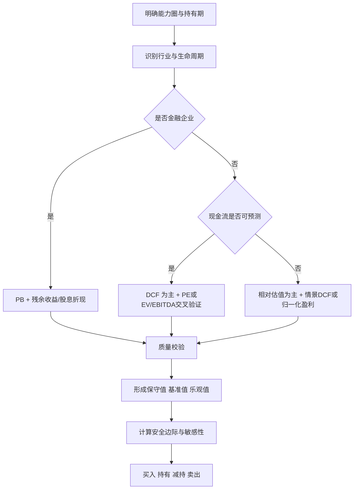

## 执行摘要

价值投资的出发点，不是猜测短期价格波动，而是估计企业**每股内在价值**，再把市场价格与该价值进行比较。伯克希尔《股东手册》明确把长期经济目标表述为“最大化每股内在商业价值的年均增速”，并将内在价值定义为企业剩余寿命内可取出现金流的折现值；这一表述与“把股票当作企业所有权份额”而非交易筹码的价值投资框架高度一致。中国A股的实证研究也显示，平均持股周期更短的投资者更难盈利，长期持有与更好的投资结果相关。citeturn29search4turn30search1turn30search9turn29search10

因此，一个严谨的价值体系应当同时回答三件事：**价值是多少、误差有多大、何时行动**。前者需要模型，中间需要区间与敏感性分析，后者需要安全边际与纪律化阈值。由于内在价值本身是“估计值”而非“精确值”，伯克希尔在早年股东信中也明确表示，不同理性评估者对同一企业的估值可能存在明显差异；这正是安全边际成为价值投资操作核心的现实基础。citeturn30search7turn30search9

本报告给出的结论是：对长期持有、重视安全边际的价值投资者而言，最稳健的做法不是迷信单一指标，而是建立“**主模型 + 交叉验证 + 质量校验 + 决策阈值**”的综合体系。对非金融企业，通常以 DCF 为主、PE/PB/EV/EBITDA 为辅；对银行等金融企业，通常以 PB、DDM、残余收益模型为主。基于这一框架，本文分别用**美的集团**与**招商银行**做了保守假设下的演示：美的集团的基准 DCF 估值约为 **77.2 元/股**，与抓取日 A 股价格 **79.06 元/股**接近；招商银行的基准残余收益估值约为 **39.5 元/股**，与抓取日 A 股价格 **38.95 元/股**接近。这两个案例都说明：在没有足够折价之前，“好公司”不必然等于“好买点”。[年报][行情] citeturn24view0turn3view1turn7view0turn17view0turn17view2turn2view1turn11search2turn11search3

## 价值投资的目标与原则

价值投资的核心目标，可以概括为：**以合理甚至保守的方法估计每股内在价值，并在市场价格显著低于该价值时买入；持有期间关注价值创造，而不是价格噪声；最终以每股价值增长而非交易频率衡量成败。** 伯克希尔长期坚持用“每股内在价值增长”而不是“规模扩张”作为经营考核目标，这一点对投资者同样适用：估值体系的最终对象不是“公司有多大”，而是“每一股代表的价值有多少”。citeturn29search4turn30search1turn30search9

在用户未指定投资期限、风险偏好与折现率口径时，本报告采用以下默认设定：**长期持有、非控制权投资、重视安全边际、优先使用审计后的公开财务数据、对终值和增长做保守处理**。这样做的原因是，CFA Institute 将现金流折现模型的第一步定义为“先确定现金流口径与折现率口径”，而对二级市场普通投资者而言，多数情形属于少数股东视角，不应默认为控制权溢价或激进协同价值。citeturn35view0turn36view1

在操作层面，价值投资至少包含四条纪律。第一是**能力圈**：只评估自己能理解收入模式、竞争结构与资本开支逻辑的企业。第二是**安全边际**：由于内在价值只能估计，必须把“估值误差”视为常态而非例外。第三是**归一化**：对周期、一次性损益、会计估计变动与异常年份进行调整，避免把景气高点利润资本化。第四是**质量优先**：盈利的稳定持续性、现金保障性、安全性和盈利能力，都会影响你该给公司多高的倍数、多少期预测和多大的安全边际。citeturn30search7turn27search0turn31view3turn33view0

一个可执行的价值体系，不能只有“模型”，还要有“目标函数”。本报告建议把目标函数定义为：**在满足质量门槛的前提下，追求“保守估值下仍有折价”的标的，而不是“在乐观估值下看起来便宜”的标的。** 这也是为什么本文后面会把保守值、基准值、乐观值拆开，而不只给一个单点数字。citeturn18search3turn30search9

## 常用估值方法与适用边界

下表按交易所口径、CFA Institute 读本、Damodaran 讲义与 Ohlson 文献整理，重点不是罗列公式，而是明确**它们各自回答什么问题、在什么场景下容易失真**。citeturn21search1turn19search1turn35view0turn31view1turn31view3turn22search3turn32search0

| 方法 | 核心公式 | 本质 | 主要优点 | 主要缺点 | 更适用的场景 |
|---|---|---|---|---|---|
| PE | \(PE=P/EPS\) | 用“每 1 元利润对应多少价格”衡量估值 | 简单、直观、与市场交流成本低 | 对会计政策、周期高点、一次性损益非常敏感；亏损公司失效 | 盈利稳定、资本开支不极端、同业可比性较强的成熟企业 |
| PB | \(PB=P/BVPS\) | 用“每 1 元净资产对应多少价格”衡量估值 | 对银行、保险、重资产企业更有意义 | 对轻资产、高无形资产企业解释力弱；账面价值可能低估品牌/平台价值 | 银行、保险、地产链重资产、公用事业 |
| DCF | \(V=\sum \frac{FCF_t}{(1+r)^t}+\frac{TV}{(1+r)^n}\) | 直接估计企业未来可分配现金流现值 | 逻辑最完整，能连接经营、资本结构与增长 | 对折现率、终值、资本开支、营运资本极其敏感；输入成本最高 | 现金流可预测、竞争格局相对稳定的企业 |
| DDM | \(P_0=\sum \frac{D_t}{(1+r)^t}\)，Gordon 模型 \(P_0=\frac{D_1}{r-g}\) | 把股东真正收到的股利折现 | 对高分红、稳定派息公司很好用 | 若分红不等于真实可分配现金，可能低估或高估 | 公用事业、成熟消费、银行、红利型资产 |
| EV/EBITDA | \(EV/EBITDA\) | 用企业价值而非股权价值衡量经营资产 | 减少资本结构差异影响，适合并购/重资产对比 | 忽略资本开支与营运资本需求；高资本密集行业可能“看起来便宜，实际上不便宜” | 制造业、通信、交通、资源品、并购比较 |
| 相对估值 | \(Value=可比倍数\times 本公司指标\) | 让市场给市场定价 | 快速、适合交叉验证 | 容易把行业整体高估合理化；“可比公司”选择决定结论 | 作为主模型的第二意见，而非唯一答案 |
| 残余收益模型 | \(P_0=B_0+\sum \frac{RI_t}{(1+r)^t}\)，\(RI_t=NI_t-r\times B_{t-1}\) | 看企业是否能在股权资本成本之上持续创造超额收益 | 对金融股、分红不稳定但账面价值可靠的公司很有效 | 依赖 clean-surplus 关系与会计质量；对 ROE 终局假设敏感 | 银行、保险、账面资本是价值核心的公司 |

同样重要的是**弃用边界**。CFA Institute 明确指出，若企业不分红、分红与 FCFE 偏离较大、或投资者更接近控制权视角，应优先考虑自由现金流方法；而 Damodaran 则特别指出，对银行和金融服务公司，FCFE/FCFF 往往更难估，DDM 更常用，且金融企业“债务”的定义本身就很混杂，因此 EV/EBITDA 与传统资本结构分析都要非常谨慎。citeturn36view1turn36view2turn31view1turn33view0

就倍数法而言，交易所与中证指数都给出了非常清楚的口径说明：行业市盈率本质上是市值与归母净利润的比值，且通常会剔除亏损公司；这意味着 PE 在市场层面天然就带有**幸存者偏差与盈利筛选偏差**。因此，价值投资者不应把“当前 PE 低于行业均值”直接等同于便宜，而应先判断行业均值是否被景气高位利润、亏损样本剔除和资本结构差异所扭曲。citeturn18search0turn19search1turn21search1

关键公式可汇总如下。下表中的“推导式”主要用于做快速交叉验证，不宜替代完整模型。相关公式依据 CFA Institute 对 DDM、可比估值与持续增长的表述，以及 Ohlson 对 clean-surplus 与账面价值—利润—分红关系的界定整理。citeturn35view0turn31view3turn32search0

| 主题 | 公式 | 解释 |
|---|---|---|
| 绝对估值总式 | \(V_0=\sum \frac{CF_t}{(1+r)^t}\) | 一切 DCF/DDM/RI 的母式 |
| FCFF | \(FCFF \approx EBIT(1-T)+D\&A-Capex-\Delta NWC\) | 面向企业整体现金流 |
| FCFE | \(FCFE=NI+D\&A-Capex-\Delta NWC+\Delta Debt\) | 面向普通股股东现金流 |
| DDM 一般式 | \(P_0=\sum_{t=1}^{\infty}\frac{D_t}{(1+r)^t}\) | 适合稳定分红企业 |
| Gordon 模型 | \(P_0=\frac{D_1}{r-g}\) | 稳定增长、\(r>g\) |
| PE | \(PE=P/EPS\) | 价格相对利润 |
| PB | \(PB=P/BVPS\) | 价格相对净资产 |
| EV/EBITDA | \(EV=市值+净债务\)，再除以 EBITDA | 经营资产相对经营现金创造能力 |
| 残余收益 | \(RI_t=NI_t-r\times B_{t-1}\) | 超过股权成本的那部分利润 |
| RI 估值 | \(P_0=B_0+\sum \frac{RI_t}{(1+r)^t}\) | 账面价值 + 超额收益现值 |
| 可持续增长 | \(g=b\times ROE\) | 留存率 \(b\) 与 ROE 决定长期内生增长 |
| 安全边际 | \(MOS=1-\frac{P}{V_{conservative}}\) | 使用保守价值而非乐观价值 |
| 稳定期合理 PB | \(P/B \approx \frac{ROE-g}{r-g}\) | 在稳定增长与 clean-surplus 假设下的简化交叉验证 |

## 影响估值的关键变量

价值不是“方法”算出来的，而是被**行业、生命周期、资本结构、成长性、盈利质量与可持续性**共同决定。行业层面，首先要把企业放到正确的分类桶里。证监会已发布《上市公司行业统计分类与代码》，中国上市公司协会也给出了行业统计分类指引，这意味着可比公司筛选和行业中位数比较，最好以统一分类框架为底，而不是凭经验随意拼装“同赛道”。citeturn26search2turn26search3

生命周期决定主模型。CFA Institute 在股利贴现部分明确区分了增长、过渡、成熟三个阶段：成熟期企业更适合稳定增长或两阶段模型，成长过渡期企业更应使用多阶段模型；Damodaran 则特别指出，分红贴现对金融机构常常更实用。这背后的逻辑是：**早期企业价值更多来自远期终值，成熟企业价值更多来自近期现金流与持续回报。** 对价值投资者而言，这意味着你越早期，越应提高折现率、缩短乐观期、扩大安全边际；你越成熟，越能把估值重心放到现金流、分红与资本回报上。citeturn31view1turn31view3turn35view0

资本结构直接影响折现率与股东风险。CFA Institute 把 WACC、CAPM、国家风险溢价与目标资本结构都列为成本估计的核心内容；Damodaran 则强调，金融服务企业的债务定义“很脏”，长期有息债是一个更实用的口径。实践中，杠杆越高、再融资弹性越弱、币种错配越严重、利率敏感性越高，股权持有人需要的回报率就越高，估值倍数就应越低。citeturn23search0turn33view0

成长性不是“越高越好”，而是要看**增长的质量与代价**。在 Gordon 框架下，合理 PE 与合理 PB 都受 \(g\) 影响；但如果增长需要持续高额资本开支、持续侵占营运资本、或是依赖激进并购，那么增长未必创造价值。Damodaran 对 EV/EBITDA 的讲义就明确指出，资本密集度、再投资需求、资本成本和税率，都会显著影响 EV/EBITDA 的可比性。换句话说，**增长率必须和再投资强度、资本回报率一起看**。citeturn35view0turn22search3

盈利质量决定你该不该相信报表利润。中文研究通常把盈利质量拆为稳定持续性、成长性、现金保障性、安全性和盈利能力几个维度；监管层面，年报格式准则要求披露非经常性损益、现金流量、审计意见等关键内容。这意味着价值投资者至少应检查：利润是否伴随现金流、应收账款和存货是否失控、一次性收益占比是否过高、审计意见是否标准无保留、金融企业的信用风险是否被低估。citeturn27search0turn25search0turn14view0

可持续性会直接影响终值、风险溢价和竞争优势期限。上交所与深交所都在 2024 年发布了可持续发展报告指引；近期中文学术研究也显示，ESG 表现与企业价值显著正相关。对估值来说，这并不意味着“ESG 高分就自动更贵”，而是意味着：若企业在治理、碳约束、供应链稳定性、合规与创新上更可持续，投资者可以把其**超额回报持续期**设得更长、终值假设更稳；反之则要缩短优势期、提高折现率。citeturn26search0turn26search1turn28search0

## 可操作的估值体系设计

一个可操作的体系，建议按“**分类—建模—加权—区间—阈值**”五步走。中国基金业协会在私募股权估值指引中明确提出：面对多种估值方法形成的结果差异，应结合适用条件、参数选取依据与估值过程综合判断，并可用情景分析综合多种方法。这个思路同样适用于二级市场价值投资。citeturn18search3

在权重设计上，如果用户没有先验偏好，我建议至少准备三套方案，并在不同公司类型之间切换，而不是机械地固定“一刀切”权重。下表给出实务上可直接采用的模板。该设计综合了 CFA Institute 的模型选择框架、AMAC 对多方法综合判断的要求，以及价值投资对保守性的偏好。citeturn35view0turn18search3turn30search9

| 方案 | 主模型权重 | 辅模型权重 | 质量与治理权重 | 适用对象 | 取舍逻辑 |
|---|---:|---:|---:|---|---|
| 均衡型 | 50% | 30% | 20% | 大多数成熟公司 | 兼顾绝对估值与市场校验 |
| 质量优先型 | 40% | 20% | 40% | 高护城河消费、品牌、平台 | 先确认可持续性，再讨论便宜与否 |
| 周期防御型 | 35% | 45% | 20% | 周期股、资源股、重资产制造 | 更依赖归一化利润与同业倍数 |
| 金融股专用型 | 55% RI/DDM/PB | 25% 相对 PB/股息率 | 20% 资产质量与资本充足率 | 银行、保险 | 避免把“债务”当作普通企业债务处理 |

决策规则必须事先写下来，否则估值体系会在情绪压力下失效。建议把“模型结论”转化为“价格纪律”。如果采用三情景估值 \(V_{low},V_{base},V_{high}\)，则价值区间可定义为 \([V_{low},V_{high}]\)，而安全边际优先以保守值 \(V_{low}\) 计算，而不是用基准值粉饰便宜程度。citeturn18search3turn30search9

| 动作 | 建议阈值 | 说明 |
|---|---|---|
| 买入 | \(P \le 0.75\times V_{low}\) 或 \(MOS \ge 25\%\) | 成熟高质量公司可放宽到 20%，周期/高杠杆公司宜提高到 30%–40% |
| 分批买入 | \(0.75\times V_{low} < P \le 0.90\times V_{base}\) | 适合高确定性但折价尚未充分的公司 |
| 持有 | \(0.90\times V_{base} < P < 1.15\times V_{base}\) | 重点跟踪基本面变化而非价格噪声 |
| 减持 | \(P \ge 1.20\times V_{base}\) 且质量边际转弱 | 先减仓、后观察，而非一刀切清仓 |
| 卖出 | 估值显著高于 \(V_{high}\)；或投资逻辑破坏 | 价值投资的真正卖点常常是**逻辑坏了**而不是涨了 |

折现率取值若未指定，也不应拍脑袋。可选方案至少有三种：一是**CAPM/WACC 法**，适合标准化、可复制；二是**build-up 法**，适合行业风险难以完全由 beta 表达的公司；三是**反向估值法**，也就是先用当前市价反推出市场隐含增长，再与你自己的假设比较。对长期价值投资者，我建议把示例中的折现率理解为**“保守必要回报率”**，不是“最可能回报率”。citeturn23search0turn34view2

敏感性分析至少要做三件事。第一，做**单变量敏感性**，看价值对 WACC、终值增长率、ROE、利润率、资本开支的弹性。第二，做**双变量表**，例如 WACC 与 \(g\)、或股权成本与终局 ROE。第三，做**逆向 DCF**，把市场价格视为已知，倒推出市场隐含的增长与回报假设，再问一句：这些假设是否过于乐观。citeturn34view2turn35view0

## 数据来源与研究流程

价值体系的可信度，首先取决于数据源优先级。中国证监会对年度报告披露内容有明确规则，巨潮资讯网又是证监会指定的信息披露网站，因此中文市场研究应优先使用**监管文件、年报全文、审计报告与交易所披露**，而不是先看二手终端的“整理后口径”。citeturn25search0turn25search3

建议采用如下优先级。表中的“用途”比“来源名称”更重要：先抓原始财务事实，再抓行业口径，再抓研究解释，最后才是第三方整理。citeturn25search0turn25search3turn19search5turn26search2turn26search3

| 优先级 | 数据类型 | 推荐来源 | 用途 |
|---|---|---|---|
| 最高 | 审计财务报表、附注、利润分配、股本、审计意见 | 年报/中报/季报全文、审计报告、巨潮资讯、交易所公告 | 核心估值输入 |
| 很高 | 监管规则与披露口径 | 证监会、上交所、深交所 | 统一口径、避免错用指标 |
| 很高 | 行业分类、行业估值、市场统计 | 证监会行业标准、中证指数、交易所统计 | 选可比公司、对照行业中枢 |
| 高 | 公司层面的额外原始材料 | 招股书、债券募集说明书、投资者关系材料、股东大会资料 | 理解资本开支、偿债、管理层指引 |
| 中高 | 行业报告与学术论文 | 券商/行业协会/高校/知网摘要 | 理解行业逻辑与变量关系 |
| 中 | 市场报价、历史行情、Beta、分红日程 | 交易所、主流财经终端 | 做时点比较与敏感性输入 |
| 最低 | 自媒体、二次转载、观点汇总 | 仅作线索，不作证据 | 发现问题，不直接入模 |

具体研究流程上，建议每次都走一遍“**口径统一**”检查：利润用归母还是普通股股东口径？股本用期末还是加权平均？PB 用的是普通股净资产还是全部股东权益？金融企业的“债务”是否与工业企业可比？如果这些问题没先处理，后面的任何公式都只是在放大误差。特别是行业 PE，交易所与中证指数都明确说明其有口径约束与更新时间点，不能机械拿来套单只股票。citeturn18search0turn21search1turn19search1

对于中文市场，另一个实用原则是：**中文官方原始资料优先，英文模型理论作补充。** 也就是说，企业事实尽量来自中文监管披露，模型框架可以借助 CFA、Damodaran、Ohlson、Berkshire 等国际一手理论来源。这种组合既能保证数据真实性，也能保证方法论的完整性。citeturn25search0turn25search3turn35view0turn33view0turn32search0turn30search9

## 实例演示

下面用两个中国市场上市公司，分别演示**非金融企业的 DCF**与**银行股的残余收益法**。这两个例子不是投资建议，而是展示“如何把原则变成算得出来、复核得了、能拿来做决策的流程”。案例输入优先使用年报与监管披露；股价仅用于与估值结果比较。citeturn25search3turn25search0

**案例一：美的集团——用 DCF 给成熟制造龙头定价。**  
选择 DCF 的原因有三点：第一，美的已经具备成熟现金流和较完整的资本开支披露；第二，PE 容易受单年利润和股权激励摊薄影响；第三，公司 2025 年存在大量货币性投资产品与定期存款收支，直接拿单年经营现金流做估值会受财资管理影响，因此需要做“归一化”。[年报] citeturn24view0turn4view6turn17view0turn17view2turn7view0

**关键假设。** 为减少单年波动，本文不用单一年度 FCFF，而用 2024–2025 两年归一化 FCFF 的平均值作为基期；折现率取 **9.5%**，显式预测期取 **5 年**，终值增长率取 **2.0%**，属于偏保守设定；净债务按“短借 + 一年内长期借款 + 长期借款 + 应付债券 – 现金及现金等价物”计算，**不把租赁负债纳入净债务**，以保持与经营现金流口径一致。考虑到美的已经 A/H 双重上市，本文按**同股同权总股本均摊企业价值**，不单独处理 A/H 流动性溢价。输入数据如下。 [年报][行情] citeturn4view2turn4view5turn17view0turn17view2turn7view0turn11search2

| 输入项 | 数值 | 说明 |
|---|---:|---|
| 2025 营业利润 | 529.79 亿元 | 用于 NOPAT |
| 2025 所得税费用 / 利润总额 | 16.1% | 作为有效税率近似 |
| 2025 折旧摊销 | 93.40 亿元 | 年报现金流附注 |
| 2025 资本开支 | 111.42 亿元 | 购建长期资产支付现金 |
| 2024 归一化 FCFF | 384.96 亿元 | \(EBIT(1-T)+D\&A-Capex\) |
| 2025 归一化 FCFF | 426.29 亿元 | 同上 |
| 基准 FCFF\(_0\) | 405.62 亿元 | 两年平均 |
| 净现金 | 43.24 亿元 | 净债务为 -43.24 亿元 |
| 总股本 | 75.97 亿股 | A+H 普通股 |
| 抓取日 A 股价格 | 79.06 元/股 | 用于比较 |

按上述设定，显式期增长率取 **4%、4%、3%、3%、2%**。计算结果如下。公式为  
\[
EV=\sum_{t=1}^{5}\frac{FCFF_t}{(1+WACC)^t}+\frac{FCFF_5(1+g)}{(WACC-g)(1+WACC)^5}
\]
再用 \(Equity=EV-NetDebt\)，最后除以总股本。公式框架依据 DCF 与 FCFF 文献整理。citeturn34view1turn34view2turn36view1

| 年度 | 增长率 | FCFF | 折现现值 |
|---|---:|---:|---:|
| 预测第 1 年 | 4.0% | 421.85 亿元 | 385.25 亿元 |
| 预测第 2 年 | 4.0% | 438.72 亿元 | 365.90 亿元 |
| 预测第 3 年 | 3.0% | 451.88 亿元 | 344.18 亿元 |
| 预测第 4 年 | 3.0% | 465.44 亿元 | 323.75 亿元 |
| 预测第 5 年 | 2.0% | 474.75 亿元 | 301.57 亿元 |
| 终值现值 | 2.0% 永续增长 | — | 4,101.39 亿元 |
| 企业价值 EV | — | — | 5,822.03 亿元 |
| 股权价值 | 加回净现金 | — | 5,865.27 亿元 |
| 每股价值 | ÷ 75.97 亿股 | — | **77.20 元/股** |

从结果看，保守 DCF 给出的基准价值约 **77.2 元/股**，与抓取日 A 股价格 **79.06 元/股**非常接近，换言之，**并没有形成足够的安全边际**。如果你要求 25% 的买入安全边际，那么买点大致应低于 **57.9 元/股**；若只要求 15%，也应低于 **65.6 元/股**。这说明对高质量龙头来说，“价格不差”与“值得买入”是两回事。citeturn11search2turn30search9

上图给出双变量敏感性。可以看到，只要 WACC 从 9.5% 下修到 8.5%，或永续增长率从 2.0% 上修到 3.0%，估值就会大幅抬升。这正是 DCF 最大的优点与最大的问题：它把逻辑说清楚了，但也把假设暴露无遗。因此，对美的这类公司，DCF 应当是主模型，但必须搭配 PE、EV/EBITDA、分红率与资本开支强度做交叉验证。图中数值基于上文同一套输入与假设推导。 [年报][行情] citeturn17view0turn17view2turn4view2turn4view5turn7view0turn11search2

**案例二：招商银行——用残余收益法给银行股定价。**  
银行股不宜照搬工业企业 DCF。Damodaran 明确指出，金融服务公司的 FCFE/FCFF 往往更难估，DDM 往往更适用；而残余收益模型的优势在于，它把银行最关键的两个量——**净资产与 ROE**——直接连接到估值上。再加上银行年报通常会详细披露每股净资产、普通股 ROE、资本充足率与信用减值准备，PB/RI 对银行更自然。citeturn31view1turn31view3turn2view1turn14view0

**关键假设。** 本例采用普通股口径。以 2025 年每股净资产 **43.43 元**、基本 EPS **5.70 元**、全年现金分红 **2.016 元/股**为起点；前五年 ROE 路径保守设为 **13.2%、12.8%、12.3%、11.8%、11.3%**，体现净息差和资产质量压力下的温和下行；股权成本取 **12.0%**；终局 ROE 取 **11.0%**；终值稳定增长率单独取 **4.0%**，对应稳定期更高分红率而不是继续维持当前留存率。这样做的逻辑是：成熟银行的稳定增长不应机械等于当前留存率 × 当前 ROE。 [年报][行情] citeturn2view1turn15view3turn11search3turn31view1

| 输入项 | 数值 |
|---|---:|
| 每股净资产 \(B_0\) | 43.43 元 |
| 基本 EPS | 5.70 元 |
| 现金分红 | 2.016 元/股 |
| 当前分红率 | 35.4% |
| 股权成本 \(r\) | 12.0% |
| 终局 ROE | 11.0% |
| 终值增长率 \(g\) | 4.0% |
| 抓取日 A 股价格 | 38.95 元/股 |

残余收益模型的计算步骤是：  
\[
RI_t = NI_t-r\times B_{t-1},\quad
P_0=B_0+\sum_{t=1}^{n}\frac{RI_t}{(1+r)^t}+\frac{CV_n}{(1+r)^n}
\]
在终值部分，本文采用“终局 ROE 固定、长期增长率固定”的处理。相关框架依据 Ohlson 与 CFA Institute 的残余收益模型表述整理。citeturn32search0turn31view3

| 年度 | 期初 BVPS | 假设 ROE | 预测 EPS | 预测 DPS | 残余收益 RI | RI 现值 |
|---|---:|---:|---:|---:|---:|---:|
| 第 1 年 | 43.43 | 13.2% | 5.73 | 2.03 | 0.52 | 0.47 |
| 第 2 年 | 47.14 | 12.8% | 6.03 | 2.13 | 0.38 | 0.30 |
| 第 3 年 | 51.03 | 12.3% | 6.28 | 2.22 | 0.15 | 0.11 |
| 第 4 年 | 55.09 | 11.8% | 6.50 | 2.30 | -0.11 | -0.07 |
| 第 5 年 | 59.29 | 11.3% | 6.70 | 2.37 | -0.42 | -0.24 |
| 显式期 RI 现值合计 | — | — | — | — | — | 0.57 |
| 终值现值 | 终局 ROE 11%，\(g=4\%\) | — | — | — | — | -4.51 |
| 每股内在价值 | \(B_0 + PV(RI) + PV(CV)\) | — | — | — | — | **39.49 元/股** |

这个结果的含义很典型：招商银行虽然仍能赚钱，但若终局 ROE 低于股权必要回报率，那么后期增长不一定创造价值，甚至可能成为“低于资本成本的扩张”。因此，残余收益模型会给出一个接近但不显著高于股价的结论。按照本例假设，内在价值约 **39.5 元/股**，与抓取日 A 股价格 **38.95 元/股**基本一致，说明它更像“接近合理价”而不是“明显折价”。同时，当前市场 PB 约为 **0.90 倍**，也与这一结果大致一致。citeturn2view1turn11search3turn31view3

招商银行的敏感性图说明了银行估值最关键的两件事：**股权成本**与**长期增长假设**。值得注意的是，当终局 ROE 固定在 11% 时，股权成本的变化显著大于长期增长率的变化；这与银行估值“高度受宏观、信用周期和监管资本要求影响”的经验一致。再结合审计报告把贷款和垫款预期信用损失列为关键审计事项这一点可以看出，银行估值的敏感性，本质上是对资产质量不确定性的定价。 [年报][审计报告] citeturn14view0turn2view1

## 结论与可执行清单

如果把整份报告压缩成一句话，就是：**价值投资者真正要建立的，不是某一个“神奇估值公式”，而是一套能在不同公司、不同阶段、不同景气环境下稳定运行的“估值价值体系”。** 这套体系的核心不是复杂，而是有顺序：先分类型，再选主模型；先看质量，再谈便宜；先给区间，再谈动作；先用保守值算安全边际，再用乐观值校验上限。citeturn18search3turn31view1turn31view3turn30search9

从方法选择看，可以记住三个最重要的判断。第一，**非金融成熟企业优先 DCF**，但必须用 PE、EV/EBITDA 与分红能力交叉验证。第二，**银行与金融股优先 PB、DDM 与残余收益模型**，不要机械套工业企业的 EV/EBITDA 或 FCFF。第三，**所有模型都要接受质量校验与敏感性分析**，因为价值不是被公式“生成”的，而是被假设“承载”的。citeturn31view1turn35view0turn22search3turn32search0

这套体系的局限性也必须正视。它会受到会计口径差异、一次性项目、双重上市股价分层、宏观利率变化、监管规则调整、行业竞争格局突变以及终值假设的强烈影响。尤其是 DCF 对折现率与终值极端敏感，残余收益模型对终局 ROE 与股权成本也同样敏感；因此，任何单点估值都不应被当作“真理”，而应被当作“在一组假设下的条件结论”。citeturn30search7turn35view0turn31view3turn14view0

可直接执行的清单如下。

- 先把公司分到四类之一：金融、成熟非金融、周期、成长过渡。
- 为每家公司固定一套“主模型 + 辅模型 + 质量指标”组合，不临场换规则。
- 输入值优先用年报、审计报告、交易所与监管披露，中文原始资料优先。citeturn25search0turn25search3
- 至少做三组估值：保守、基准、乐观，并把买入安全边际建立在**保守值**上。citeturn18search3turn30search9
- 对非金融企业，每次重估都至少更新：收入增速、利润率、资本开支、营运资本、折现率。
- 对银行，每次重估都至少更新：ROE、分红率、资本充足率、信用成本、终局 ROE 假设。citeturn2view1turn14view0
- 强制保留一张双变量敏感性表；没有敏感性分析的估值，不进入交易决策。
- 只有当“质量达标 + 保守估值有折价 + 安全边际满足阈值”同时成立时，才进入买入名单。