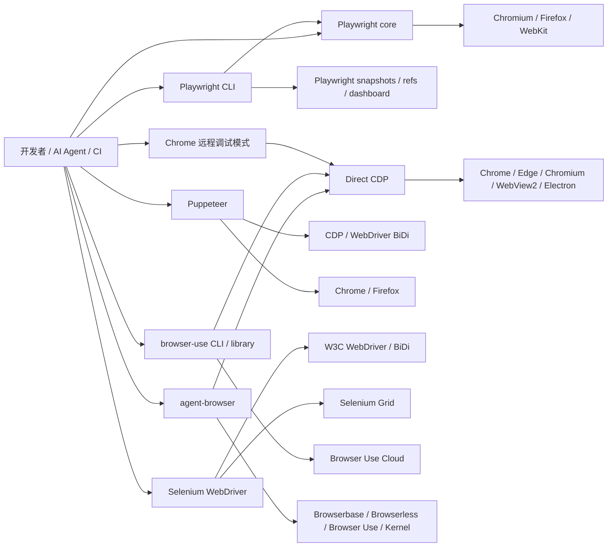

## 执行摘要

这几类方案并不是同一层级的替代品。**Chrome 远程调试模式**本质上是“协议入口”，提供的是 Chromium/Chrome 暴露出的 CDP 连接能力；**Playwright core、Puppeteer、Selenium**是面向开发者的自动化库或框架；**Microsoft Playwright CLI、Vercel Labs Agent Browser、browser-use CLI/库**则更偏“面向 AI 代理或命令行操作员的上层封装”。如果把它们当作同类产品横比，容易得出失真的结论。更合理的理解是：它们覆盖了从“低层协议”到“高层 agent 工作流”的不同抽象层。citeturn7search1turn28view4turn22search2turn6view1turn20search4turn11view5

若你的核心目标是**通用、可维护、跨浏览器的工程化自动化**，我更倾向于把 **Playwright core** 作为首选基线：它支持 Chromium、Firefox、WebKit，具备浏览器上下文隔离、自动等待、现代 locator、网络拦截、下载/上传、Trace Viewer、视频与截图等成熟能力；如果是大规模企业环境、跨语言团队或已有 Grid 基础设施，**Selenium** 依然最稳，尤其在标准化、组织兼容性与分布式执行方面优势明显。citeturn28view3turn24search2turn18search1turn18search8turn18search10turn18search18turn32search0turn32search1turn20search3turn20search11turn20search1turn26search0

若你的核心目标是**让 coding agent 以低 token 开销操控浏览器**，三者分化很明显。**Playwright CLI**胜在与 Playwright 生态天然衔接，支持 snapshot/ref、生成 locator、文件拖放、视频/trace、可视化 dashboard，以及启动或附着到现有浏览器；**agent-browser**胜在 100% 原生 Rust、直接 CDP、紧凑文本输出、基于无障碍树的 ref、HAR/网络路由、流式 viewport、dashboard、doctor，以及接 Browserbase/Browserless/Browser Use/Kernel 等云提供商；**browser-use**则更偏“LLM 驱动任务执行”与“云浏览器/反检测/代理/CAPTCHA/配置托管”，开源库与 CLI 都很活跃，且其低层 Actor API 刻意做成“像 Playwright，但更接近 CDP 子集”的迁移体验。citeturn4view0turn4view1turn11view0turn29view2turn23search10turn23search11turn23search6turn22search12turn31view1turn31view0turn6view1turn15view0turn5search4turn5search11

如果你只需要**最快速复用“已经登录好的本机 Chrome”**，例如调试现有 Web 会话、复用 Cookie、接管 Electron/WebView2 或做临时脚本，**Chrome 远程调试模式**的成本最低、启动也最“热”，但它的安全边界最弱、抽象最少、需要自己解决等待、容错、定位、日志与可维护性；而且从 **Chrome 136** 开始，`--remote-debugging-port`/`--remote-debugging-pipe` 对默认用户数据目录不再生效，必须配合 `--user-data-dir` 指向非默认目录，这是 Chrome 官方针对 Cookie 窃取风险收紧后的行为变化。citeturn21search0turn21search4turn25search0turn25search10turn8search9turn8search13turn33search4

对你给定的基线环境还要特别提醒两点：**Playwright CLI 明确要求 Node.js 18+**，与你的假设一致；但**Puppeteer 25 当前官方系统要求是 Node 22.12+**，**Selenium JavaScript 绑定当前要求 Node 20+**，因此若必须严格锁定 **Node 18.x**，就不应直接采用它们的“最新 JavaScript 绑定”组合，除非你接受降版本，或者在 Selenium/Playwright 中改用 Python、Java、.NET 等绑定。**browser-use CLI/库需要 Python 3.11+**；**agent-browser** 的“从源码构建”需要 Node 24+、pnpm 11+ 和 Rust，但其运行时 daemon 已不依赖 Node.js。citeturn29view4turn34search1turn34search2turn29view3turn29view2

## 研究范围与方法

本报告以 **Windows 10/11** 与 **Ubuntu 22.04** 作为目标平台，以你给定的 **Node.js 18.x** 作为默认 JavaScript 运行时假设；凡与此假设不一致的方案，我都单独标注。依据主要来自官方仓库、官方文档、官方发布说明，以及最近两年内与稳定性、安全性、性能设计有关的 issue/release 说明；中文官方文档与中文官方安全公告在能用时优先使用。citeturn29view4turn29view3turn34search0turn20search8turn21search0

评价时我把目标拆成三类：**协议层**（Chrome 远程调试/CDP）、**开发者库层**（Playwright core、Puppeteer、Selenium）和 **agent/CLI 层**（Playwright CLI、agent-browser、browser-use）。因此后文评分是“在当前维度下的工程判断”，不是“谁绝对更强”。例如：在“安全边界”上，原生 CDP 接口天然不如受控框架；在“抽象成本”上，原生 CDP 又会更低。citeturn7search1turn25search0turn20search4turn11view5turn28view4turn22search2turn31view0

## 架构与运行模式

先把关系图画清楚，比直接列优缺点更重要。Playwright CLI、agent-browser、browser-use 其实都在尝试解决同一个问题：**让“浏览器自动化”更适合 AI agent 或 shell 工作流**；只是它们选择的底座不同。Playwright CLI 站在 Playwright 能力之上，强调 token-efficient 的 CLI + SKILL；agent-browser 直接走 CDP，采用 Rust CLI + Rust daemon；browser-use 的 Actor/Browser/CLI 也转向 direct CDP，并把云浏览器、代理、CAPTCHA、配置托管纳入一体化体验。citeturn4view0turn29view2turn31view1turn6view1turn5search4



**Playwright CLI** 的核心设计点是：它不是把完整页面树塞进大模型上下文，而是通过命令 + snapshot/ref 的方式，让 agent 只处理必要信息，因此强调 token efficiency。它要求 Node 18+，提供 `open/goto/click/fill/upload/drop/snapshot/eval/highlight/generate-locator` 等命令，支持会话列表、dashboard、save video、save trace、console/network 输出，并支持通过 extension 或 CDP 附着到现有浏览器；配置项还明确列出了 `chrome / firefox / webkit / msedge` 等浏览器取值。citeturn4view0turn4view1turn30view1turn30view2turn11view0

**agent-browser** 的架构已经完全偏离“Node + Playwright daemon”路线。官方当前文档明确说明：它默认是 **100% native Rust**，采用 **Rust CLI + Rust daemon + direct CDP**，daemon 会在首次命令后驻留，以减少后续操作开销；典型工作流是 `snapshot` 先取带 ref 的无障碍树，再对 `@e1/@e2` 操作。它支持 Chrome/Chromium，也引入了 **Lightpanda** 作为另一引擎；支持本地浏览器、自动连接到运行中的 Chrome、以及 Browserbase、Browserless、Browser Use、Kernel 等云提供商。citeturn29view2turn23search9turn23search10turn22search1turn22search12turn23search6

**Chrome 远程调试模式** 则最“原教旨”。浏览器以 `--remote-debugging-port` 暴露 HTTP/WebSocket 端点后，客户端直接对 **CDP** 发消息。CDP 覆盖 DOM、Runtime、Network、Fetch、Page、Accessibility、Performance、Memory、Debugger 等域，所以理论上你能得到极强的控制力；但它只给你协议能力，不给你 Playwright 的 auto-wait、Puppeteer/Playwright 的高层 locator，也不负责失败恢复、重试或测试语义。更重要的是，Chrome 官方已因 Cookie 窃取风险在 Chrome 136 改变远程调试开关行为，要求显式使用非默认 `--user-data-dir`。citeturn7search1turn8search9turn8search13turn33search2turn33search4turn21search0turn21search4

**browser-use** 必须拆成两层看。开源库层面，它是以 **Agent + Browser/Actor** 为核心的 Python 优先方案，Actor 官方明确说其 API “尽量像 Playwright”，但本质是 **built on CDP, not Playwright**，而且是子集；CLI 层面，它采用多会话 daemon 架构，默认 headless Chromium，也可连接真实 Chrome profile、已有 CDP、或 Browser Use Cloud。其显著差异不是“命令多”，而是把 **LLM 任务执行、云基础设施、代理、反检测与配置托管**结合得更紧。citeturn6view1turn31view1turn31view0turn31view2turn5search4turn5search5

**Playwright core**、**Puppeteer**、**Selenium** 则属于更传统的开发者库范式。Playwright core 用一个 API 驱动 Chromium、Firefox、WebKit，并通过 BrowserContext 做低开销隔离；Puppeteer 当前是用高层 API 控制 Chrome 或 Firefox，底层可以是 CDP 或 WebDriver BiDi，在 Chrome 上仍以 CDP 为默认；Selenium 则围绕 W3C WebDriver 和正在推进中的 BiDi 演进，强调浏览器与语言绑定的可互换性、远程执行与 Grid 扩展。citeturn24search4turn24search2turn11view5turn19search14turn20search4turn20search1turn27search8

## 关键维度对比表

评分说明：**5 = 同类强项；4 = 较强；3 = 可用；2 = 明显短板；1 = 不建议作为该维度主选。** 这些分数是基于后文事实与官方资料做的工程判断，不代表官方结论。

| 方案 | 架构适配度 | 安装轻量性 | API/脚本易用性 | 功能广度 | 性能上限 | 稳定性 | 调试与可观测性 | 安全控制 | 扩展/生态 | 迁移成本 |
|---|---:|---:|---:|---:|---:|---:|---:|---:|---:|---:|
| Playwright CLI | 4 | 4 | 4 | 4 | 4 | 4 | 5 | 4 | 4 | 5 |
| agent-browser | 5 | 4 | 4 | 4 | 5 | 4 | 5 | 4 | 4 | 3 |
| Chrome 远程调试模式 | 2 | 5 | 2 | 5 | 5 | 2 | 3 | 1 | 5 | 2 |
| browser-use | 5 | 3 | 4 | 4 | 4 | 3 | 3 | 3 | 4 | 3 |
| Playwright core | 5 | 4 | 5 | 5 | 4 | 5 | 5 | 4 | 5 | 4 |
| Puppeteer | 4 | 3 | 4 | 4 | 4 | 4 | 4 | 3 | 5 | 4 |
| Selenium | 4 | 4 | 3 | 4 | 3 | 5 | 4 | 4 | 5 | 3 |

| 方案 | 运行模式与依赖 | 功能特征摘要 | 已知边界 |
|---|---|---|---|
| Playwright CLI | Node 18+；CLI + snapshot/ref + 会话/附着模式；可保存视频与 trace。citeturn29view4turn30view1turn11view0 | 适合 coding agent；支持 `upload/drop/generate-locator/highlight/dashboard`；可附着现有 Chrome/Edge，也可按配置选择 Firefox/WebKit。citeturn4view1turn30view2turn30view1 | 更偏 agent/shell，而不是完整测试 runner；复杂并发/分布式仍需借 Playwright Test 或外部编排。citeturn28view4turn18search2turn18search6 |
| agent-browser | 原生 Rust CLI + Rust daemon；direct CDP；支持 Chrome、Lightpanda、本地/云 provider。citeturn29view2turn23search0turn22search12 | 强项是 ref + 无障碍树、紧凑文本、dashboard、stream、HAR、network route、doctor。citeturn23search10turn23search11turn23search6turn23search4turn17search12 | 以 Chrome/CDP 生态为中心；跨浏览器标准化不如 Playwright/Selenium。citeturn22search3turn20search4turn24search4 |
| Chrome 远程调试模式 | 直接暴露 CDP 端口；任何支持 CDP 的客户端都可接入。citeturn21search1turn19search2turn25search0 | 协议能力最全：DOM、Runtime、Network、Fetch、A11y、Performance、Memory、Debugger 都可直达。citeturn33search2turn8search9turn8search13turn33search4turn33search11turn33search14turn33search12 | 安全风险最高；Chrome 136 起必须与非默认 `--user-data-dir` 搭配；协议自身不提供等待/容错/工程抽象。citeturn21search0turn21search4turn33search9 |
| browser-use | Python 3.11+；库 + CLI + Cloud；CLI 为多会话 daemon；可接真实 Chrome/CDP/云浏览器。citeturn29view3turn31view0turn31view1turn31view2 | 强项是 LLM agent 闭环、云浏览器、代理、反检测、任务平台；开源库支持 Agent、Browser、Tools、自定义动作。citeturn6view0turn5search4turn5search5turn5search11 | 当前 CLI/Actor 以 Chrome/CDP 为中心；文档明确说明不是 Playwright，且 API 只是相似子集。citeturn6view1turn16view0 |
| Playwright core | Node 项目安装 `playwright`；一套 API 驱动 Chromium/Firefox/WebKit；多语言绑定。citeturn24search3turn24search4turn24search1 | 自动等待、Context 隔离、locator、网络路由、下载/上传、trace/video/screenshot、调试器/UI mode 都很成熟。citeturn28view3turn18search1turn18search8turn18search10turn18search18turn32search0turn32search1 | 如果主要只是短平快的 Chrome 脚本，抽象层可能高于实际需要。citeturn24search4turn24search3 |
| Puppeteer | 当前官方要求 Node 22.12+；默认下载 Chrome for Testing，也支持 Firefox。citeturn34search1turn34search9turn19search10 | Chrome 优先、Node 体验好、连接现有浏览器方便；请求拦截、截图、PDF、locator、BiDi 支持都在推进。citeturn11view5turn19search0turn19search6turn8search2turn19search14 | 文件下载当前官方仍说“不是程序化一等能力”；跨浏览器与测试能力整体不如 Playwright 全栈顺手。citeturn19search4turn24search4 |
| Selenium | JavaScript 绑定当前要求 Node 20+；默认使用 Selenium Manager 自动管理 driver/browser；可上 Grid。citeturn34search2turn26search0turn20search11 | 最大强项是标准化、跨浏览器、跨语言、Grid 分布式、IDE 录制回放、BiDi 日志/网络。citeturn20search4turn20search3turn20search6turn20search9turn20search13 | API 仍相对冗长；下载进度不暴露，官方甚至将下载测试列为 discouraged。citeturn27search2turn27search6 |

**安装与依赖。** 在你给定的 Node 18 基线上，最“匹配”的是 Playwright CLI；Playwright core 本报告按 Node 项目场景比较，但官方首页在当前引文中并未直接给出 Node 下限。Puppeteer 25 的官方系统要求已经提升到 Node 22.12+，最新 Selenium JavaScript 绑定要求 Node 20+，这意味着它们与“严格 Node 18”存在版本门槛；browser-use 则转向 Python 3.11+，agent-browser 的源码构建需要 Node 24+/pnpm 11+/Rust，但 daemon 本身不依赖 Node。citeturn29view4turn34search1turn34search2turn29view3turn29view2

**API 与脚本易用性。** 如果按“人类开发者写脚本”的体验排，Playwright core 仍是最均衡的：locator、auto-wait、BrowserContext、下载/上传与 network mock 的贴合度最高。Puppeteer 紧随其后，尤其适合 Chrome-first 的 JavaScript 团队。Selenium 的问题不在能力不足，而在等待、句柄切换、下载等场景中更容易暴露“经典 WebDriver 心智负担”。如果按“AI agent / shell”体验排，agent-browser、Playwright CLI、browser-use 更自然，因为它们专门针对 snapshot/ref、紧凑输出、驻留会话、技能发现等模式做了设计。citeturn32search6turn24search2turn18search13turn19search12turn19search0turn27search2turn27search1turn23search10turn4view0turn31view1

**功能特性。** Playwright core 在“多浏览器、headless/headed、模拟移动设备、网络拦截、下载/上传、trace/video/screenshot、角色/标签/title/testid 等现代定位方式”方面最完整；Playwright CLI 把其中一部分包装成 agent 友好的命令，并额外提供 highlight、generate-locator、dashboard、attach/detach。agent-browser 在 Chrome/CDP 世界里功能也非常全：无障碍树 snapshot、传统 selector 与语义 locator 并存，支持 upload/download、network route、HAR、pdf、stream、dashboard。browser-use 的开源 CLI 重点是 `state`、索引操作、cookies/tabs、eval、Python 持久会话与 cloud API；其云能力明显超过开源 CLI。Puppeteer 有 request interception、截图、PDF、locator、Firefox/BiDi，但官方仍明确说下载不是程序化一等能力。Selenium 则通过 WebDriver、BiDi、Grid 与 IDE 覆盖“标准执行、网络/日志、分布式、录制回放”，但不是以现代 a11y-first locator 为卖点。原生 CDP 的能力面极广，但都要你自己封装。citeturn28view3turn24search5turn18search13turn18search18turn32search0turn32search1turn4view1turn23search4turn23search6turn23search11turn31view3turn5search5turn19search0turn19search4turn8search2turn20search6turn20search9turn20search11turn8search9turn8search13turn33search4

**性能、稳定性与错误恢复。** 这部分没有一套能完全公平覆盖七类方案的官方统一基准，所以更适合从架构判断。原生 CDP 与 direct-CDP CLI 的上限通常最高，因为中间层少；agent-browser 明确诉求就是 Rust + direct CDP，browser-use CLI 和 agent-browser 都通过驻留 daemon 把冷启动成本摊平，browser-use 还公开给出了约 50ms 的命令延迟说法。Playwright core/Playwright Test 的强项不在“最薄”，而在**稳定**：auto-wait、context isolation、trace、现代 locator 组合能显著压制 flaky 测试。Selenium 的稳定性更多依赖 waits、BiDi 与 Grid 观测配置。Playwright CLI 和 browser-use 的近期 release/issue 也能看出它们仍在快速修复 daemon、进程残留、依赖与连接类问题，这既说明活跃，也说明成熟度仍在上升。citeturn29view2turn31view1turn28view3turn24search14turn27search2turn20search15turn11view0turn16view0

**调试、日志、安全与权限。** Playwright 生态有最成熟的可观测性：UI Mode、Inspector、Trace Viewer、视频/截图、console/network 信息都比较体系化。agent-browser 的优势是本地 dashboard、viewport streaming、doctor、profiler；browser-use CLI 有 `doctor/setup/cli.log` 与 session 状态文件，问题排查路径清晰。原生 CDP 则给了你最底层的 Debugger、DOMDebugger、Performance、Memory 等域，但需要自己做采样与聚合。安全层面，最大的红线在 **Chrome 远程调试**：Chrome 官方已经把它作为攻击者窃取 Cookie 的通道之一来收紧；如果你真的要用，应该只对本机开放、使用临时 `user-data-dir`、避免默认 profile，并尽量让上层框架代你接管。citeturn18search10turn18search11turn18search0turn18search4turn23search6turn23search11turn17search4turn17search12turn29view3turn31view0turn33search12turn33search7turn33search11turn33search14turn21search0turn21search4

**可扩展性、社区与许可。** 社区成熟度看，Puppeteer、browser-use、Playwright 三个仓库当前都在 9 万星左右，Selenium 与 agent-browser 在 3 万级，Playwright CLI 约 1 万级；最近发布节奏上，这几个项目都依然活跃。许可方面，**Playwright core / Playwright CLI / agent-browser / Puppeteer / Selenium** 都是 **Apache-2.0**；**browser-use 开源库**是 **MIT**，但其云服务另有服务条款与计费。浏览器云能力方面，browser-use 与 agent-browser 都明显更积极；Selenium 则把扩展性押在标准、语言绑定与 Grid；Playwright 押在完整生态与跨浏览器一致性。citeturn12view4turn12view3turn15view4turn12view0turn12view1turn14view0turn11view0turn11view1turn16view0turn10search4turn11view3turn10search3turn12view3turn11view2turn14view0turn15view0

## 典型示例代码

以下示例尽量保持**短、可直接改造**。由于你的默认环境是 Node 18.x，我对与该前提不一致的方案会显式标注。

**Playwright CLI**  
运行环境：Node.js 18+，全局安装 `@playwright/cli`。官方定位就是给 coding agent 和 CLI 工作流使用。citeturn29view4turn4view1

```bash
npm install -g @playwright/cli@latest

# 打开页面并获取元素引用快照
playwright-cli open https://example.com --headed
playwright-cli snapshot

# 假设快照里按钮是 e15
playwright-cli click e15
playwright-cli screenshot
playwright-cli close
```

**Vercel Labs agent-browser**  
运行环境：推荐直接安装二进制/包；源码构建才需要 Node.js 24+、pnpm 11+ 和 Rust。daemon 本身不依赖 Node。citeturn29view2turn23search10

```bash
npm install -g agent-browser
agent-browser install

agent-browser open https://example.com
agent-browser snapshot        # 获取带 @eN 的无障碍树
agent-browser click @e2
agent-browser screenshot page.png
agent-browser close
```

```bash
# 连接到已有 Chrome 的 CDP 端口，并做一次网络拦截
agent-browser --cdp 9222 open https://example.com
agent-browser network route "*" --abort --resource-type script
agent-browser reload
agent-browser network requests
```

**Chrome 远程调试模式**  
运行环境：Chrome/Chromium；建议使用临时 `user-data-dir`。Chrome 136 起不应对默认 profile 开远程调试。citeturn21search0turn21search4turn21search1

```bash
# Windows
chrome.exe --remote-debugging-port=9222 --user-data-dir=C:\tmp\chrome-debug
```

```js
// Node.js：用 Puppeteer 连接已开启远程调试的 Chrome
// 说明：Puppeteer 25 当前官方要求 Node 22.12+；若你严格锁定 Node 18，请改用旧版或换 Playwright/Python。 
import puppeteer from 'puppeteer';

const browser = await puppeteer.connect({ browserURL: 'http://127.0.0.1:9222' });
const page = (await browser.pages())[0] ?? await browser.newPage();

await page.goto('https://example.com');
console.log(await page.title());
await browser.disconnect();
```

**browser-use**  
运行环境：Python 3.11+。开源库为 MIT；CLI/库都支持接管真实 Chrome 或远程 CDP。citeturn29view3turn15view0turn31view2

```python
# pip/uv 环境，Python 3.11+
from browser_use import Agent, ChatBrowserUse
import asyncio

async def main():
    agent = Agent(
        task="打开 example.com，读取页面标题，并说明页面上最重要的可点击元素",
        llm=ChatBrowserUse(),
    )
    await agent.run()

asyncio.run(main())
```

```bash
# CLI 版：索引式交互
browser-use open https://example.com
browser-use state
browser-use click 0
browser-use screenshot page.png
browser-use close
```

**Puppeteer**  
运行环境：当前最新官方要求 Node 22.12+；安装 `puppeteer` 会自动下载 Chrome for Testing。citeturn34search1turn34search9

```js
import puppeteer from 'puppeteer';

const browser = await puppeteer.launch();
const page = await browser.newPage();

await page.setRequestInterception(true);
page.on('request', req => {
  if (req.isInterceptResolutionHandled()) return;
  if (req.url().endsWith('.png') || req.url().endsWith('.jpg')) req.abort();
  else req.continue();
});

await page.goto('https://example.com');
await page.screenshot({ path: 'example.png' });
await browser.close();
```

**Selenium**  
运行环境：这里给 JavaScript 绑定示例；当前官方要求 Node 20+。如果必须保持 Node 18，建议改用 Python/Java/.NET 绑定。citeturn34search2turn26search0

```js
const { Builder, Browser, By } = require('selenium-webdriver');

(async function main() {
  let driver = await new Builder().forBrowser(Browser.CHROME).build();
  try {
    await driver.get('https://www.selenium.dev');
    console.log(await driver.getTitle());
  } finally {
    await driver.quit();
  }
})();
```

```js
// 文件上传：Selenium 官方推荐直接 sendKeys 到 input[type=file]
const { Builder, By } = require('selenium-webdriver');

(async function upload() {
  let driver = await new Builder().forBrowser('chrome').build();
  try {
    await driver.get('https://the-internet.herokuapp.com/upload');
    await driver.findElement(By.css('input[type=file]')).sendKeys('/absolute/path/to/file.png');
    await driver.findElement(By.id('file-submit')).click();
  } finally {
    await driver.quit();
  }
})();
```

**Playwright core**  
运行环境：Node 项目安装 `playwright`；官方文档将其定位为通用浏览器自动化库。citeturn24search3turn24search4

```ts
import { chromium } from 'playwright';

const browser = await chromium.launch();
const context = await browser.newContext();
const page = await context.newPage();

await context.route('**/api/**', route =>
  route.fulfill({ status: 200, body: JSON.stringify({ ok: true }) })
);

await page.goto('https://example.com');
console.log(await page.title());

await browser.close();
```

```ts
import { chromium } from 'playwright';
import path from 'node:path';

const browser = await chromium.launch({ downloadsPath: './downloads' });
const page = await browser.newPage();

await page.goto('https://example.com/upload');
await page.getByLabel('Upload file').setInputFiles(path.join(process.cwd(), 'demo.pdf'));

await browser.close();
```

## 限制故障与排查

**Playwright CLI 的典型问题**主要集中在“附着模式”和“长期会话”。官方 release 已记录过长期 CLI/agent 会话中的高 CPU/内存与残留 Chrome 进程问题，后续版本已针对 orphaned processes、extension 连接失败、空浏览器列表等做过修复；此外，`attach` 现在要求显式目标，浏览器扩展缺失时也会给出提示。实践上，排查顺序建议是：先升级到最新 CLI；再用 `list / show / close-all / kill-all` 清会话；最后检查 `--cdp` 或 `--extension` 连接链路。citeturn11view0turn4view1

**agent-browser** 的排查路径最完整。官方已经把 `doctor`、dashboard、streaming、profiler 都做成一等能力；安装阶段在 Linux 可用 `agent-browser install --with-deps`，运行阶段可先看 dashboard 的 viewport/活动流/console，再决定是否启用 profiler。它对 snapshot 的边界也写得很清楚：阻止读取无障碍树的 cross-origin iframe 会被省略，需要显式切 frame 处理。citeturn17search12turn23search6turn17search8turn17search4turn22search4turn29view1

**browser-use** 的常见问题更偏运行环境与 daemon 生命周期。官方文档专门列了 Windows 故障：ARM64 Windows 需安装 x64 Python、PATH 生效问题需要重开终端、`Failed to start daemon` 要清理僵尸 Python 进程与虚拟环境；CLI 文档也给出了 `~/.browser-use/` 下的 socket、pid、state、cli.log 路径。另一方面，官方 README 直接提醒 Chrome 很吃内存、很多 agent 并行难管理，所以生产侧更推荐其 Cloud API 去处理内存、代理、并行与指纹。citeturn29view3turn31view0turn15view0

**Puppeteer** 的典型坑在请求拦截与下载。官方明确说一旦开启 request interception，每个请求都必须被 `continue/respond/abort` 之一处理，否则会挂起；同时它也明确说“当前不提供程序化处理下载的方式”，因此如果你的业务大量依赖下载监控，Puppeteer 不是最舒服的主框架。另一个现实问题是：最新版本系统要求 Node 22.12+，会直接影响你当前的 Node 18 假设。citeturn19search0turn19search11turn19search4turn34search1

**Selenium** 的典型坑是“等待策略不当导致 flaky”。官方直言 race condition 是自动化最常见挑战之一，并明确警告不要混用隐式等待与显式等待；下载测试也被列入 discouraged，因为 API 不暴露下载进度。更可取的做法是：用 WebDriver 处理登录/拿 Cookie，再交给 HTTP 客户端下载；同时在远程环境中打开 Grid observability 和 BiDi logging/network 能力。citeturn27search2turn27search5turn27search6turn20search15turn20search13turn20search9

**Chrome 远程调试模式** 最大的问题不是“会不会连”，而是“默认太危险”。Chrome 官方已经把通过远程调试窃取 Cookie 视为真实攻击路径，并从 Chrome 136 开始要求配合非默认 `user-data-dir` 使用。排查这一路线时，第一步应确认是否用了临时 profile；第二步确认端口只暴露在本机；第三步用 `/json/version` 或客户端库的 `connect/browserURL` 验证端点；第四步再考虑上层库连接质量。若你发现自己需要自行复刻等待、重试、selector 升级、日志归档，那么往往已经到了该换 Playwright/Puppeteer/agent-browser 的时候。citeturn21search0turn21search4turn19search2turn25search1turn25search0

## 性能评测设计

目前我没有找到**同一硬件、同一站点集、同一版本窗口**下，能同时覆盖 **Playwright CLI、agent-browser、原生 CDP、browser-use、Puppeteer、Selenium、Playwright core** 的权威官方统一基准。因此这类比较更适合做**可复现实验设计**，而不是直接相信零散“XX 更快”的宣传数字。现有官方材料能确定的是：agent-browser 与 browser-use CLI 都采用了驻留 daemon／持久会话以减少每步冷启动开销；agent-browser 与 browser-use 都强调 direct CDP；Playwright Test 明确支持 workers 与 sharding；Selenium Grid 明确支持多机分布式；browser-use Cloud 和 agent-browser providers 能把浏览器基础设施外包出去。citeturn29view2turn31view1turn18search2turn18search6turn20search3turn20search11turn5search5turn22search12

我建议测试集至少拆成四类工作负载。**冷启动自动化**：从空进程启动浏览器，访问 10 个轻页面，记录首次可操作时间；**热会话自动化**：连接到已运行且已登录的浏览器，重复执行 100 次“小步骤操作”（click/fill/get text）；**重交互流程**：带上传、下载、网络 mock/HAR、两次新开 tab；**并发流程**：4、8、16 路会话同时跑同一任务，观察成功率与资源曲线。这样才能把“协议成本”“浏览器冷启动”“框架等待策略”“云端基础设施延迟”分开看。citeturn31view1turn23search11turn18search1turn32search1turn23search4turn20search11

指标建议最少包含：**冷启动时间**、**首步完成时间**、**单步 P50/P95 延迟**、**端到端成功率**、**flake rate**、**峰值 RSS/平均 RSS**、**CPU 时间**、**网络请求数与失败数**、**日志/trace 可追溯性**。如果要比较 agent-first CLI，还应额外采集 **snapshot/输出字符数** 以及 **单位任务 token 消耗**，因为 Playwright CLI、agent-browser、browser-use 都把“减少上下文负担”作为设计目标之一。citeturn4view0turn22search2turn31view1

可复现做法上，建议固定：**相同 Chrome/Edge 稳定版本或 Chrome for Testing 版本**、**相同 viewport**、**相同代理与网络节流条件**、**相同测试站点**、**相同 CPU/内存配额**。若涉及原生 CDP，请把“协议客户端”也固定成同一个（例如统一用 Playwright `connectOverCDP` 或 Puppeteer `connect`）以避免把客户端库差异混进“远程调试模式”本身。Chrome/Chromium 的网络节流、下载状态、性能与内存指标都可以从 CDP 的 Network、Browser、Performance、Memory 域采集。citeturn21search3turn25search0turn25search1turn33search1turn33search6turn33search11turn33search14

## 迁移建议与结论

| 场景 | 优先建议 |
|---|---|
| 你已经在用 Playwright，希望让 Claude Code / Copilot / Codex 低 token 地操作浏览器 | **Playwright CLI** |
| 你要做 Chrome-centric 的 agent 浏览、网络路由、HAR、可视化 dashboard、pair browsing | **agent-browser** |
| 你要做“任务型”AI 浏览，且需要云浏览器、代理、反检测、CAPTCHA、托管基础设施 | **browser-use** |
| 你要最快复用本机已登录的 Chrome / Electron / WebView2 会话 | **Chrome 远程调试模式**，但最好通过 Playwright/Puppeteer/agent-browser 接入 |
| 你要写长期可维护、跨浏览器、跨团队复用的自动化代码 | **Playwright core** |
| 你是 Node 团队，Chrome 优先，已有 Puppeteer 资产或依赖 its tooling | **Puppeteer** |
| 你是企业多语言、多浏览器、多机器并发、已有 Selenium 资产与 Grid | **Selenium** |

从**迁移成本**看，最平滑的路径通常有四条。其一，**Playwright core ⇄ Playwright CLI**：同一家生态、同一套核心能力，CLI 还可以生成 locator、运行代码片段，适合把“库脚本”与“agent 工作流”连起来。其二，**原生 CDP → Playwright/Puppeteer/agent-browser**：当你开始重复造 auto-wait、selector、日志与错误恢复时，就应该离开“裸协议”。其三，**Puppeteer → Playwright core**：当你想要更强的跨浏览器、trace、测试工具链时，这通常是收益最高的一跳。其四，**browser-use Actor ↔ Playwright**：browser-use 官方自己就强调它的低层 API 形状尽量接近 Playwright，目的是降低迁移摩擦。citeturn11view0turn24search4turn25search0turn25search1turn6view1

如果必须给出一句“怎么选”的结论，我会这样落地。**工程自动化主线**：选 **Playwright core**；**企业遗产与标准化主线**：守 **Selenium**；**Node + Chrome 快速脚本主线**：选 **Puppeteer**；**AI coding agent 主线**：如果你本来就是 Playwright 用户，选 **Playwright CLI**；如果你要的是更原生、更轻、更偏 Chrome 与云浏览器 provider 的 agent CLI，选 **agent-browser**；如果你要的是“让 LLM 直接把模糊任务做完”，并把浏览器基础设施、代理、反检测一并纳入，选 **browser-use**；而 **Chrome 远程调试模式** 最适合作为这些上层方案的连接底座，而不是长期直接面对的主抽象。citeturn28view4turn20search11turn11view5turn4view0turn22search2turn31view1turn21search4

**开放问题与报告边界。** 一是：最新官方资料下，Puppeteer 与 Selenium JavaScript 绑定已经超出 Node 18 假设，这会直接影响你在“最新版本 + JS 绑定”条件下的可执行性；二是：没有统一官方 benchmark 能公平比较七类方案在相同硬件与同一任务集上的吞吐、延迟和 flake rate，因此性能部分更适合作为复现实验设计而非绝对排行；三是：Chrome 远程调试模式没有独立框架式的“许可/商业限制”边界，它依赖你所选浏览器发行版与客户端库各自的条款。citeturn34search1turn34search2turn33search9turn21search3