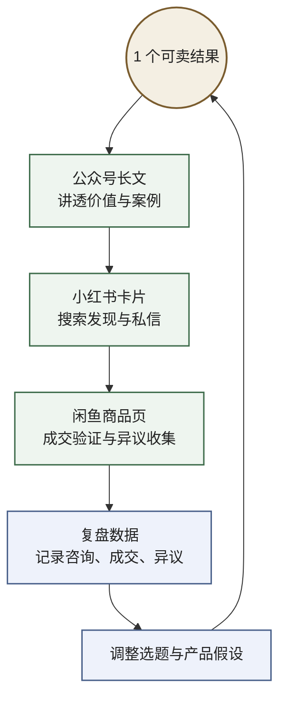

# 内容要接上交易与复盘才会形成飞轮

## 核心洞察

4 月 24 日这份复盘暴露的，不是"内容没价值"，而是系统只跑到了"文章 -> 关注"这一步。要让内容真正复利增长，必须把四个部件接成一个闭环：

> **复盘数据决定方向，公众号负责解释与沉淀，小红书负责搜索与发现，闲鱼负责把抽象兴趣变成具体成交。**

单独运营公众号，只会得到一条很脆弱的链路；把这四者接起来，才会得到一个能持续学习、持续变现、持续校正的飞轮。

## 飞轮的四个部件

**公众号：信任层，不是全部增长层**

4 月 24 日复盘显示，当前关注来源 85.3% 来自文章，搜一搜仅 9.5%，扫码、名片、微信、视频号几乎为 0。这说明"内容 -> 关注"并非没用，但整个系统目前几乎只靠一种入口。公众号真正的角色不是独自承担增长，而是负责完整表达方法、案例和判断，承接读者对你的长期信任。
→ 原始材料：[[20260424复盘|4 月 24 日复盘]]、[[Karpathy的自运行个人知识库|Karpathy LLM Wiki 商业化]]

**小红书：发现层，用内容把搜索意图捞起来**

复盘里已经给出很直接的动作建议：每篇公众号文章都要拆出小红书版的 3:4 知识卡。更深一层看，小红书的价值不只是"再发一遍"，而是它天然更适合承接搜索、种草和半熟人信任。长尾突围报告甚至直接给出判断：在 B2B 获客场景里，小红书的 ROI 和内容长尾都显著强于公众号。换句话说，公众号更像主站，小红书更像外部搜索引擎。
→ 原始材料：[[20260424复盘|4 月 24 日复盘]]、[[最后一公里痛点需求|长尾突围报告]]

**闲鱼：交易层，把"觉得你有意思"变成"愿意为结果付钱"**

Karpathy LLM Wiki 的商业化分析里，"中文 Starter Kit + 模板库"被明确放在"咸鱼/公众号"这个渠道组合里，这很关键：它不是卖平台，而是卖具体结果。闲鱼研究也说明，这个平台早就不只是二手货架，而是已经扩展到了虚拟资料、技能服务和副业交易。对你来说，闲鱼最适合承担的不是品牌展示，而是挂出一个非常具体的可交付物，让用户从"看内容"跨到"买结果"。
→ 原始材料：[[Karpathy的自运行个人知识库|Karpathy LLM Wiki 商业化]]、[[闲鱼APP的进化演变之旅|闲鱼演变]]

**复盘数据：方向盘，不是报表**

复盘最重要的价值，不是证明自己焦虑得有理，而是给系统选下一个动作。4 月 24 日这份数据已经告诉你：问题不在内容转化，而在增长入口单一。所以接下来该优化的不是"多写几篇"，而是"哪类文章能带来搜索，哪类切片能带来私信，哪类产品能带来成交"。数据不是结尾，而是飞轮的起点。
→ 原始材料：[[20260424复盘|4 月 24 日复盘]]

## 数据飞轮

这张图里最重要的改动，是把中心放成 **1 个可卖结果**，而不是把公众号、小红书、闲鱼画成三个平级主角。平台只是不同环节，产品才是飞轮轴心。

这不是简单的多平台分发，而是一个分层系统：

- 公众号回答"你到底在研究什么"
- 小红书回答"为什么陌生人现在就该看见你"
- 闲鱼回答"你的东西值不值得付钱"
- 复盘数据回答"下一轮该往哪里加力"

## 为什么这个结构成立

因为这四个部件刚好互补：

- 公众号强在深度和连续性，弱在新增入口
- 小红书强在搜索和发现，弱在系统沉淀
- 闲鱼强在交易和结果验证，弱在长期叙事
- 数据强在校正方向，但前提是你真的把渠道和产品都接起来

所以真正该做的不是"把公众号做大"，而是把一个产品在不同平台上完成不同动作。公众号沉淀判断，小红书放大发现，闲鱼验证付费，复盘数据决定下一轮迭代。

## 下一个阶段应该做什么

先不要同时做很多产品。下一阶段更合理的做法，是先跑通一条最小飞轮：

1. 只定义 1 个明确可卖的结果，不卖抽象能力。比如"AI 内容工厂 Starter Kit"、"主题 wiki Starter Kit"、"公众号研究写作流程包"。
2. 公众号围绕这个结果写 3 类内容：1 篇搜索型、1 篇案例型、1 篇资产型。目标不是凑更新频率，而是把产品价值讲透。
3. 每篇长文都拆成小红书版本，不搬全文，只提炼一个结论、一张图、一个案例。目标是拿搜索和私信，不是拿长阅读。
4. 在闲鱼上挂出具体交付页，写清楚交付物、适合谁、不适合谁、示例和价格。让用户可以直接下单，而不是只会留言"感兴趣"。
5. 每周固定做一次复盘，只看 5 个数：哪篇文章带来关注，哪张卡片带来私信，哪种商品有人咨询，哪些异议反复出现，哪类成交最顺畅。

这一步的关键不是扩张，而是先证明：**你的内容能不能稳定地把陌生人带到一个具体产品，并从成交里反哺下一轮内容。**

## 与其他页面的关系

- [[卖结果不卖工具]]：这页把"卖结果"从产品原则推进到了渠道结构
- [[同一内容的多次压缩]]：公众号和小红书是同一洞察在不同分发层的两种压缩
- [[评估者比执行者更危险]]：复盘数据就是这个飞轮里的评估器
- [[收缩即护城河]]：下一阶段应该先跑通一条窄飞轮，而不是同时铺满所有平台

## 未回答的问题

- 第一个挂到闲鱼上的产品，应该优先卖模板包、服务包，还是一次性交付包？
- 微信私域和视频号，应该在飞轮跑通后接入，还是一开始就纳入？
